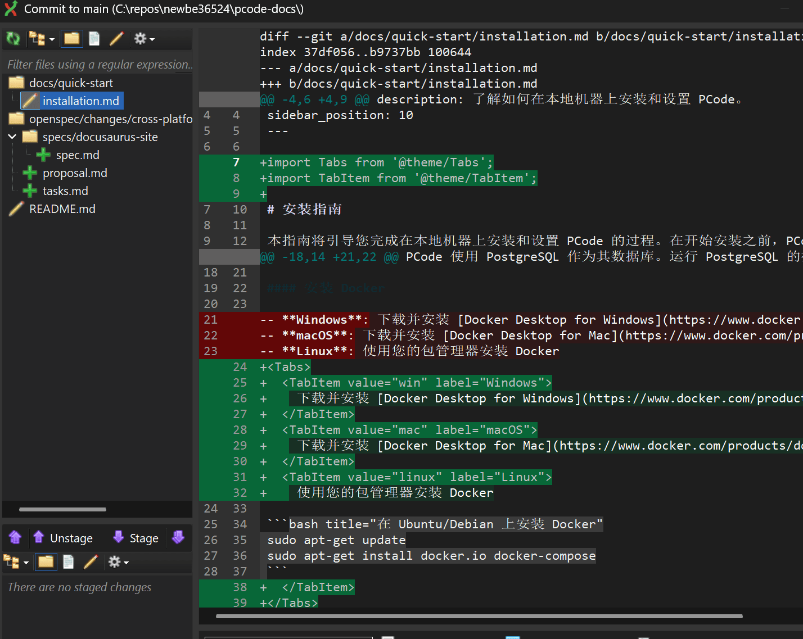
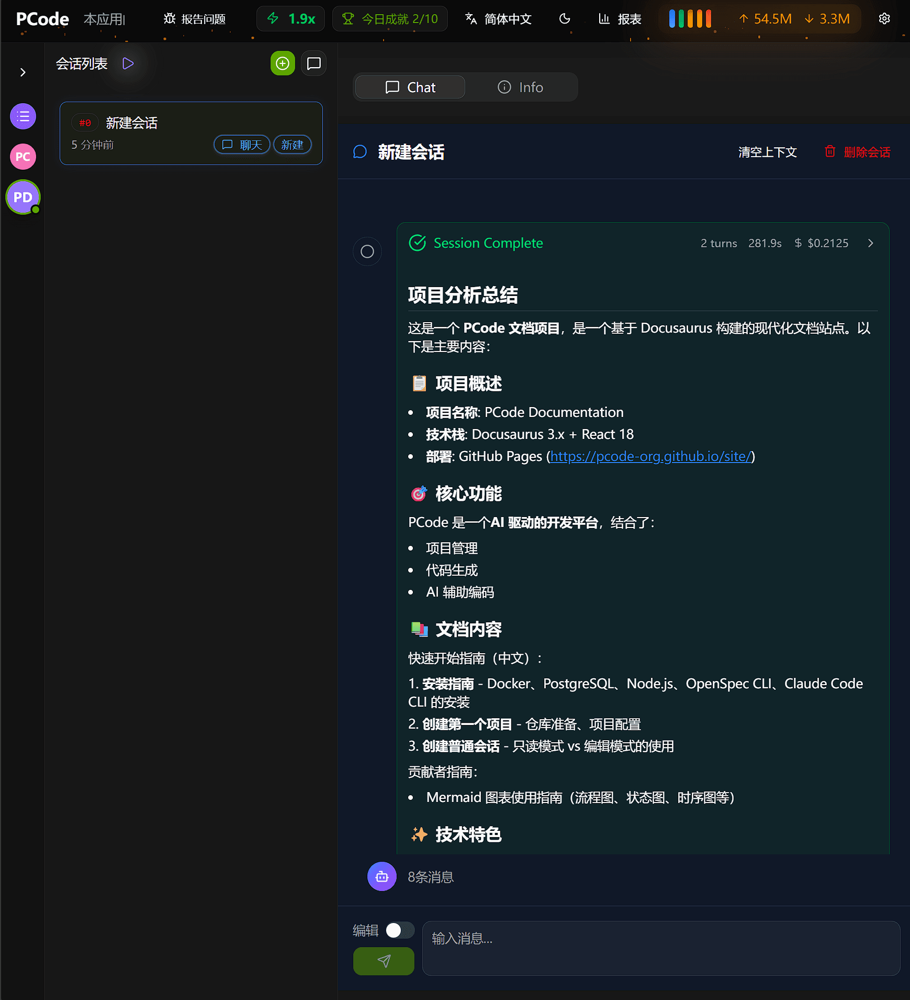
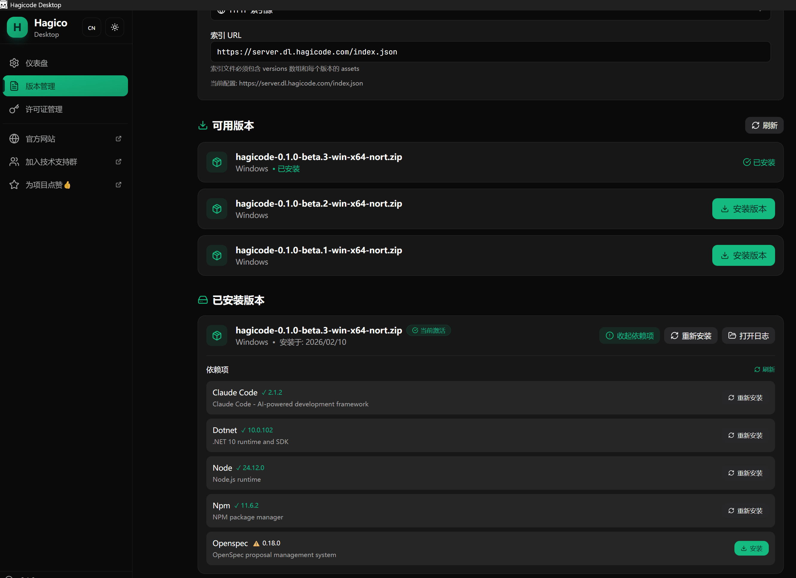

<div align="center">

<h1>Smart · Efficient · Interesting AI Coding Assistant</h1>

<p>HagiCode turns ideas into shipped work with OpenSpec workflows, multi-agent parallel execution, and Hero Dungeon battle reports that keep AI coding visible, structured, and enjoyable.</p>


<br />

<a href="https://hagicode.com/">🌐 Visit Website</a>
·
<a href="https://hagicode.com/desktop/">🖥️ Desktop</a>
·
<a href="https://hagicode.com/container/">🐳 Container</a>
·
<a href="https://docs.hagicode.com/product-overview/">📚 Product Overview</a>

</div>

[简体中文](./README_cn.md)

---

## What HagiCode is built for

HagiCode is an AI coding product for teams and individual developers who want more than a single chat box.
It combines proposal-driven workflows, parallel agent execution, and memorable product feedback so complex work stays understandable from idea to archive.

- **Smart** - OpenSpec gives each change a clear path through idea, proposal, review, implementation, testing, and archive.
- **Efficient** - Claude Code, Codex, and other CLI agents can run across multiple agents and instances in parallel, so fixes, reviews, and delivery keep moving together.
- **Interesting** - Hero Dungeon rosters, battle reports, and visual workspaces turn long-running AI collaboration into something easier to follow and more rewarding to use.

## Visual Tour

The gallery below uses product-owned assets stored in `repos/site`, so the README can show the current product directly on GitHub.
Instead of relying on a single hero image, it walks through the real proposal flow, fast execution mode, skill safety surfaces, Hero identity, and desktop controls.

<p>
  
  <br />
  <strong>Proposal stages at a glance</strong><br />
  <sub><strong>UI screenshot.</strong> Follow one proposal from optimization through archive in a single nine-stage timeline.</sub>
</p>

<p>
  
  <br />
  <strong>Inline review and annotations</strong><br />
  <sub><strong>UI screenshot.</strong> Add focused inline comments before sending precise feedback back to AI.</sub>
</p>

<p>
  
  <br />
  <strong>Execution result with code diff</strong><br />
  <sub><strong>UI screenshot.</strong> Inspect the applied diff immediately after execution finishes.</sub>
</p>

<p>
  
  <br />
  <strong>Normal session execution result</strong><br />
  <sub><strong>UI screenshot.</strong> Use a quick session when a task does not need the full proposal flow.</sub>
</p>

<p>
  
  <br />
  <strong>Skill trust and managed command</strong><br />
  <sub><strong>UI screenshot.</strong> Confirm the install source, trust status, and exact managed command for every skill.</sub>
</p>

<p>
  
  <br />
  <strong>Hero highlight and product personality</strong><br />
  <sub><strong>Product visual.</strong> Hero Dungeon themes and battle reports give long-running AI sessions a recognizable identity.</sub>
</p>

<p>
  
  <br />
  <strong>Desktop start service control</strong><br />
  <sub><strong>UI screenshot.</strong> Start or monitor the local HagiCode service from the desktop dashboard.</sub>
</p>

<p>
  
  <br />
  <strong>Desktop version management</strong><br />
  <sub><strong>UI screenshot.</strong> Switch packages, dependencies, and release tracks from the desktop version center.</sub>
</p>

## Why teams use it

- **Proposal-driven by default** - Scope, tasks, and archive history stay connected, so AI work remains reviewable.
- **Designed for parallel throughput** - Real-time token tracking, multi-agent workspaces, and execution views are built for multiple streams at once.
- **Easy to remember and revisit** - Hero Dungeon and Hero Battle reports add narrative, momentum, and clearer status feedback.

## Getting Started

Start with the official entry points:

- [hagicode.com](https://hagicode.com/) for the full homepage experience
- [Desktop](https://hagicode.com/desktop/) to install the local app
- [Container](https://hagicode.com/container/) for the self-hosted deployment path
- [Product Overview](https://docs.hagicode.com/product-overview/) for the documentation entry

Run the site locally from `repos/site`:

```bash
npm install
npm run dev
npm run build
npm run preview
```

The dev server runs on `http://localhost:31264` by default.
For contributor-focused details, start with [`AGENTS.md`](./AGENTS.md) and [`CLAUDE.md`](./CLAUDE.md).

## Build and deployment notes

This repository now focuses on building the static site and related content.
It no longer publishes to Azure Static Web Apps from this repo.

- Build output is generated into `dist/` with `npm run build`.
- Homepage activity metrics are consumed at runtime from `https://index.hagicode.com/activity-metrics.json`.
- Desktop package fallback data lives on the index site at `https://index.hagicode.com/desktop/history/` and `https://index.hagicode.com/desktop/index.json`.
- If runtime data looks wrong or stale, inspect the index repository and its deployment chain before adding local copies here.

## Homepage activity metrics

The homepage activity metrics module is a runtime consumer of the canonical JSON hosted by the index site:

- Source: `https://index.hagicode.com/activity-metrics.json`
- Single source of truth: `repos/index` generates and publishes the only metrics asset that `repos/site` is allowed to consume
- Ownership: the data is produced and published from `repos/index`, not from `repos/site`
- Failure mode: if the remote asset is unavailable, the homepage keeps the existing empty-state fallback instead of breaking the page
- Maintenance boundary: if the metrics look wrong or stale, investigate the index repository and index deployment first instead of re-adding a local refresh script or JSON copy here

## Desktop version fallback

- The homepage install entry and the standalone Desktop page both consume runtime package data instead of maintaining a site-local release list
- When package loading reaches terminal failure, the canonical fallback target is `https://index.hagicode.com/desktop/history/`
- `repos/index` remains a referenced dependency only; treat `https://index.hagicode.com/desktop/history/` and `https://index.hagicode.com/desktop/index.json` as the stable fallback surface
- Do not add a second in-site Desktop history page here; if the fallback flow looks wrong, inspect the runtime fetch chain and the index deployment first

## Star History

Track how the `HagiCode-org/site` repository has grown over time:

<p align="center">
  <a href="https://star-history.com/#HagiCode-org/site&Date">
    <picture>
      <source
        media="(prefers-color-scheme: dark)"
        srcset="https://api.star-history.com/svg?repos=HagiCode-org/site&type=Date&theme=dark"
      />
      <source
        media="(prefers-color-scheme: light)"
        srcset="https://api.star-history.com/svg?repos=HagiCode-org/site&type=Date"
      />
      
    </picture>
  </a>
</p>

## License

This repository is released under the terms in [LICENSE](./LICENSE).

---

Ready to explore the full product story? Visit [hagicode.com](https://hagicode.com/) and choose the experience that fits your workflow.
