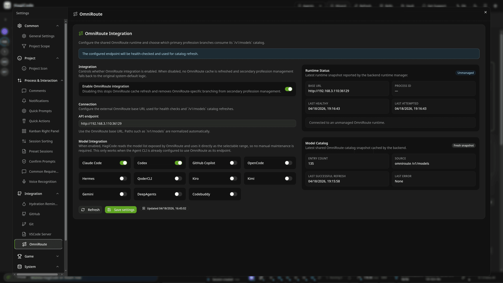
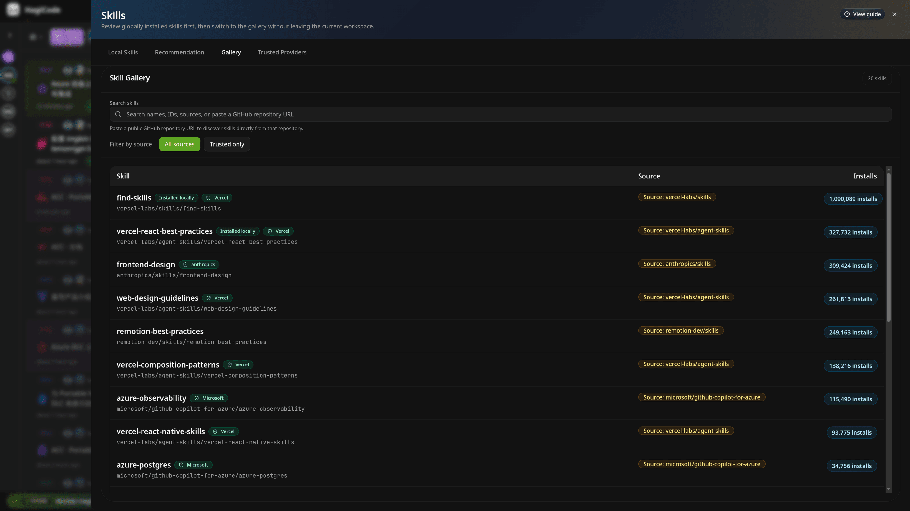
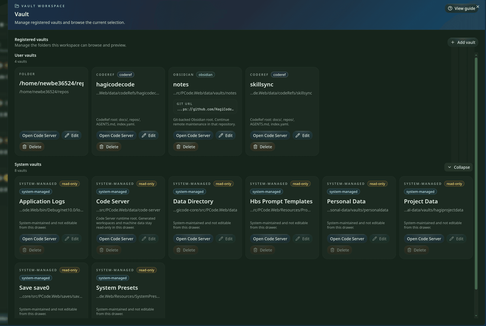

<div align="center">

# HagiCode

<p><strong>HagiCode is a product that combines an AI coding tool, a gamified feedback system, and a full development workspace into one platform.</strong></p>

<p>Use it to understand repositories, write proposals, break down tasks, modify code, organize commits, manage multiple repositories, and build a reusable knowledge base without leaving the same workspace.</p>

<a href="https://hagicode.com/">Website</a>
·
<a href="https://docs.hagicode.com/product-overview/">Product Overview</a>
·
<a href="https://hagicode.com/desktop/">Desktop</a>
·
<a href="https://hagicode.com/container/">Container</a>
·
<a href="https://docs.hagicode.com/blog/">Blog</a>

</div>

[简体中文](./README_cn.md)

---

## What HagiCode Is

HagiCode was not built to be another code chat box. It brings AI into the full software development process: understanding repositories, planning changes, implementing code, organizing commits, tracking knowledge, and keeping work reviewable from idea to archive.


## Core Capabilities

### 1. Proposal-driven AI coding with OpenSpec

For non-trivial work, HagiCode starts with a proposal instead of jumping straight into file edits. OpenSpec turns requests into scope, tasks, impact analysis, validation steps, and an execution trail that stays easy to review.


### 2. Mainstream Agent CLIs with OmniRoute

HagiCode supports Codex, Claude Code, GitHub Copilot, OpenCode, Hermes, QoderCLI, Kiro, Kimi, Gemini, DeepAgents, and Codebuddy. OmniRoute keeps the CLI choice separate from the model and subscription layer, so teams can route models and endpoints without hard-binding everything to one default stack.



### 3. A full development workspace, not just a chat pane

The workspace ties together the capabilities that usually end up scattered across separate tools:

- `MonoSpecs` for multi-repository inventory, scope, and coordination
- `Skills` for installable workflow extensions and trust-aware tooling
- `Vault` for reusable knowledge capture across projects
- `AI Compose Commit` and `code-server` integration for finishing the job inside the same flow

<p align="center">
  
  
</p>

<p align="center">
  
</p>

### 4. Gamified feedback that stays operationally useful

HagiCode treats achievements, daily reports, efficiency multipliers, token throughput, and themed interface feedback as part of the product, not cosmetic leftovers. The result is a workspace that keeps long-running AI work visible instead of flattening everything into one scrolling transcript.


## Official Entry Points

- [Website](https://hagicode.com/) for the full product homepage
- [Product Overview](https://docs.hagicode.com/product-overview/) for the canonical public introduction
- [Desktop](https://hagicode.com/desktop/) for local-first installation and service management
- [Container](https://hagicode.com/container/) for the self-hosted deployment path
- [Blog](https://docs.hagicode.com/blog/) for product updates and long-form posts

## Develop This Repository

This repository contains the public HagiCode website. From `repos/site`, run:

```bash
npm install
npm run dev
npm run build
npm run preview
```

The default dev server runs at `http://localhost:31264`.
For contributor guidance, start with [`AGENTS.md`](./AGENTS.md) and [`CLAUDE.md`](./CLAUDE.md).

## License

This repository is released under [LICENSE](./LICENSE).
