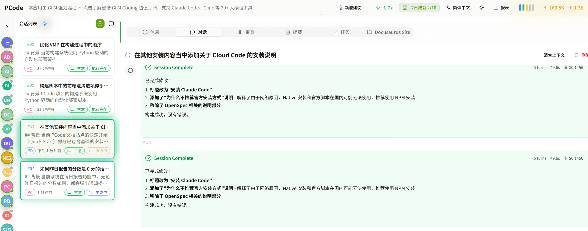
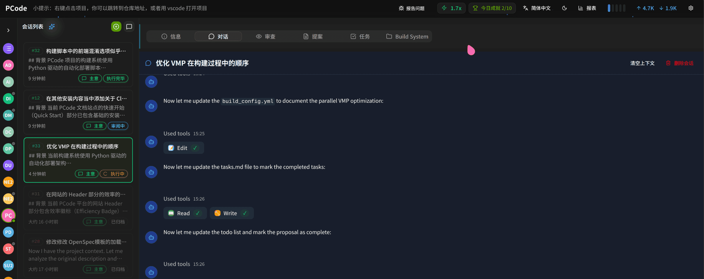
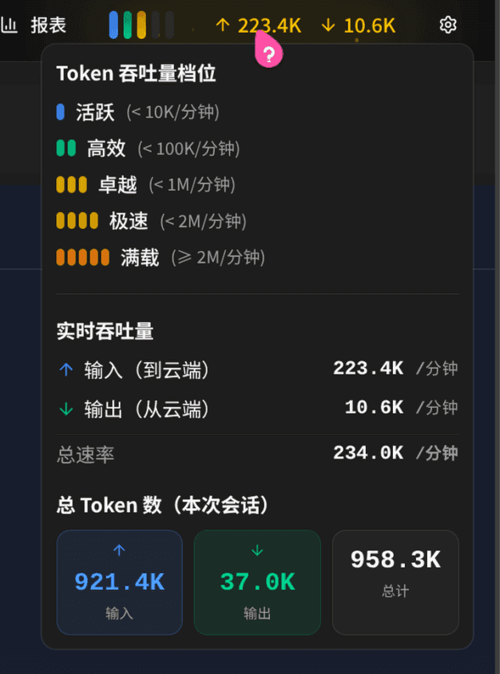
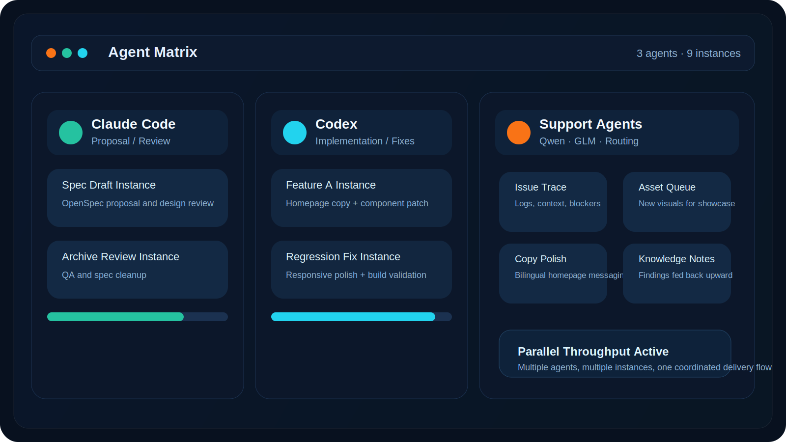
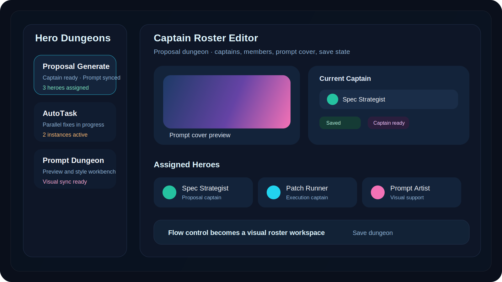
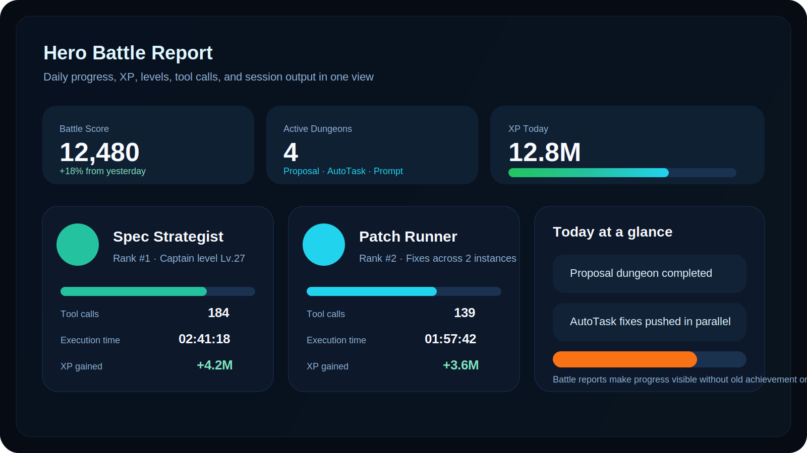

<div align="center">

<h1>智能 · 高效 · 有趣的 AI 编码助手</h1>

<p>HagiCode 官网仓库入口，聚焦当前首页仍在展示的 OpenSpec、多 Agent 并行执行、Hero Dungeon 与 Hero Battle 体验。</p>



<br />

<a href="https://hagicode.com/zh-CN/">🌐 访问官网</a>
·
<a href="https://hagicode.com/zh-CN/desktop/">🖥️ 桌面版</a>
·
<a href="https://hagicode.com/zh-CN/container/">🐳 容器版</a>
·
<a href="https://docs.hagicode.com/product-overview/?lang=zh-CN">📚 产品概览</a>

</div>

---

## 仓库定位

`repos/site` 是 HagiCode 的官方 Astro 站点仓库。这个 README 不再保留历史营销快照，而是直接对应当前首页正在表达的产品主线：

- **智能 / Smart**：OpenSpec 9 阶段工作流把想法、提案、评审、任务、实现、测试与归档串成一个结构化流程。
- **高效 / Efficient**：Claude Code、Codex、Qwen · GLM 等 Agent 可以并行驱动多个实例，把等待时间转成持续吞吐。
- **有趣 / Interesting**：Hero Dungeon、队长编组、Prompt 视觉与 Hero Battle 战报，让日常 AI 编码协作更像一场可推进的冒险。

## 当前首页区块映射

- **Hero**：首屏围绕“智能 · 高效 · 有趣”展开，并把官网、桌面版、容器版、产品概览作为主要入口。
- **Activity Metrics**：首页实时展示 Docker Hub 拉取量、活跃用户和活跃会话，数据来源于 `public/activity-metrics.json`。
- **Features Showcase**：用 `Smart / Efficient / Interesting` 三组模块分别承载 OpenSpec、多 Agent 并行矩阵、Hero Dungeon / Hero Battle 的叙事。
- **Evidence**：首页当前使用 6 张界面图和 3 条 Bilibili 视频，帮助访客快速判断产品形态与工作流。
- **Install Options**：桌面版与容器版两种安装方式保持为首页底部 CTA，与 README 中的入口说明一致。

## 三大核心特性

### Smart · 智能

- OpenSpec 提供从 `Idea` 到 `Archive` 的 9 阶段工作流，帮助团队把需求拆解、评审、实现与归档连起来。
- 首页当前强调结构化 AI 工作流，而不是旧版的零散功能清单或单点提示词体验。
- README 顶部的产品定位、产品概览链接和截图说明都以这条主线为基础。

### Efficient · 高效

- 当前首页的效率叙事聚焦“多 Agent / 多实例并行”，把提案、实现、修复与评审组织成持续吞吐的执行矩阵。
- 当前展示的并行执行矩阵包含 `Claude Code`、`Codex`、`Qwen · GLM`，并补充说明支持 `GitHubCopilot`、`CodebuddyCli`、`OpenCodeCli`、`IFlowCli` 等 CLI。
- 典型并行场景包括：提案起草、设计校对、功能实现、回归修复、问题排查与文案优化。

### Interesting · 有趣

- Hero Dungeon 把提案、副本执行、Prompt 视觉等工作台组织成更直观的“副本”体验。
- 队长编组让 `Spec Strategist`、`Patch Runner`、`Prompt Artist` 等角色承担不同职责，强化协作感和可视化反馈。
- Hero Battle 战报用 XP、等级和副本推进情况回看一天的执行结果，让 README 保持聚焦当前首页中的副本与战报体验。

## 当前首页截图

<table>
<tr>
<td align="center">

<br />
亮色主题主界面
</td>
<td align="center">

<br />
暗色主题主界面
</td>
</tr>
<tr>
<td align="center">

<br />
实时 Token 用量
</td>
<td align="center">

<br />
多 Agent 并行工作台
</td>
</tr>
<tr>
<td align="center">

<br />
Hero Dungeon 副本编组
</td>
<td align="center">

<br />
Hero Battle 战报
</td>
</tr>
</table>

这些截图与 `repos/site/src/components/home/ShowcaseSection.tsx` 当前展示顺序一致，只保留首页仍在使用的资源。

## 视频演示

- [每天哈基半小时，AI 多任务编程实战](https://www.bilibili.com/video/BV1pirZBuEzq/)：当前首页的主推荐视频，用来快速理解 Hagicode 的整体工作流与多任务体验。
- [AI 居然写代码时玩游戏](https://www.bilibili.com/video/BV1KxwMzxEVK/)：展示产品在真实编码过程中的趣味互动，强调“有趣”这条主线。
- [GPT Codex in Hagicode 实测](https://www.bilibili.com/video/BV1yqPmzTEqP/)：聚焦 Codex 在 Hagicode 中的实际表现，方便访客判断模型接入效果。

## 安装入口

| 方式 | 适用场景 | 当前首页强调点 | 入口 |
| --- | --- | --- | --- |
| 桌面版 | 个人开发、快速上手 | 本地运行、支持 Windows / macOS / Linux、开箱即用 | [下载桌面应用](https://hagicode.com/zh-CN/desktop/) |
| 容器版 | 团队部署、远程访问 | 服务器部署、数据持久化、支持 Docker Compose Builder | [查看容器部署](https://hagicode.com/zh-CN/container/) |

## 本地开发

```bash
cd repos/site
npm install
npm run dev
npm run build
npm run preview
```

更多当前仍有效的仓库脚本：

- `npm run typecheck`：TypeScript 类型检查
- `npm run test`：运行 Vitest 测试
- `npm run update-metrics`：刷新首页活动指标数据

## 仓库结构速览

- `src/pages/`：官网页面入口，包括首页、桌面版和容器版页面
- `src/components/home/`：首页 Hero、活动指标、三大特性、截图、视频和安装入口组件
- `public/img/home/`：当前 README 与首页共用的展示资源
- `scripts/`：站点构建与活动指标更新脚本

---

<div align="center">

<a href="https://hagicode.com/zh-CN/">官网</a>
|
<a href="https://github.com/HagiCode-org/site">GitHub</a>
|
<a href="https://docs.hagicode.com/blog/?lang=zh-CN">博客</a>
|
<a href="https://docs.astro.build/">Astro 文档</a>

<p>Built for the current homepage narrative, not a historical snapshot.</p>

</div>
