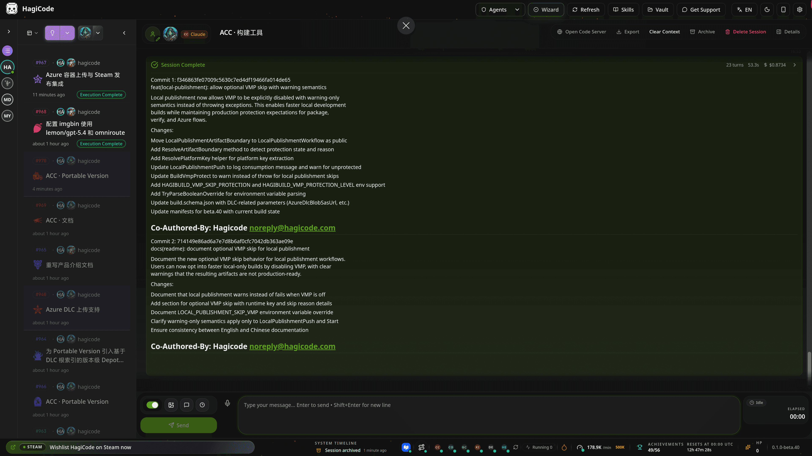
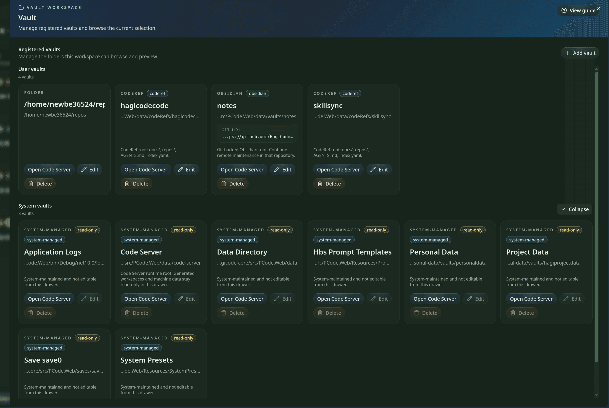
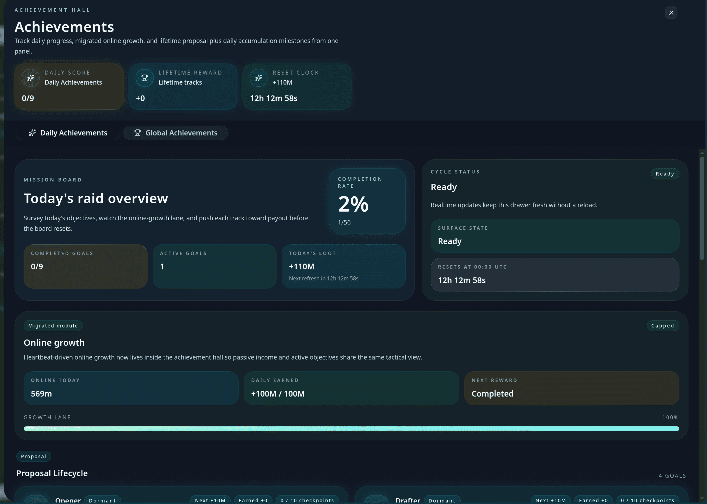

<div align="center">

# HagiCode

<p><strong>HagiCode 是一个把 AI 编程工具、游戏化反馈系统和综合型开发工作台合并在一起的产品。</strong></p>

<p>你可以用它理解仓库、写提案、拆任务、修改代码、整理提交、管理多仓库，并在同一个工作台里持续沉淀可复用的知识。</p>

<a href="https://hagicode.com/">Website</a>
·
<a href="https://docs.hagicode.com/product-overview/">Product Overview</a>
·
<a href="https://hagicode.com/desktop/">Desktop</a>
·
<a href="https://hagicode.com/container/">Container</a>
·
<a href="https://apps.microsoft.com/detail/9N3PM0N3SVDW">Windows Store</a>
·
<a href="https://docs.hagicode.com/blog/">Blog</a>

</div>

[English](./README.md) · [简体中文](./README_cn.md) · [繁體中文](./README_zh-Hant.md) · [日本語](./README_ja-JP.md) · [한국어](./README_ko-KR.md) · [Deutsch](./README_de-DE.md) · [Français](./README_fr-FR.md) · [Español](./README_es-ES.md) · [Português (Brasil)](./README_pt-BR.md) · [Русский](./README_ru-RU.md)

---

## Windows Store And Add-ons

| 预览 | 产品 | 定位 | 入口 |
| --- | --- | --- | --- |
|  | **HagiCode for Windows** | Current public entry point for the desktop app. The Steam main application entry has been retired. | [Open Windows Store](https://apps.microsoft.com/detail/9N3PM0N3SVDW) · [Desktop downloads](https://hagicode.com/desktop/) · [Steam status FAQ](https://docs.hagicode.com/faq/steam-distribution-status/) |
|  | **Hagicode Plus** | Bundle and upgrade guidance remains available through the docs site. | [Read Hagicode Plus docs](https://docs.hagicode.com/bundles/hagicode-plus/) |
|  | **Turbo Engine DLC** | DLC guidance for higher concurrency and customization remains available through the docs site. | [Read Turbo Engine DLC docs](https://docs.hagicode.com/dlc/turbo-engine-dlc/) |

## HagiCode 是什么

HagiCode 不是另一个代码聊天框。它把 AI 带进完整的软件开发流程：理解仓库、规划变更、实现代码、整理提交、追踪知识，并让从想法到归档的全过程都保持可审阅。


## 核心能力

### 1. 用 OpenSpec 驱动提案式 AI 编码

对于非简单工作，HagiCode 会先从提案开始，而不是立刻修改文件。OpenSpec 会把请求整理为范围、任务、影响分析、验证步骤，以及一条始终易于审阅的执行轨迹。


### 2. 主流 Agent CLI 与 OmniRoute 组合使用

HagiCode 支持 Codex、Claude Code、GitHub Copilot、OpenCode、Hermes、QoderCLI、Kiro、Kimi、Gemini、Pi、Reasonix、DeepAgents 和 Codebuddy。OmniRoute 把 CLI 选择与模型和订阅层分开，让团队可以路由模型和端点，而不用把一切硬绑定到单一默认栈。


### 3. 它是完整开发工作台，不只是聊天窗口

这个工作台把原本容易散落在不同工具里的能力整合进同一条流程：

- `MonoSpecs` 用于多仓库清单、范围和协同
- `Skills` 用于可安装的工作流扩展与信任感知工具
- `Vault` 用于跨项目复用的知识沉淀
- `AI Compose Commit` 与 `code-server` 集成用于把收尾工作也留在同一流程中完成

<p align="center">
  
  
</p>

<p align="center">
  
</p>

### 4. 游戏化反馈不是装饰，而是可用反馈系统

HagiCode 把成就、日报、效率倍率、Token 吞吐量和主题化界面反馈视为产品的一部分，而不是装饰性残留。结果是，一个能让长时运行的 AI 工作保持可见的工作台，而不是把一切压扁成一条无限滚动的聊天记录。



## 官方入口

- [Website](https://hagicode.com/) 查看完整产品官网
- [Product Overview](https://docs.hagicode.com/product-overview/) 查看官方公开产品介绍
- [Desktop](https://hagicode.com/desktop/) 进入本地优先的安装与服务管理入口
- [Container](https://hagicode.com/container/) 查看自托管部署路径
- [Windows Store](https://apps.microsoft.com/detail/9N3PM0N3SVDW) for the current Windows desktop entry point
- [Steam status FAQ](https://docs.hagicode.com/faq/steam-distribution-status/) for why the Steam main application is no longer the primary channel
- [Blog](https://docs.hagicode.com/blog/) 查看产品更新与长文内容

## 开发这个仓库

这个仓库承载 HagiCode 的公开官网。在 `repos/site` 下运行：

```bash
npm install
npm run dev
npm run build
npm run preview
```

默认开发服务器运行在 `http://localhost:31264`。
贡献者说明请先查看 [`AGENTS.md`](./AGENTS.md) 和 [`CLAUDE.md`](./CLAUDE.md)。

## 生产部署

- 权威工作流：`.github/workflows/site-deploy-gh-pages.yml`
- 生产环境的事实来源：`gh-pages` 分支，并且只允许 GitHub Actions 发布
- 发布产物契约：分支根目录保留 `esa.jsonc`、`wrangler.jsonc`，已验证的 Astro 静态快照放在 `dist/`
- 手动触发路径：`workflow_dispatch` 会基于所选 ref 重新构建，并把校验后的 payload 重新发布到 `gh-pages`
- Cloudflare 直接发布现在在这个 workflow 之外处理；请把 `gh-pages/wrangler.jsonc` 视为直接发布操作使用的、受版本控制的 Wrangler 契约
- 所需 GitHub 权限：deploy job 需要 `contents: write`；build job 保持只读
- 所需托管设置：让生产托管读取 `gh-pages/esa.jsonc`，把 `gh-pages/wrangler.jsonc` 作为直接发布使用的 Wrangler 事实来源，并把 `gh-pages/dist/` 作为静态资源目录
- 首次部署检查：确认工作流实际发布了 `esa.jsonc`、`wrangler.jsonc` 和 `dist/`，确认托管目标仍指向 `gh-pages`，再访问 `https://hagicode.com`
- 回滚路径：回退源提交，或从旧提交重新触发部署，让 CI 重新发布上一份快照

### Desktop Index 回退说明

桌面历史索引 `https://index.hagicode.com/desktop/history/` 在这里仅作为被引用依赖。站点会把它当作桌面引导的运行时回退目标，但这个仓库本身并不直接发布或维护这个索引。

## 许可协议

本仓库遵循 [LICENSE](./LICENSE)。
