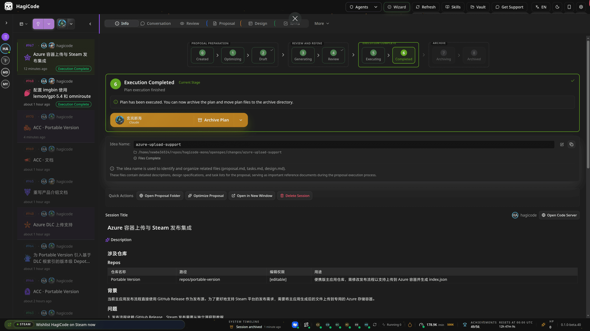
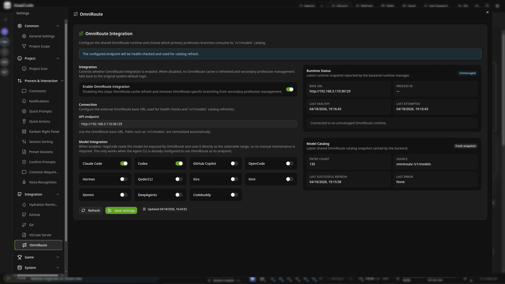
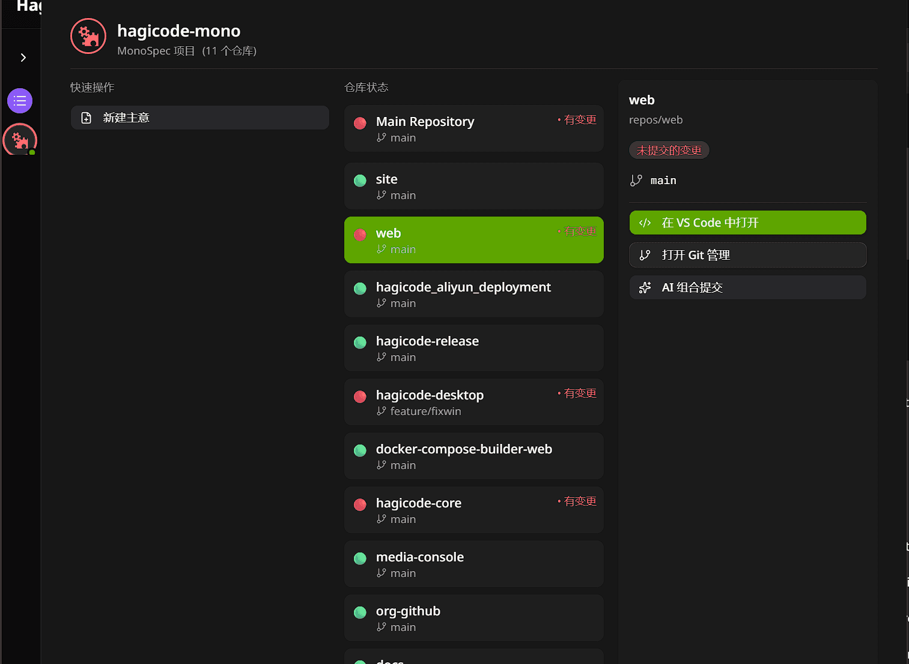
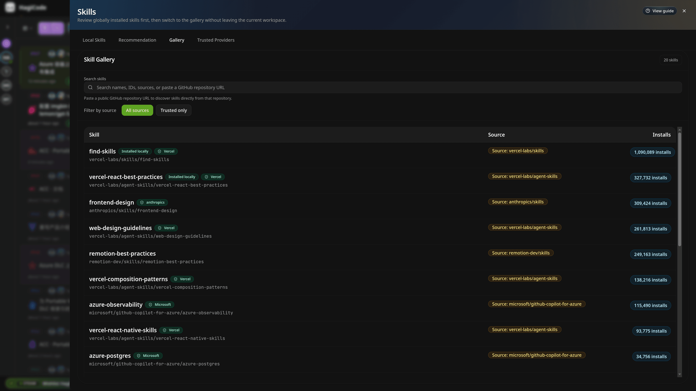
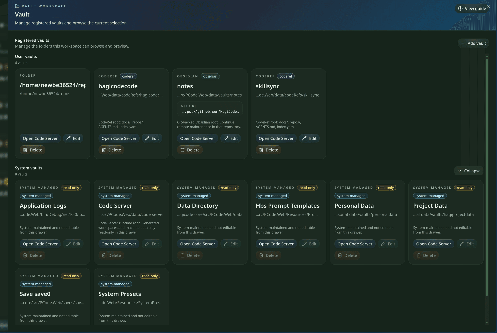

<div align="center">

# HagiCode

<p><strong>HagiCode ist ein Produkt, das ein KI-Coding-Tool, ein gamifiziertes Feedback-System und einen vollständigen Entwicklungs-Workspace in einer Plattform zusammenführt.</strong></p>

<p>Damit lassen sich Repositories verstehen, Vorschläge schreiben, Aufgaben aufteilen, Code ändern, Commits organisieren, mehrere Repositories verwalten und wiederverwendbares Wissen aufbauen, ohne denselben Workspace zu verlassen.</p>

<a href="https://hagicode.com/">Website</a>
·
<a href="https://docs.hagicode.com/product-overview/">Product Overview</a>
·
<a href="https://hagicode.com/desktop/">Desktop</a>
·
<a href="https://hagicode.com/container/">Container</a>
·
<a href="https://store.steampowered.com/app/4625540/Hagicode/">Steam</a>
·
<a href="https://docs.hagicode.com/blog/">Blog</a>

</div>

[English](./README.md) · [简体中文](./README_cn.md) · [繁體中文](./README_zh-Hant.md) · [日本語](./README_ja-JP.md) · [한국어](./README_ko-KR.md) · [Deutsch](./README_de-DE.md) · [Français](./README_fr-FR.md) · [Español](./README_es-ES.md) · [Português (Brasil)](./README_pt-BR.md) · [Русский](./README_ru-RU.md)

---

## Steam-Übersicht

| Vorschau | Produkt | Was es ist | Einstieg |
| --- | --- | --- | --- |
|  | **HagiCode** | Basisanwendung auf Steam mit Cloud Saves, Workshop-Unterstützung und dem klarsten öffentlichen Installationspfad für die Desktop-Edition. | [Auf Steam öffnen](https://store.steampowered.com/app/4625540/Hagicode/) |
|  | **Hagicode Plus** | Bundle-Leitfaden für die vollständigere Einrichtung. Enthält HagiCode und das Turbo Engine DLC in einem gemeinsamen Bundle-Pfad. | [Bundle-Leitfaden lesen](https://docs.hagicode.com/en/bundles/hagicode-plus/) · [Bundle auf Steam ansehen](https://store.steampowered.com/bundle/73989/Hagicode_Plus/) |
|  | **Turbo Engine DLC** | DLC für HagiCode, das bis zu 32 gleichzeitige Online-Sitzungen und weitere Anpassungsoptionen freischaltet. | [DLC ansehen](https://store.steampowered.com/app/4635480/Hagicode__Turbo_Engine/) |

## Was HagiCode ist

HagiCode wurde nicht gebaut, um nur eine weitere Code-Chatbox zu sein. Es bringt KI in den vollständigen Softwareentwicklungsprozess: Repositories verstehen, Änderungen planen, Code umsetzen, Commits organisieren, Wissen festhalten und den gesamten Ablauf von der Idee bis zum Archiv prüfbar halten.


## Kernfunktionen

### 1. Vorschlagsgetriebenes KI-Coding mit OpenSpec

Bei nicht-trivialer Arbeit startet HagiCode mit einem Vorschlag, statt sofort Dateien zu bearbeiten. OpenSpec verwandelt Anfragen in Umfang, Aufgaben, Impact-Analyse, Validierungsschritte und einen Ausführungsverlauf, der jederzeit leicht zu überprüfen bleibt.



### 2. Gängige Agent-CLIs mit OmniRoute

HagiCode unterstützt Codex, Claude Code, GitHub Copilot, OpenCode, Hermes, QoderCLI, Kiro, Kimi, Gemini, DeepAgents und Codebuddy. OmniRoute trennt die CLI-Auswahl von Modell- und Abonnementebene, damit Teams Modelle und Endpunkte routen können, ohne alles hart an einen einzigen Standard-Stack zu binden.



### 3. Ein vollständiger Entwicklungs-Workspace, nicht nur ein Chatbereich

Der Workspace verbindet Fähigkeiten, die sonst meist auf verschiedene Werkzeuge verteilt sind:

- `MonoSpecs` für Multi-Repository-Inventar, Umfang und Koordination
- `Skills` für installierbare Workflow-Erweiterungen und vertrauensbewusste Werkzeuge
- `Vault` für wiederverwendbare Wissenssammlung über Projekte hinweg
- `AI Compose Commit` und die `code-server`-Integration, um auch den letzten Teil der Arbeit im selben Ablauf abzuschließen

<p align="center">
  
  
</p>

<p align="center">
  
</p>

### 4. Gamifiziertes Feedback mit praktischem Nutzen

HagiCode behandelt Errungenschaften, Tagesberichte, Effizienzmultiplikatoren, Token-Durchsatz und thematisches UI-Feedback als Teil des Produkts statt als bloße Dekoration. Das Ergebnis ist ein Workspace, der langlaufende KI-Arbeit sichtbar hält, statt alles in einem endlosen Chatverlauf zu glätten.


## Offizielle Einstiegspunkte

- [Website](https://hagicode.com/) für die vollständige Produkt-Homepage
- [Product Overview](https://docs.hagicode.com/product-overview/) für die offizielle öffentliche Produkteinführung
- [Desktop](https://hagicode.com/desktop/) für lokalen Einstieg und Serviceverwaltung
- [Container](https://hagicode.com/container/) für den Self-Hosted-Deployment-Pfad
- [Steam](https://store.steampowered.com/app/4625540/Hagicode/) für die Steam-Edition mit plattformnativer Distribution
- [Blog](https://docs.hagicode.com/blog/) für Produktupdates und längere Beiträge

## Dieses Repository entwickeln

Dieses Repository enthält die öffentliche HagiCode-Website. Führe in `repos/site` Folgendes aus:

```bash
npm install
npm run dev
npm run build
npm run preview
```

Der Standard-Dev-Server läuft unter `http://localhost:31264`.
Für Hinweise zur Mitarbeit starte mit [`AGENTS.md`](./AGENTS.md) und [`CLAUDE.md`](./CLAUDE.md).

## Produktions-Deployment

- Maßgeblicher Workflow: `.github/workflows/site-deploy-gh-pages.yml`
- Quelle der Wahrheit für Produktion: der Branch `gh-pages`, veröffentlicht ausschließlich durch GitHub Actions
- Vertrag für das veröffentlichte Payload: Im Branch-Root liegt `esa.jsonc`, und der validierte Astro-Snapshot befindet sich in `dist/`
- Erforderliche GitHub-Berechtigungen: Der Deploy-Job braucht `contents: write`; der Build-Job bleibt schreibgeschützt
- Erforderliche Hosting-Einstellung: Der Produktionshost muss `gh-pages/esa.jsonc` lesen und `gh-pages/dist/` als statisches Verzeichnis ausliefern
- Prüfung beim ersten Deploy: Bestätige, dass der Workflow `esa.jsonc` und `dist/` veröffentlicht, dass das Hosting-Ziel weiterhin auf `gh-pages` zeigt, und lade dann `https://hagicode.com`
- Rollback-Pfad: Quelländerung zurücksetzen oder Deployment von einem älteren Commit erneut ausführen, damit CI den vorherigen Snapshot erneut veröffentlicht

### Desktop-Index-Fallback

Der Desktop-History-Index unter `https://index.hagicode.com/desktop/history/` ist hier nur eine referenzierte Abhängigkeit. Die Website verlinkt ihn als Laufzeit-Fallbackziel für Desktop-Hinweise, aber dieses Repository veröffentlicht oder verwaltet diesen Index nicht direkt.

## Lizenz

Dieses Repository wird unter [LICENSE](./LICENSE) veröffentlicht.
