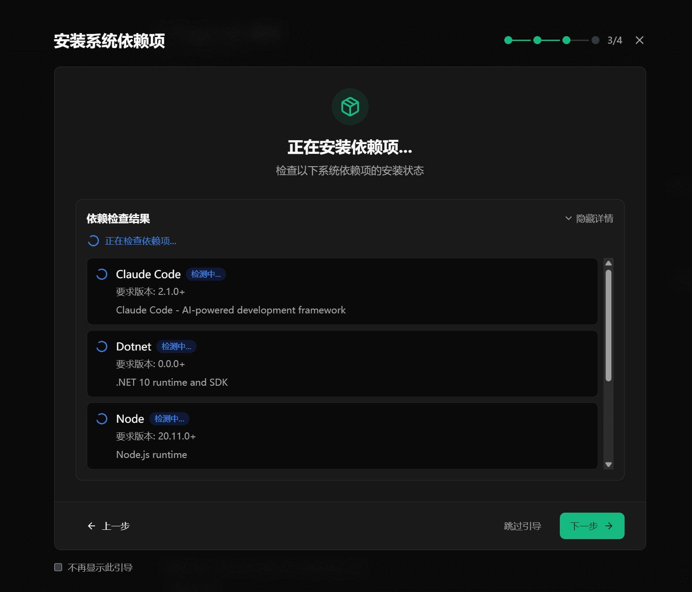
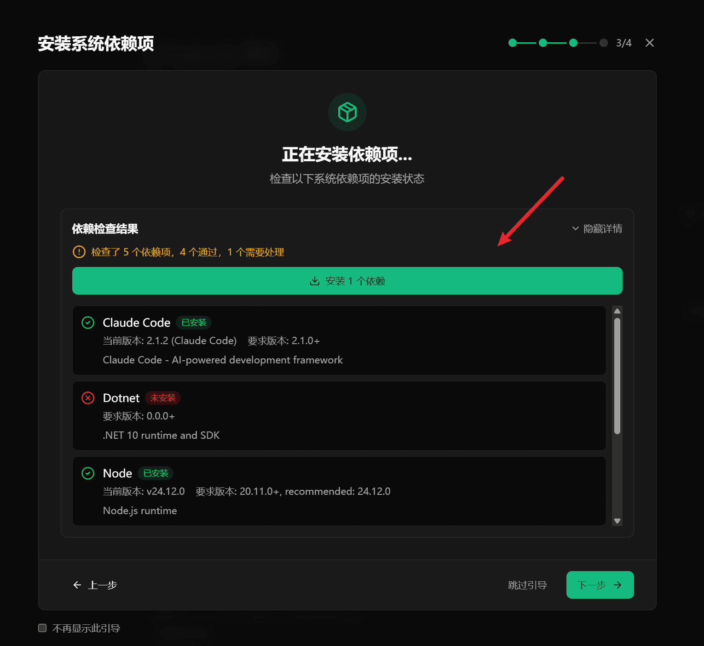
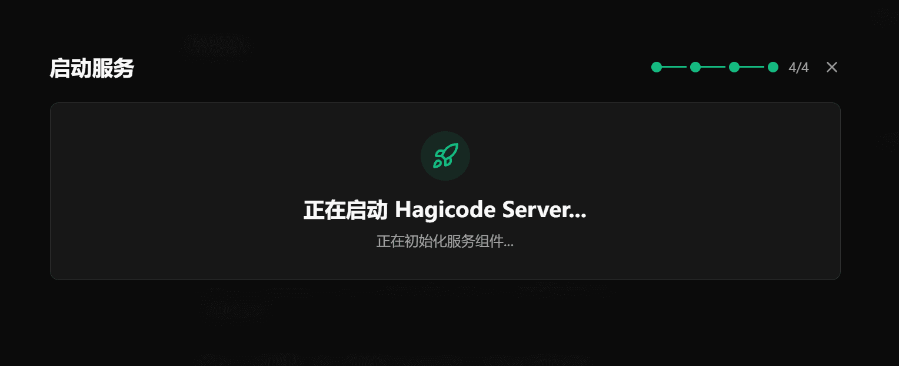
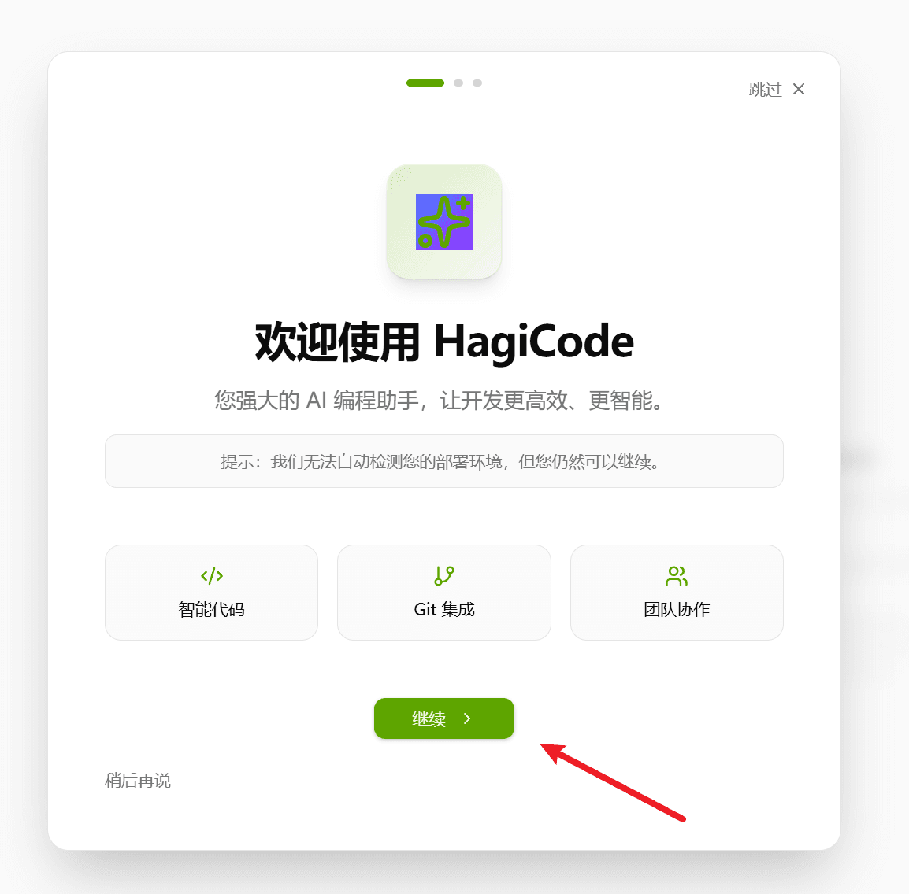
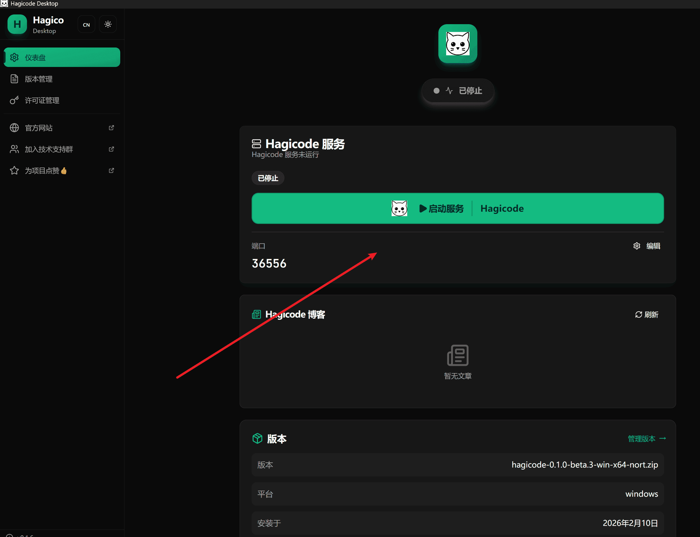

本指南介绍如何安装和使用 Hagicode Desktop 桌面应用程序。Hagicode Desktop 是一款功能强大且易于使用的桌面应用程序，为您提供完整的 Hagicode 体验。

:::tip[推荐方式]
Hagicode Desktop 是最适合个人用户和开发者的安装方式，具有以下优势：
- 一键安装，无需配置复杂的环境
- 自动管理依赖项和服务
- 图形化界面，操作简单直观
- 内置版本管理，轻松切换不同版本
- 本地运行，数据完全掌控
:::

## 什么是 Hagicode Desktop

Hagicode Desktop 是 Hagicode 的官方桌面应用程序，专为 Windows、macOS 和 Linux 系统设计。它集成了 Hagicode 的所有核心功能，并通过图形化安装向导，让安装过程变得简单快捷。

### 主要优势

- **一键安装**：通过安装向导，自动完成所有配置步骤
- **自动依赖管理**：自动检测并安装所需的运行时环境（如 .NET 运行时）
- **服务管理**：内置 Hagicode Server 管理，轻松启动和停止服务
- **版本切换**：支持多版本管理，可在不同版本之间自由切换
- **本地运行**：所有数据存储在本地，保护您的隐私
- **自动更新**：自动检测并下载最新版本

### 适用场景

Hagicode Desktop 适用于以下场景：
- 个人开发者希望在本地使用 Hagicode
- 需要离线使用 Hagicode 的用户
- 希望简化安装过程的非技术用户
- 需要频繁切换不同版本的开发者

## 下载 Desktop

### 快速下载

选择适合您操作系统的版本，直接下载安装程序：

import InstallButton from '../../../components/InstallButton';

{/* 使用 client:visible 指令确保组件在可见时进行客户端水合，避免 SSR 阶段的 React Hooks 错误 */}
<InstallButton variant="full" client:visible />

### 其他获取方式

您还可以从以下渠道获取 Hagicode Desktop 安装程序：

1. **官方发布页面**：访问 [Hagicode GitHub Releases](https://github.com/Hagicode-org/releases/releases) 下载最新版本
2. **官方网站**：访问 [Hagicode 官网](https://hagicode.com/) 获取下载链接

### 选择正确的版本

根据您的操作系统选择对应的安装程序：

- **Windows**：下载 `.exe` 安装程序
- **macOS**：下载 `.dmg` 磁盘映像文件
- **Linux**：下载 `.AppImage` 或 `.deb` 安装包

:::note[系统要求]
- **Windows**：Windows 10 或更高版本（64 位）
- **macOS**：macOS 10.15 或更高版本
- **Linux**：主流 Linux 发行版（Ubuntu 20.04+、Fedora 33+ 等）
:::

## 运行安装程序

下载完成后，运行安装程序。您将看到 Hagicode Desktop 安装程序的欢迎界面。

**安装程序界面说明**：
- 这是 Hagicode Desktop 的安装管理器
- 它会引导您完成整个安装过程
- 点击相应的按钮开始安装流程

## 安装向导步骤

Hagicode Desktop 提供了一个四步安装向导，引导您完成整个安装过程。以下是每个步骤的详细说明：

### 第一步：启动安装向导

下载完成后，运行安装程序。安装向导将启动并显示欢迎界面。

**此步骤说明**：
- 点击"开始安装"按钮启动安装过程
- 安装程序将自动检查系统环境和所需组件

### 第二步：下载最新版本

安装向导会自动从官方源下载最新版本的 Hagicode。

**此步骤说明**：
- 安装程序自动检测并下载最新稳定版本
- 下载进度会实时显示
- 下载完成后会自动进入下一步

:::note[网络要求]
确保您的网络连接正常，安装程序需要从互联网下载组件。如果下载失败，请检查网络设置或稍后重试。
:::

### 第三步：安装依赖项

Hagicode Desktop 需要一些运行时环境才能正常工作。安装向导会自动检测并安装这些依赖项。

#### 检查依赖项

首先，安装向导会检查系统是否已安装所需的依赖项。

#### 安装依赖项

如果检测到缺少依赖项，您将看到以下界面，可以一键安装所有缺失的组件。

**主要依赖项包括**：

Hagicode Desktop 当前版本需要以下软件组件才能完整运行：

- **.NET 运行时**：Hagicode 基于 .NET 技术构建，需要 .NET 运行时支持
- **Node.js**：用于运行某些前端开发和构建工具
- **OpenSpec**：用于提案管理和规范验证
- **Claude Code**：AI 辅助开发工具集成

:::note[依赖项安装参考]
如果在自动安装过程中遇到任何问题，您可以参考以下详细安装指南：

- [Node.js 安装指南](/related-software-installation/nodejs/installation)
- [OpenSpec 安装指南](/related-software-installation/openspec/setup-openspec)
- [Claude Code 安装指南](/related-software-installation/claude-code/setup-claude-code-with-zai)

这些指南提供了详细的安装步骤、故障排除和最佳实践。
:::

#### 安装过程

安装向导会自动安装所有缺失的依赖项。以下是安装 .NET 运行时的示例：

#### 完成依赖项安装

当所有依赖项安装完成后，您将看到成功提示。

:::tip[依赖项管理]
所有依赖项的安装都是自动进行的，您无需手动下载或配置。安装向导会确保安装正确的版本和组件。
:::

### 第四步：启动服务

依赖项安装完成后，安装向导将启动 Hagicode Server 服务。

**此步骤说明**：
- Hagicode Server 会在后台自动启动
- 启动过程通常只需要几秒钟
- 启动完成后，您可以开始使用 Hagicode

#### 服务启动完成

当 Hagicode Server 成功启动后，您将看到以下界面，点击 "Hagicode" 按钮即可开始使用。

安装向导完成后，您现在可以开始使用 Hagicode 了。

## 首次使用

### 创建项目

首次进入 Hagicode 时，您可以通过内置向导创建您的第一个项目。

**创建项目的步骤**：
1. 选择"创建新项目"
2. 配置项目名称和路径
3. 选择编程语言和框架
4. 配置 API 设置
5. 完成项目创建

### 导入 Git 仓库

如果您已有现有的 Git 仓库，可以轻松导入到 Hagicode 中。

**导入步骤**：
1. 点击"导入项目"
2. 输入包含 Git 仓库的文件夹路径
3. Hagicode 会自动扫描该文件夹下的所有 Git 仓库
4. 选择要导入的仓库并确认

## 版本管理

Hagicode Desktop 支持多版本管理，您可以在不同版本之间自由切换。

### 切换版本

1. 打开 Hagicode Desktop
2. 进入"版本管理"页面
3. 选择要切换的版本
4. 点击"切换版本"按钮
5. 等待切换完成

:::note[版本切换注意事项]
- 切换版本会自动重启 Hagicode Server
- 确保在切换前保存所有工作
- 不同版本的项目配置可能会有差异
:::

## 启动和停止服务

Hagicode Desktop 提供了简单的方式来管理 Hagicode Server 服务。

### 启动服务

在 Desktop 应用程序的首页，点击"启动服务"按钮即可启动 Hagicode Server。

### 停止服务

要停止 Hagicode Server，点击首页的"停止服务"按钮。

:::tip[服务状态]
Desktop 应用程序会实时显示 Hagicode Server 的运行状态，包括：
- 服务状态（运行中/已停止）
- 服务端口号
- 当前版本信息
:::

## 后续步骤

安装完成后，您可以：

1. **创建您的第一个项目**：按照[快速开始指南](/quick-start/create-first-project)创建项目
2. **了解 Hagicode 功能**：浏览[功能文档](/docs/)了解更多功能
3. **配置 API 设置**：配置您的 API 提供商和 Token
4. **加入技术交流群**：扫描下方二维码加入 Hagicode 技术交流群，与其他开发者交流经验、获取帮助和分享项目成果

## 故障排除

### 安装失败

如果安装过程中遇到问题：

1. **检查网络连接**：确保能够访问互联网
2. **检查磁盘空间**：确保有足够的磁盘空间
3. **以管理员身份运行**：在 Windows 上，右键点击安装程序，选择"以管理员身份运行"
4. **查看日志文件**：安装程序会生成详细的日志文件，可以帮助诊断问题

### 依赖项安装失败

如果依赖项安装失败：

1. **检查系统兼容性**：确保您的操作系统满足最低要求
2. **手动安装依赖项**：可以手动下载并安装 .NET 运行时
3. **检查防火墙设置**：确保防火墙没有阻止安装程序

### 服务启动失败

如果 Hagicode Server 无法启动：

1. **检查端口占用**：确保端口 45000 未被其他程序占用
2. **检查防火墙设置**：确保防火墙允许 Hagicode Server 访问网络
3. **重启应用程序**：尝试重启 Hagicode Desktop
4. **查看日志**：在 Desktop 应用程序中查看详细的错误日志

### 需要更多帮助？

如果您遇到此处未涵盖的问题：

1. 查看 [GitHub Issues](https://github.com/HagiCode-org/site/issues) 寻找类似问题
2. 访问我们的[社区论坛](https://github.com/HagiCode-org/site/discussions)寻求帮助
3. 提交新的 Issue，详细描述您的问题
