本概述文档将帮助您从产品定位、核心能力、技术架构和使用场景等多个维度,全面了解 Hagicode 这款 AI 驱动的代码开发辅助工具。

## 为什么选择 Hagicode?

在众多 AI 编程助手的选择中,你是否也曾遇到以下困惑?

---

### 你是否在开发过程中发现 AI 自主混乱的操作,或者生成的代码不符合你的心意?

**传统 AI 助手的困境**:
你说"优化数据库性能",AI 直接修改了 10 个文件,但改动的方向和你预期完全不同。你想说"先别动,让我看看计划",但 AI 已经开始执行了。

**Hagicode 的解决方案:提案驱动开发**

Hagicode 的**提案会话模式**将抽象想法转化为结构化的实施计划:
- **明确的目标和范围界定** - AI 先问你具体要优化什么,确认范围再动手
- **可执行的任务清单** - 生成详细的任务列表,你可以审查和调整
- **清晰的验证标准** - 完成后如何验证,事先说清楚
- **完整的设计决策记录** - 为什么这么做,有据可查


> "从想法到代码的规范路径,让每一次变更都可追溯、可审查、可复用。"

---

### 你是否担心 AI 分析代码时意外修改文件,或者不敢让 AI 接触复杂项目?

**传统 AI 助手的困境**:
你想让 AI 帮忙理解一个陌生项目的架构,但担心 AI 乱改文件。你想安全探索代码,但 AI 助手总是"忍不住"要动手修改点什么。

**Hagicode 的解决方案:只读/编辑双模式**

Hagicode 独创的**双模式设计**,让你在不同场景选择最合适的工作方式:
- **只读模式**: AI 深入分析代码库,解释架构逻辑,找出潜在问题,但**绝不修改任何文件**——适合安全探索和理解复杂项目
- **编辑模式**: AI 动手实现功能、修复 bug、执行重构——适合快速开发和迭代优化

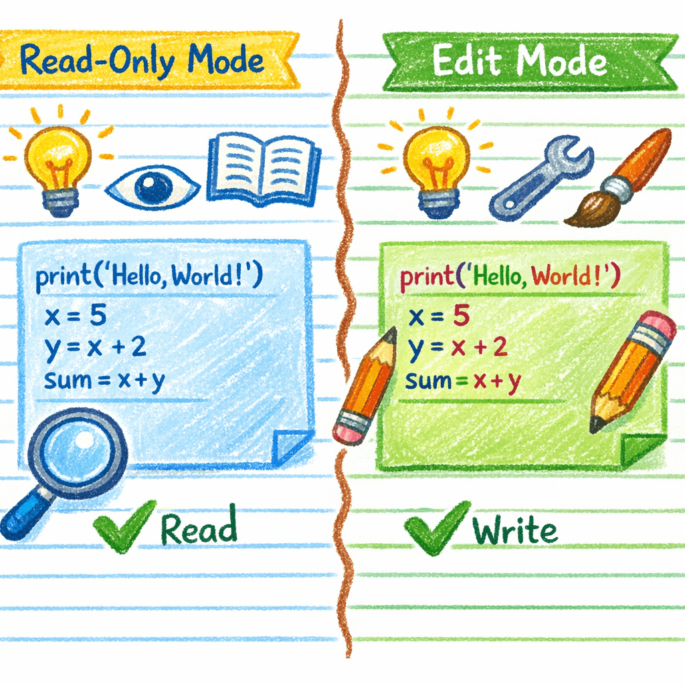

> "细粒度的权限控制,让你既能大胆探索,又能放心实践。"

---

### 你是否觉得 AI 只是"代码生成器",缺乏对整个项目的深度理解?

**传统 AI 助手的困境**:
AI 能帮你写函数、写组件,但对项目的整体架构、业务逻辑、设计模式一无所知。每次都要你详细解释上下文,效率低下。

**Hagicode 的解决方案:深度代码理解的编程搭档**

Hagicode 不仅是"代码生成器",更是你的"编程搭档":
- **深度代码理解** - AI 分析整个代码库,理解项目架构、设计模式和业务逻辑
- **智能对话交互** - 支持富文本消息、工具调用、任务管理,像和经验丰富的同事协作
- **多会话并发** - 同时处理多个任务,在不同会话间自由切换

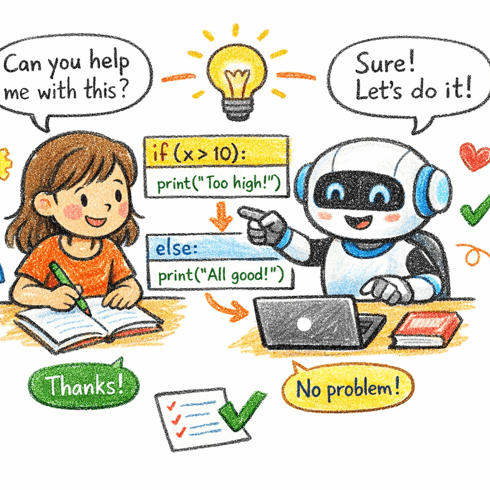

> "超越代码生成的智能助手,真正理解你的代码。"

---

### 你是否怀疑过:这个工具真的好用吗?连开发者自己都不用,凭什么让我用?

**传统 AI 助手的困境**:
很多 AI 工具宣传得天花乱坠,但你发现开发者自己根本不用。如果一个工具连自己的开发者都无法有效使用,又如何帮助其他人?

**Hagicode 的证明:自举特性**

Hagicode 最独特的优势:**它用自己的技术栈构建了自己**。这不是营销口号,而是事实:
- Hagicode 的**文档系统**是用本工具创建和优化的
- Hagicode 的**仓库管理**使用本工具进行提案管理
- Hagicode 的**持续迭代**通过本工具的提案会话规划

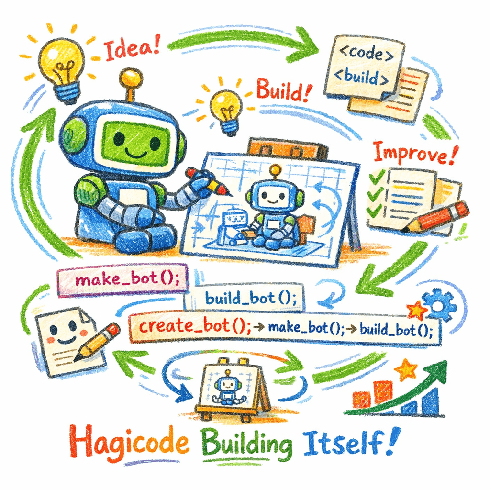

你现在阅读的这份文档,就是使用 Hagicode 优化的成果。

> "用工具开发工具的最好证明——我们自己都在用。"

---

### 谁最适合使用 Hagicode?

如果你符合以下任一描述,Hagicode 就是为你打造的:

- **新人工程师** - 快速理解陌生代码库,缩短从入职到独立开发的时间
- **技术负责人** - 通过提案工作流管理复杂变更,确保代码质量和架构一致性
- **开源维护者** - 高效处理 PR,自动化代码审查,管理项目规范和知识
- **独立开发者** - 获得全栈开发支持,从设计到实现的一站式 AI 助手

## 一个真实的场景

想象你刚加入一个新团队,面前是一个拥有几十万行代码的仓库。按照传统方式,你需要花几天时间阅读文档、调试代码、到处询问同事,才能勉强理解项目结构。

现在想象另一种方式:你打开 Hagicode,创建一个"只读会话",问 AI:"这个项目的核心架构是什么?"几分钟内,你不仅获得了清晰的架构图,还了解了关键模块的设计思路和业务逻辑。当你准备动手实现第一个功能时,你切换到"编辑模式",AI 帮你完成编码,并解释每个修改的意图。

这不再是科幻想象——这就是 Hagicode 能带给你的体验。

## 自举证明 - 工具开发工具

Hagicode 最独特的优势在于:**它用自己的技术栈构建了自己**。这不是营销口号,而是事实——Hagicode 的文档系统、仓库管理和持续迭代都使用了本工具开发。

### 文档系统自举

你现在阅读的这份文档,就是使用 Hagicode 创建和优化的:

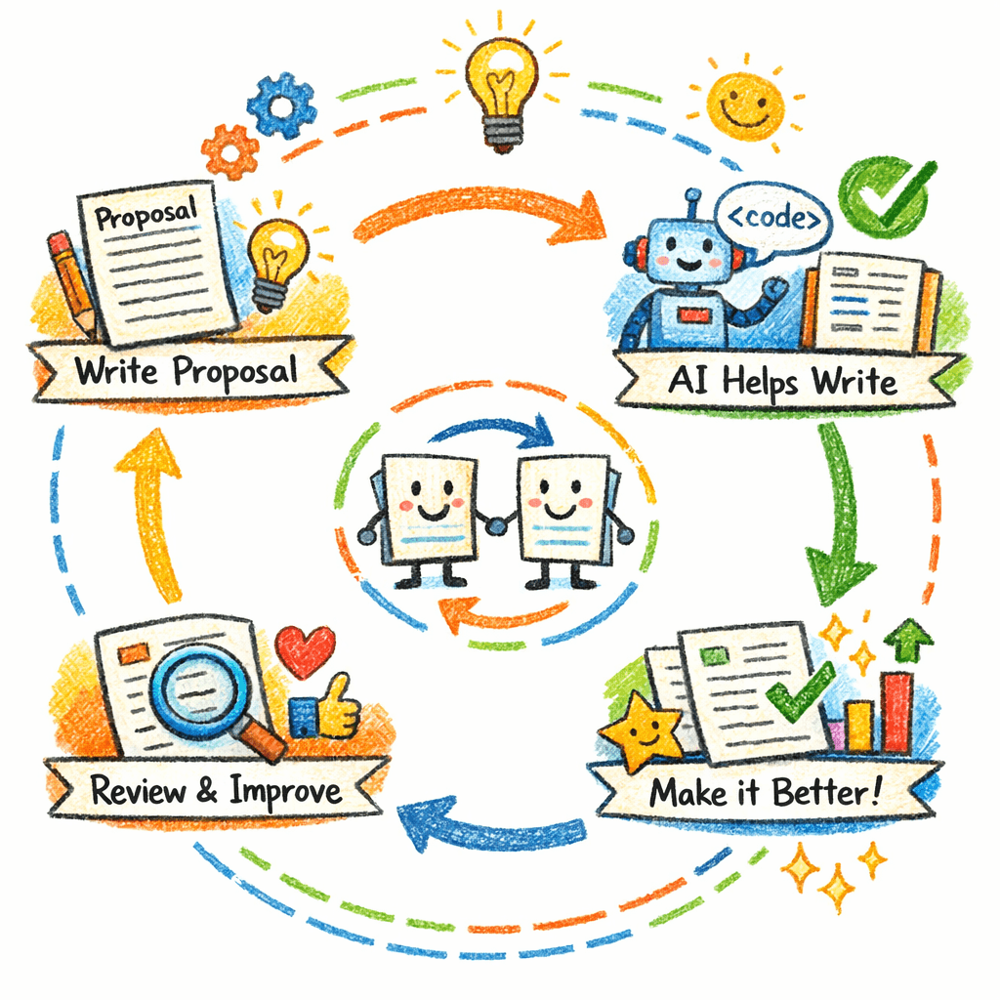

- **提案驱动**: 文档优化通过 OpenSpec 提案流程实施,包含结构化计划和验收标准
- **AI 辅助编写**: 内容草稿由 AI 根据需求生成,开发者审查和调整
- **自动优化**: AI 分析文档结构,提出改进建议并执行优化

你可以查看 [openspec/changes/product-overview-optimization/](https://github.com/newbe36524/pcode-docs/tree/newdocs/openspec/changes/product-overview-optimization/) 提案,了解这份文档是如何被优化的。

### 仓库管理自举

Hagicode 的项目管理和 SDD(软件设计文档)功能也在管理着自己的开发:

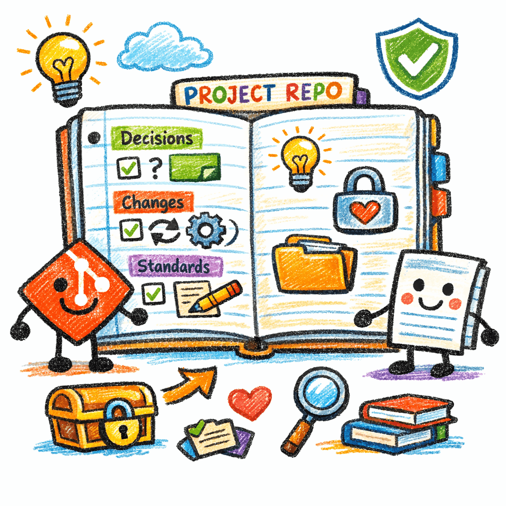

- **项目知识沉淀**: 每个功能的设计决策都记录在 OpenSpec 提案中
- **变更追溯**: 从需求分析到代码实现,完整记录开发过程
- **规范驱动**: 严格遵守自己定义的开发规范和最佳实践

当你使用 Hagicode 管理项目时,你使用的正是 Hagicode 自己在用的功能。

### 持续迭代自举

Hagicode 的功能迭代也在使用自己的工具:

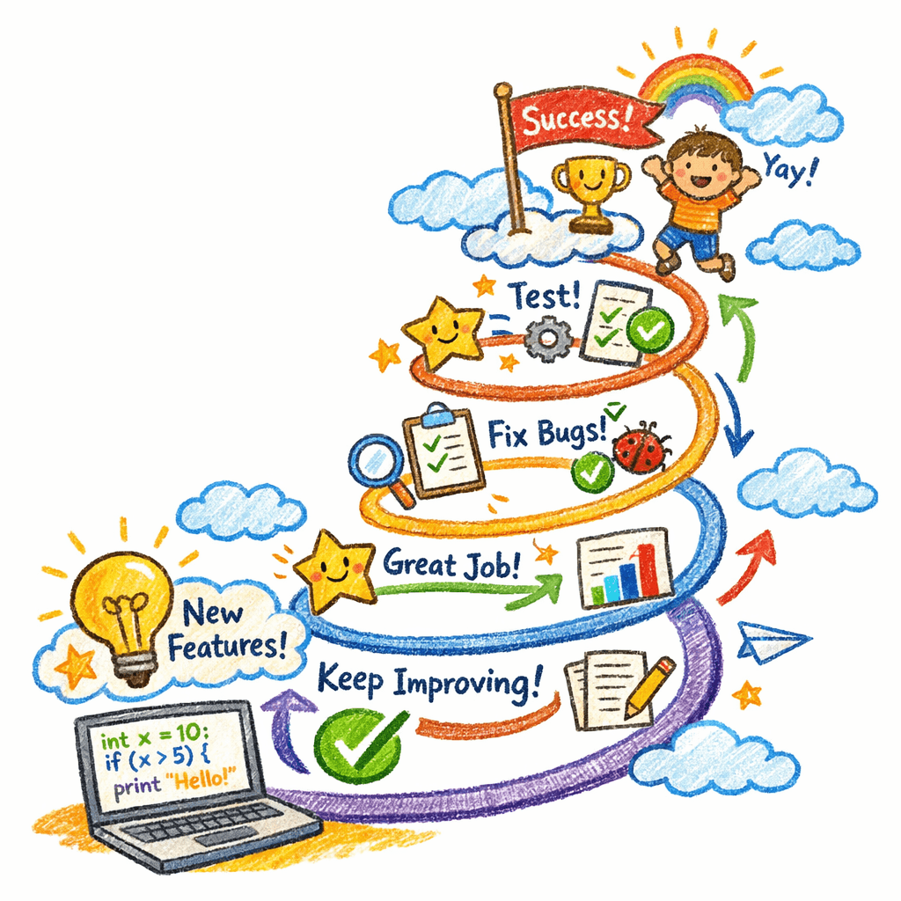

- **新功能提案**: 新特性通过提案会话创建和规划
- **代码审查**: AI 自动检查代码质量,提出改进建议
- **文档同步**: 功能更新时,文档自动同步更新

这种"自举"特性证明了 Hagicode 的实用性和成熟度——如果一个工具连自己都无法有效开发,又如何帮助开发者呢?

## 产品定位

### Hagicode 是什么?

**Hagicode** 是一个深度集成到开发工作流中的 AI 编程助手,它不仅帮你写代码,更帮你管理想法、追踪进度、沉淀知识。

与传统 AI 编程助手不同,Hagicode 专注于**规范化管理和知识沉淀**,特别适合需要长期维护的团队项目。

### 与竞品的差异化

你可能已经了解 VS Code Copilot、Cursor AI、Kilo 或 Claude Code,它们都很优秀。但 Hagicode 有一些独特的优势:

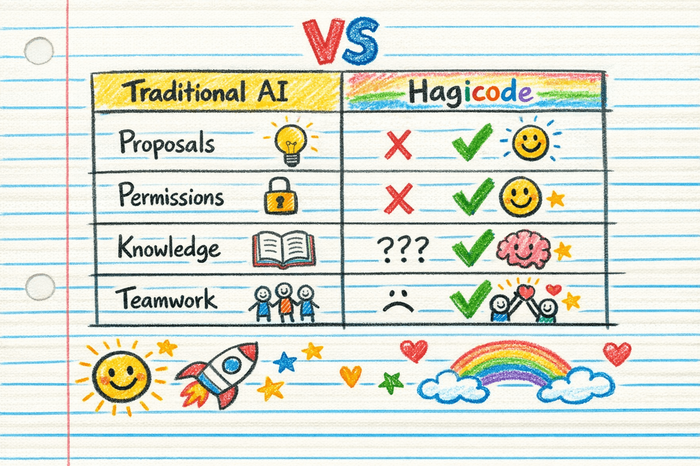

| 特性 | 传统 AI 助手 | Hagicode |
|------|-------------|----------|
| **开发模式** | 直接对话和代码修改 | 提案会话驱动,先规划后实施 |
| **权限控制** | AI 可直接修改文件 | 只读/编辑双模式,细粒度权限控制 |
| **知识管理** | 依赖 git 历史和注释 | OpenSpec 工作流自动沉淀设计决策 |
| **变更追溯** | 分散在提交历史和聊天记录 | 提案归档完整记录设计思路和实施过程 |
| **团队协作** | 个人效率工具 | 内置项目管理和团队知识共享功能 |
| **适用场景** | 快速编码辅助 | 复杂变更管理、团队知识沉淀 |

### 适用场景

Hagicode 特别适合以下场景:

- **复杂功能开发** - 需要多步骤实施的复杂变更,通过提案会话规范管理
- **团队知识管理** - 需要沉淀设计决策和实施理由,避免知识流失
- **代码库理解** - 新人快速理解陌生代码库,缩短上手时间
- **规范驱动开发** - 需要遵循规范的团队,确保变更可追溯和可审查

## 真实使用故事

### 故事 1: 新人上手不再焦虑

**角色**: 刚加入团队的软件工程师小王

**挑战**: 面对一个陌生的电商系统代码库(50,000+ 行代码),需要在 5 个工作日内完成订单模块的新功能

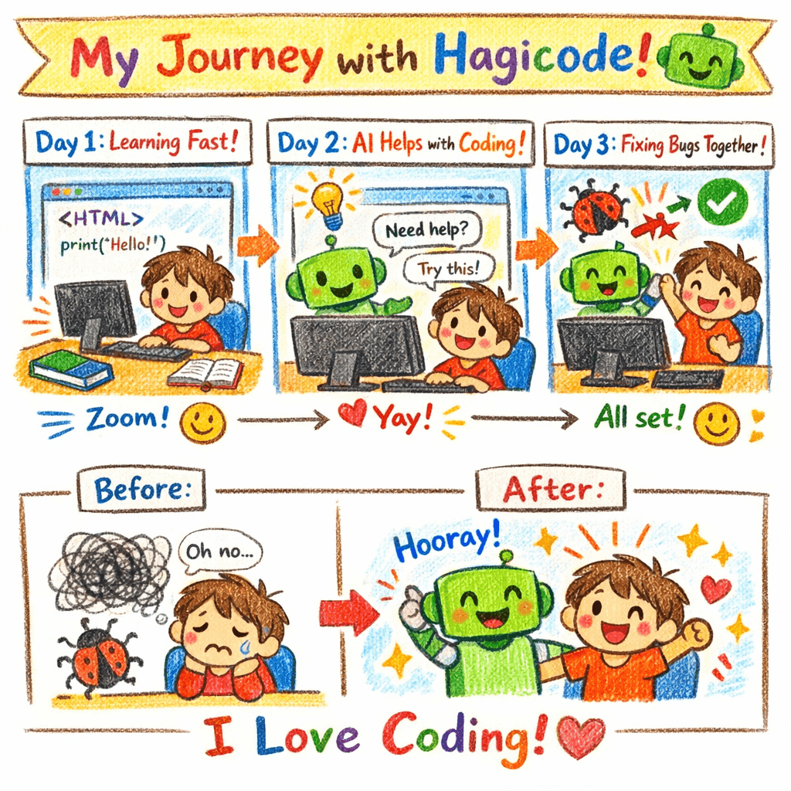

**传统方式**: 小王花了前 3 天阅读文档、调试代码,在团队群里问了 50+ 个问题,才勉强理解现有架构。第 4 天开始编码,因为对代码库不熟悉,改出了 3 个 bug,又花了 2 天修复。

**使用 Hagicode 后**:
- **第 1 天**: 小王创建只读会话,问 AI:"订单模块的核心流程是什么?"AI 不仅解释了流程,还画出了时序图,指出 15 个关键文件和 5 个潜在风险点。理解时间从 3 天缩短到 4 小时。
- **第 2 天**: 小王切换到编辑模式,和 AI 讨论实现方案,AI 帮他完成了 80% 的核心代码,并解释每个修改的意图。
- **第 3 天**: 小王用 AI 审查代码,发现并修复了 4 个边界条件问题,提交代码并通过审查。

**结果**: 原来 5 天的工作,3 天完成(效率提升 40%),代码质量评分从 75 分提升到 90 分。

### 故事 2: 复杂变更不再混乱

**角色**: 技术负责人李经理

**挑战**: 团队提出"重构支付系统"的想法,涉及 20+ 个文件,担心改出新问题

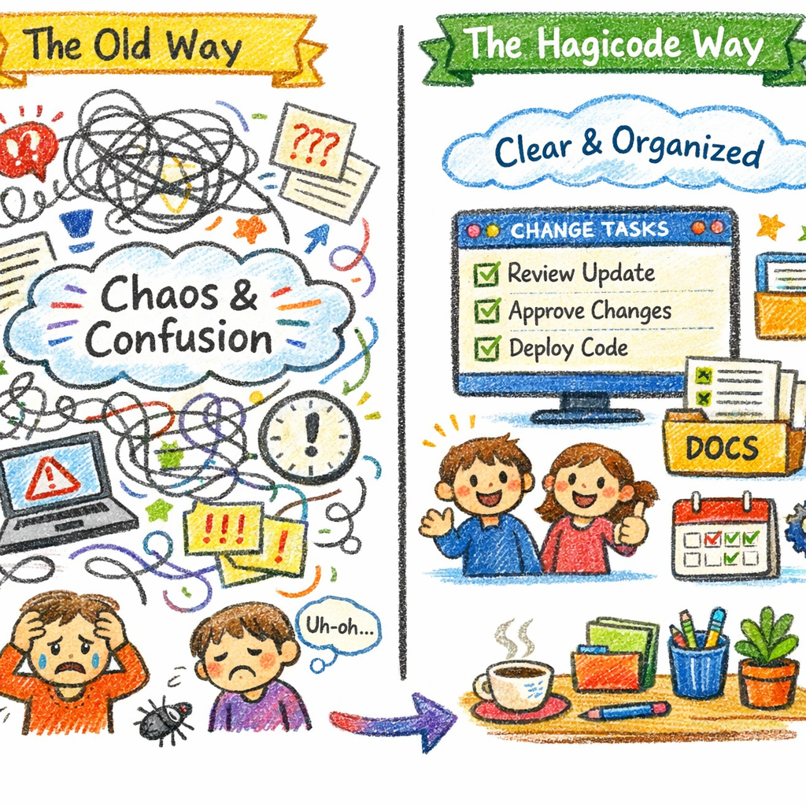

**传统方式**: 李经理自己写 15 页设计文档,列出 30+ 个任务,分派给 3 名团队成员。实施过程中:
- 2 个边界情况被遗漏
- 1 名成员误解设计意图
- 代码审查时发现 8 个问题
- 返工重做花费 3 天

**使用 Hagicode 后**:
- 李经理创建提案会话,描述:"重构支付系统,支持多种支付方式,提高可扩展性"
- AI 自动生成结构化提案(proposal.md),包含 1 个目标、3 个范围、28 个任务和 12 个验证标准
- 团队成员审查提案,调整 5 处细节后,按任务清单逐步实施
- 每个任务完成后,自动标记进度,遇到 3 个问题时 AI 提供解决方案
- 完成后 12 个验证标准全部通过,提案归档到 `changes/archive/`

**结果**: 变更过程规范有序,代码审查时间减少 60%,新成员可以在 30 分钟内通过归档提案理解设计思路。

### 故事 3: 团队知识不再流失

**角色**: 项目经理张总监

**挑战**: 核心开发者离职,带走了大量隐性知识,2 名新成员接手困难

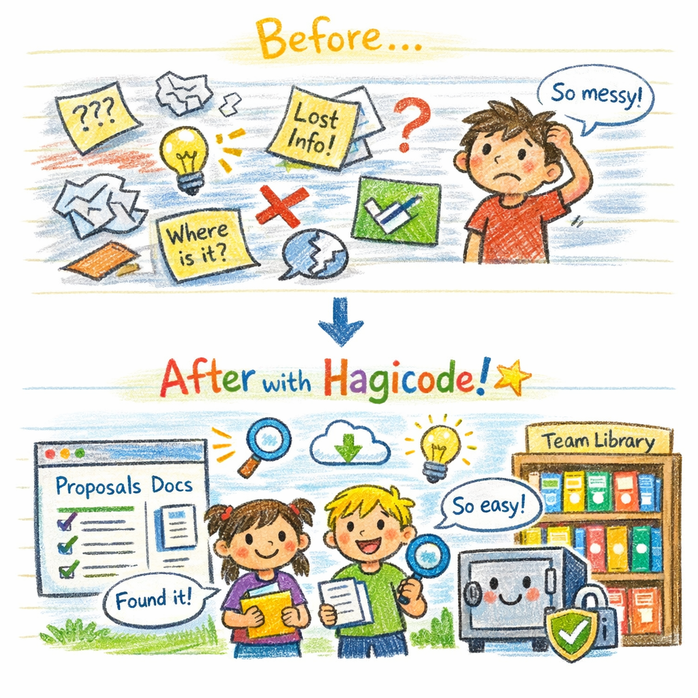

**传统方式**: 知识散落在 100+ 个代码注释、50+ 个个人笔记、无数条聊天记录中。新成员只能边做边猜:
- 平均每人每天问 20+ 个问题
- 重复实现已有功能 3 次
- 代码风格不统一

**使用 Hagicode 后**:
- 每个功能通过 OpenSpec 工作流实施,自动记录设计思路、实现过程和决策理由
- 历史提案归档在 `openspec/changes/archive/`,包含 25 个已完成提案,可以按时间、功能分类查看
- 新成员加入时,张总监让新成员阅读 5 个相关提案,快速理解"为什么这么做"
- SDD 文档自动维护,始终保持最新状态,包含 15 个核心模块的设计文档

**结果**: 知识不再流失,新成员上手时间从 3 周缩短到 5 天(效率提升 70%),团队问题数量减少 80%。

## 核心特性详解

Hagicode 的功能按三层架构组织,从核心能力到集成体验,为开发者提供完整的开发支持。

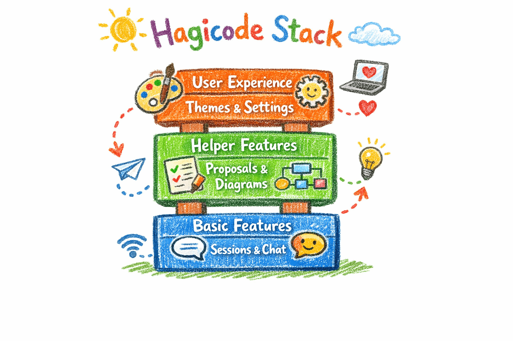

### 核心特性层 - 开发工作流的基础

#### 会话管理

- **普通会话** - 与 AI 进行传统聊天式交互,支持代码分析、审查和修改
  - 只读模式: AI 可以读取、分析、描述代码,但无法进行修改——适合安全探索代码库
  - 编辑模式: AI 具备文件修改权限,可以实现功能、修复 bug、执行重构——适合快速开发
- **提案会话** - 基于想法的结构化工作流,将抽象想法转化为具体执行计划
- **会话详情** - 查看会话历史、消息记录和执行结果
- **并发控制** - 管理多个同时进行的会话,避免资源冲突

#### 对话功能

- **消息渲染** - 支持 Markdown 代码块、语法高亮、表格和列表的富文本消息展示
- **工具调用** - AI 可以调用各种工具执行文件操作、运行命令、搜索代码等
- **待办任务** - AI 可以创建和管理任务清单,追踪实现进度
- **视图模式** - 支持不同的消息视图模式,适应不同屏幕和阅读偏好

#### 提案会话

- **提案创建** - 将想法转化为结构化的提案文档,包含目标、范围、任务和验证标准
- **任务管理** - 按计划逐步实施,每个变更都有迹可循
- **进度追踪** - 实时查看任务完成状态,遇到问题及时调整

### 集成能力层 - 项目开发的扩展

#### OpenSpec 工作流

- **规范驱动开发** - 遵循提案→实施→归档的规范流程,确保变更的可追溯性和质量
- **图表支持** - 使用 Mermaid 绘制架构图、流程图、状态图,可视化设计思路
- **project.md 优化** - AI 自动分析和优化项目配置文件,添加领域上下文和提示词配置
- **提案归档** - 完成后的提案自动归档,形成项目知识库

#### 图表和注释

- **Mermaid 图表** - 支持思维导图、流程图、序列图等多种图表类型
- **注释管理** - 在代码中添加和管理注释,帮助 AI 更好地理解代码意图
- **文档同步** - 图表和注释自动同步到文档,保持文档与代码一致

#### 项目管理

- **项目列表** - 查看和管理所有项目,快速切换工作空间
- **项目详情** - 深入了解项目结构、SDD 状态和配置信息
- **项目创建** - 简单几步添加新项目,自动识别 Git 仓库
- **SDD 管理** - 初始化和管理软件设计文档,沉淀项目知识

### 用户体验层 - 个性化的开发环境

#### 配置和设置

- **会话配置** - 自定义会话行为,设置只读/编辑模式默认值
- **模型选择** - 选择不同的 AI 模型,平衡性能和成本
- **工具权限** - 配置 AI 可用的工具和操作权限

#### 主题自定义

- **浅色/深色主题** - 支持系统主题自动切换
- **代码高亮** - 自定义代码块的语法高亮样式
- **字体大小** - 调整界面文字大小,适应不同阅读习惯

#### 统计成就

- **使用统计** - 查看会话次数、消息数量、任务完成情况
- **成就系统** - 解锁使用成就,记录开发里程碑
- **导出数据** - 导出使用数据和会话记录

### 核心特性思维导图

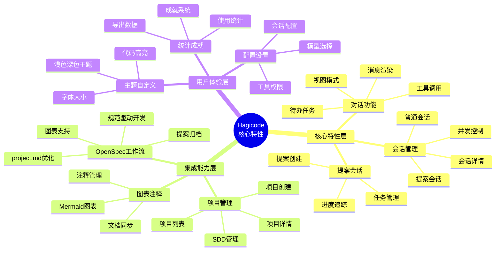
```mermaid
mindmap
  root((Hagicode<br/>核心特性))
    核心特性层
      会话管理
        普通会话
        提案会话
        会话详情
        并发控制
      对话功能
        消息渲染
        工具调用
        待办任务
        视图模式
      提案会话
        提案创建
        任务管理
        进度追踪
    集成能力层
      OpenSpec工作流
        规范驱动开发
        图表支持
        project.md优化
        提案归档
      图表注释
        Mermaid图表
        注释管理
        文档同步
      项目管理
        项目列表
        项目详情
        项目创建
        SDD管理
    用户体验层
      配置设置
        会话配置
        模型选择
        工具权限
      主题自定义
        浅色深色主题
        代码高亮
        字体大小
      统计成就
        使用统计
        成就系统
        导出数据
```

## 使用示例

通过具体示例了解如何使用 Hagicode 的核心功能。

### 提案驱动开发示例

假设你需要"重构用户认证模块,支持多因素认证"。

**传统方式**:
1. 自己编写设计文档
2. 列出任务清单
3. 分派给团队
4. 实施过程中容易遗漏边界情况
5. 代码审查时发现问题,返工重做

**使用 Hagicode 提案会话**:

1. **创建提案会话**:
```
用户: 重构用户认证模块,支持多因素认证

AI: 我来帮你创建一个结构化提案。

[生成 proposal.md,包含:]
- 目标: 重构认证模块,支持短信、邮箱、TOTP 多因素认证
- 范围: 认证服务、数据库模型、前端界面
- 任务清单:
  1. 设计新的认证流程
  2. 更新数据库模型
  3. 实现多因素认证后端
  4. 更新前端登录界面
  5. 编写单元测试
  6. 更新文档
- 验证标准:
  - 所有认证方式正常工作
  - 测试覆盖率 > 80%
  - 文档完整更新
```

2. **审查和调整提案**:
```
用户: 看起来不错,但还需要添加备用码功能

AI: 好的,我更新提案,添加备用码生成和验证功能。
```

3. **按计划实施**:
```
用户: 开始实施第一个任务

AI: 正在实施任务 1: 设计新的认证流程...
[展示流程图,解释设计思路]
```

**优势**: 整个过程规范有序,可追溯,代码审查更轻松。

### 双模式会话示例

Hagicode 的只读/编辑模式让你在不同场景下选择最合适的工作方式。

**场景 1: 只读模式 - 安全探索代码库**

你刚接手一个新项目,想了解订单处理流程:

```
用户: 订单模块的核心流程是什么?(只读模式)

AI: 让我分析订单模块的代码...

[分析结果:]
订单处理流程:
1. 用户下单 → OrderService.createOrder()
2. 库存检查 → InventoryService.checkStock()
3. 支付处理 → PaymentService.processPayment()
4. 订单确认 → OrderService.confirmOrder()

关键文件:
- src/services/OrderService.ts
- src/services/InventoryService.ts
- src/services/PaymentService.ts

潜在风险:
- 库存检查和支付处理之间可能存在竞态条件
- 建议添加分布式锁

注意: 当前为只读模式,我未修改任何文件。
```

**场景 2: 编辑模式 - 快速实现功能**

你了解了代码库后,准备添加新功能:

```
用户: 添加订单取消功能(编辑模式)

AI: 好的,我来实现订单取消功能。

[正在修改文件:]
- 更新 OrderService.ts,添加 cancelOrder() 方法
- 更新数据库模型,添加订单状态字段
- 更新 API 路由

[完成:]
订单取消功能已实现:
- 只有未支付的订单可以取消
- 取消后自动释放库存
- 发送取消通知给用户

是否需要我编写测试?
```

**优势**: 先只读理解,再编辑实现,安全又高效。

### AI 辅助编码示例

Hagicode 不仅生成代码,更是你的编程搭档。

**场景: 复杂算法实现**

你需要实现一个高效的缓存淘汰策略:

```
用户: 实现 LRU 缓存淘汰算法

AI: 好的,我来实现 LRU(最近最少使用)缓存。

[实现思路:]
使用哈希表 + 双向链表:
- 哈希表: O(1) 查找
- 双向链表: O(1) 插入和删除

[生成代码:]
class LRUCache {
  constructor(capacity) {
    this.capacity = capacity;
    this.cache = new Map();
  }

  get(key) {
    if (!this.cache.has(key)) return -1;
    // 重新插入以更新顺序
    const value = this.cache.get(key);
    this.cache.delete(key);
    this.cache.set(key, value);
    return value;
  }

  put(key, value) {
    if (this.cache.has(key)) {
      this.cache.delete(key);
    } else if (this.cache.size >= this.capacity) {
      // 删除最久未使用的项
      const firstKey = this.cache.keys().next().value;
      this.cache.delete(firstKey);
    }
    this.cache.set(key, value);
  }
}

[测试用例:]
const cache = new LRUCache(2);
cache.put(1, 'a');
cache.put(2, 'b');
cache.get(1); // 返回 'a'
cache.put(3, 'c'); // 淘汰 key 2
cache.get(2); // 返回 -1(已淘汰)

时间复杂度:
- get: O(1)
- put: O(1)

空间复杂度: O(capacity)
```

**优势**: AI 不仅生成代码,还解释设计思路和复杂度分析。

## 从这里开始

根据您的角色和需求,选择最适合的阅读路径:

### 新用户推荐路径

如果您是第一次接触 Hagicode,建议按以下顺序阅读:

1. **[本文档](/product-overview)** - 建立对产品的整体认知(您在这里)
2. **[安装指南](/installation/docker-compose/)** - 安装并运行 Hagicode
3. **[创建第一个项目](/quick-start/create-first-project)** - 初始化您的项目
4. **[创建普通会话](/quick-start/conversation-session)** - 开始与 AI 交互
5. **[创建提案会话](/quick-start/proposal-session)** - 了解提案工作流

### 不同角色的快速入口

- **开发者**: 从 [创建普通会话](/quick-start/conversation-session) 开始,体验只读和编辑模式
- **技术负责人**: 从 [创建提案会话](/quick-start/proposal-session) 开始,了解规范驱动开发
- **项目经理**: 从 [项目管理](/projects/) 开始,学习如何管理项目和团队知识

---

**需要帮助?**

如果您在阅读本文档时有任何疑问,或发现需要改进的地方,欢迎:
- 在 GitHub 上提 Issue 报告问题或建议
- 查看其他快速入门文档获取更多细节
- 联系团队获取支持
