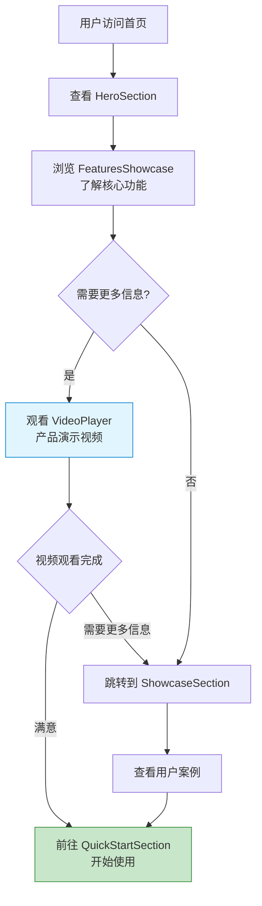
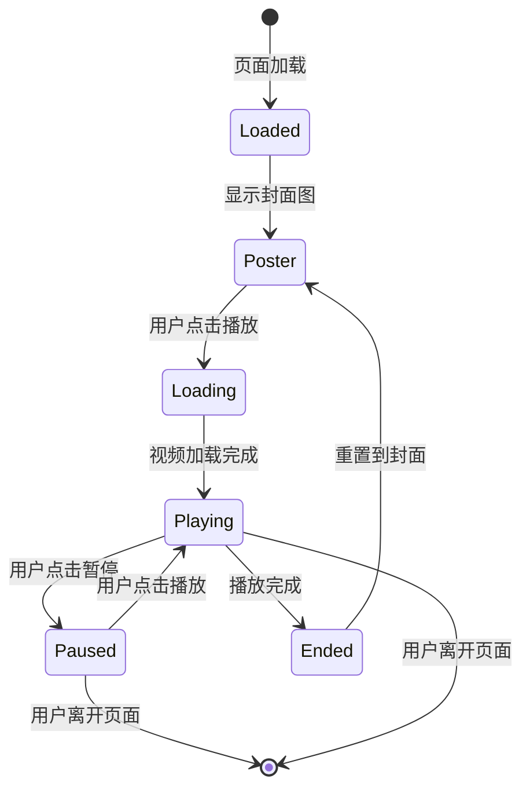
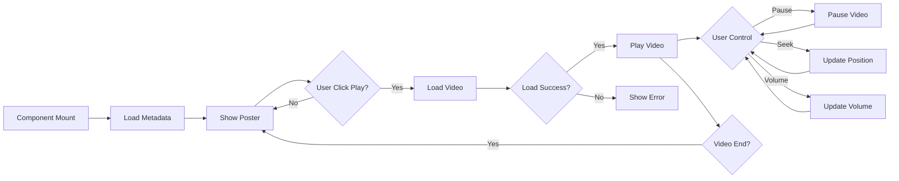

# Design Document: Homepage Video Player Integration

## Context

Hagicode 文档站点需要添加视频播放器组件来展示产品介绍视频（约 21MB）。视频文件已放置在 `static/videos/intro` 路径。当前首页包含多个功能区域，需要确定视频播放器的最佳位置和实现方式。

**Constraints:**
- 视频文件大小约 21MB，需要考虑加载性能
- 必须保持与现有首页设计风格一致（渐变、动画、响应式）
- 支持深色/浅色主题切换
- 需要适配桌面、平板、移动设备

**Stakeholders:**
- 新用户：希望快速了解产品功能
- 产品团队：希望提高用户转化率
- 开发团队：希望代码简洁、易于维护

## Goals / Non-Goals

**Goals:**
- 提供直观的产品视频演示
- 实现流畅的播放体验
- 保持与现有设计风格一致
- 优化加载性能（21MB 文件）
- 支持响应式布局

**Non-Goals:**
- 自定义视频播放器控件（使用原生控件即可）
- 视频托管或 CDN 集成
- 视频编辑或转码功能
- 播放统计或分析

## Decisions

### Decision 1: 播放器位置选择

**Choice**: 放置在 FeaturesShowcase 之后，QuickStartSection 之前

**Visual Position:**

```
首页组件顺序 (从上到下):
1. HeroSection (英雄区域)
      ↓
2. FeaturesShowcase (功能展示)
      ↓
3. ╔═══════════════════════════╗
   ║  VideoPlayer ← 新增位置    ║  ← 在此位置插入
   ╚═══════════════════════════╝
      ↓
4. ShowcaseSection (案例展示)
      ↓
5. QuickStartSection (快速开始)
```

**代码中的位置 (`src/pages/index.tsx`):**

```tsx
<Layout>
  <main>
    <HeroSection />
    <FeaturesShowcase />
    <VideoPlayer />          {/* ← 新增组件的位置 */}
    <ShowcaseSection />
    <QuickStartSection />
  </main>
</Layout>
```

**Rationale:**
- FeaturesShowcase 展示产品功能后，视频作为实际演示自然过渡
- QuickStartSection 是行动号召，视频作为"了解"阶段的内容放在前面更合适
- 不会影响首屏加载性能（HeroSection 和 FeaturesShowcase 会先加载）
- 用户在了解核心功能后，通过视频获得更直观的产品演示
- 位置突出，用户在浏览功能卡片后自然过渡到视频区域

**Alternatives considered:**
1. **HeroSection 区域内** - 优点：优先级高；缺点：影响首屏加载性能，21MB 文件过大
2. **ShowcaseSection 替换** - 优点：统一媒体展示；缺点：失去截图展示的价值
3. **QuickStartSection 之后** - 优点：不影响现有内容；缺点：用户可能不会滚动到底部

### Decision 2: 技术实现方式

**Choice**: 使用原生 `<video>` 标签 + React 组件封装

**Rationale:**
- 原生控件提供所有必要功能（播放/暂停、进度、音量、全屏）
- 无需引入额外的第三方库
- 浏览器原生支持，性能最优
- 代码简洁，易于维护

**Alternatives considered:**
1. **Video.js / Plyr** - 优点：功能丰富；缺点：增加依赖，对于简单播放器过于复杂
2. **React Player** - 优点：React 友好；缺点：主要用于 YouTube/Vimeo 等流媒体，本地文件支持有限

### Decision 3: 加载策略

**Choice**: 懒加载 + `preload="metadata"` + 封面图

**Rationale:**
- 视频文件较大（21MB），不应在页面加载时立即下载
- `preload="metadata"` 只加载元数据（时长、尺寸），不加载完整视频
- 用户点击播放后再加载完整视频
- 添加封面图提升用户体验，避免空白视频框

**Alternatives considered:**
1. **立即加载** - 优点：播放无延迟；缺点：严重影响首页加载性能
2. **完全按需加载** - 优点：最小化初始加载；缺点：点击后加载时间较长

### Decision 4: 组件架构

**Choice**: 独立组件 + CSS Module

**Rationale:**
- 符合现有组件结构（所有首页组件都在 `src/components/home/`）
- CSS Module 确保样式隔离
- 便于复用和维护

**Component structure:**
```
src/components/home/
├── VideoPlayer.tsx           # 主组件
└── videoPlayer.module.css    # 样式文件
```

## UI/UX Design

### 首页组件结构与视频播放器位置

```
Hagicode 首页 (Homepage)
│
├─ HeroSection (英雄区域)
│  └─ 标题："用 AI 重新定义开发体验"
│  └─ 副标题："智能编码助手，让开发更高效"
│  └─ CTA 按钮：快速开始
│
├─ FeaturesShowcase (功能展示)
│  └─ 3 个核心功能卡片
│     • AI 代码生成
│     • 智能代码补全
│     • 实时错误检测
│
├─ ═══════════════════════════════════════════════
│  📍 VideoPlayer (视频播放器) ← 【新增位置】
│  ═══════════════════════════════════════════════
│
├─ ShowcaseSection (案例展示)
│  └─ 用户案例展示
│  └─ 成功故事
│
└─ QuickStartSection (快速开始)
   └─ 安装指南
   └─ 创建项目
   └─ 开始编码
```

### 视频播放器在首页中的视觉位置

```
┌────────────────────────────────────────────────────────────────────────────┐
│                                                                            │
│  ╔══════════════════════════════════════════════════════════════════════╗  │
│  ║  功能展示 (FeaturesShowcase)                                         ║  │
│  ║  ┌─────────┐  ┌─────────┐  ┌─────────┐                             ║  │
│  ║  │  AI     │  │  智能   │  │  实时   │                             ║  │
│  ║  │  代码   │  │  补全   │  │  检测   │                             ║  │
│  ║  └─────────┘  └─────────┘  └─────────┘                             ║  │
│  ╚══════════════════════════════════════════════════════════════════════╝  │
│                              ↓                                            │
│  ╔══════════════════════════════════════════════════════════════════════╗  │
│  ║                        产品介绍视频                                   ║  │
│  ║                     快速了解 Hagicode 核心功能                         ║  │
│  ║  ┌────────────────────────────────────────────────────────────────┐  ║  │
│  ║  │                                                                │  ║  │
│  ║  │  📺                                                         │  ║  │
│  ║  │                   [ 视频播放器区域 ]                           │  ║  │
│  ║  │                                                                │  ║  │
│  ║  │              点击播放按钮观看产品演示视频                         │  ║  │
│  ║  │                                                                │  ║  │
│  ║  └────────────────────────────────────────────────────────────────┘  ║  │
│  ╚══════════════════════════════════════════════════════════════════════╝  │
│                              ↓                                            │
│  ╔══════════════════════════════════════════════════════════════════════╗  │
│  ║  案例展示 (ShowcaseSection)                                         ║  │
│  ║  用户案例和成功故事...                                               ║  │
│  ╚══════════════════════════════════════════════════════════════════════╝  │
│                                                                            │
└────────────────────────────────────────────────────────────────────────────┘
```

### 用户浏览路径



### 视频播放器组件详情

视频播放器应与现有首页风格保持一致：

```
┌────────────────────────────────────────────────────────────────────────┐
│                           产品介绍视频                                   │
│                        快速了解 Hagicode 核心功能                         │
├────────────────────────────────────────────────────────────────────────┤
│                                                                        │
│   ┌────────────────────────────────────────────────────────────────┐   │
│   │                                                                │   │
│   │                    [ 视频封面图 / 播放中 ]                        │   │
│   │                                                                │   │
│   │                                                                │   │
│   │                                                                │   │
│   └────────────────────────────────────────────────────────────────┘   │
│                                                                        │
│   [原生视频控件: ▶️ ⏸️ 🔊 📺]                                        │
│                                                                        │
└────────────────────────────────────────────────────────────────────────┘
```

**样式规范:**
- 圆角：24px（与其他卡片一致）
- 边框：2px 渐变边框（悬停时显示）
- 阴影：`var(--pc-card-shadow)` / `var(--pc-card-shadow-hover)`
- 标题：使用渐变文字效果（`--pc-accent` 到 `--pc-gradient-3`）
- 背景动画：微妙的渐变背景

### 用户交互流程



### 响应式断点

- **Desktop (>1024px)**: 最大宽度 900px，居中显示
- **Tablet (768px-1024px)**: 最大宽度 700px，两侧间距减少
- **Mobile (<768px)**: 全宽显示，容器 padding 1rem

### 状态设计

1. **初始状态**: 显示封面图 + 播放按钮覆盖层
2. **加载中**: 显示加载动画 + 进度指示
3. **播放中**: 视频内容 + 原生控件
4. **暂停**: 当前帧暂停 + 原生控件
5. **错误**: 错误提示 + 重试按钮

## Technical Design

### 组件接口

```typescript
interface VideoPlayerProps {
  src: string;           // 视频文件路径
  poster?: string;       // 封面图路径（可选）
  title?: string;        // 视频标题
  description?: string;  // 视频描述
  className?: string;    // 自定义类名
}
```

### 数据流



### 组件结构

```
VideoPlayer (Section)
└── VideoContainer
    ├── SectionHeader
    │   ├── SectionTitle
    │   └── SectionDescription
    └── VideoWrapper
        ├── VideoElement
        │   ├── Source
        │   └── Track (可选字幕)
        └── LoadingOverlay (条件渲染)
```

### Props 配置

```typescript
const videoProps = {
  controls: true,        // 显示原生控件
  preload: "metadata",   // 预加载元数据
  poster: posterUrl,     // 封面图
  className: styles.videoElement,
};
```

### 性能优化策略

1. **懒加载**: 使用 `loading="lazy"` 属性
2. **预加载策略**: `preload="metadata"` 只加载元数据
3. **封面图**: 优化的图片（推荐 WebP 格式）
4. **错误重试**: 网络错误时提供重试选项

## Risks / Trade-offs

### Risk 1: 视频文件大小影响性能

**Risk**: 21MB 视频文件可能影响用户体验，特别是移动网络用户

**Mitigation**:
- 实现 `preload="metadata"` 避免自动下载
- 添加封面图提供即时反馈
- 考虑提供低质量版本（未来优化）
- 添加文件大小提示给用户

### Risk 2: 跨浏览器兼容性

**Risk**: 不同浏览器对视频格式支持不同

**Mitigation**:
- 提供多种格式（MP4 作为主要格式）
- 测试主流浏览器（Chrome、Firefox、Safari）
- 提供降级方案（封面图 + 下载链接）

### Trade-off 1: 原生控件 vs 自定义控件

**Trade-off**: 使用原生控件牺牲了一些自定义能力

**Rationale**: 原生控件更稳定、无障碍支持更好、代码更简洁。对于产品介绍视频，原生控件已足够。

### Trade-off 2: 视频位置选择

**Trade-off**: 放在 FeaturesShowcase 之后意味着部分用户可能不会滚动到该位置

**Rationale**: 不影响首屏加载性能，用户在了解功能后观看视频更符合认知流程。

## Migration Plan

**Steps:**
1. 创建 VideoPlayer 组件文件
2. 实现 UI 样式（与现有风格匹配）
3. 在 index.tsx 中集成组件
4. 测试播放功能
5. 测试响应式布局
6. 测试跨浏览器兼容性
7. 性能测试和优化

**Rollback:**
- 如果出现问题，可以从 index.tsx 中移除 VideoPlayer 引用
- 删除组件文件即可完全回滚

## Open Questions

1. **封面图**: 是否需要设计专门的视频封面图？（建议：从视频中截取关键帧或制作产品 logo 合成图）
2. **视频优化**: 是否需要转码为更高效的格式？（如 H.265/AVIF，当前假设为标准 MP4）
3. **移动端数据**: 是否需要为移动用户提供"仅在 Wi-Fi 下播放"选项？（未来优化）
4. **字幕支持**: 是否需要为视频添加多语言字幕？（当前不需要）
