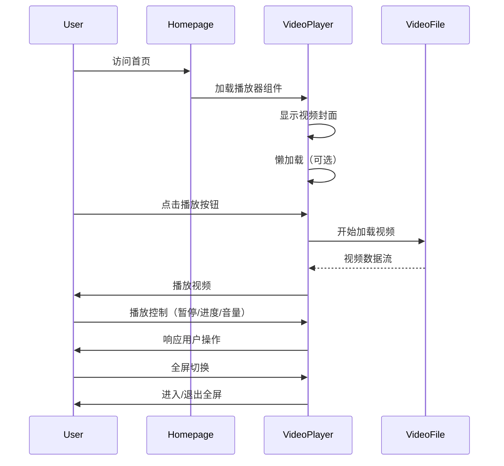
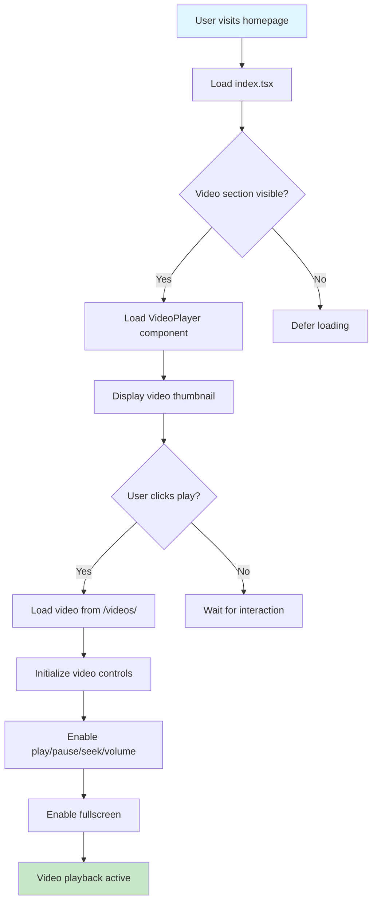

# Change: 首页集成视频播放器组件

## Why

Hagicode 文档站点已添加产品介绍视频资源（约 21MB），用于向新用户展示产品功能。当前首页虽然包含丰富的组件（英雄区域、功能展示、案例展示、快速开始），但缺少视频展示方式，新用户无法直接在首页观看产品介绍视频，需要额外导航或查找视频资源。集成视频播放器可以提供更直观的产品演示，降低学习成本，提升用户转化率。

## What Changes

- 在首页添加视频播放器组件
- 创建 React 视频播放器组件，支持标准播放控制
- 实现视频加载优化策略（懒加载、预加载选项）
- 确保播放器与现有首页设计风格一致
- 支持响应式设计，适配不同屏幕尺寸

## UI Design Changes

### 首页布局结构

```
┌────────────────────────────────────────────────────────────────────────────┐
│                         Hagicode 首页 (Homepage)                           │
├────────────────────────────────────────────────────────────────────────────┤
│                                                                            │
│  ┌──────────────────────────────────────────────────────────────────────┐ │
│  │                      HeroSection (英雄区域)                            │ │
│  │                    标题 + 副标题 + CTA 按钮                            │ │
│  └──────────────────────────────────────────────────────────────────────┘ │
│                              ↓                                            │
│  ┌──────────────────────────────────────────────────────────────────────┐ │
│  │                    FeaturesShowcase (功能展示)                        │ │
│  │                      3 个核心功能卡片展示                              │ │
│  └──────────────────────────────────────────────────────────────────────┘ │
│                              ↓                                            │
│  ┌──────────────────────────────────────────────────────────────────────┐ │
│  │  ╔═════════════════════════════════════════════════════════════════╗  │ │
│  │  ║                                                                   ║  │ │
│  │  ║        VideoPlayer Section (视频播放器) [新增]                   ║  │ │
│  │  ║                                                                   ║  │ │
│  │  ║        ┌─────────────────────────────────────────────────┐      ║  │ │
│  │  ║        │                                                 │      ║  │ │
│  │  ║        │              [ Video Thumbnail ]                │      ║  │ │
│  │  ║        │                                                 │      ║  │ │
│  │  ║        │                   ┌─────────┐                  │      ║  │ │
│  │  ║        │                   │   ▶    │                  │      ║  │ │
│  │  ║        │                   └─────────┘                  │      ║  │ │
│  │  ║        │                                                 │      ║  │ │
│  │  ║        │      Hagicode 产品介绍视频 - 快速了解核心功能    │      ║  │ │
│  │  ║        │                                                 │      ║  │ │
│  │  ║        └─────────────────────────────────────────────────┘      ║  │ │
│  │  ║                                                                   ║  │ │
│  │  ║               产品介绍视频                           ║  │ │
│  │  ║            快速了解 Hagicode 核心功能                             ║  │ │
│  │  ║                                                                   ║  │ │
│  │  ╚═════════════════════════════════════════════════════════════════╝  │ │
│  └──────────────────────────────────────────────────────────────────────┘ │
│                              ↓                                            │
│  ┌──────────────────────────────────────────────────────────────────────┐ │
│  │                    ShowcaseSection (案例展示)                         │ │
│  │                      用户案例和成功故事                                │ │
│  └──────────────────────────────────────────────────────────────────────┘ │
│                              ↓                                            │
│  ┌──────────────────────────────────────────────────────────────────────┐ │
│  │                  QuickStartSection (快速开始)                         │ │
│  │                    安装指南 + 创建项目 + 开始编码                      │ │
│  └──────────────────────────────────────────────────────────────────────┘ │
│                                                                            │
└────────────────────────────────────────────────────────────────────────────┘
```

### 组件层级关系

```
src/pages/index.tsx (首页入口)
│
├── HeroSection
├── FeaturesShowcase
├── VideoPlayer          ← 新增组件位置
├── ShowcaseSection
└── QuickStartSection
```

### 视频播放器组件详情

```
┌─────────────────────────────────────────────────────────────────────┐
│                        Video Player Section                         │
├─────────────────────────────────────────────────────────────────────┤
│                                                                     │
│  ┌─────────────────────────────────────────────────────────────┐   │
│  │                                                             │   │
│  │                    [ Video Thumbnail ]                      │   │
│  │                                                             │   │
│  │                       ┌─────────┐                          │   │
│  │                       │   ▶    │                          │   │
│  │                       └─────────┘                          │   │
│  │                                                             │   │
│  │         Hagicode 产品介绍视频 - 快速了解核心功能             │   │
│  │                                                             │   │
│  └─────────────────────────────────────────────────────────────┘   │
│                                                                     │
│  [ Video Title: 产品介绍视频 ]                                       │
│  [ Video Description: 快速了解 Hagicode 核心功能 ]                    │
│                                                                     │
└─────────────────────────────────────────────────────────────────────┘
```

### User Interaction Flow



## Code Flow Changes



## Impact

- **Affected specs**: docusaurus-site
- **Affected code**:
  - `src/pages/index.tsx` - 添加 VideoPlayer 组件引用
  - `src/components/home/VideoPlayer.tsx` - 新建视频播放器组件
  - `src/components/home/videoPlayer.module.css` - 新建播放器样式文件
  - `static/videos/` - 视频资源已存在，无需修改

- **Dependencies**: 无需新增外部依赖，使用原生 `<video>` 标签
- **Performance**: 21MB 视频文件，建议实现懒加载或按需加载
- **UX**: 新用户可直接观看产品介绍，提升转化率

## Positioning Options

1. **HeroSection 区域内** - 首屏展示，优先级高，但可能影响首屏加载性能
2. **FeaturesShowcase 之后** - 功能介绍后，自然过渡，推荐位置
3. **ShowcaseSection 替代或补充** - 与截图展示形成互补
4. **QuickStartSection 之前** - 引导用户开始使用前展示

**Recommended**: FeaturesShowcase 之后，QuickStartSection 之前，作为功能展示的补充。
