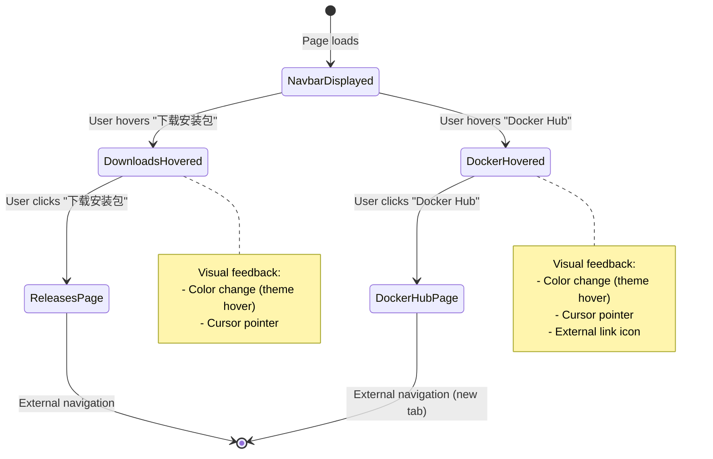

## Context

The Hagicode documentation website uses Docusaurus 3.x for its static site. The navigation bar is configured via `themeConfig.navbar.items` in `docusaurus.config.ts`. Currently, the top-right area contains a single GitHub link, which limits user access to important resources like downloads and Docker images.

### Constraints
- Must maintain Docusaurus configuration compatibility
- Should preserve responsive design behavior
- Need to support existing styling from `custom.css`

### Stakeholders
- End users: Need quick access to downloads and Docker resources
- Project maintainers: Want to promote Docker distribution channel

## Goals / Non-Goals

### Goals
- Provide direct access to GitHub Releases for application downloads
- Provide direct access to Docker Hub for containerized deployment
- Maintain clean, intuitive navigation bar layout
- Preserve responsive behavior across device sizes

### Non-Goals
- Changing the left-side navigation structure
- Adding complex dropdown menus for these actions

## Decisions

### Decision 1: Use Docusaurus Built-in Link Type vs HTML Type

**Choice**: Use built-in `type: 'link'` with `className` for consistent styling

**Rationale**:
- Better integration with Docusaurus theming
- Automatic responsive behavior handling
- Consistent hover states and active states with other nav items

**Alternatives considered**:
- `type: 'html'` - More flexible but requires manual CSS for consistent styling
- Custom navbar component - Overkill for simple links, adds maintenance burden

### Decision 2: Button Ordering

**Choice**: QQ群 -> 下载安装包 -> Docker Hub (left to right)

**Rationale**:
- QQ群 remains closest to existing position
- Download button is primary call-to-action, placed before Docker
- Maintains logical flow: community -> download -> deployment

### Decision 3: External Link Behavior

**Choice**: Open Docker Hub in new tab (`target: "_blank"`), keep Releases in same tab

**Rationale**:
- Docker Hub is an external resource (different domain)
- GitHub Releases is part of the same project ecosystem
- Consistent with common web conventions for external links

## UI/UX Design

### Desktop Navigation Bar Layout

```
+----------------------------------------------------------------------------------------------------------+
|  [LOGO]  Hagicode Docs     [Docs]  [Blog]              [QQ群] [下载安装包] [Docker Hub] |              |
+----------------------------------------------------------------------------------------------------------+
          ^                 ^         ^                    ^         ^              ^
          |                 |         |                    |         |              |
        Brand          Docs Nav  Blog Nav           Community  Downloads     Docker
                                                    (existing)    (new)        (new)
```

### Button Styling Specifications

Both buttons should use Docusaurus's default navbar link styling:
- Font weight: 600 (same as other nav items)
- Color: Inherits theme's navbar link color
- Hover state: Theme's navbar link hover color
- Spacing: Consistent with existing nav items

### Mobile Menu Behavior

On mobile devices (< 768px), the right-side buttons will move to the mobile drawer menu:

```
+--------------------------+
|  ≡   Hagicode Docs       |
+--------------------------+
|  Docs                    |
|  Blog                    |
|  -----                   |
|  QQ群                    |
|  下载安装包               |
|  Docker Hub              |
+--------------------------+
```

### State Transitions



### Responsive Breakpoints

| Screen Size | Behavior |
|-------------|----------|
| > 996px | Both buttons visible inline |
| 768px - 996px | Both buttons visible inline |
| < 768px | Buttons move to mobile menu |

### Footer Layout

The footer will be updated to match the new navigation structure. The Community section will replace the GitHub link with the new download and Docker Hub links.

**Current Footer Structure**:
```
Community          |  More
- GitHub           |  - Blog
- QQ技术支持群 (610394020) |
```

**Proposed Footer Structure**:
```
Community          |  More
- 下载安装包        |  - Blog
- Docker Hub       |
- QQ技术支持群 (610394020) |
```

## Technical Design

### Component Structure

```mermaid
graph TD
    subgraph "Docusaurus Config"
        A[docusaurus.config.ts]
        B[navbar.items array]
        C[footer.links array]
    end

    subgraph "Navigation Items"
        D[Docs Sidebar]
        E[Blog Link]
        F[QQ群 Link - existing]
        G[下载安装包 Link - new]
        H[Docker Hub Link - new]
    end

    subgraph "Footer Items"
        I[下载安装包 - new]
        J[Docker Hub - new]
        K[QQ技术支持群 - existing]
        L[Blog - existing]
    end

    A --> B
    A --> C
    B --> D
    B --> E
    B --> F
    B --> G
    B --> H
    C --> I
    C --> J
    C --> K
    C --> L

    subgraph "External Destinations"
        M[/docs - internal]
        N[/blog - internal]
        O[QQ群 URL - external]
        P[GitHub Releases - external]
        Q[Docker Hub - external new tab]
    end

    D --> M
    E --> N
    F --> O
    G --> P
    H --> Q
    I --> P
    J --> Q
    K --> O
    L --> N
```

### Configuration Changes

**File**: `docusaurus.config.ts`

**Navbar Changes - Remove** (lines 67-71):
```typescript
{
  href: 'https://github.com/Hagicode-org/hagicode-docs',
  label: 'GitHub',
  position: 'right',
},
```

**Navbar Changes - Add**:
```typescript
{
  to: 'https://github.com/HagiCode-org/releases/releases',
  label: '下载安装包',
  position: 'right',
},
{
  href: 'https://hub.docker.com/r/newbe36524/hagicode',
  label: 'Docker Hub',
  position: 'right',
  className: 'navbar-external-link',
},
```

**Footer Changes - Remove** (lines 80-83):
```typescript
{
  label: 'GitHub',
  href: 'https://github.com/Hagicode-org/hagicode-docs',
},
```

**Footer Changes - Add** (in Community section, before QQ技术支持群):
```typescript
{
  label: '下载安装包',
  href: 'https://github.com/HagiCode-org/releases/releases',
},
{
  label: 'Docker Hub',
  href: 'https://hub.docker.com/r/newbe36524/hagicode',
},
```

### Link Properties Summary

#### Navbar Links

| Button | Property | Value |
|--------|----------|-------|
| 下载安装包 | `to` | `https://github.com/HagiCode-org/releases/releases` |
| 下载安装包 | `label` | `下载安装包` |
| 下载安装包 | `position` | `right` |
| 下载安装包 | `target` | (default: same tab) |
| Docker Hub | `href` | `https://hub.docker.com/r/newbe36524/hagicode` |
| Docker Hub | `label` | `Docker Hub` |
| Docker Hub | `position` | `right` |
| Docker Hub | `target` | `_blank` |

#### Footer Links

| Link | Property | Value |
|------|----------|-------|
| 下载安装包 | `label` | `下载安装包` |
| 下载安装包 | `href` | `https://github.com/HagiCode-org/releases/releases` |
| Docker Hub | `label` | `Docker Hub` |
| Docker Hub | `href` | `https://hub.docker.com/r/newbe36524/hagicode` |

## Risks / Trade-offs

### Risk 1: Mobile Menu Clutter

**Risk**: Adding two new items increases mobile menu length

**Mitigation**: Only two items added; mobile menu can accommodate this. Monitor feedback and consider combining into a dropdown if needed in future iterations.

### Trade-off: Link Type Consistency

**Trade-off**: Using `to` for Releases vs `href` for Docker Hub

**Rationale**: `to` provides internal routing optimizations for same-domain links. Since GitHub is technically external, `href` could be used for both, but the current approach is consistent with Docusaurus conventions for project-ecosystem links.

### Migration Plan

### Implementation Steps

1. **Pre-implementation**
   - Create feature branch from main

2. **Configuration changes**
   - Edit `docusaurus.config.ts` to remove GitHub link from navbar
   - Add two new link items for Downloads and Docker Hub in navbar
   - Update footer Community section to replace GitHub link with Downloads and Docker Hub

3. **Local validation**
   - Run `npm start` to verify changes
   - Test navbar and footer button functionality
   - Check responsive behavior at different breakpoints

4. **Build verification**
   - Run `npm run build` to ensure no build errors
   - Check for TypeScript type errors

5. **Deployment**
   - Commit changes with descriptive message
   - Create pull request for review
   - Merge after approval

### Rollback Plan

If issues arise:
1. Revert `docusaurus.config.ts` navbar changes
2. Revert `docusaurus.config.ts` footer changes
3. Restore original GitHub link configuration in both navbar and footer
4. Redeploy previous version

## Open Questions

1. **Button text preference**: Should "下载安装包" use alternative text like "下载发布版本"?
   - Current choice: "下载安装包" (more action-oriented)
   - Can be adjusted based on user feedback
