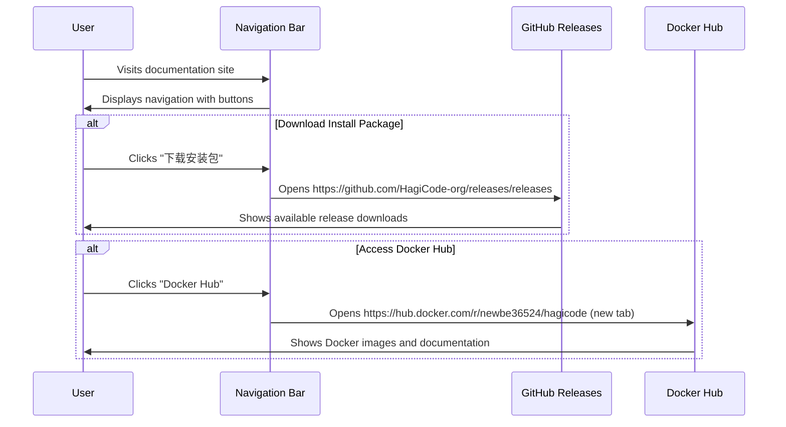

# Change: Refactor Navbar Right-Hand Button Area

## Why

The current Hagicode documentation website navigation bar has a single GitHub link in the top-right corner. This provides limited user access to key resources—users cannot directly access download links or Docker resources from the navigation. The GitHub link should be fixed and enhanced with additional buttons for common user actions. Additionally, the footer should be updated to match the new navigation structure.

## What Changes

- **Replace single GitHub link with two action buttons**:
  - Button 1: "下载安装包" linking to GitHub Releases page
  - Button 2: "Docker Hub" linking to the project's Docker Hub repository
- **Remove the existing GitHub link** from `navbar.items` configuration
- **Update footer links** to include the new download and Docker Hub resources

## UI Design Changes

### Current Navigation Bar (Right Side)

```
+---------------------------------------------------------------+
|  Hagicode Docs     [Docs]  [Blog]        [QQ群]  [GitHub] |  <<  |
+---------------------------------------------------------------+
```

### Proposed Navigation Bar (Right Side)

```
+---------------------------------------------------------------+
|  Hagicode Docs     [Docs]  [Blog]  [QQ群] [下载安装包] [Docker Hub] |  |
+---------------------------------------------------------------+
```

### Current Footer (Community Section)

```
+------------------------------------------+
|  Community           |  More             |
|  - GitHub            |  - Blog           |
|  - QQ技术支持群       |                   |
+------------------------------------------+
```

### Proposed Footer (Community Section)

```
+------------------------------------------+
|  Community           |  More             |
|  - 下载安装包         |  - Blog           |
|  - Docker Hub        |                   |
|  - QQ技术支持群       |                   |
+------------------------------------------+
```

### Button Interaction Flow



### Responsive Behavior

- Desktop (> 996px): Both buttons visible with full text
- Tablet (768px - 996px): Both buttons visible
- Mobile (< 768px): Buttons move to mobile menu (hamburger menu)

## Impact

- Affected specs: `website-navigation`
- Affected code:
  - `docusaurus.config.ts:52-72` (navbar configuration)
  - `docusaurus.config.ts:74-101` (footer configuration)
- Testing required:
  - `npm start` - Verify navbar and footer display correctly
  - `npm run build` - Ensure no build errors
  - Manual testing of button links and responsive behavior
