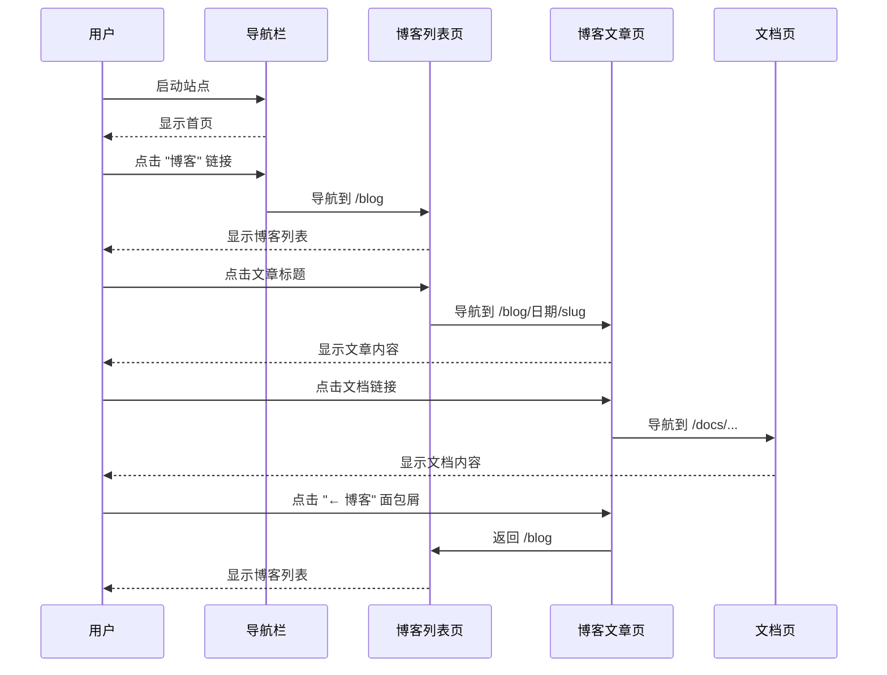
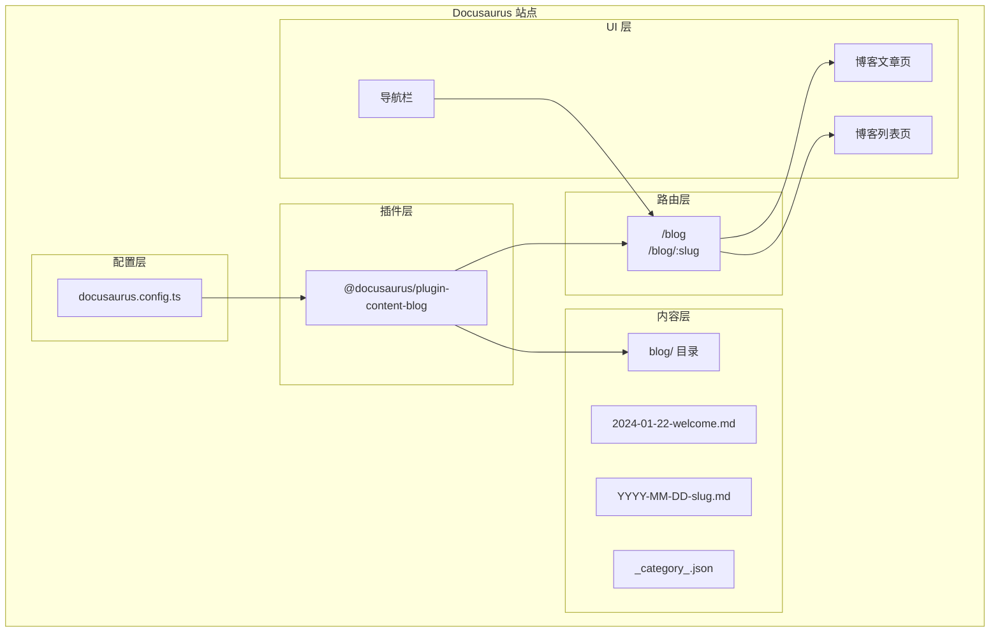
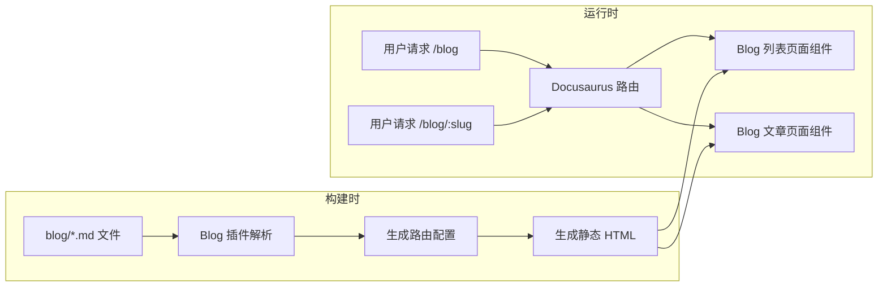

# Design: Docusaurus 博客功能设计

## Overview

本文档详细描述为 Hagicode 文档站点添加博客功能的设计方案。博客功能基于 Docusaurus 内置的 `@docusaurus/plugin-content-blog` 插件实现，提供完整的博客文章管理、分类、标签和搜索功能。

## UI/UX Design

### 导航栏布局设计

博客链接将添加到导航栏左侧，位于 "Docs" 链接之后：

```
┌──────────────────────────────────────────────────────────────────────┐
│ Hagicode Docs                                                    [v] │
├──────────────────────────────────────────────────────────────────────┤
│ Docs  Blog  │              │ QQ群  下载安装包  Docker Hub  Docker... │
└──────────────────────────────────────────────────────────────────────┘
     ^      ^
     |      └── 新增：博客链接（position: 'left'）
     └── 现有：文档侧边栏
```

**设计决策**：
- 将博客链接放在 "Docs" 之后，保持内容相关链接的集中
- 使用 `to: '/blog'` 而非 `href`，确保使用客户端路由
- 标签使用中文 "博客" 保持与站点语言一致

### 博客列表页面设计

```
┌──────────────────────────────────────────────────────────────────────┐
│ 博客                                              [🔍 搜索博客文章]   │
├──────────────────────────────────────────────────────────────────────┤
│                                                                      │
│  按标签筛选: [全部] [动态] [教程] [更新日志]                          │
│                                                                      │
│  ┌──────────────────────────────────────────────────────────────┐   │
│  │ 2024年1月22日                                                 │   │
│  │                                                              │   │
│  │ 📝 欢迎来到 Hagicode 博客                                        │   │
│  │                                                              │   │
│  │ 欢迎来到 Hagicode 博客！这里是我们分享项目动态、技术文章和...  │   │
│  │                                                              │   │
│  │ 标签: #公告 #欢迎                                              │   │
│  │                                        [阅读更多 ->]          │   │
│  └──────────────────────────────────────────────────────────────┘   │
│                                                                      │
│  [加载更多文章...]                                                   │
└──────────────────────────────────────────────────────────────────────┘
```

### 博客文章详情页设计

```
┌──────────────────────────────────────────────────────────────────────┐
│                              ← 博客                                  │
├──────────────────────────────────────────────────────────────────────┤
│                                                                      │
│  欢迎来到 Hagicode 博客                                              │
│  ─────────────────────────────────────────────────────────────────  │
│  作者: Hagicode 团队 • 2024年1月22日 • 阅读时间: 3 分钟              │
│  ─────────────────────────────────────────────────────────────────  │
│                                                                      │
│  欢迎来到 Hagicode 博客！这里是我们分享项目动态、技术文章和更新...    │
│                                                                      │
│  ## 博客用途                                                        │
│                                                                      │
│  本博客用于发布：                                                    │
│  - 项目动态和更新日志                                                │
│  - 技术文章和教程                                                    │
│  - 最佳实践和使用技巧                                                │
│  - 社区贡献展示                                                      │
│                                                                      │
│  ## 探索文档                                                        │
│                                                                      │
│  如果您是第一次访问 Hagicode，建议从以下文档开始：                    │
│  - [安装指南](/docs/quick-start/installation)                       │
│  - [创建你的第一个项目](/docs/quick-start/create-project)           │
│                                                                      │
│  [底部评论区 - 通过 Disqus/Giscus 集成]                              │
│                                                                      │
└──────────────────────────────────────────────────────────────────────┘
```

### 用户交互流程



## Technical Design

### 系统架构图



### 数据流设计



### 文件结构设计

```
project/
├── blog/
│   ├── _category_.json          # 博客分类配置（可选）
│   ├── authors.yml               # 作者信息配置（可选）
│   └── 2024-01-22-welcome.md    # 欢迎文章
│       ├── frontmatter: title, description, authors, tags
│       └── content: Markdown 内容
│
├── docusaurus.config.ts          # 主配置文件
│   ├── presets[].blog: {}        # 博客插件配置
│   └── themeConfig.navbar: []    # 导航栏配置
│
└── sidebars.ts                   # 侧边栏配置（不变）
```

## API 设计

### Docusaurus Blog Plugin API

插件配置通过 `docusaurus.config.ts` 的 `presets` 数组传递：

```typescript
presets: [
  [
    '@docusaurus/preset-classic',
    {
      blog: {
        blogTitle: '博客',              // 博客页面标题
        blogDescription: 'Hagicode 项目动态、技术分享与更新日志', // SEO 描述
        routeBasePath: 'blog',          // URL 路由前缀
        path: 'blog',                   // Markdown 文件目录
        postsPerPage: 10,               // 每页显示文章数
        blogSidebarCount: 'ALL',        // 侧边栏显示文章数
        blogSidebarTitle: '所有文章',    // 侧边栏标题
        feedOptions: {                  // RSS/Atom 订阅配置
          type: 'all',
          copyright: `Copyright © ${new Date().getFullYear()} Hagicode`,
        },
      },
    } satisfies PresetOptions,
  ],
]
```

### 导航栏配置 API

```typescript
themeConfig: {
  navbar: {
    items: [
      {
        type: 'docSidebar',
        sidebarId: 'docsSidebar',
        position: 'left',
        label: 'Docs',
      },
      {
        to: '/blog',              // 博客链接（使用客户端路由）
        label: '博客',             // 显示文本
        position: 'left',         // 位置：左侧
      },
      // ... 其他导航项
    ],
  },
}
```

### Blog Post Frontmatter API

```yaml
---
title: 欢迎来到 Hagicode 博客
description: 欢迎来到 Hagicode 博客！这里是我们分享项目动态、技术文章和更新日志的地方。
slug: welcome                    # 可选：自定义 URL slug
authors: hagicode                # 可选：作者标识或 authors.yml 中的 key
tags: [公告, 欢迎]              # 可选：文章标签
date: 2024-01-22                 # 可选：发布日期（默认从文件名提取）
readingTime: true                # 可选：显示阅读时间
image: ./img/blog-cover.jpg      # 可选：社交卡片图片
---
```

## 实现细节

### 关键代码片段

#### docusaurus.config.ts 配置变更

**变更前**：
```typescript
presets: [
  [
    '@docusaurus/preset-classic',
    {
      docs: {
        sidebarPath: './sidebars.ts',
        editUrl: 'https://github.com/Hagicode-org/hagicode-docs/tree/main/',
      },
      pages: {},
      theme: {
        customCss: ['./src/css/custom.css'],
      },
    } satisfies PresetOptions,
  ],
],
```

**变更后**：
```typescript
presets: [
  [
    '@docusaurus/preset-classic',
    {
      docs: {
        sidebarPath: './sidebars.ts',
        editUrl: 'https://github.com/Hagicode-org/hagicode-docs/tree/main/',
      },
      blog: {
        blogTitle: '博客',
        blogDescription: 'Hagicode 项目动态、技术分享与更新日志',
        routeBasePath: 'blog',
        path: 'blog',
        postsPerPage: 10,
      },
      pages: {},
      theme: {
        customCss: ['./src/css/custom.css'],
      },
    } satisfies PresetOptions,
  ],
],
```

#### 导航栏配置变更

**变更前**：
```typescript
navbar: {
  title: 'Hagicode Docs',
  items: [
    {
      type: 'docSidebar',
      sidebarId: 'docsSidebar',
      position: 'left',
      label: 'Docs',
    },
    // ... 其他导航项
  ],
},
```

**变更后**：
```typescript
navbar: {
  title: 'Hagicode Docs',
  items: [
    {
      type: 'docSidebar',
      sidebarId: 'docsSidebar',
      position: 'left',
      label: 'Docs',
    },
    {
      to: '/blog',
      label: '博客',
      position: 'left',
    },
    // ... 其他导航项
  ],
},
```

#### 欢迎文章内容模板

```markdown
---
title: 欢迎来到 Hagicode 博客
description: 欢迎来到 Hagicode 博客！这里是我们分享项目动态、技术文章和更新日志的地方。
authors: hagicode
tags: [公告, 欢迎]
---

欢迎来到 Hagicode 博客！这里是我们分享项目动态、技术文章和更新日志的地方。

## 博客用途

本博客用于发布：

- **项目动态**：最新的项目进展、功能预览
- **技术分享**：深入的技术解析、使用技巧
- **更新日志**：版本更新说明、迁移指南
- **社区贡献**：优秀的社区案例、贡献者介绍

## 探索文档

如果您是第一次访问 Hagicode，建议从以下文档开始：

- [安装指南](/docs/quick-start/installation) - 快速安装 Hagicode
- [创建你的第一个项目](/docs/quick-start/create-project) - 开始使用 Hagicode
- [创建普通会话](/docs/quick-start/create-conversation-session) - 了解会话类型

## 加入社区

- [QQ 技术支持群 (610394020)](https://qm.qq.com/q/Wk6twXHdyS)
- [GitHub 仓库](https://github.com/Hagicode-org/hagicode-docs)
- [下载安装包](https://github.com/HagiCode-org/releases/releases)

欢迎关注我们的博客，获取最新的项目动态！
```

### 配置变更

| 配置项 | 值 | 说明 |
|-------|---|------|
| `blog.blogTitle` | `'博客'` | 博客页面标题 |
| `blog.blogDescription` | `'Hagicode 项目动态、技术分享与更新日志'` | SEO 描述 |
| `blog.routeBasePath` | `'blog'` | URL 路由前缀 |
| `blog.path` | `'blog'` | Markdown 文件目录 |
| `blog.postsPerPage` | `10` | 每页显示文章数 |
| `navbar.items[].to` | `'/blog'` | 使用客户端路由 |
| `navbar.items[].label` | `'博客'` | 显示文本 |
| `navbar.items[].position` | `'left'` | 位置：左侧 |

## 测试策略

### 功能测试

1. **导航栏测试**
   - 验证导航栏显示 "博客" 链接
   - 验证链接位置正确（Docs 之后）
   - 验证点击链接跳转到 `/blog`

2. **博客列表页测试**
   - 验证博客列表页面正确渲染
   - 验证欢迎文章显示在列表中
   - 验证文章元数据（标题、日期、摘要）正确显示

3. **博客文章页测试**
   - 验证文章详情页正确渲染
   - 验证 Markdown 内容正确解析
   - 验证内部链接工作正常

### 构建测试

1. **类型检查测试**
   ```bash
   npm run typecheck
   ```
   确保没有 TypeScript 类型错误

2. **构建测试**
   ```bash
   npm run build
   ```
   确保没有构建错误

3. **断链检查**
   - 验证 `onBrokenLinks: 'throw'` 配置生效
   - 验证博客文章中的链接有效

### 兼容性测试

1. **浏览器兼容性**
   - Chrome/Edge (最新版本)
   - Firefox (最新版本)
   - Safari (最新版本)

2. **响应式测试**
   - 桌面视图 (> 996px)
   - 平板视图 (768px - 996px)
   - 移动视图 (< 768px)

### 开发环境测试

```bash
# 启动开发服务器
npm start

# 访问以下 URL 验证
# http://localhost:3000/blog
# http://localhost:3000/blog/2024/01/22/welcome
```

## 可选功能扩展

以下是未来可以考虑的功能扩展，不在本次实现范围内：

1. **评论系统集成**
   - Disqus 集成
   - Giscus (GitHub Discussions) 集成

2. **RSS/Atom 订阅**
   - 配置 `feedOptions` 生成订阅源

3. **作者信息管理**
   - 创建 `authors.yml` 配置作者信息
   - 作者页面和归档

4. **博客标签系统**
   - 标签云组件
   - 按标签筛选文章

5. **搜索优化**
   - Algolia DocSearch 集成
   - 博客文章搜索索引

6. **社交媒体分享**
   - 文章分享按钮
   - Twitter Card / Open Graph 优化
