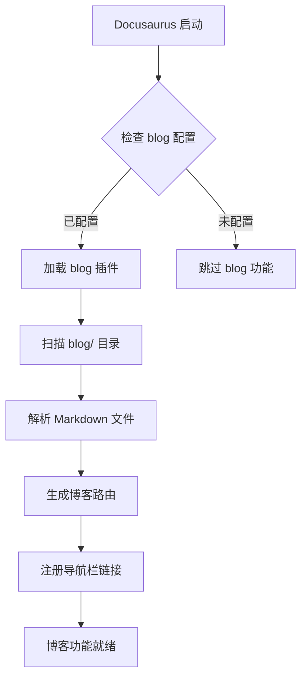
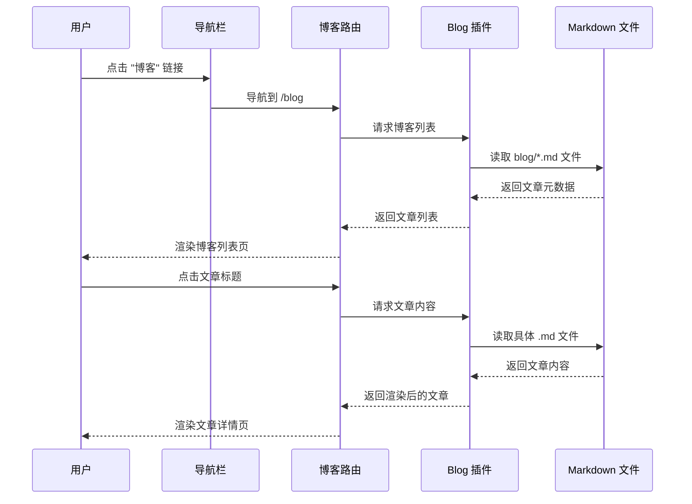

# Change: docusaurus-blog-feature

## Why

Hagicode 文档站点目前缺少独立的博客功能区域，无法以博客形式发布项目动态、版本更新、技术分享等内容。当前站点仅有文档内容结构（快速开始），内容组织形式较为单一。

用户通过导航栏只能访问文档、QQ群、下载链接等，缺少一个专门用于发布非结构化内容的博客入口。这限制了项目团队与用户之间的交流方式，无法通过博客形式分享：
- 项目动态和更新日志
- 技术文章和教程
- 社区贡献和最佳实践
- 版本发布说明

## What Changes

### 新增功能
- 启用 Docusaurus 博客插件
- 在导航栏添加博客入口
- 创建默认欢迎文章

### 具体变更
1. **配置文件变更** (`docusaurus.config.ts`)
   - 在 `@docusaurus/preset-classic` 中启用 `blog` 插件
   - 配置博客标题、描述、路由路径等元数据
   - 在 `navbar` 中添加博客链接（位置：左侧，文档链接之后）

2. **新增目录结构**
   - 创建 `blog/` 目录用于存放博客文章
   - 创建 `blog/_category_.json` 用于博客分类配置（可选）

3. **新增欢迎文章**
   - 创建 `blog/2024-01-22-welcome.md` 欢迎文章
   - 包含博客用途介绍、项目引导、社区贡献说明

### 破坏性变更
无

## UI 设计变更

### 导航栏变更

**变更前**：
```
┌──────────────────────────────────────────────────────────────────────┐
│ Hagicode Docs                                                        │
├──────────────────────────────────────────────────────────────────────┤
│ Docs  │                      │ QQ群  下载安装包  Docker Hub  Docker...│
└──────────────────────────────────────────────────────────────────────┘
```

**变更后**：
```
┌──────────────────────────────────────────────────────────────────────┐
│ Hagicode Docs                                                        │
├──────────────────────────────────────────────────────────────────────┤
│ Docs  Blog  │              │ QQ群  下载安装包  Docker Hub  Docker... │
└──────────────────────────────────────────────────────────────────────┘
```

### 博客列表页面

```
┌──────────────────────────────────────────────────────────────────────┐
│ 博客                                                     [搜索框]      │
├──────────────────────────────────────────────────────────────────────┤
│                                                                      │
│  ┌──────────────────────────────────────────────────────────────┐   │
│  │ 2024年1月22日                                                 │   │
│  │                                                              │   │
│  │ 欢迎来到 Hagicode 博客                                        │   │
│  │                                                              │   │
│  │ 欢迎来到 Hagicode 博客！这里是我们分享项目动态、技术文章和...  │   │
│  │                                                              │   │
│  │                                        [阅读更多 ->]          │   │
│  └──────────────────────────────────────────────────────────────┘   │
│                                                                      │
│  [更多文章即将到来...]                                               │
└──────────────────────────────────────────────────────────────────────┘
```

### 博客文章详情页

```
┌──────────────────────────────────────────────────────────────────────┐
│                              ← 返回博客列表                          │
├──────────────────────────────────────────────────────────────────────┤
│                                                                      │
│  欢迎来到 Hagicode 博客                                              │
│  2024年1月22日 • 作者: Hagicode 团队                                  │
│  ─────────────────────────────────────────────────────────────────  │
│                                                                      │
│  欢迎来到 Hagicode 博客！这里是我们分享项目动态、技术文章和更新...    │
│                                                                      │
│  ## 博客用途                                                        │
│                                                                      │
│  本博客用于发布：                                                    │
│  - 项目动态和更新日志                                                │
│  - 技术文章和教程                                                    │
│  ...                                                                │
└──────────────────────────────────────────────────────────────────────┘
```

## 代码流程变更

### 博客插件初始化流程



### 用户访问博客流程



### 配置变更清单

| 文件路径 | 变更类型 | 变更原因 | 影响范围 |
|---------|---------|---------|---------|
| `docusaurus.config.ts` | 修改 | 在 preset 配置中添加 blog 插件配置 | 站点配置 |
| `docusaurus.config.ts` | 修改 | 在 navbar.items 中添加博客链接 | 导航栏 |
| `blog/` | 新增目录 | 存放博客文章的根目录 | 内容管理 |
| `blog/2024-01-22-welcome.md` | 新增文件 | 默认欢迎文章 | 博客内容 |
| `blog/_category_.json` | 新增文件（可选） | 博客分类配置 | 博客分类 |

### 详细配置变更 - docusaurus.config.ts

| 配置项 | 变更前 | 变更后 | 变更原因 |
|-------|-------|-------|---------|
| preset-classic 配置 | `docs: {...}, pages: {}, theme: {...}` | `docs: {...}, blog: {...}, pages: {}, theme: {...}` | 启用博客插件 |
| navbar.items | `[{type: 'docSidebar', ...}, {href: 'qq群', ...}, ...]` | `[{type: 'docSidebar', ...}, {to: '/blog', label: '博客'}, {href: 'qq群', ...}, ...]` | 添加博客导航链接 |

## Impact

### 用户体验影响
- **正面**：用户可通过导航栏直接访问博客内容
- **正面**：欢迎文章为博客区域提供友好的首次访问体验
- **正面**：增强内容的多样性和可读性
- **中性**：导航栏增加一个链接项，空间占用略微增加

### 技术影响
- **构建影响**：需要重新构建站点 (`npm run build`) 验证配置
- **依赖影响**：使用 Docusaurus 内置 blog 插件，无需新增依赖
- **性能影响**：博客功能为 Docusaurus 内置功能，性能影响可忽略
- **兼容性**：与现有文档功能完全兼容

### 维护影响
- **内容维护**：后续可持续发布博客文章（格式：`blog/YYYY-MM-DD-slug.md`）
- **格式规范**：需遵循 Docusaurus 博客 frontmatter 规范（title, description, authors, tags 等）
- **分类管理**：可通过 `_category_.json` 或标签系统管理文章分类

### 开发工作流
- 博客文章使用标准 Markdown 格式，支持 MDX
- 文章命名需遵循日期前缀格式（`YYYY-MM-DD-slug.md`）
- 支持作者、标签、摘要等元数据配置

## Success Criteria

1. 导航栏成功显示 "博客" 链接
2. 点击博客链接可访问 `/blog` 路由
3. 博客列表页面正确显示欢迎文章
4. 欢迎文章内容完整显示，包含标题、作者、日期
5. 站点构建成功，无构建错误
6. TypeScript 类型检查通过
7. 无断链错误

## Related Changes

无

## Related Specs

[docusaurus-site](../specs/docusaurus-site/spec.md) - Docusaurus 站点核心规格
