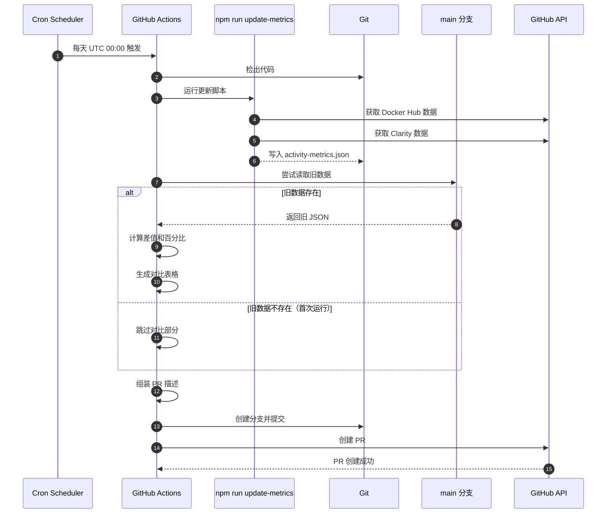
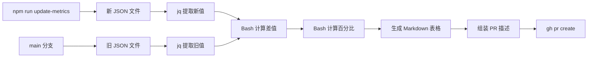

## Context

Hagicode 项目使用 `update-activity-metrics.yml` GitHub Actions 每日定时更新活动指标数据。该工作流自动获取 Docker Hub 拉取次数和 Microsoft Clarity 的活跃用户/会话数据，更新 `data/activity-metrics.json` 文件，并创建 PR 提交变更。

当前该工作流创建的 PR 仅展示当前的新数值，reviewer 无法直观了解指标的变化趋势，需要手动查看之前的 PR 或历史文件才能完成对比。

### Stakeholders

- **Reviewers**: 需要快速了解指标的变化幅度，评估项目活跃度趋势
- **Project Maintainers**: 需要追踪项目指标的历史变化，了解社区活跃度
- **Community**: 通过 PR 描述了解项目增长情况

### Constraints

- 必须在 GitHub Actions 环境中运行（Bash 脚本）
- 使用现有的工具链：jq、git、gh CLI
- 不能引入复杂的依赖或外部服务
- 数据格式固定为 `data/activity-metrics.json` 的 JSON 结构

### Current Implementation

```yaml
# .github/workflows/update-activity-metrics.yml (当前实现)
# 1. 定时触发 (cron: '0 0 * * *')
# 2. 运行 npm run update-metrics 获取最新数据
# 3. 提交 data/activity-metrics.json
# 4. 创建 PR，包含简单的数值表格
```

### Data Structure

```json
{
  "lastUpdated": "2026-01-21T08:51:22.071Z",
  "dockerHub": {
    "pullCount": 373,
    "repository": "newbe36524/hagicode"
  },
  "clarity": {
    "activeUsers": 45,
    "activeSessions": 61,
    "dateRange": "3Days"
  }
}
```

## Goals / Non-Goals

### Goals

1. 在 `update-activity-metrics.yml` 创建的 PR 中展示指标变化对比
2. 从 main 分支读取旧数据，计算差值和百分比
3. 在 PR 描述中以表格格式展示原值、新值、变化
4. 视觉区分增长（绿色/↑）和下降（红色/↓）的指标

### Non-Goals

1. 不创建新的 GitHub Actions 工作流
2. 不修改 `data/activity-metrics.json` 的数据结构
3. 不支持其他文件格式的 metrics 解析
4. 不在 PR 评论中发布（仅增强 PR 描述）

## Decisions

### Decision 1: 修改现有工作流而非创建新工作流

**选择**: 修改 `.github/workflows/update-activity-metrics.yml`，在创建 PR 前添加对比逻辑。

**原因**:
- 复用现有的工作流和基础设施
- 避免重复的数据获取逻辑
- 保持单一职责（指标更新和报告生成在一起）
- 减少维护成本

**替代方案**:
- **创建新的工作流监听 PR 事件**: 增加复杂度，需要额外的触发条件
- **创建独立的脚本**: 增加维护文件，不如直接在工作流中实现

### Decision 2: 在 PR 描述中展示对比

**选择**: 在 `gh pr create` 的 `--body` 参数中嵌入对比表格。

**原因**:
- PR 描述是用户首先看到的内容
- 不需要额外的 API 调用（不需要发布评论）
- 格式化控制更简单

**替代方案**:
- **PR 评论**: 需要额外的 API 调用，评论可能在描述之后被注意到
- **GitHub Check**: 格式化能力有限，不如 Markdown 表格直观

### Decision 3: 使用 Bash + jq 实现对比逻辑

**选择**: 在 GitHub Actions 的 Bash 步骤中使用 jq 读取和计算。

**原因**:
- jq 已在项目中使用（当前 PR 描述生成已使用）
- Bash 脚本简单直接，无需额外编译
- 易于调试和维护

**实现方式**:
```bash
# 读取旧数据
OLD_DATA=$(git show main:data/activity-metrics.json)

# 读取新数据
NEW_DATA=$(cat data/activity-metrics.json)

# 使用 jq 提取和计算
OLD_PULL=$(echo "$OLD_DATA" | jq -r '.dockerHub.pullCount')
NEW_PULL=$(echo "$NEW_DATA" | jq -r '.dockerHub.pullCount')
DELTA=$((NEW_PULL - OLD_PULL))
```

### Decision 4: 首次运行的降级处理

**选择**: 当 main 分支不存在旧数据时（首次运行），跳过对比部分。

**原因**:
- 避免解析错误导致 workflow 失败
- 首次运行时没有旧值是正常情况

**实现**:
```bash
if git show main:data/activity-metrics.json &>/dev/null; then
  # 有旧数据，执行对比
  ...
else
  # 无旧数据，跳过对比
  echo "首次运行，无历史数据对比"
fi
```

## UI/UX Design

### PR 描述布局（增强后）

```
┌─────────────────────────────────────────────────────────────┐
│  ## 活动指标更新                                              │
│                                                              │
│  ### 摘要                                                     │
│  此 PR 更新首页的活动指标数据。                                │
│                                                              │
│  ### 指标变化对比                                             │
│                                                              │
│  | 指标                 | 原值 | 新值 | 变化               |  │
│  |---------------------|------|------|-------------------|  │
│  | Docker Hub 拉取次数   | 350  | 373  | ↑23 (▲6.6%)     |  │
│  | 活跃用户 (近3天)      | 38   | 45   | ↑7 (▲18.4%)     |  │
│  | 活跃会话 (近3天)      | 52   | 61   | ↑9 (▲17.3%)     |  │
│                                                              │
│  **摘要**: 3 个指标发生变化，全部呈现增长趋势 📈               │
│                                                              │
│  ---                                                         │
│                                                              │
│  ### 详细数据                                                 │
│  | 指标                 | 数值  |                            │
│  |---------------------|-------|                            │
│  | Docker Hub 拉取次数   | 373   |                            │
│  | 活跃用户 (近3天)      | 45    |                            │
│  | 活跃会话 (近3天)      | 61    |                            │
│  | 更新时间              | ...   |                            │
│                                                              │
└─────────────────────────────────────────────────────────────┘
```

### 交互流程



### 错误处理

**首次运行（无旧数据）**:
```markdown
## 活动指标更新

### 摘要
此 PR 更新首页的活动指标数据。

### 指标变化对比

> ℹ️ 首次运行，无历史数据进行对比。

### 详细数据
[当前数据表格...]
```

**数据解析失败**:
```markdown
## 活动指标更新

> ⚠️ 警告：无法解析历史数据进行对比。

当前数据已成功更新。
```

## Technical Design

### 工作流修改点

```yaml
# .github/workflows/update-activity-metrics.yml (修改内容)

jobs:
  update-metrics:
    steps:
      # ... 现有步骤保持不变 ...

      # 【新增】在运行 update-metrics 之后添加对比步骤
      - name: Calculate metrics diff
        id: diff
        run: |
          # 读取新数据
          NEW_DATA=$(cat data/activity-metrics.json)

          # 尝试读取旧数据
          if git show main:data/activity-metrics.json &>/dev/null; then
            OLD_DATA=$(git show main:data/activity-metrics.json)

            # 提取并计算各指标差值
            # ... jq 计算逻辑 ...

            # 输出对比表格
            echo "diff_table<<EOF" >> $GITHUB_OUTPUT
            # ... 生成 Markdown 表格 ...
            echo "EOF" >> $GITHUB_OUTPUT
          else
            # 首次运行，无旧数据
            echo "diff_table=首次运行，无历史数据对比" >> $GITHUB_OUTPUT
          fi

      # 【修改】在 PR 描述中使用对比结果
      - name: Create Pull Request
        env:
          GH_TOKEN: ${{ secrets.GITHUB_TOKEN }}
        run: |
          PR_BODY="## 活动指标更新

          ### 指标变化对比

          ${{ steps.diff.outputs.diff_table }}

          ### 详细数据
          ..."
          gh pr create --body "$PR_BODY" ...
```

### 数据流



### 指标配置

```yaml
# 硬编码的指标列表（在 workflow 中定义）
metrics:
  - name: "Docker Hub 拉取次数"
    path: "dockerHub.pullCount"
    unit: ""
    direction: "higher_better"  # 越高越好

  - name: "活跃用户 (近3天)"
    path: "clarity.activeUsers"
    unit: ""
    direction: "higher_better"

  - name: "活跃会话 (近3天)"
    path: "clarity.activeSessions"
    unit: ""
    direction: "higher_better"
```

### 计算逻辑

```bash
# 伪代码示例
for metric in "${metrics[@]}"; do
  name=$(echo "$metric" | jq -r '.name')
  path=$(echo "$metric" | jq -r '.path')

  # 提取值
  old_value=$(echo "$OLD_DATA" | jq -r ".$path")
  new_value=$(echo "$NEW_DATA" | jq -r ".$path")

  # 计算差值
  delta=$((new_value - old_value))

  # 计算百分比
  if [ "$old_value" -gt 0 ]; then
    percent=$(awk "BEGIN {printf \"%.1f\", ($delta / $old_value) * 100}")
  else
    percent="N/A"
  fi

  # 确定箭头方向
  if [ "$delta" -gt 0 ]; then
    arrow="↑"
    filled="▲"
  elif [ "$delta" -lt 0 ]; then
    arrow="↓"
    filled="▼"
  else
    arrow="→"
    filled="▶"
  fi

  # 生成表格行
  echo "| $name | $old_value | $new_value | ${arrow}${delta} (${filled}${percent}%) |"
done
```

## Risks / Trade-offs

### Risk 1: 首次运行的数据可用性

**风险**: 首次运行时 main 分支没有 `activity-metrics.json`，git show 会失败。

**缓解**:
- 使用 git show 的错误检测（&>/dev/null）
- 提供清晰的降级消息
- 首次运行后该问题自动消失

### Risk 2: JSON 结构变化

**风险**: 如果未来 `activity-metrics.json` 的结构发生变化，硬编码的路径可能失效。

**缓解**:
- jq 在路径不存在时会返回 null，不会导致脚本失败
- 可以添加验证逻辑，检查关键字段是否存在
- 文档中记录预期的 JSON 结构

### Risk 3: 百分比计算的边界情况

**风险**: 当旧值为 0 时，百分比计算会出现除零错误。

**缓解**:
- 检查旧值是否为 0，显示 "N/A" 而不是崩溃
- 使用 awk 进行浮点数计算，处理小数

### Risk 4: Bash 脚本的可维护性

**风险**: 复杂的 Bash 脚本可能难以维护和调试。

**缓解**:
- 保持脚本简单，避免过度复杂化
- 添加清晰的注释
- 使用 GitHub Actions 的环境变量传递数据，避免复杂的字符串操作

## Migration Plan

### Phase 1: 基础对比实现

1. 修改 `update-activity-metrics.yml` 添加对比步骤
2. 实现基础的差值和百分比计算
3. 生成简单的对比表格

### Phase 2: UI 增强（可选）

1. 添加视觉区分（箭头、颜色）
2. 添加摘要统计
3. 改进错误消息

### Rollback

如需回滚：
1. 恢复 `update-activity-metrics.yml` 到修改前的版本
2. 已创建的 PR 保持不变（不影响现有数据）

## Open Questions

1. **是否需要支持负增长的特殊标记？**
   - 对于活跃指标，负增长可能表示问题，建议使用红色/⚠️ 标记

2. **百分比是否需要设置最小显示阈值？**
   - 建议小于 1% 的变化显示为 "<1%" 而不是精确值

3. **是否需要将对比逻辑提取为独立脚本？**
   - 当前方案直接在 workflow 中实现，如逻辑变复杂可考虑提取
