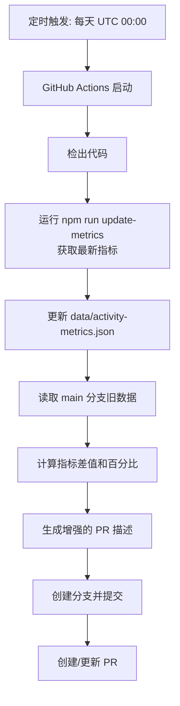
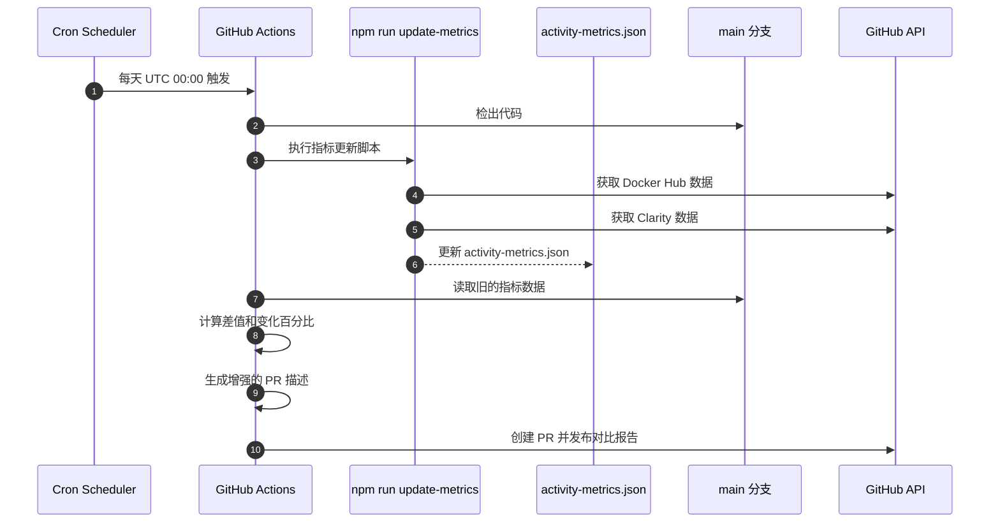

# Change: GitHub PR Metrics 变化自动对比展示

**Status**: ExecutionCompleted

## Why

Hagicode 项目使用 `update-activity-metrics.yml` GitHub Actions 定时更新活动指标数据（Docker Hub 拉取次数、Clarity 活跃用户/会话等），并自动创建 PR 提交 `data/activity-metrics.json` 的更新。

当前该 PR 仅展示当前的新数值，reviewer 难以快速了解：
- metrics 的**原有数值**是多少
- metrics 的**新数值**是多少
- 两者之间的**差值**和**变化百分比**

这导致需要手动查看之前 PR 的数值或历史文件才能完成对比，增加了 review 的时间和复杂度。

## What Changes

- **修改 `update-activity-metrics.yml` 工作流**：在创建 PR 时获取旧值并生成对比报告
- **新增指标对比逻辑**：读取 main 分支的旧数据，与新数据对比计算差值
- **增强 PR 描述格式**：在 PR 描述中展示原值、新值、差值变化
- **新增视觉区分支持**：正差值显示为绿色/↑，负差值显示为红色/↓

## UI Design Changes

### PR 描述展示格式（增强 update-activity-metrics.yml 创建的 PR）

```
## 活动指标更新

### 摘要
此 PR 更新首页的活动指标数据。

### 指标变化对比

| 指标 | 原值 | 新值 | 变化 |
|------|------|------|------|
| Docker Hub 拉取次数 | 350 | 373 | ↑23 (▲6.6%) |
| 活跃用户 (近3天) | 38 | 45 | ↑7 (▲18.4%) |
| 活跃会话 (近3天) | 52 | 61 | ↑9 (▲17.3%) |

**摘要**: 3 个指标发生变化，全部呈现增长趋势 📈

### 详细数据
| 指标 | 数值 |
|------|------|
| Docker Hub 拉取次数 | 373 |
| 活跃用户 (近3天) | 45 |
| 活跃会话 (近3天) | 61 |
| 更新时间 | 2026-01-21T08:51:22.071Z |

### 变更
- 更新 `data/activity-metrics.json` 为最新指标

### 自动化
此 PR 由 [Update Activity Metrics](workflow_url) 工作流自动创建。
```

## Code Flow Changes





## Impact

- **Affected specs**: `github-integration` (新建)
- **Affected code**:
  - `.github/workflows/update-activity-metrics.yml` (修改现有工作流，增加对比逻辑)
  - `data/activity-metrics.json` (数据源，格式不变)

## Success Criteria

1. `update-activity-metrics.yml` 创建的 PR 描述中包含原值、新值、差值对比
2. 准确计算各指标的绝对差值和变化百分比
3. 生成的 PR 描述格式清晰，易于阅读
4. 视觉区分增长（绿色/↑）和下降（红色/↓）的指标
5. 正确处理首次运行场景（无旧数据时的降级处理）
