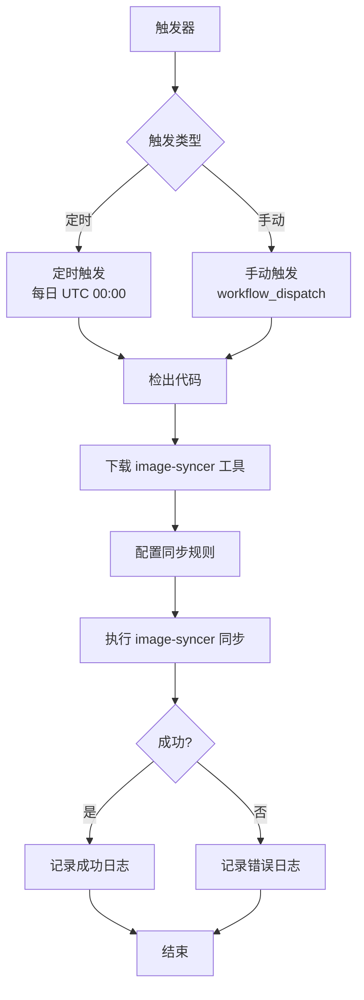
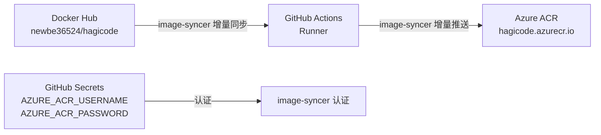
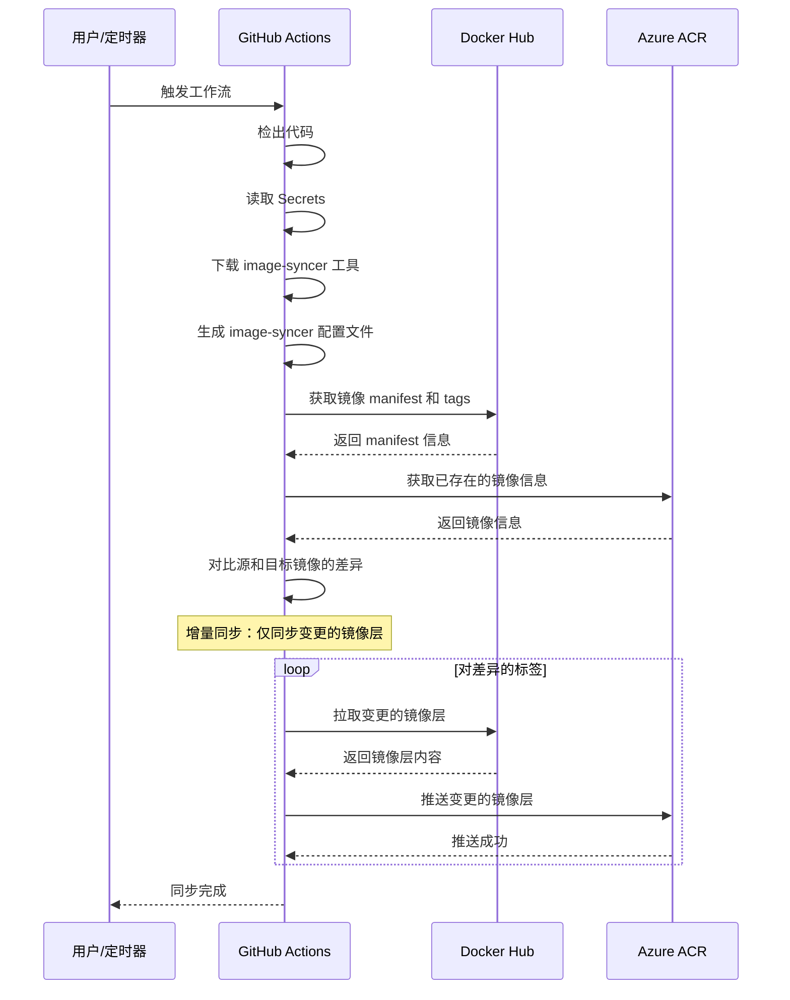

# Design: GitHub Actions Docker 镜像同步到 Azure ACR

## Context
Hagicode 项目当前使用 Docker Hub 作为主要的 Docker 镜像托管平台（`newbe36524/hagicode`）。为了优化 Azure 环境下的镜像拉取速度，提高系统可用性，并简化与 Azure 云服务的集成，需要建立镜像同步机制，将 Docker Hub 的镜像自动同步到 Azure Container Registry (ACR)。

**约束条件：**
- 必须使用现有的 GitHub Actions 基础设施
- 需要配置 Azure ACR 的认证信息
- 必须保持镜像标签的一致性
- 同步过程必须自动化，减少人工干预

**利益相关者：**
- 开发团队：需要简化的镜像同步流程
- 运维团队：需要可靠的镜像同步和监控
- Azure 用户：需要快速的镜像拉取体验

## Goals / Non-Goals

**Goals：**
- 实现完全自动化的 Docker 镜像同步（Docker Hub → Azure ACR）
- 支持所有镜像标签的同步
- 提供定时和手动两种触发方式
- 完善的错误处理和日志记录
- 易于配置和维护

**Non-Goals：**
- 不实现双向同步（仅支持 Docker Hub → Azure ACR）
- 不处理镜像构建逻辑（仅同步已存在的镜像）
- 不实现镜像标签过滤或转换
- 不实现镜像清理或归档功能

## Decisions

### Decision 1: 使用 image-syncer 进行镜像同步

**选择：** 使用 `image-syncer` 工具进行镜像同步（推荐）

**原因：**
- **专门的镜像同步工具**：`image-syncer` 是阿里云容器服务团队开源的专业镜像同步工具，专门针对多仓库同步场景优化
- **增量同步支持**：通过对比镜像的 digest 或 tag，仅同步变更的镜像层，避免重复传输
- **高效并发**：支持配置并发线程数，提升大镜像同步效率
- **断点续传**：网络中断后可恢复同步，减少失败重试成本
- **轻量级部署**：单二进制文件，无依赖，支持 Linux 系统，非常适合 GitHub Actions 环境
- **灵活配置**：通过 YAML 配置文件定义同步规则，支持多组同步任务
- **完善的错误处理**：内置失败重试、超时控制等机制

**替代方案：**
- **Docker CLI**：使用 `docker pull` 和 `docker push` 命令，但不支持增量同步
- **Skopeo**：专门用于镜像操作的工具，但功能相对单一
- **Azure CLI**：可以使用 `az acr import` 命令直接导入，但需要配置 Azure CLI 认证，复杂度较高

### Decision 2: 定时触发设置为每日 UTC 00:00

**选择：** 每日 UTC 00:00 自动触发同步

**原因：**
- Docker Hub 的镜像通常在每日构建后更新
- UTC 00:00 是较为空闲的时间段，减少对其他操作的影响
- 每日同步频率适中，既能保持镜像新鲜度，又不会过度消耗资源

**替代方案：**
- **每 12 小时**：同步更频繁，但会增加资源消耗
- **每周同步**：资源消耗更少，但镜像更新不够及时

### Decision 3: 保留所有镜像标签

**选择：** 同步所有 Docker Hub 上的镜像标签到 Azure ACR

**原因：**
- 保持与 Docker Hub 的完全一致性
- 用户可以根据需要选择不同标签的镜像
- 简化同步逻辑，避免复杂的标签过滤规则

**替代方案：**
- **仅同步 latest 标签**：减少同步时间和存储空间，但限制了用户选择
- **按需同步指定标签**：更灵活，但增加了配置复杂度

### Decision 4: 使用 GitHub Secrets 存储认证信息

**选择：** 使用 GitHub Secrets 存储 Azure ACR 的用户名和密码

**原因：**
- GitHub Actions 原生支持 Secrets，安全性高
- 配置简单，易于管理
- 支持仓库级别的访问控制

**替代方案：**
- **使用 GitHub Environments**：提供更细粒度的访问控制，但对于此场景过于复杂
- **使用 Azure Managed Identity**：更安全，但需要配置 Azure AD 集成，复杂度高

## Technical Design

### 工作流架构



### 数据流



### 组件交互



## Risks / Trade-offs

### Risk 1: Azure ACR 认证信息泄露

**风险：** 如果 GitHub Secrets 配置不当，可能导致 Azure ACR 认证信息泄露

**缓解措施：**
- 使用 GitHub Secrets 加密存储认证信息
- 定期轮换 ACR 密码
- 限制 ACR 用户的权限为仅推送（pull/push）
- 监控 ACR 的访问日志

### Risk 2: 同步失败导致镜像不一致

**风险：** 同步过程中断或失败可能导致 Docker Hub 和 Azure ACR 的镜像不一致

**缓解措施：**
- image-syncer 内置增量同步机制，仅同步变更的镜像层，减少同步失败的影响范围
- 内置失败重试机制（默认 3 次），自动处理临时网络或仓库故障
- 添加详细的错误日志，便于排查问题
- 配置失败通知，及时发现问题
- 断点续传功能，网络中断后可恢复同步

### Risk 3: 资源消耗过大

**风险：** 同步大量镜像标签可能消耗大量的网络带宽和存储空间

**缓解措施：**
- image-syncer 支持增量同步，通过对比镜像 digest，仅同步变更的镜像层，显著减少网络传输
- 支持配置并发线程数，可根据实际情况调整同步性能
- 监控每次同步的镜像数量和大小
- 设置合理的同步频率
- 考虑在非高峰时段运行同步
- 可配置镜像标签过滤规则，仅同步必要的标签

### Trade-off: 同步频率 vs 镜像新鲜度

**权衡：**
- 更高的同步频率（如每小时）能保持镜像更新，但增加资源消耗
- 更低的同步频率（如每周）能减少资源消耗，但镜像更新不及时

**选择：** 每日同步是一个平衡点，既能保持镜像新鲜度，又不会过度消耗资源

## Migration Plan

### 实施步骤

1. **准备阶段**
   - 在 Azure Portal 中创建或确认 Azure Container Registry
   - 创建 ACR 的访问密钥（用户名和密码）
   - 确认 Docker Hub 镜像仓库的访问权限

2. **配置阶段**
   - 在 GitHub 仓库中配置 Secrets：
     - `AZURE_ACR_USERNAME`: Azure ACR 用户名
     - `AZURE_ACR_PASSWORD`: Azure ACR 密码
   - 创建 `.github/workflows/sync-docker-acr.yml` 工作流文件

3. **测试阶段**
   - 手动触发工作流，验证配置正确性
   - 检查 Azure ACR 中是否成功同步镜像
   - 验证所有标签是否正确同步
   - 测试错误场景（如认证失败、网络问题）

4. **部署阶段**
   - 合并工作流文件到 main 分支
   - 验证定时触发是否正常工作
   - 监控几次自动同步的执行情况

5. **运维阶段**
   - 定期检查同步日志
   - 监控 Azure ACR 的存储使用情况
   - 根据需要调整同步频率或配置

### 回滚计划

如果同步机制出现问题，可以采取以下回滚措施：

1. **立即禁用工作流**
   - 在 GitHub Actions 中禁用工作流
   - 删除 `.github/workflows/sync-docker-acr.yml` 文件

2. **清理 Azure ACR 中的镜像**（如果需要）
   ```bash
   az acr repository delete --name hagicode --image hagicode:tag
   ```

3. **恢复使用 Docker Hub**
   - 更新部署配置，重新使用 Docker Hub 镜像
   - 通知相关团队变更

## Open Questions

1. **是否需要实现增量同步？**
   - 当前设计是同步所有标签，是否需要优化为仅同步新的或更新的标签？
   - 这需要维护标签状态，增加了复杂度

2. **是否需要保留历史版本的镜像？**
   - Azure ACR 的存储成本如何考虑？
   - 是否需要实现镜像清理策略？

3. **是否需要支持多个镜像仓库？**
   - 当前设计仅同步 `newbe36524/hagicode` 一个镜像
   - 是否需要扩展到其他镜像仓库？

4. **同步失败的重试策略是什么？**
   - 是否需要自动重试机制？
   - 重试次数和间隔如何设置？

## Implementation Notes

### 工作流配置示例

使用 `image-syncer` 的 GitHub Actions 工作流配置示例：

```yaml
name: Sync Docker Image to Azure ACR

on:
  schedule:
    - cron: '0 0 * * *'  # 每天 UTC 00:00
  workflow_dispatch:     # 手动触发

permissions:
  contents: read

jobs:
  sync:
    runs-on: ubuntu-latest
    steps:
      - name: Checkout code
        uses: actions/checkout@v4

      - name: Download image-syncer
        run: |
          # 下载 image-syncer 二进制文件
          wget https://github.com/AliyunContainerService/image-syncer/releases/download/v1.0.0/image-syncer-linux-amd64.tar.gz
          tar -zxvf image-syncer-linux-amd64.tar.gz
          chmod +x image-syncer

      - name: Create image-syncer config
        run: |
          # 生成配置文件
          cat > config.json <<EOF
          {
            "auth": {
              "hagicode.azurecr.io": {
                "username": "${{ secrets.AZURE_ACR_USERNAME }}",
                "password": "${{ secrets.AZURE_ACR_PASSWORD }}"
              }
            },
            "rules": [
              {
                "src": "newbe36524/hagicode",
                "dest": "hagicode.azurecr.io/hagicode"
              }
            ]
          }
          EOF

      - name: Run image-syncer
        run: |
          # 执行同步
          ./image-syncer --config=config.json --proc=10 --log=info

      - name: Upload logs
        if: always()
        uses: actions/upload-artifact@v3
        with:
          name: sync-logs
          path: image-syncer-*.log
```

### image-syncer 配置文件详解

`config.json` 配置文件结构：

```json
{
  "auth": {
    "hagicode.azurecr.io": {
      "username": "${{ secrets.AZURE_ACR_USERNAME }}",
      "password": "${{ secrets.AZURE_ACR_PASSWORD }}"
    }
  },
  "rules": [
    {
      "src": "newbe36524/hagicode",
      "dest": "hagicode.azurecr.io/hagicode",
      "tags": ["*"]  // * 表示同步所有标签，可指定具体标签如 ["latest", "v1.0"]
    }
  ]
}
```

**配置说明：**
- `auth`: 认证信息配置，key 为 registry 地址
- `rules`: 同步规则列表
  - `src`: 源镜像地址（Docker Hub）
  - `dest`: 目标镜像地址（Azure ACR）
  - `tags`: 要同步的标签列表，`*` 表示所有标签

### GitHub Secrets 配置清单

需要在 GitHub 仓库中配置以下 Secrets：

| Secret 名称 | 描述 | 示例值 |
|------------|------|--------|
| `AZURE_ACR_USERNAME` | Azure ACR 登录服务器用户名 | `hagicode` |
| `AZURE_ACR_PASSWORD` | Azure ACR 访问密钥/密码 | `xxxxxxxx-xxxx-xxxx-xxxx-xxxxxxxxxxxx` |

**注意：**
- 如果 `newbe36524/hagicode` 是公开镜像，不需要配置 Docker Hub 的认证信息
- `image-syncer` 会自动从源仓库获取 manifest 并进行增量同步
- 可通过调整 `--proc` 参数控制并发线程数，默认为 10

### image-syncer 命令参数

```bash
./image-syncer [选项]

选项：
  --config string        配置文件路径（必需）
  --proc int             并发线程数（默认 10）
  --log string           日志级别：debug、info、warn、error（默认 info）
  --os string            操作系统类型：linux、windows（默认 linux）
  --arch string          架构类型：amd64、arm64（默认 amd64）
  --images string        指定要同步的镜像列表（文件路径）
  --retries times        失败重试次数（默认 3）
  --registry string      自定义 registry 地址
  --dest-registry string 自定义目标 registry 地址
```

### 替代方案：使用 Docker CLI

如果不想使用 `image-syncer`，也可以使用传统的 Docker CLI 方式：

```yaml
name: Sync Docker Image to Azure ACR (Docker CLI)

on:
  schedule:
    - cron: '0 0 * * *'
  workflow_dispatch:

jobs:
  sync:
    runs-on: ubuntu-latest
    steps:
      - name: Login to Azure ACR
        uses: docker/login-action@v3
        with:
          registry: hagicode.azurecr.io
          username: ${{ secrets.AZURE_ACR_USERNAME }}
          password: ${{ secrets.AZURE_ACR_PASSWORD }}

      - name: Sync images
        run: |
          # 获取所有标签
          TOKEN=$(curl -s "https://auth.docker.io/token?service=registry.docker.io&scope=repository:newbe36524/hagicode:pull" | jq -r .token)
          TAGS=$(curl -s -H "Authorization: Bearer $TOKEN" "https://registry-1.docker.io/v2/newbe36524/hagicode/tags/list" | jq -r .tags[])

          # 同步每个标签
          for tag in $TAGS; do
            docker pull newbe36524/hagicode:$tag
            docker tag newbe36524/hagicode:$tag hagicode.azurecr.io/hagicode:$tag
            docker push hagicode.azurecr.io/hagicode:$tag
          done
```

**注意：** Docker CLI 方式不支持增量同步，每次都需要拉取完整的镜像内容，效率较低。

## References

### image-syncer 项目资源

- **GitHub 仓库**: [AliyunContainerService/image-syncer](https://github.com/AliyunContainerService/image-syncer)
- **官方文档**: [阿里云容器服务 - 镜像同步工具](https://help.aliyun.com/document_detail/100694.html)
- **功能特性**:
  - 增量同步：通过对比镜像 digest，仅同步变更的镜像层
  - 并发控制：支持配置并发线程数，提升同步效率
  - 断点续传：网络中断后可恢复同步
  - 多仓库支持：兼容 Docker Hub、Azure ACR、阿里云 ACR、Harbor 等
  - 灵活配置：通过 YAML/JSON 配置文件定义同步规则
  - 安全可靠：支持 HTTPS、认证、失败重试等机制

### 相关技术文档

- [Azure Container Registry 文档](https://docs.microsoft.com/azure/container-registry/)
- [GitHub Actions 文档](https://docs.github.com/en/actions)
- [Docker Registry HTTP API V2](https://docs.docker.com/registry/spec/api/)
