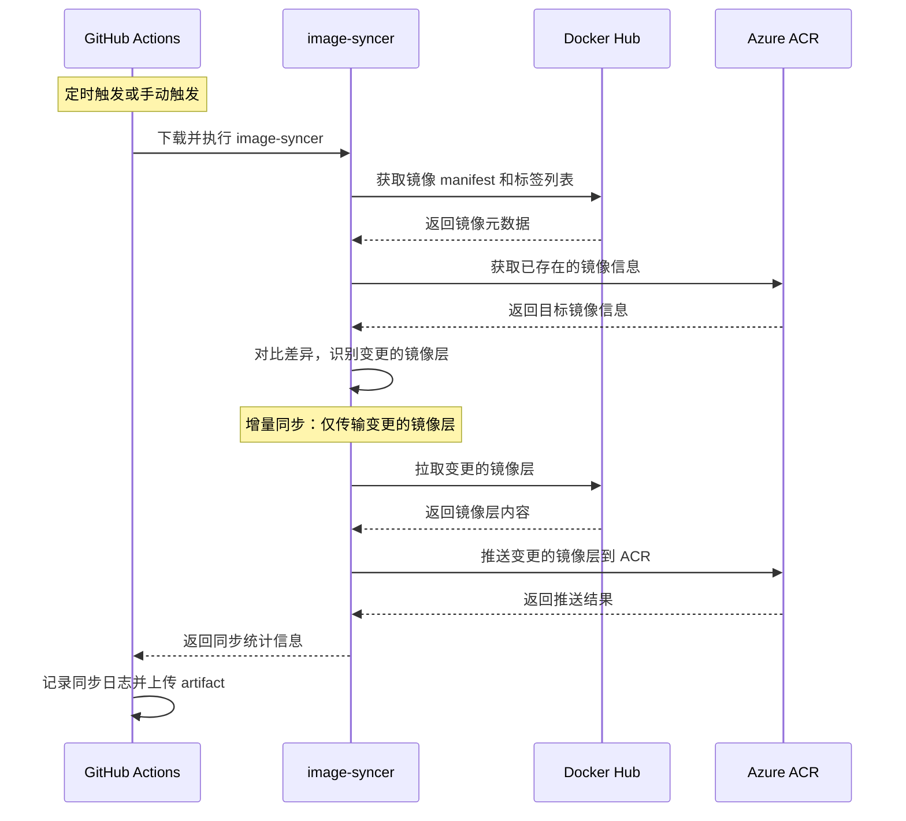

# Change: 使用 GitHub Actions 自动同步 Docker 镜像到 Azure ACR

## Why
Hagicode 项目依赖 Docker 镜像作为核心运行时组件，当前主要镜像托管在 Docker Hub（`newbe36524/hagicode`）。为提升镜像拉取速度、增强可用性，并确保与 Azure 云服务的集成优化，需要建立镜像同步机制。

## What Changes
- 创建新的 GitHub Actions 工作流 `sync-docker-acr.yml`，用于自动同步 Docker 镜像
- 集成阿里云开源的 `image-syncer` 工具进行高效的镜像同步
- 配置工作流使用 Azure 容器 registry（ACR）认证信息
- 实现从 Docker Hub（`newbe36524/hagicode`）到 Azure ACR（`hagicode.azurecr.io`）的镜像同步
- 支持增量同步（仅同步变更的镜像层）和定时更新（每日同步）
- 配置必要的 GitHub Secrets 用于认证
- 添加详细的同步日志和错误处理机制

## Impact
- 受影响的规格：github-integration（新增需求）
- 受影响的代码：`.github/workflows/` 目录下新增工作流文件
- 新增依赖：image-syncer 工具（通过 GitHub Actions 下载，无需手动安装）
- 需要配置的 Secrets：`AZURE_ACR_USERNAME`、`AZURE_ACR_PASSWORD`
- 性能提升：增量同步机制减少网络传输，提高同步效率

## Code Flow Changes

