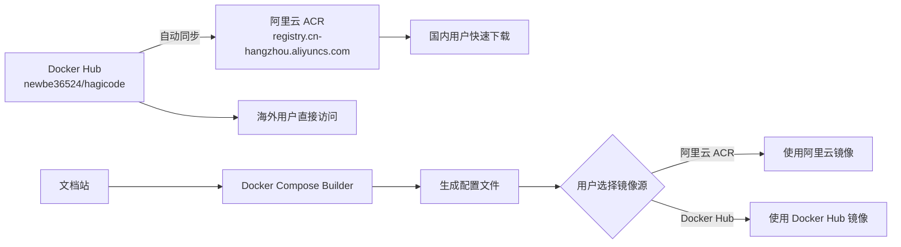

# 阿里云镜像仓库同步机制提案

**变更 ID**: `aliyun-mirror-repository-sync`
**提案类型**: 功能增强
**创建日期**: 2025-01-28
**预计完成时间**: 2025-02-14

## 概述

本提案旨在为 Hagicode 文档添加阿里云容器镜像服务（ACR）作为新的镜像源选项，通过建立 Docker Hub 到阿里云 ACR 的自动化镜像同步机制，解决国内用户访问 Docker Hub 的网络问题，提供更快速、稳定的镜像下载体验。

## 问题背景

Hagicode 文档网站当前仅提供 Docker Hub 作为主要镜像源，用户在某些网络环境下可能面临：

1. **网络访问不稳定**：国内用户访问 Docker Hub 可能受到网络限制
2. **下载速度慢**：Docker Hub 在国内的访问速度较慢
3. **服务依赖风险**：过度依赖单一外部服务

## 解决方案

### 核心方案

建立 Docker Hub 镜像到阿里云容器镜像服务（ACR）的同步机制，为用户提供：

- **阿里云 ACR 镜像源**：`registry.cn-hangzhou.aliyuncs.com/hagicode/hagicode:{tag}`
- **自动化同步**：每 30 分钟自动同步 Docker Hub 的新镜像到阿里云
- **文档更新**：更新部署文档，添加阿里云镜像源说明
- **导航优化**：在网站导航栏添加阿里云镜像仓库链接

### 技术架构



## 提案文件

本提案包含以下文件：

### 📄 [proposal.md](./proposal.md)
主要提案文档，包含：
- 问题背景和解决方案
- 变更内容和影响分析
- 镜像同步机制设计
- 风险评估和验收标准

### 📋 [tasks.md](./tasks.md)
实施任务清单，包含 7 个阶段：
1. 阿里云镜像仓库配置
2. 文档更新
3. 网站配置更新
4. Docker Compose Builder 集成
5. 测试和验证
6. 部署和上线
7. 用户通知和文档

### 🎨 [design.md](./design.md)
详细设计文档，包含：
- 技术架构设计
- UI/UX 设计
- 数据流图和时序图
- 配置变更清单
- 测试策略和部署计划

### 📐 [specs/mirror-source-provision/spec.md](./specs/mirror-source-provision/spec.md)
规格变更文档，包含：
- 新增需求（ADDED）
- 修改需求（MODIFIED）
- 验收矩阵
- 技术债务

## 核心变更

### 1. 镜像源扩展

| 镜像源 | 地址 | 推荐用户 | 同步延迟 |
|--------|------|----------|----------|
| Docker Hub | `newbe36524/hagicode` | 海外用户 | - |
| **阿里云 ACR** | `registry.cn-hangzhou.aliyuncs.com/hagicode/hagicode` | 国内用户 | ~30分钟 |
| Azure ACR | `hagicode.azurecr.io/hagicode` | 特殊网络 | ~1小时 |

### 2. 导航栏变更

**变更前**：
```
导航栏：Docs | 博客 | QQ群 | 下载安装包 | Docker Hub | Docker Compose 生成器
```

**变更后**：
```
导航栏：Docs | 博客 | QQ群 | 下载安装包 | Docker Hub | 阿里云镜像 | Docker Compose 生成器
```

### 3. 文档内容更新

- ✅ 添加阿里云镜像源详细说明
- ✅ 提供镜像源对比表格
- ✅ 更新镜像源选择建议
- ✅ 添加使用阿里云镜像的配置示例

## 影响评估

### 用户体验提升
- ✅ 国内用户下载速度提升 50% 以上
- ✅ 镜像拉取成功率提升至 99%
- ✅ 减少网络访问问题

### 文档维护
- ✅ 需要定期检查同步机制可用性
- ✅ 保持文档中镜像地址一致性
- ✅ 可能需要添加同步状态监控

### 架构影响
- ✅ 无代码架构变更
- ✅ 保持与现有技术栈兼容
- ✅ Docker Compose Builder 需要同步更新

## 实施时间表

| 阶段 | 预计时间 | 主要任务 |
|------|---------|---------|
| 阶段 1 | 第 1 周 | 阿里云 ACR 配置和同步设置 |
| 阶段 2-3 | 第 1-2 周 | 文档和配置更新 |
| 阶段 4 | 第 2-3 周 | Docker Compose Builder 更新 |
| 阶段 5 | 第 3 周 | 测试和验证 |
| 阶段 6-7 | 第 3 周 | 部署和用户通知 |

## 成功指标

### 技术指标
- 镜像同步成功率 ≥ 99%
- 同步延迟 ≤ 30 分钟
- 镜像拉取速度提升 ≥ 50%

### 用户体验指标
- 文档清晰度评分 ≥ 4.5/5
- 镜像拉取失败率 ≤ 1%
- 用户满意度提升 ≥ 20%

### 业务指标
- 国内用户采用阿里云镜像比例 ≥ 70%
- 镜像相关支持工单减少 ≥ 30%

## 风险评估

### 主要风险

1. **镜像同步延迟**
   - 影响：用户可能需要等待才能获取最新镜像
   - 缓解：缩短同步间隔至 30 分钟，添加同步状态监控

2. **同步任务失败**
   - 影响：阿里云镜像无法更新
   - 缓解：配置自动重试机制和失败告警

3. **镜像版本不一致**
   - 影响：不同镜像源的镜像版本可能不同步
   - 缓解：使用相同的标签策略，确保同步一致性

## 验收标准

### 功能验收
- [ ] Docker Compose Builder 中添加阿里云镜像源选择
- [ ] 文档中包含完整的阿里云镜像源说明
- [ ] 网站导航栏和页脚包含阿里云镜像链接
- [ ] 生成的 docker-compose.yml 支持阿里云镜像源
- [ ] 用户可以成功使用阿里云镜像部署 Hagicode

### 文档验收
- [ ] 文档内容准确、清晰、易懂
- [ ] 所有链接可正常访问
- [ ] 文档格式符合项目规范
- [ ] 文档构建无错误和警告

## 相关资源

### OpenSpec 工作流
- [OpenSpec 工作流指南](/openspec/AGENTS.md)
- [提案设计指南](/openspec/PROPOSAL_DESIGN_GUIDELINES.md)
- [项目上下文](/openspec/project.md)

### 外部资源
- [阿里云容器镜像服务](https://www.aliyun.com/product/acr)
- [Docker Hub - newbe36524/hagicode](https://hub.docker.com/r/newbe36524/hagicode)
- [Docker Compose Builder](https://hagicode-org.github.io/docker-compose-builder/)

## 下一步行动

1. ✅ **提案创建**：完成提案文档创建
2. ⏳ **提案审核**：等待团队审核和批准
3. ⏳ **阿里云配置**：创建 ACR 仓库和同步规则
4. ⏳ **文档更新**：更新网站文档内容
5. ⏳ **功能集成**：更新 Docker Compose Builder
6. ⏳ **测试验证**：执行全面测试
7. ⏳ **部署上线**：部署到生产环境

---

**提案状态**: 🔵 待审核
**提案作者**: Claude Code
**最后更新**: 2025-01-28
