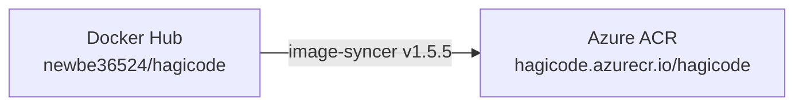
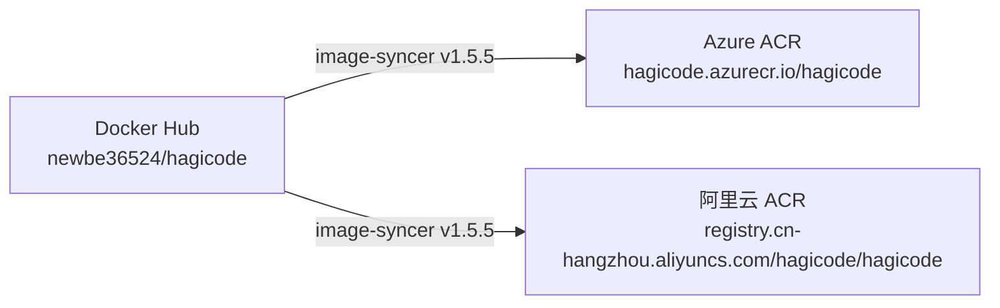

# Design: 阿里云镜像仓库同步机制设计

## 概述

本设计文档详细描述了如何通过修改现有的 GitHub Action 工作流程来实现 Docker Hub 到阿里云容器镜像服务（ACR）的自动同步。目的是为国内用户提供稳定、快速的镜像下载体验，同时保留对 Azure ACR 的支持。

## 当前架构分析

### 现有同步系统
当前项目使用阿里云的 `image-syncer` 工具实现 Docker Hub 到 Azure ACR 的镜像同步，工作流程配置在 `.github/workflows/sync-docker-acr.yml` 文件中。

**现有架构图：**


**现有工作流程特点：**
- 使用阿里云官方提供的 `image-syncer` 工具（v1.5.5）
- 触发方式：定时（每天 UTC 00:00）、手动触发、push 到 `publish` 分支
- 性能配置：10 个并发进程，3 次重试
- 认证方式：使用 GitHub Secrets 存储 Azure ACR 凭证
- 配置文件：
  - `auth.yaml`：存储认证信息（自动生成）
  - `images.yaml`：存储镜像映射关系（自动生成）

## 修改方案设计

### 修改后架构
在现有架构基础上添加阿里云 ACR 作为同步目标，使用 `image-syncer` 工具同时支持两个同步目标。

**修改后架构图：**


### 工作流程修改策略
1. **保持现有工具链不变**：继续使用阿里云 `image-syncer` 工具
2. **扩展认证配置**：添加阿里云 ACR 凭证到 GitHub Secrets
3. **修改镜像映射**：更新 `images.yaml` 配置，同时包含 Azure ACR 和阿里云 ACR 映射
4. **保持触发机制**：保留现有的定时、手动和分支触发机制
5. **优化性能配置**：保持现有的 10 个并发进程和 3 次重试配置

## 详细设计

### 1. 修改后的工作流程配置

```yaml
name: Sync Docker Image to ACRs (Azure + Alibaba Cloud)

on:
  schedule:
    - cron: "0 0 * * *" # 每天 UTC 00:00
  workflow_dispatch: # 手动触发
  push:
    branches: [publish]

permissions:
  contents: read

jobs:
  sync:
    runs-on: ubuntu-latest

    steps:
      - name: Checkout code
        uses: actions/checkout@v4

      - name: Download image-syncer
        run: |
          wget https://github.com/AliyunContainerService/image-syncer/releases/download/v1.5.5/image-syncer-v1.5.5-linux-amd64.tar.gz
          tar -zxvf image-syncer-v1.5.5-linux-amd64.tar.gz
          chmod +x image-syncer

      - name: Create auth config
        run: |
          # 生成认证配置文件 (YAML 格式) - 包含 Azure ACR 和阿里云 ACR
          cat > auth.yaml <<EOF
          hagicode.azurecr.io:
            username: "${{ secrets.AZURE_ACR_USERNAME }}"
            password: "${{ secrets.AZURE_ACR_PASSWORD }}"
          registry.cn-hangzhou.aliyuncs.com:
            username: "${{ secrets.ALIYUN_ACR_USERNAME }}"
            password: "${{ secrets.ALIYUN_ACR_PASSWORD }}"
          EOF

      - name: Create images config
        run: |
          # 生成镜像同步配置文件 (YAML 格式) - 包含两个 ACR 映射
          cat > images.yaml <<EOF
          docker.io/newbe36524/hagicode: hagicode.azurecr.io/hagicode
          docker.io/newbe36524/hagicode: registry.cn-hangzhou.aliyuncs.com/hagicode/hagicode
          EOF

      - name: Run image-syncer
        run: |
          # 执行同步 (使用新版 --auth 和 --images 参数)
          ./image-syncer --auth=./auth.yaml --images=./images.yaml --proc=10 --retries=3

      - name: Upload logs
        if: always()
        uses: actions/upload-artifact@v4
        with:
          name: sync-logs
          path: image-syncer-*.log
          retention-days: 7
```

### 2. GitHub Secrets 配置

需要在 GitHub 仓库中添加以下 Secrets（环境变量）：

| 变量名 | 说明 |
|--------|------|
| `AZURE_ACR_USERNAME` | 现有：Azure ACR 用户名 |
| `AZURE_ACR_PASSWORD` | 现有：Azure ACR 密码 |
| `ALIYUN_ACR_USERNAME` | 新增：阿里云 ACR 用户名（访问凭证用户名） |
| `ALIYUN_ACR_PASSWORD` | 新增：阿里云 ACR 密码（访问凭证密码） |

### 3. 阿里云 ACR 配置

#### 3.1 创建命名空间
- 在阿里云容器镜像服务中创建命名空间 `hagicode`
- 设置为公开访问（public），方便用户直接拉取镜像

#### 3.2 创建仓库
- 在 `hagicode` 命名空间下创建仓库 `hagicode`
- 设置为公开仓库，支持匿名拉取

#### 3.3 创建访问凭证
- 使用阿里云容器镜像服务的"访问凭证"功能
- 为 GitHub Action 创建专用的访问凭证
- 权限设置为"管理仓库"或"推送镜像"

### 4. 文档更新设计

#### 4.1 镜像源选择界面
在 Docker Compose Builder 中添加阿里云 ACR 选项：

```
┌─────────────────────────────────────────────────────────────────────┐
│ Docker Compose 配置生成器                                            │
├─────────────────────────────────────────────────────────────────────┤
│                                                                     │
│  镜像源选择 *                                                        │
│  ○ Docker Hub（推荐海外用户）                                       │
│    └─ newbe36524/hagicode:{tag}                                    │
│                                                                     │
│  ● 阿里云容器镜像服务（推荐国内用户）                               │
│    └─ registry.cn-hangzhou.aliyuncs.com/hagicode/hagicode:{tag}   │
│    ✓ 国内访问速度快，稳定性高                                      │
│                                                                     │
│  ○ Azure Container Registry（备选方案）                            │
│    └─ hagicode.azurecr.io/hagicode:{tag}                          │
│                                                                     │
│  💡 根据您的网络环境，系统推荐：阿里云容器镜像服务                   │
│                                                                     │
│  [查看镜像源对比]                                                   │
│                                                                     │
├─────────────────────────────────────────────────────────────────────┤
│                    [取消]  [下一步：API配置]                        │
│                                                                     │
└─────────────────────────────────────────────────────────────────────┘
```

#### 4.2 镜像源对比表格

**docs/installation/docker-compose.md** 文件更新：

```markdown
## 镜像源对比

| 镜像源 | 地址 | 推荐用户 | 下载速度 | 同步延迟 | 稳定性 |
|--------|------|----------|----------|----------|--------|
| **Docker Hub** | `newbe36524/hagicode` | 海外用户 | ⭐⭐⭐ | - | ⭐⭐⭐⭐⭐ |
| **阿里云 ACR** | `registry.cn-hangzhou.aliyuncs.com/hagicode/hagicode` | 国内用户 | ⭐⭐⭐⭐⭐ | ~24小时 | ⭐⭐⭐⭐⭐ |
| **Azure ACR** | `hagicode.azurecr.io/hagicode` | 特殊网络环境 | ⭐⭐⭐⭐ | ~24小时 | ⭐⭐⭐⭐ |

### 推荐选择
- 🇨🇳 **国内用户**：优先选择阿里云 ACR，下载速度快且稳定
- 🌍 **海外用户**：选择 Docker Hub，官方镜像源
- 🔧 **特殊网络环境**：选择 Azure ACR 作为备选方案

### 同步说明
所有 ACR 镜像与 Docker Hub 官方镜像保持同步，同步频率为**每日一次（UTC 00:00）**。
```

### 5. Docker Compose Builder 修改

#### 5.1 镜像地址配置

**修改 `docker-compose-builder` 项目**：

```typescript
// src/config/image-sources.ts
export const imageSources = [
  {
    id: 'docker-hub',
    name: 'Docker Hub',
    description: '官方推荐，适合海外用户',
    imageUrl: 'newbe36524/hagicode:{tag}',
    recommendedFor: ['overseas'],
    downloadSpeed: 3,
    syncDelay: '-',
    stability: 5,
  },
  {
    id: 'aliyun-acr',
    name: '阿里云容器镜像服务',
    description: '国内访问速度快，稳定性高',
    imageUrl: 'registry.cn-hangzhou.aliyuncs.com/hagicode/hagicode:{tag}',
    recommendedFor: ['china'],
    downloadSpeed: 5,
    syncDelay: '~24小时',
    stability: 5,
  },
  {
    id: 'azure-acr',
    name: 'Azure Container Registry',
    description: '特殊网络环境的备选方案',
    imageUrl: 'hagicode.azurecr.io/hagicode:{tag}',
    recommendedFor: ['special'],
    downloadSpeed: 4,
    syncDelay: '~24小时',
    stability: 4,
  },
];
```

#### 5.2 生成的 docker-compose.yml 配置

**使用阿里云镜像源时：**

```yaml
version: '3.8'

services:
  hagicode:
    image: registry.cn-hangzhou.aliyuncs.com/hagicode/hagicode:latest
    container_name: hagicode
    ports:
      - "45000:8080"
    # ... 其他配置
```

## 技术实现细节

### 1. 认证配置

`auth.yaml` 文件格式（自动生成）：
```yaml
hagicode.azurecr.io:
  username: "${{ secrets.AZURE_ACR_USERNAME }}"
  password: "${{ secrets.AZURE_ACR_PASSWORD }}"
registry.cn-hangzhou.aliyuncs.com:
  username: "${{ secrets.ALIYUN_ACR_USERNAME }}"
  password: "${{ secrets.ALIYUN_ACR_PASSWORD }}"
```

### 2. 镜像映射配置

`images.yaml` 文件格式（自动生成）：
```yaml
docker.io/newbe36524/hagicode: hagicode.azurecr.io/hagicode
docker.io/newbe36524/hagicode: registry.cn-hangzhou.aliyuncs.com/hagicode/hagicode
```

### 3. 执行命令

使用 `image-syncer` 工具执行同步：
```bash
./image-syncer --auth=./auth.yaml --images=./images.yaml --proc=10 --retries=3
```

参数说明：
- `--auth`: 认证配置文件路径
- `--images`: 镜像映射配置文件路径
- `--proc`: 并发进程数（10）
- `--retries`: 失败重试次数（3）

## 验证方案

### 1. 凭证验证
- 使用 `docker login` 命令手动测试阿里云 ACR 凭证
- 测试从 Docker Hub 拉取镜像并推送到阿里云 ACR

### 2. 工作流程测试
- 创建 PR 提交工作流程修改
- 在 PR 中使用 `workflow_dispatch` 手动触发工作流程
- 验证日志中显示成功同步到两个 ACR

### 3. 镜像拉取测试
- 使用 `docker pull` 命令测试从阿里云 ACR 拉取镜像
- 测试使用生成的 docker-compose.yml 文件启动服务

### 4. 定时任务验证
- 监控下一次定时任务执行情况
- 检查 GitHub Actions 日志

## 风险评估

### 高风险
- **Docker Hub 访问限制**：可能导致同步失败
- **网络连接不稳定**：可能导致镜像拉取或推送失败

### 中风险
- **同步延迟**：每日同步可能导致用户无法立即获取最新镜像
- **凭证过期**：可能导致登录失败

### 低风险
- **仓库存储空间满**：可能导致镜像推送失败
- **工作流程中断**：可能导致同步任务停止

### 缓解措施

1. **Docker Hub 访问限制**：
   - 配置重试机制（已启用，3次重试）
   - 使用代理或镜像加速服务
   - 考虑备用源

2. **网络稳定性**：
   - 配置超时和重试（已启用）
   - 使用多个网络环境
   - 添加网络监控

3. **同步延迟**：
   - 保持每日同步频率（可根据需要调整）
   - 添加实时通知

4. **凭证管理**：
   - 定期轮换凭证
   - 配置凭证过期预警
   - 使用短期凭证

## 部署计划

### 阶段 1：准备阶段（1-2小时）
- 创建阿里云容器镜像服务仓库
- 准备访问凭证
- 配置 GitHub Secrets

### 阶段 2：开发阶段（2-3小时）
- 修改现有 GitHub Action 工作流程
- 添加阿里云 ACR 认证和镜像映射配置
- 更新工作流程名称和描述
- 测试工作流程修改

### 阶段 3：集成阶段（3-4小时）
- 更新 Docker Compose Builder
- 更新文档
- 测试集成

### 阶段 4：部署阶段（1-2小时）
- 部署到生产环境
- 验证同步功能
- 监控运行状态

### 阶段 5：优化阶段（2-3小时）
- 性能优化
- 监控完善
- 文档优化

## 总结

本方案通过修改现有的 GitHub Action 工作流程，使用阿里云官方的 `image-syncer` 工具实现了 Docker Hub 到 Azure ACR 和阿里云 ACR 的同时同步。这样既保留了现有功能的稳定性，又为国内用户提供了快速访问的镜像源。

方案的核心优势：
1. **保持工具链一致性**：继续使用 `image-syncer`，无需引入新工具
2. **成本效益高**：GitHub Action 提供免费额度，无需额外服务器
3. **可靠性高**：支持重试机制和失败通知
4. **扩展性强**：未来可以轻松添加更多同步目标
5. **用户体验好**：为国内用户提供快速稳定的镜像访问

通过本方案的实施，Hagicode 项目将为国内用户提供更好的服务体验，同时保持与全球用户的服务一致性。
