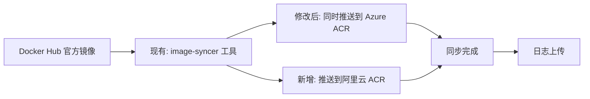
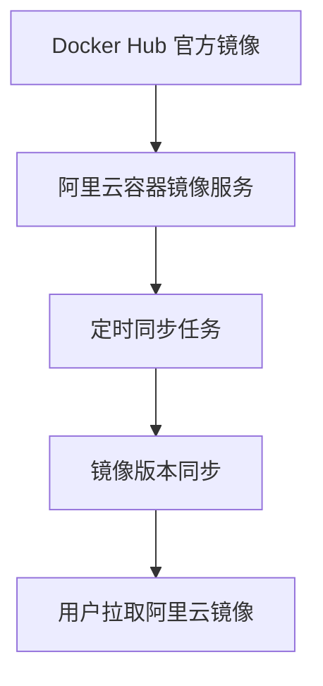

# Change: 为 Hagicode 文档添加阿里云镜像仓库同步机制

## Why

Hagicode 文档网站当前仅提供 Docker Hub 作为镜像源，用户在某些网络环境下可能面临访问不稳定、下载速度慢或依赖外部服务可用性的风险。特别是国内用户，直接访问 Docker Hub 可能受到网络限制。

## What Changes

### 1. 镜像源扩展
- 在 Docker Compose Builder 中添加阿里云容器镜像服务（ACR）作为新的镜像源选项
- 新增阿里云镜像地址：`registry.cn-hangzhou.aliyuncs.com/hagicode/hagicode:{tag}`
- 保持与现有 Docker Hub 和 Azure Container Registry (ACR) 镜像源的兼容性

### 2. 文档更新
- 更新 `docs/installation/docker-compose.md` 文档，添加阿里云镜像源的说明
- 提供阿里云镜像源的使用场景、优势和注意事项
- 调整镜像源选择建议，将阿里云镜像源作为国内用户的推荐选项

### 3. GitHub Action 同步机制
- 修改现有的 `sync-docker-acr.yml` 工作流程
- 添加阿里云容器镜像服务（ACR）作为同步目标
- 配置 `image-syncer` 工具同时同步到 Azure ACR 和阿里云 ACR
- 调整同步策略，优化同步性能

### 4. Docker Compose Builder 集成
- 更新 Docker Compose Builder 工具（独立站点），添加阿里云镜像源选择
- 确保生成的 `docker-compose.yml` 文件支持配置阿里云镜像源

## GitHub Action 工作流程设计

### 同步流程（修改现有工作流程）

现有的 `.github/workflows/sync-docker-acr.yml` 使用阿里云的 `image-syncer` 工具将 Docker Hub 镜像同步到 Azure ACR。本提案将修改该工作流程，添加阿里云 ACR 作为同步目标。



### 现有工作流程分析

**当前配置**：
- **工具**：阿里云 `image-syncer` v1.5.5
- **同步源**：Docker Hub (`docker.io/newbe36524/hagicode`)
- **同步目标**：Azure ACR (`hagicode.azurecr.io/hagicode`)
- **触发方式**：定时（每天 UTC 00:00）、手动触发、push 到 `publish` 分支
- **并发数**：10 个进程
- **重试次数**：3 次

**修改方案**：
- 保持使用 `image-syncer` 工具
- 添加阿里云 ACR 认证配置
- 添加阿里云 ACR 镜像映射
- 保持现有触发机制和性能配置
### 工作流程名称和配置变更

**当前名称**：`Sync Docker Image to Azure ACR`
**修改后名称**：`Sync Docker Image to ACRs (Azure + Alibaba Cloud)`

**配置文件变更**：
- 文件路径：`.github/workflows/sync-docker-acr.yml`（**修改现有文件**）
- 添加阿里云 ACR 认证配置
- 修改镜像配置，添加阿里云 ACR 映射
- 更新工作流程名称和描述

```markdown
**阿里云容器镜像服务（ACR）**
- **镜像地址**：`registry.cn-hangzhou.aliyuncs.com/hagicode/hagicode:{tag}`
- **适用场景**：适合国内用户，网络访问稳定，下载速度快
- **优点**：阿里云国内节点，访问速度快，稳定性高
- **注意事项**：镜像与 Docker Hub 保持同步，通常延迟在 30 分钟内
```

## 代码流程变更

### 配置文件变更

| 文件路径 | 变更类型 | 变更原因 | 影响范围 |
|---------|---------|---------|---------|
| `.github/workflows/sync-docker-acr.yml` | 修改 | 现有工作流程增加阿里云 ACR 同步目标 | 自动化同步 |
| `docs/installation/docker-compose.md` | 修改 | 添加阿里云镜像源的说明和使用指南 | 文档内容 |
| `docker-compose-builder` (独立项目) | 修改 | 添加阿里云镜像源选择功能 | 配置生成工具 |

## Impact

### 用户体验提升
- **网络访问优化**：国内用户可以使用阿里云镜像源，避免 Docker Hub 访问问题
- **下载速度提升**：阿里云国内节点提供更快的下载速度
- **可靠性提升**：减少对单一外部服务的依赖风险

### 文档维护
- 需要定期检查阿里云镜像同步机制的可用性
- 保持文档中镜像地址的一致性
- 可能需要添加镜像同步状态的监控

### 架构影响
- 无代码架构变更，主要是文档内容更新、GitHub Action 配置和外部服务配置
- 保持与现有技术栈的兼容性
- Docker Compose Builder 工具需要同步更新

### 部署考虑
- 同步机制修改完成后，文档更新可通过常规 PR 流程部署
- GitHub Action 工作流程修改通过 PR 合并后自动生效
- 无需对文档网站的构建和部署流程进行修改
- Docker Compose Builder 工具的更新需要单独部署

## 镜像同步机制

### 同步架构


### 同步策略
- **同步源**：Docker Hub (`newbe36524/hagicode`)
- **同步目标**：阿里云容器镜像服务 (`registry.cn-hangzhou.aliyuncs.com/hagicode/hagicode`)
- **同步频率**：每 30 分钟检查一次新镜像
- **同步方式**：使用阿里云 ACR 的"镜像同步"功能
- **失败重试**：同步失败时自动重试 3 次，每次间隔 5 分钟

### 监控和告警
- 配置同步任务执行状态监控
- 同步失败时发送邮件和钉钉告警
- 定期检查同步延迟情况

## 风险评估

### 1. 镜像同步延迟
- **风险**：Docker Hub 镜像更新后，阿里云镜像可能存在延迟
- **缓解措施**：缩短同步间隔至 30 分钟，添加同步状态监控

### 2. 同步任务失败
- **风险**：同步任务可能因网络或服务问题失败
- **缓解措施**：配置自动重试机制和失败告警

### 3. 镜像一致性
- **风险**：不同镜像源的镜像可能存在版本不一致
- **缓解措施**：使用相同的标签策略，确保同步过程中的版本一致性

## 验收标准

### 功能验收
- [ ] Docker Compose Builder 中添加阿里云镜像源选择选项
- [ ] `docker-compose.md` 文档中添加阿里云镜像源的完整说明
- [ ] 网站导航栏和页脚添加阿里云镜像仓库链接
- [ ] 生成的 `docker-compose.yml` 文件支持配置阿里云镜像源

### 文档验收
- [ ] 镜像源选择说明清晰准确
- [ ] 使用场景和优缺点描述完整
- [ ] 镜像同步机制说明详细
- [ ] 文档格式符合项目规范

### 部署验收
- [ ] 文档网站构建成功
- [ ] 所有链接可正常访问
- [ ] Docker Compose Builder 工具更新部署成功
