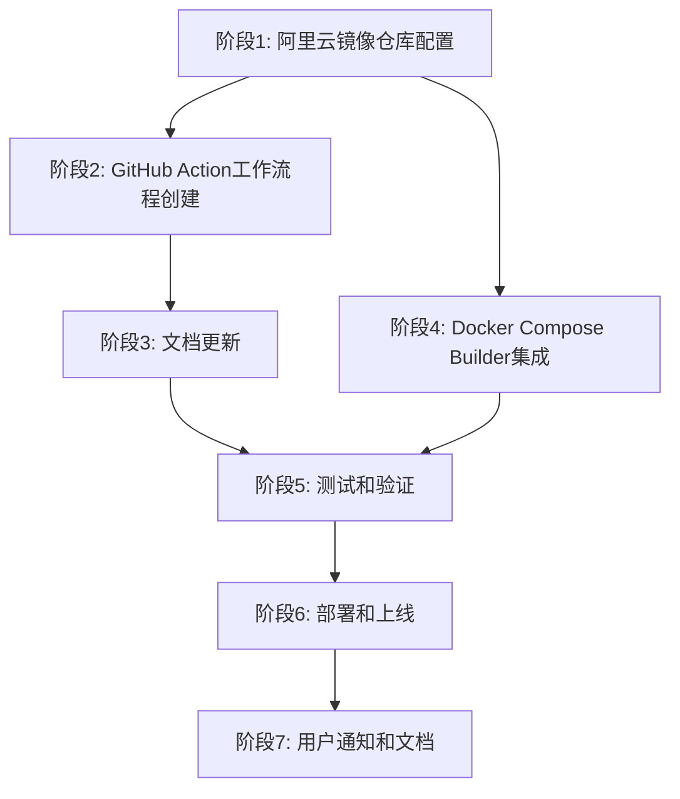

# Tasks: 阿里云镜像仓库同步机制实施

本文档列出了为 Hagicode 文档添加阿里云镜像仓库同步机制所需的实施任务。

## 阶段 1: 阿里云镜像仓库配置

### 1.1 创建阿里云容器镜像服务仓库
- [ ] 在阿里云容器镜像服务中创建命名空间 `hagicode`
- [ ] 创建镜像仓库 `hagicode`
- [ ] 配置镜像仓库为公开访问（public）
- [ ] 获取阿里云镜像仓库地址：`registry.cn-hangzhou.aliyuncs.com/hagicode/hagicode`

### 1.2 准备镜像同步凭证
- [ ] 在阿里云 ACR 中创建访问凭证（用户名和密码）
- [ ] 将阿里云 ACR 访问凭证配置到 GitHub Repository Secrets 中
  - `ALIYUN_ACR_USERNAME`
  - `ALIYUN_ACR_PASSWORD`
- [ ] 验证凭证配置正确

**验证**：使用凭证手动登录阿里云 ACR，确认可以成功推送镜像

## 阶段 2: GitHub Action 工作流程修改

### 2.1 分析现有工作流程
- [ ] 查看 `.github/workflows/sync-docker-acr.yml` 文件
- [ ] 理解现有 `image-syncer` 工具的配置和使用方式
- [ ] 确认当前工作流程的触发机制和性能参数
- [ ] 记录现有的认证配置和镜像映射

### 2.2 修改工作流程添加阿里云 ACR 支持
- [ ] 修改工作流程名称：`Sync Docker Image to ACRs (Azure + Alibaba Cloud)`
- [ ] 在 `auth.yaml` 配置中添加阿里云 ACR 认证：
  ```yaml
  registry.cn-hangzhou.aliyuncs.com:
    username: "${{ secrets.ALIYUN_ACR_USERNAME }}"
    password: "${{ secrets.ALIYUN_ACR_PASSWORD }}"
  ```
- [ ] 在 `images.yaml` 配置中添加阿里云 ACR 镜像映射：
  ```yaml
  docker.io/newbe36524/hagicode: registry.cn-hangzhou.aliyuncs.com/hagicode/hagicode
  docker.io/newbe36524/hagicode: hagicode.azurecr.io/hagicode
  ```
- [ ] 保持现有的触发机制（定时、手动、push 到 publish 分支）
- [ ] 保持现有的性能配置（`--proc=10 --retries=3`）

### 2.3 测试修改后的工作流程
- [ ] 提交修改后的工作流程文件到仓库
- [ ] 使用 `workflow_dispatch` 手动触发工作流程
- [ ] 验证镜像成功同步到阿里云 ACR
- [ ] 验证镜像仍然成功同步到 Azure ACR（确保没有被破坏）
- [ ] 检查上传的同步日志，确认两个目标都成功
- [ ] 验证工作流程的执行时间在合理范围内
- [ ] 测试失败重试机制是否正常工作

### 2.4 验证定时触发和性能
- [ ] 确认定时任务（每天 UTC 00:00）配置保持不变
- [ ] 监控下一次定时任务的执行情况
- [ ] 验证并发性能（10 个进程）正常工作
- [ ] 确认日志上传功能正常（保留 7 天）

**验证**：检查 GitHub Actions 运行日志，确认镜像成功同步到两个 ACR

## 阶段 3: 文档更新

### 3.1 更新 Docker Compose 部署文档
- [ ] 在 `docs/installation/docker-compose.md` 中添加阿里云镜像源说明
- [ ] 在"镜像源选择"部分添加阿里云 ACR 选项
- [ ] 更新镜像源选择建议，将阿里云镜像作为国内用户推荐选项
- [ ] 添加阿里云镜像地址、适用场景、优缺点和注意事项说明
- [ ] 更新镜像源对比表格，包含三个选项：Docker Hub、Azure ACR、阿里云 ACR

**文档内容要点**：
- 镜像地址：`registry.cn-hangzhou.aliyuncs.com/hagicode/hagicode:{tag}`
- 适用场景：国内用户，网络访问稳定
- 优点：阿里云国内节点，下载速度快
- 注意事项：镜像与 Docker Hub 保持同步，延迟约 30 分钟

### 3.2 更新其他相关文档
- [ ] 检查 `docs/installation/package-deployment.md` 中是否需要提及阿里云镜像
- [ ] 检查其他安装相关文档，确保镜像源信息一致
- [ ] 更新 FAQ 文档（如有），添加阿里云镜像相关的常见问题

**验证**：运行 `npm run build` 确保文档构建成功，无链接错误

## 阶段 4: Docker Compose Builder 集成

### 4.1 更新 Docker Compose Builder 工具
- [ ] 在 Docker Compose Builder 项目中添加阿里云镜像源选择选项
- [ ] 更新镜像源选择表单，添加"阿里云容器镜像服务（ACR）"选项
- [ ] 配置阿里云镜像地址映射：`registry.cn-hangzhou.aliyuncs.com/hagicode/hagicode:{tag}`
- [ ] 更新生成的 `docker-compose.yml` 模板，支持阿里云镜像源
- [ ] 添加镜像源选择说明和推荐逻辑（国内用户默认推荐阿里云）

### 4.2 更新 Docker Compose Builder 文档
- [ ] 在 Docker Compose Builder 站点中添加阿里云镜像源说明
- [ ] 更新镜像源选择指南，包含三个选项的对比
- [ ] 添加阿里云镜像源的使用说明和注意事项

### 4.3 测试 Docker Compose Builder
- [ ] 测试生成包含阿里云镜像源的 `docker-compose.yml` 文件
- [ ] 验证生成的配置文件格式正确
- [ ] 验证使用生成的配置文件可以成功拉取阿里云镜像
- [ ] 部署更新后的 Docker Compose Builder 到生产环境

**验证**：使用生成的 `docker-compose.yml` 文件实际启动服务，确认镜像拉取成功

## 阶段 5: 测试和验证

### 5.1 功能测试
- [ ] 测试阿里云镜像拉取速度和稳定性
- [ ] 测试镜像同步机制，确认新镜像在 30 分钟内同步到阿里云
- [ ] 测试文档中的所有链接，确保链接可访问
- [ ] 测试 Docker Compose Builder 生成的配置文件

### 5.2 文档构建测试
- [ ] 运行 `npm run clear` 清理缓存
- [ ] 运行 `npm run build` 构建生产版本
- [ ] 确认构建成功，无错误和警告
- [ ] 运行 `npm run typecheck` 进行类型检查
- [ ] 检查生成的 HTML 页面，确认内容显示正确

### 5.3 本地预览测试
- [ ] 运行 `npm start` 启动本地开发服务器
- [ ] 浏览器访问 `http://localhost:3000`
- [ ] 检查文档内容是否正确渲染
- [ ] 测试所有文档链接，确保无断链

### 5.4 镜像同步测试
- [ ] 在 Docker Hub 上发布一个新的测试镜像标签（可选）
- [ ] 手动触发 GitHub Action 工作流程（使用 `workflow_dispatch`）
- [ ] 验证新镜像成功同步到阿里云 ACR
- [ ] 验证新镜像成功同步到 Azure ACR
- [ ] 测试从阿里云拉取新镜像，确认镜像完整性
- [ ] 测试从 Azure 拉取新镜像，确认镜像完整性（确保现有功能未受影响）

## 阶段 6: 部署和上线

### 6.1 文档站点部署
- [ ] 提交所有文档和配置更改到 Git 仓库
- [ ] 创建 Pull Request，代码审查通过后合并到 `main` 分支
- [ ] GitHub Actions 自动触发部署到 GitHub Pages
- [ ] 验证生产环境文档站点更新成功
- [ ] 检查生产环境所有链接和页面显示正常

### 6.2 GitHub Action 工作流程部署
- [ ] 创建 PR 提交工作流程修改到主分支
- [ ] 代码审查通过后合并 PR
- [ ] 验证工作流程自动触发（定时任务或手动触发）
- [ ] 监控首次修改后的同步执行情况
- [ ] 确认镜像成功同步到阿里云 ACR 和 Azure ACR
- [ ] 配置工作流程运行状态监控
- [ ] 添加工作徽章（可选）：显示同步状态

### 6.3 Docker Compose Builder 部署
- [ ] 提交 Docker Compose Builder 项目更改
- [ ] 通过 CI/CD 流程部署到生产环境
- [ ] 验证 Docker Compose Builder 功能正常
- [ ] 通知用户可以使用新的阿里云镜像源

### 6.4 监控和维护
- [ ] 定期检查 GitHub Action 工作流程执行状态（建议每日一次）
- [ ] 定期检查同步延迟情况
- [ ] 定期检查镜像同步完整性
- [ ] 收集用户反馈，优化镜像源选择建议

## 阶段 7: 用户通知和文档

### 7.1 发布说明
- [ ] 编写变更日志（CHANGELOG）条目
- [ ] 在文档站点首页或博客发布新功能公告
- [ ] 在 QQ 群、GitHub Discussions 等渠道通知用户新功能

### 7.2 用户指南
- [ ] 创建或更新用户指南，说明如何选择合适的镜像源
- [ ] 添加常见问题解答（FAQ），解答镜像源相关问题
- [ ] 提供镜像源切换的操作指南
- [ ] 说明 GitHub Action 自动同步机制

## 依赖关系



## 并行任务

以下任务可以并行执行：
- **阶段 2**（GitHub Action 工作流程创建）和 **阶段 3**（文档更新）可以并行进行
- **阶段 4**（Docker Compose Builder 集成）可以与 **阶段 2、3** 并行进行
- **阶段 5.2**（文档构建测试）可以在完成 **阶段 3** 后立即开始

## 预计工作量

- **阶段 1**：1-2 小时（阿里云配置和凭证准备）
- **阶段 2**：4-6 小时（GitHub Action 工作流程开发）
- **阶段 3**：1-2 小时（文档内容更新）
- **阶段 4**：3-4 小时（Docker Compose Builder 更新和测试）
- **阶段 5**：2-3 小时（全面测试和验证）
- **阶段 6**：1-2 小时（部署和验证）
- **阶段 7**：1-2 小时（用户通知和文档）

**总计**：约 13-21 小时

## 成功标准

### 功能完整性
- ✅ GitHub Action 工作流程成功创建并运行
- ✅ 镜像自动同步到阿里云 ACR 和 Azure ACR
- ✅ 文档中包含完整的阿里云镜像源说明
- ✅ Docker Compose Builder 支持生成阿里云镜像源配置
- ✅ 用户可以使用阿里云镜像源成功部署 Hagicode

### 文档质量
- ✅ 文档内容准确、清晰、易懂
- ✅ 所有链接可正常访问
- ✅ 文档格式符合项目规范
- ✅ 文档构建无错误和警告

### 用户体验
- ✅ 国内用户可以快速下载阿里云镜像
- ✅ 镜像同步机制稳定可靠
- ✅ 用户能够根据自身情况选择合适的镜像源

### 技术指标
- ✅ 镜像同步延迟 ≤ 30 分钟
- ✅ 镜像拉取成功率 ≥ 99%
- ✅ 同步任务失败时告警及时触发
- ✅ 网站构建和部署无错误
- ✅ GitHub Action 工作流程执行成功率 ≥ 99%
