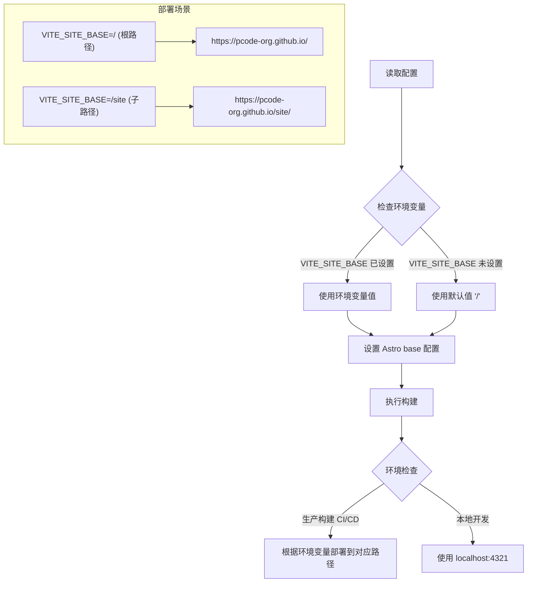
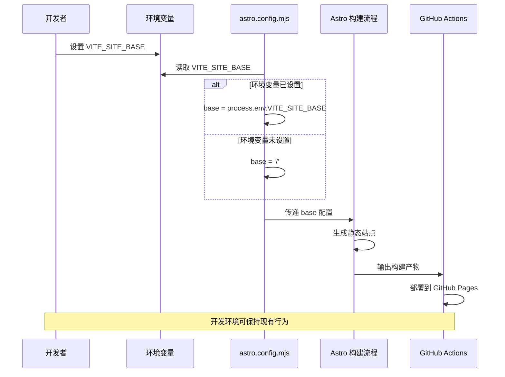

# Change: 支持可配置的站点基础路径

## Why

当前站点的 base 路径在 `astro.config.mjs` 中硬编码为 `/site`,导致所有生产环境的 URL 都带有 `/site` 前缀。这种配置存在以下限制:

1. **硬编码前缀**: 无法灵活配置站点基础路径
2. **单一部署**: 只能部署一套站点,无法同时支持有前缀和无前缀两个版本
3. **部署场景受限**: 无法在同一域名下通过子路径部署多个版本,或同时在根路径和子路径部署

通过实现可配置的 base 路径,可以支持多种部署场景:
- 在根路径部署(`https://pcode-org.github.io/`)
- 在子路径部署(`https://pcode-org.github.io/site/`)
- 同时部署多个版本

## What Changes

- **环境变量支持**: 使用 `VITE_SITE_BASE` 环境变量动态配置 base 路径
- **配置更新**: 在 `astro.config.mjs` 中读取环境变量并设置 `base` 选项
- **默认值处理**: 当环境变量未设置时,默认使用 `/` 作为根路径
- **CI/CD 支持**: 更新 GitHub Actions 工作流以支持多目标部署
- **本地开发兼容**: 开发环境保持现有行为

## UI Design Changes

不适用。此变更仅影响站点配置和部署流程,不涉及用户界面。

## Code Flow Changes

## Impact

- **影响的功能模块**: astro-site
- **影响的代码文件**:
  - 修改: `astro.config.mjs` (base 配置)
  - 修改: `.github/workflows/deploy.yml` (添加环境变量支持)
- **影响的配置**:
  - Astro 配置: `base` 选项改为从环境变量读取
  - 环境变量: 新增 `VITE_SITE_BASE` 环境变量支持
- **收益**:
  - 支持通过环境变量动态配置站点基础路径
  - 可以同时部署有前缀和无前缀两个版本
  - 支持多种部署场景(根路径、子路径)
  - 保持现有构建流程不变,仅增加环境变量注入
  - 本地开发体验保持不变
- **注意事项**:
  - 需要更新部署文档,说明如何配置环境变量
  - 现有的 `/site` 前缀部署需要明确设置 `VITE_SITE_BASE=/site`
  - 开发环境(`npm run dev`)保持现有行为
  - TypeScript 类型检查不受影响
  - 不影响内容链接和图片路径(它们会自动适配 base 路径)
