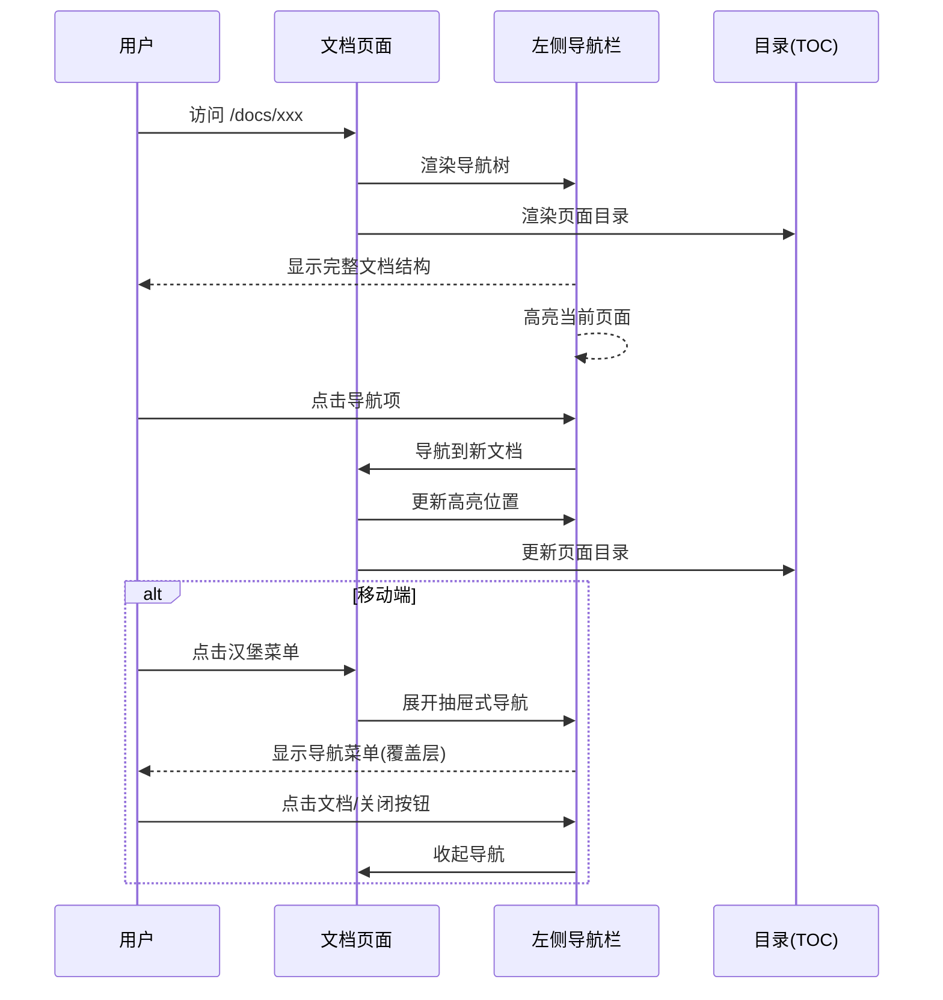
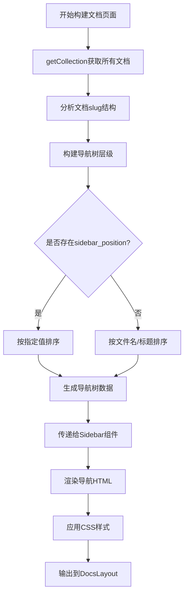

# Change: 为文档页面添加左侧导航栏

## Why

当前文档站点缺少左侧导航栏,用户在不同文档之间切换时导航效率低,内容可见性差,且浏览体验不连贯。主流文档站(如 Docusaurus、VitePress、GitBook)都提供左侧导航栏作为核心导航方式,这是文档站的最佳实践。

## What Changes

- 添加左侧导航栏组件(`Sidebar.astro`),基于文档目录结构自动生成导航树
- 支持多级嵌套文档结构和父子关系显示
- 高亮当前页面所在位置
- 桌面端固定在左侧,移动端提供抽屉式折叠/展开功能
- 支持暗色主题,继承现有 CSS 变量确保主题一致性
- 集成到 `DocsLayout.astro` 布局中
- 利用 Astro Content Collections API 自动生成导航,无需手动维护配置文件
- 支持 frontmatter 中的 `sidebar_position` 字段自定义排序

## UI Design Changes

### 桌面端布局 (宽度 > 1280px)

```
┌─────────────────────────────────────────────────────────────────────────────┐
│  Navbar (固定顶部)                                                            │
├──────────┬──────────────────────────────────────────────────────────────────┤
│          │  主内容区                                                          │
│  左侧    │  ┌────────────────────────────────────────────────────────────┐  │
│  导航栏  │  │  文档标题                                                   │  │
│  (固定)  │  │  ─────────────────────────────────────────────────────────  │  │
│          │  │                                                            │  │
│ 📖 快速开始│  │  文档内容...                                                │  │
│   ├ 安装指南 │  │                                                            │  │
│   ├ 创建项目 │  │                                                            │  │
│   └ 会话管理 │  │                                                            │  │
│          │  │                                                            │  │
│ 📦 安装   │  │                                                            │  │
│   ├ Docker  │  └────────────────────────────────────────────────────────────┘  │
│   └ 部署   │                                                                   │
│          │                                                                   │
│ 🔧 相关   │                                                                   │
│   软件    │  右侧目录 (可选)                                                  │
│   ├ Node  │                                                                   │
│   └ Claude│                                                                   │
│          │                                                                   │
└──────────┴───────────────────────────────────────────────────────────────────┘
```

### 移动端布局 (宽度 < 1280px)

```
┌─────────────────────────────────────┐
│  ☰  Hagicode Docs                   │  ← 汉堡菜单按钮
├─────────────────────────────────────┤
│                                     │
│  主内容区                            │
│  ┌───────────────────────────────┐  │
│  │  文档标题                     │  │
│  │  ───────────────────────────  │  │
│  │                               │  │
│  │  文档内容...                   │  │
│  │                               │  │
│  └───────────────────────────────┘  │
│                                     │
└─────────────────────────────────────┘

当点击汉堡菜单时:
┌─────────────────────────────────────┐
│  ✕  Hagicode Docs    (遮罩层)      │  ← 关闭按钮
├─────┬───────────────────────────────┤
│侧边栏│ (半透明遮罩)                  │
│     │                               │
│ 📖 快│                               │
│   ├ 安│                               │
│   ├ 创│                               │
│   └ 会│                               │
│     │                               │
│ 📦 安│                               │
│   ├ D│                               │
│   └ 部│                               │
└─────┴───────────────────────────────┘
```

### 用户交互流程



### 导航栏状态设计

**桌面端:**
- 始终可见
- 固定在左侧
- 支持滚动浏览所有文档

**移动端:**
- 默认隐藏
- 点击汉堡菜单展开(抽屉式滑入)
- 点击遮罩层或关闭按钮收起
- ESC 键关闭
- 打开时锁定页面滚动

**当前页面高亮:**
- 使用主题色背景高亮
- 加粗文字
- 左侧添加指示条

## Code Flow Changes

### 文档结构读取流程



### 组件交互架构

```mermaid
graph TD
    A[[...slug].astro] -->|获取文档集合| B[getCollection]
    A -->|传递数据| C[DocsLayout.astro]
    C -->|引入| D[Sidebar.astro]
    C -->|引入| E[TableOfContents.astro]
    D -->|接收| F[allDocs, currentSlug]
    E -->|接收| G[headings]
    D -->|生成| H[导航树HTML]
    E -->|生成| I[页面目录HTML]
    H -->|桌面端| J[固定显示]
    H -->|移动端| K[汉堡菜单触发]
    I -->|右侧边栏| L[粘性定位]
```

### 数据结构设计

```typescript
// 导航树节点类型
interface SidebarNode {
  slug: string;           // 文档路径
  title: string;          // 显示标题
  children?: SidebarNode[]; // 子节点
  collapsed?: boolean;    // 是否折叠(移动端)
}

// 文档数据结构
interface DocData {
  slug: string;
  data: {
    title: string;
    description?: string;
    sidebar_position?: number;
  };
}
```

## Impact

### 受影响的规范
- `astro-site` - 新增左侧导航栏功能需求

### 受影响的代码
- `src/layouts/DocsLayout.astro` - 引入 Sidebar 组件
- `src/components/Sidebar.astro` - 新建导航栏组件
- `src/pages/docs/[...slug].astro` - 传递当前 slug 给 Sidebar
- `src/styles/global.css` - 添加导航栏 CSS 变量(可选)

### 用户体验改进
- **提升导航效率** - 用户可快速跳转到任意相关文档,无需返回上级目录
- **增强内容可发现性** - 清晰的层级结构帮助用户发现相关内容
- **改善阅读体验** - 减少在文档间迷失的情况,明确当前位置

### 技术影响
- **性能** - 保持 Astro 零 JS 默认特性,导航栏为纯静态 HTML
- **类型安全** - 利用 Content Collections 的类型系统
- **可维护性** - 自动基于文件系统生成,减少手动配置
- **主题一致性** - 使用现有 CSS 变量,确保视觉风格统一

### 兼容性
- 符合 Astro 5.16 最佳实践
- 保持与现有路由系统兼容
- 支持未来的文档扩展(如博客、API 文档等)
- 与暗色主题系统无缝集成
- 响应式设计支持移动端和桌面端

### 迁移计划
无需数据迁移,纯前端功能添加。建议:
1. 先实现核心导航功能
2. 测试响应式布局
3. 验证主题切换兼容性
4. 优化移动端交互体验

### 风险与权衡
- **风险** - 移动端导航可能占用较多屏幕空间
  - **缓解** - 采用抽屉式设计,默认隐藏
- **风险** - 大量文档时导航栏可能过长
  - **缓解** - 使用粘性定位和滚动支持
- **权衡** - 桌面端内容区域宽度减少约 280px
  - **接受** - 1280px 以下设备隐藏侧边栏,保持内容区域宽度
