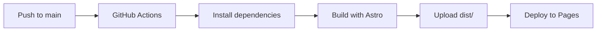

# 设计文档: Docusaurus 到 Astro 迁移

## 文档元数据

- **提案 ID**: `migrate-docusaurus-to-astro`
- **创建日期**: 2026-01-29
- **状态**: 设计中

---

## 架构设计

### 目录结构对比

#### Docusaurus 结构

```
pcode-docs/
├── docusaurus.config.ts     # Docusaurus 配置
├── sidebars.ts               # 侧边栏配置
├── docs/                     # 文档内容
├── blog/                     # 博客内容
├── src/
│   ├── components/           # React 组件
│   ├── css/                  # 全局样式
│   ├── pages/                # 页面组件
│   └── theme/                # 主题覆盖
└── static/                   # 静态资源
```

#### Astro 结构

```
pcode-docs/
├── astro.config.mjs          # Astro 配置
├── src/
│   ├── components/           # Astro/React 组件
│   ├── layouts/              # 布局组件
│   ├── pages/                # 页面路由
│   │   ├── index.astro       # 首页
│   │   ├── docs/
│   │   │   └── [...slug].astro  # 文档动态路由
│   │   └── blog/
│   │       ├── index.astro       # 博客列表
│   │       └── [...slug].astro   # 博客详情
│   ├── content/              # 内容集合
│   │   ├── docs/             # 文档内容
│   │   │   └── config.ts     # 文档集合配置
│   │   └── blog/             # 博客内容
│   │       └── config.ts     # 博客集合配置
│   └── styles/               # 全局样式
└── public/                   # 静态资源
```

### 关键差异

1. **配置文件**:
   - Docusaurus: `docusaurus.config.ts` + `sidebars.ts`
   - Astro: `astro.config.mjs` + `src/content/config.ts`

2. **内容管理**:
   - Docusaurus: 文件系统 + sidebars 配置
   - Astro: 内容集合(Collections) + 自动路由

3. **路由系统**:
   - Docusaurus: 配置驱动 (`sidebars.ts`)
   - Astro: 文件系统路由 + 动态路由 (`[...slug].astro`)

4. **静态资源**:
   - Docusaurus: `static/` 目录
   - Astro: `public/` 目录

---

## 组件架构

### 布局层次结构

```
Layout.astro (根布局)
├── 全局样式
├── Clarity 脚本
└── <slot />

    DocsLayout.astro (文档布局)
    ├── Navbar.astro
    ├── <main>
    │   └── <slot />  # 文档内容
    └── Footer.astro

    BlogLayout.astro (博客布局)
    ├── Navbar.astro
    ├── <main>
    │   └── <slot />  # 博客内容
    └── Footer.astro
```

### React 组件集成策略

#### 客户端组件(需要 hydration)

```tsx
// src/components/home/VideoPlayer.tsx
export default function VideoPlayer() {
  // 使用 React hooks 和状态管理
  const [isPlaying, setIsPlaying] = useState(false);

  return (
    <div>
      {/* 交互式视频播放器 */}
    </div>
  );
}
```

在 Astro 中使用:

```astro
---
import VideoPlayer from '../components/home/VideoPlayer';
---

<VideoPlayer client:load />
<!-- 或 client:visible, client:idle 等 -->
```

#### 静态组件(无需 hydration)

```astro
---
// 直接在 Astro 中编写,无需 React
const title = "Hello";
---

<h1>{title}</h1>
```

---

## 内容管理设计

### 内容集合配置

#### 文档集合 (`src/content/docs/config.ts`)

```typescript
import { defineCollection, z } from 'astro:content';

const docs = defineCollection({
  type: 'content',
  schema: z.object({
    title: z.string(),
    description: z.string().optional(),
    slug: z.string().optional(),
    // 可扩展其他 frontmatter 字段
  }),
});
```

#### 博客集合 (`src/content/blog/config.ts`)

```typescript
const blog = defineCollection({
  type: 'content',
  schema: z.object({
    title: z.string(),
    description: z.string().optional(),
    publishDate: z.coerce.date(),
    author: z.string().optional(),
    tags: z.array(z.string()).optional(),
  }),
});
```

### Frontmatter 迁移策略

#### Docusaurus Frontmatter

```markdown
---
id: installation
title: 安装指南
sidebar_label: 快速开始
---
```

#### Astro Frontmatter(迁移后)

```markdown
---
title: 安装指南
description: 快速开始安装 Hagicode
slug: installation
---
```

**差异**:
- 移除 `id`(使用文件路径)
- 移除 `sidebar_label`(在导航配置中处理)
- 添加 `description`(用于 SEO)

---

## 路由设计

### URL 一致性保证

#### Docusaurus URL 结构

```
/site/docs/installation/docker
/site/blog/2024-01-15-new-release
```

#### Astro URL 结构(保持一致)

```
/site/docs/installation/docker
/site/blog/new-release
```

### 动态路由实现

#### 文档路由 (`src/pages/docs/[...slug].astro`)

```astro
---
export async function getStaticPaths() {
  const docs = await getCollection('docs');
  return docs.map((doc) => ({
    params: { slug: doc.slug.replace(/^docs\//, '').split('/') },
    props: { doc },
  }));
}
---
```

#### 博客路由 (`src/pages/blog/[...slug].astro`)

```astro
---
export async function getStaticPaths() {
  const posts = await getCollection('blog');
  return posts.map((post) => ({
    params: { slug: post.slug.replace(/^blog\//, '').split('/') },
    props: { post },
  }));
}
---
```

---

## 样式系统设计

### CSS 变量映射

#### 保留 Infima 变量(兼容性)

```css
:root {
  --ifm-color-primary: #2e8555;
  --ifm-font-size-base: 16px;
  --ifm-spacing-horizontal: 2rem;
  /* ... 其他 Infima 变量 */
}
```

#### 自定义主题变量

```css
:root {
  --color-primary: var(--ifm-color-primary);
  --color-text: #1c1e21;
  --color-background: #ffffff;
}

[data-theme='dark'] {
  --color-text: #e5e7eb;
  --color-background: #1a1a1a;
}
```

### 深色主题实现

#### 方案 1: 基于 data-attribute(推荐)

```html
<html data-theme="dark">
```

```css
[data-theme='dark'] {
  --color-text: #e5e7eb;
}
```

#### 方案 2: 基于 class

```html
<html class="dark">
```

```css
.dark {
  --color-text: #e5e7eb;
}
```

**决策**: 使用方案 1,与 Docusaurus 保持一致。

---

## 插件和集成设计

### Mermaid 图表

#### Docusaurus

```javascript
// docusaurus.config.ts
module.exports = {
  themes: ['@docusaurus/theme-mermaid'],
};
```

#### Astro

```javascript
// astro.config.mjs
import mermaid from '@astrojs/mermaid';

export default defineConfig({
  integrations: [mermaid()],
});
```

### Microsoft Clarity

#### Docusaurus

```javascript
// 使用 docusaurus-plugin-microsoft-clarity
module.exports = {
  plugins: [
    ['@gracefullight/docusaurus-plugin-microsoft-clarity', {
      clarityID: process.env.CLARITY_PROJECT_ID,
    }],
  ],
};
```

#### Astro

```astro
---
// 在 Layout.astro 中直接注入
const clarityId = import.meta.env.CLARITY_PROJECT_ID;
---

{clarityId && (
  <script is:inline set:html={`...`} />
)}
```

### 代码高亮

#### Docusaurus

```javascript
// prism-react-renderer
module.exports = {
  themeConfig: {
    prism: {
      theme: prismThemes.github,
      additionalLanguages: ['csharp', 'fsharp', 'powershell'],
    },
  },
};
```

#### Astro

```javascript
// astro.config.mjs
export default defineConfig({
  markdown: {
    shikiConfig: {
      theme: 'github',
      langs: ['bash', 'csharp', 'fsharp', 'powershell'],
    },
  },
});
```

---

## 性能优化设计

### 构建性能

#### 目标指标

- Docusaurus 构建: ~5 分钟
- Astro 构建: <2 分钟

#### 优化策略

1. **内容预渲染**:
   - Astro 默认零 JS
   - 仅对交互组件启用 hydration

2. **代码分割**:
   - 使用 `client:` 指令精确控制
   - 按需加载 React 组件

3. **构建缓存**:
   - 启用 Vite 缓存
   - 并行构建页面

### 运行时性能

#### Lighthouse 目标

| 指标 | 当前 | 目标 |
|------|------|------|
| Performance | 75 | 95 |
| FCP | 2.1s | 1.5s |
| LCP | 3.2s | 2.5s |
| TTI | 4.5s | 3.5s |

#### 优化措施

1. **图片优化**:
   - 使用 Astro Image 组件
   - 响应式图片加载

2. **字体优化**:
   - 字体预加载
   - 使用 font-display: swap

3. **资源预加载**:
   - 关键 CSS 内联
   - 预连接到外部域名

---

## 测试策略

### 单元测试

```typescript
// 组件测试
describe('Navbar', () => {
  it('should render navigation links', () => {
    // 测试导航栏渲染
  });
});
```

### 集成测试

```typescript
// 路由测试
describe('Docs pages', () => {
  it('should render all docs pages', async () => {
    const docs = await getCollection('docs');
    docs.forEach(doc => {
      // 验证每个文档页面可以渲染
    });
  });
});
```

### E2E 测试

```typescript
// 使用 Playwright
test('homepage loads correctly', async ({ page }) => {
  await page.goto('/site/');
  await expect(page.locator('h1')).toContainText('Hagicode');
});
```

---

## 部署架构

### CI/CD 流程



### 环境变量

```yaml
# .github/workflows/deploy.yml
env:
  CLARITY_PROJECT_ID: ${{ secrets.CLARITY_PROJECT_ID }}
```

---

## 迁移检查清单

### 必须完成

- [ ] 所有页面正常渲染
- [ ] 所有路由无 404
- [ ] React 组件正常工作
- [ ] 深色主题切换
- [ ] Mermaid 图表显示
- [ ] Clarity 分析工作
- [ ] CI/CD 部署成功

### 优化项(可选)

- [ ] 图片优化
- [ ] 字体优化
- [ ] 代码分割优化
- [ ] 缓存策略
- [ ] Service Worker

---

## 参考资料

- [Astro 最佳实践](https://docs.astro.build/en/guides/best-practices/)
- [性能优化指南](https://docs.astro.build/en/guides/performance/)
- [内容集合教程](https://docs.astro.build/en/guides/content-collections/)
