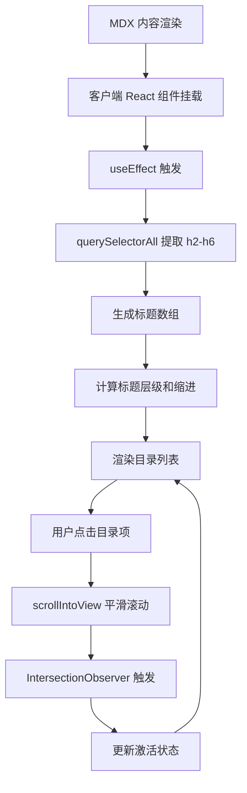

# 设计文档:目录(Table of Contents)功能

## 架构设计

### 组件层次结构

```
DocsLayout.astro
├── Navbar.astro
├── docs-layout (flex container)
│   ├── docs-main (主内容区域)
│   │   └── slot (文档/博客内容)
│   └── docs-sidebar (侧边栏,可选)
│       └── TableOfContents.astro
│           └── TableOfContents.tsx (React 组件)
└── Footer.astro
```

### 布局策略

#### 桌面端布局(>= 996px)

```
┌─────────────────────────────────────────────────┐
│                    Navbar                       │
├─────────────────────────────────────────────────┤
│                                                 │
│  ┌──────────────────────┐  ┌────────────────┐ │
│  │                      │  │   目录          │ │
│  │                      │  │                │ │
│  │   主内容区域          │  │   • 章节1      │ │
│  │                      │  │     • 小节1.1  │ │
│  │                      │  │   • 章节2      │ │
│  │                      │  │     • 小节2.1  │ │
│  │                      │  │   • 章节3      │ │
│  │                      │  │                │ │
│  └──────────────────────┘  └────────────────┘ │
│                                                 │
└─────────────────────────────────────────────────┘
```

#### 移动端布局(< 996px)

```
┌──────────────────────────┐
│        Navbar            │
├──────────────────────────┤
│                          │
│   目录 (可折叠)           │
│   ▼ 章节1                │
│   ▼ 章节2                │
│   ▼ 章节3                │
│                          │
│   主内容区域              │
│                          │
└──────────────────────────┘
```

或使用"返回顶部"按钮替代目录。

## 数据流设计

### 标题提取流程



### 组件状态管理

```typescript
interface TableOfContentsProps {
  // 当前页面的所有标题
  headings: Heading[];
  // 国际化文本
  labels?: {
    title?: string;        // "目录"
    goToTop?: string;      // "返回顶部"
  };
}

interface Heading {
  text: string;    // 标题文本
  slug: string;    // 锚点 ID
  level: number;   // 标题级别 (2-6)
}

interface TableOfContentsState {
  activeId: string | null;  // 当前激活的标题 ID
}
```

## UI 设计

### 目录组件布局

```ascii
┌────────────────────────────┐
│ 本页目录                    │
├────────────────────────────┤
│ ◦ 快速开始                  │ ← 激活状态
│   ◦ 安装指南                │ ← 二级标题(缩进)
│   ◦ 创建项目                │
│ ◦ 功能介绍                  │
│   ◦ 会话管理                │
│   ◦ 对话功能                │
│     ◦ 消息渲染              │ ← 三级标题(更深层缩进)
│ ◦ API 参考                  │
│                            │
│ [↑ 返回顶部]               │
└────────────────────────────┘
```

### 视觉规范

#### 桌面端样式
- **位置**:右侧边栏,固定定位(sticky)
- **宽度**:240-280px
- **最大高度**:calc(100vh - 200px)
- **背景色**:透明或与页面背景一致
- **边框**:左侧 2px 实线边框(主题色)
- **字体大小**:14px
- **行高**:1.6
- **内边距**:16px

#### 目录项样式
- **普通状态**:
  - 文本色:次要文本色(`--color-secondary`)
  - 背景:透明
  - 下划线:无
- **悬停状态**:
  - 文本色:主题色(`--ifm-color-primary`)
  - 背景:轻微背景高亮
  - 下划线:无
- **激活状态**:
  - 文本色:主题色(`--ifm-color-primary`)
  - 背景:轻微背景高亮
  - 左侧边框:2px 主题色
  - 字重:600(font-weight)

#### 层级缩进
- H2:0px 缩进
- H3:16px 缩进
- H4:32px 缩进
- H5:48px 缩进
- H6:64px 缩进

### 响应式设计

#### 移动端(< 768px)
- **布局选项**:
  1. 隐藏目录,使用"返回顶部"按钮
  2. 将目录移至内容顶部,可折叠
  3. 使用抽屉(drawer)组件

**推荐**:选项 1(隐藏 + 返回顶部按钮)

#### 平板端(768px - 996px)
- **布局**:
  - 保持桌面端布局
  - 减少侧边栏宽度至 200px
  - 调整主内容区域宽度

#### 桌面端(>= 996px)
- **布局**:标准双栏布局

## 技术实现细节

### React 组件实现

#### 使用客户端 React

```typescript
// src/components/TableOfContents.tsx
import { useEffect, useState } from 'react';
import clsx from 'clsx';

interface Heading {
  text: string;
  slug: string;
  level: number;
}

interface Props {
  labels?: {
    title?: string;
    goToTop?: string;
  };
}

export default function TableOfContents({ labels }: Props) {
  const [headings, setHeadings] = useState<Heading[]>([]);
  const [activeId, setActiveId] = useState<string>('');

  useEffect(() => {
    // 提取标题
    const elements = Array.from(
      document.querySelectorAll('article h2, article h3, article h4, article h5, article h6')
    );

    const headingData: Heading[] = elements.map((elem) => ({
      text: elem.textContent || '',
      slug: elem.id,
      level: parseInt(elem.tagName.charAt(1)),
    }));

    setHeadings(headingData);

    // 设置 Intersection Observer
    const observer = new IntersectionObserver(
      (entries) => {
        entries.forEach((entry) => {
          if (entry.isIntersecting) {
            setActiveId(entry.target.id);
          }
        });
      },
      { rootMargin: '-100px 0px -80% 0px' }
    );

    elements.forEach((elem) => observer.observe(elem));

    return () => observer.disconnect();
  }, []);

  const handleClick = (slug: string) => {
    const element = document.getElementById(slug);
    if (element) {
      element.scrollIntoView({ behavior: 'smooth' });
    }
  };

  if (headings.length === 0) {
    return null;
  }

  return (
    <nav className="toc">
      <h3 className="toc-title">{labels?.title || '本页目录'}</h3>
      <ul className="toc-list">
        {headings.map((heading) => (
          <li
            key={heading.slug}
            className={clsx(
              'toc-item',
              `toc-level-${heading.level}`,
              { active: heading.slug === activeId }
            )}
          >
            <a
              href={`#${heading.slug}`}
              onClick={(e) => {
                e.preventDefault();
                handleClick(heading.slug);
              }}
            >
              {heading.text}
            </a>
          </li>
        ))}
      </ul>
      <button
        className="toc-back-to-top"
        onClick={() => window.scrollTo({ top: 0, behavior: 'smooth' })}
      >
        {labels?.goToTop || '↑ 返回顶部'}
      </button>
    </nav>
  );
}
```

### Astro 组件封装

```astro
---
// src/components/TableOfContents.astro
import TableOfContents from './TableOfContents';

interface Props {
  labels?: {
    title?: string;
    goToTop?: string;
  };
}

const { labels } = Astro.props;
---

<div class="toc-container">
  <TableOfContents labels={labels} client:load />
</div>

<style>
  .toc-container {
    position: sticky;
    top: 100px;
    max-height: calc(100vh - 200px);
    overflow-y: auto;
  }

  /* 移动端隐藏 */
  @media (max-width: 996px) {
    .toc-container {
      display: none;
    }
  }
</style>
```

### MDX 标题 ID 配置

确保 `astro.config.mjs` 中的 MDX 配置包含 `rehypeSlug`:

```javascript
import { mdx } from '@astrojs/mdx';
import rehypeSlug from 'rehype-slug';

export default defineConfig({
  integrations: [
    mdx({
      rehypePlugins: [rehypeSlug],
    }),
  ],
});
```

### 布局文件修改

#### DocsLayout.astro

```astro
<Layout title={title} description={description}>
  <Navbar />
  <div class="docs-layout">
    <main class="docs-main">
      <slot />
    </main>
    <aside class="docs-sidebar">
      <slot name="sidebar" />
    </aside>
  </div>
  <Footer />
</Layout>

<style>
  .docs-layout {
    display: flex;
    max-width: 1400px;
    margin: 0 auto;
    padding: 2rem 1rem;
    gap: 2rem;
  }

  .docs-main {
    flex: 1;
    min-width: 0;
  }

  .docs-sidebar {
    width: 280px;
    flex-shrink: 0;
  }

  @media (max-width: 996px) {
    .docs-layout {
      flex-direction: column;
    }

    .docs-sidebar {
      display: none;
    }
  }
</style>
```

### 样式实现

```css
/* src/styles/global.css 添加 */

/* 目录容器 */
.toc {
  padding: 1rem;
  border-left: 2px solid var(--color-border);
}

/* 目录标题 */
.toc-title {
  font-size: 1rem;
  font-weight: 600;
  margin-bottom: 1rem;
  color: var(--ifm-color-primary);
}

/* 目录列表 */
.toc-list {
  list-style: none;
  padding: 0;
  margin: 0;
}

/* 目录项 */
.toc-item {
  margin-bottom: 0.5rem;
}

/* 目录链接 */
.toc-item a {
  display: block;
  color: var(--ifm-color-secondary);
  text-decoration: none;
  padding: 0.25rem 0;
  transition: color 0.2s ease;
}

.toc-item a:hover {
  color: var(--ifm-color-primary);
}

/* 激活状态 */
.toc-item.active a {
  color: var(--ifm-color-primary);
  font-weight: 600;
  border-left: 2px solid var(--ifm-color-primary);
  padding-left: 0.5rem;
}

/* 层级缩进 */
.toc-level-2 {
  padding-left: 0;
}

.toc-level-3 {
  padding-left: 1rem;
}

.toc-level-4 {
  padding-left: 2rem;
}

.toc-level-5 {
  padding-left: 3rem;
}

.toc-level-6 {
  padding-left: 4rem;
}

/* 返回顶部按钮 */
.toc-back-to-top {
  margin-top: 1rem;
  padding: 0.5rem;
  background: transparent;
  border: 1px solid var(--color-border);
  border-radius: 0.25rem;
  color: var(--ifm-color-secondary);
  cursor: pointer;
  font-size: 0.875rem;
  transition: all 0.2s ease;
}

.toc-back-to-top:hover {
  background: var(--ifm-color-primary);
  color: white;
  border-color: var(--ifm-color-primary);
}

/* 深色模式 */
[data-theme='dark'] .toc {
  border-left-color: var(--color-border);
}

[data-theme='dark'] .toc-item a {
  color: var(--ifm-color-secondary);
}

[data-theme='dark'] .toc-item.active a {
  color: var(--ifm-color-primary);
}
```

## 性能优化

### 1. 防抖优化

Intersection Observer 已内置性能优化,无需额外防抖。

### 2. 条件渲染

仅当标题数量 >= 3 时显示目录:

```typescript
if (headings.length < 3) {
  return null;
}
```

### 3. 懒加载

使用 `client:load` 而非 `client:idle` 确保目录立即可用,或使用 `client:visible` 延迟加载:

```astro
<TableOfContents labels={labels} client:visible />
```

### 4. 减少 DOM 查询

缓存 `querySelectorAll` 结果,避免重复查询。

## 可访问性

### ARIA 属性

```tsx
<nav aria-label="目录">
  <h3 className="toc-title">本页目录</h3>
  <ul className="toc-list">
    <li><a href="#section1">章节1</a></li>
  </ul>
</nav>
```

### 键盘导航

- 支持Tab键导航
- 支持Enter键激活链接
- 焦点可见性

### 屏幕阅读器

- 使用语义化 HTML(`<nav>`, `<ul>`, `<li>`)
- 添加 `aria-label` 和 `aria-current`

## 测试策略

### 单元测试

```typescript
// 测试标题提取
describe('TableOfContents', () => {
  it('should extract headings correctly', () => {
    // Mock DOM
    document.body.innerHTML = `
      <article>
        <h2 id="section1">Section 1</h2>
        <h3 id="section1-1">Section 1.1</h3>
      </article>
    `;

    // Test implementation
  });

  it('should update active heading on scroll', () => {
    // Test Intersection Observer
  });
});
```

### 集成测试

- 在文档页面验证目录显示
- 在博客页面验证目录显示
- 验证点击跳转功能
- 验证滚动高亮功能

### 视觉回归测试

- 桌面端布局
- 移动端布局
- 深色模式样式

## 已知限制

1. **Markdown 中的标题**:如果 MDX 内容中包含自定义组件内的标题,可能无法提取
2. **动态内容**:页面动态添加的标题不会自动更新目录
3. **SPA 导航**:在页面间导航时需要重新初始化组件

## 未来改进

1. **打印样式**:为打印版本优化目录显示
2. **目录折叠**:允许用户折叠/展开目录层级
3. **搜索功能**:在目录中搜索章节标题
4. **进度指示**:显示阅读进度条
5. **分享链接**:生成带锚点的分享链接

---

**文档版本**:1.0
**最后更新**:2026-01-29
**作者**:AI Assistant
