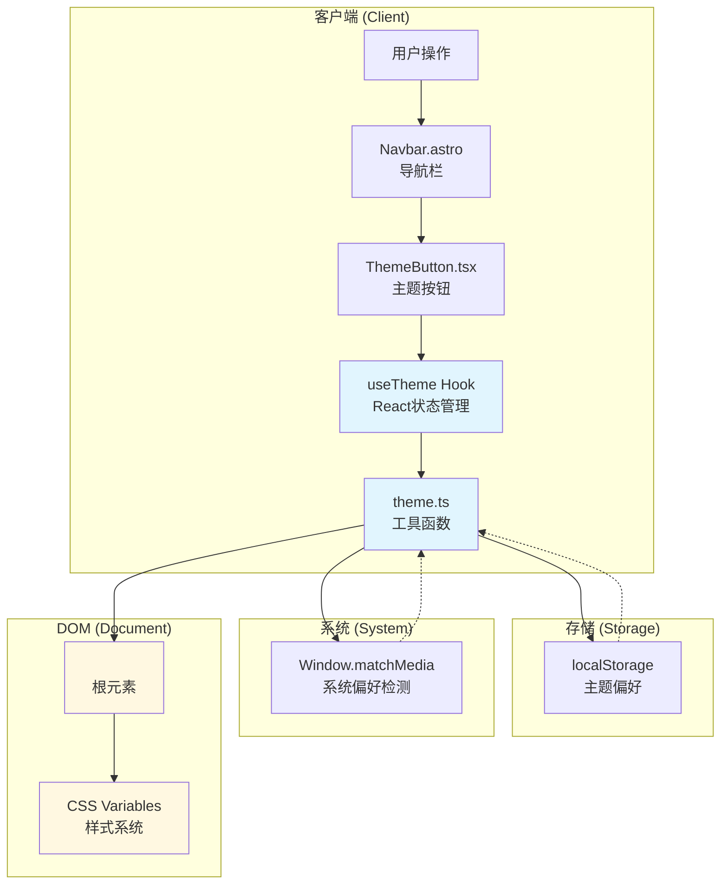
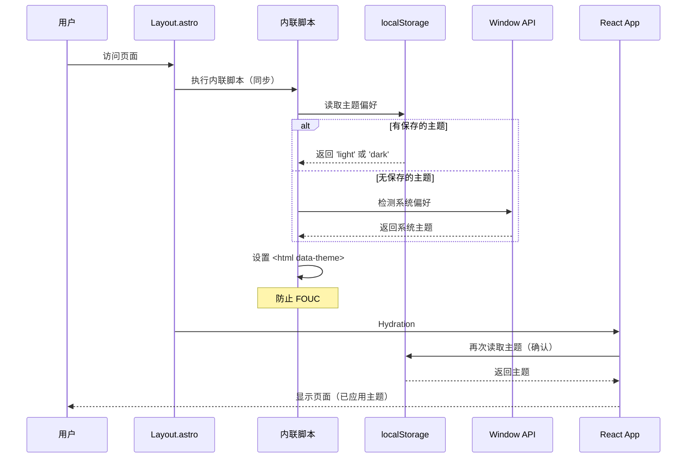
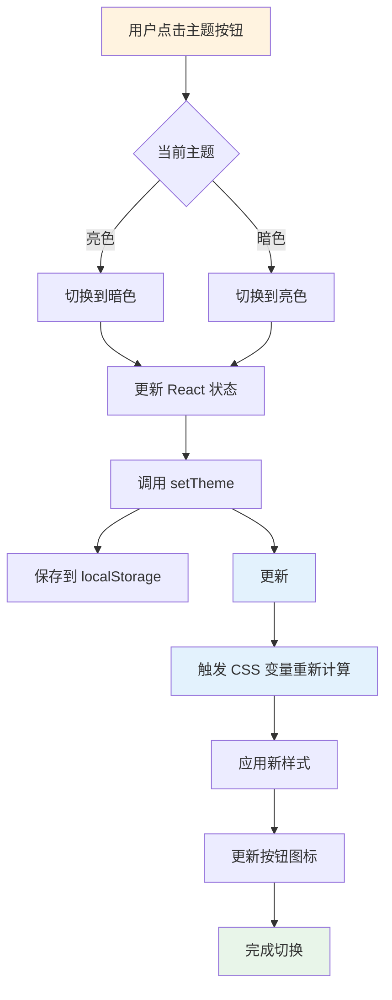

# Design: 主题切换功能技术设计

## 概述

本文档详细描述了为 Hagicode 文档站点添加主题切换功能的技术设计方案。该功能允许用户在亮色和暗色主题之间切换，并持久化用户的主题偏好。

**设计目标**：
- 提供流畅、直观的主题切换体验
- 支持用户偏好持久化
- 确保服务端渲染（SSR）兼容性
- 遵循 Astro 零 JS 默认原则
- 与现有技术栈（Astro + React + Framer Motion）无缝集成

## 约束与依赖

### 技术约束
- **框架**：Astro 5.16（SSR/静态生成）
- **UI 库**：React 18.2 + @astrojs/react 4.4
- **动画库**：Framer Motion 12.26（已存在）
- **类型系统**：TypeScript 5.3（strict 模式）
- **样式方案**：CSS 变量（Custom Properties）
- **浏览器支持**：现代浏览器（Chrome, Firefox, Safari, Edge 最新版）

### 依赖关系
- 依赖现有的 `src/styles/global.css` CSS 变量系统
- 依赖现有的 `src/components/Navbar.astro` 导航栏组件
- 依赖现有的 Framer Motion 动画库
- 不需要新增任何外部 npm 依赖

## 设计决策

### 决策 1：主题状态管理方案

**选择**：使用 React Hook (`useTheme`) + 工具函数 (`theme.ts`) 的组合方案

**理由**：
1. **类型安全**：TypeScript 提供完整的类型推导
2. **代码复用**：工具函数可在非 React 环境中使用
3. **状态同步**：React Hook 提供响应式状态管理
4. **测试友好**：工具函数易于单元测试

**替代方案对比**：

| 方案 | 优点 | 缺点 | 是否采用 |
|------|------|------|---------|
| React Hook + 工具函数 | 类型安全、可复用、易测试 | 轻微增加代码量 | ✅ 采用 |
| 纯 React Context | 全局状态管理 | 需要额外 Provider 包装 | ❌ 不采用 |
| Astro 端组件集成 | 更轻量 | 功能受限，状态管理复杂 | ❌ 不采用 |
| 第三方库（如 next-themes） | 功能完善 | 外部依赖，不是为 Astro 设计 | ❌ 不采用 |

### 决策 2：主题持久化策略

**选择**：localStorage + 系统偏好检测

**优先级**：
1. **localStorage**（用户手动选择的主题）
2. **系统偏好**（`prefers-color-scheme` 媒体查询）
3. **默认暗色**（站点默认主题）

**理由**：
- **用户优先**：尊重用户的手动选择
- **系统感知**：未选择时跟随系统偏好
- **默认暗色**：符合开发者和极客文化的偏好

**实现逻辑**：
```typescript
function getInitialTheme(): Theme {
  // 1. 检查 localStorage
  const stored = localStorage.getItem('hagicode-theme');
  if (stored) return stored as Theme;

  // 2. 检测系统偏好
  const systemDark = window.matchMedia('(prefers-color-scheme: dark)').matches;
  if (systemDark) return 'dark';

  // 3. 默认暗色
  return 'dark';
}
```

### 决策 3：主题应用方式

**选择**：在 `<html>` 根元素设置 `data-theme` 属性

**对比方案**：

| 方案 | 优点 | 缺点 | 是否采用 |
|------|------|------|---------|
| `data-theme` 属性 | 语义化、CSS 选择器简单 | 属性不是标准 HTML | ✅ 采用 |
| class 切换（`.dark-mode`） | 更传统、兼容性更好 | 语义不够清晰 | ❌ 不采用 |
| CSS 变量覆盖 | 直接修改样式 | JavaScript 依赖重、难维护 | ❌ 不采用 |

**CSS 选择器示例**：
```css
/* 亮色主题（默认） */
:root {
  --color-background: #ffffff;
  --color-text: #1c1e21;
}

/* 暗色主题 */
[data-theme='dark'] {
  --color-background: #1a1a1a;
  --color-text: #e5e7eb;
}
```

### 决策 4：防止页面闪烁（FOUC）

**问题**：Astro SSR 时客户端 hydration 会导致主题加载延迟，造成闪烁。

**解决方案**：在 `<head>` 中使用内联脚本提前设置主题

**实现位置**：`src/layouts/Layout.astro`
```astro
<!DOCTYPE html>
<html lang="zh-CN">
  <head>
    <!-- 内联脚本在页面渲染前执行 -->
    <script is:inline define:vars={{ themeKey: 'hagicode-theme' }}>
      (function() {
        const theme = localStorage.getItem(themeKey) ||
                     (window.matchMedia('(prefers-color-scheme: dark)').matches ? 'dark' : 'light');
        document.documentElement.setAttribute('data-theme', theme);
      })();
    </script>
  </head>
  <body>
    <slot />
  </body>
</html>
```

**关键点**：
- 使用 `is:inline` 确保脚本不被处理
- 立即执行函数避免污染全局作用域
- 在 `<head>` 中执行，防止内容渲染后闪烁

### 决策 5：动画实现方式

**选择**：使用 Framer Motion（项目已有依赖）

**动画设计**：
- **图标切换**：旋转 180 度 + 缩放（0 → 1）
- **按钮交互**：悬停放大 1.1 倍，点击缩小 0.95 倍
- **过渡时长**：300ms（平衡流畅度和响应速度）

**实现代码**：
```tsx
<motion.button
  whileHover={{ scale: 1.1 }}
  whileTap={{ scale: 0.95 }}
  aria-label={`切换到${theme === 'dark' ? '亮色' : '暗色'}主题`}
>
  <motion.svg
    animate={{ rotate: theme === 'dark' ? 180 : 0 }}
    transition={{ duration: 0.3, ease: 'easeInOut' }}
  >
    {/* 太阳/月亮图标 */}
  </motion.svg>
</motion.button>
```

**替代方案**：CSS `transition` 和 `transform`
- 优点：更轻量，无 JS 依赖
- 缺点：动画效果受限，与项目技术栈不一致
- **不采用原因**：项目已有 Framer Motion，动画效果更佳

## UI/UX 设计

### 桌面端设计

#### 导航栏布局

```
┌──────────────────────────────────────────────────────────────────────┐
│  [☰]  Hagicode Docs    Docs    博客    QQ群    下载    🌙           │
└──────────────────────────────────────────────────────────────────────┘
  ↑            ↑                                                          ↑
汉堡菜单    品牌名称                                              主题切换按钮
              导航链接
```

**按钮样式规范**：
- **尺寸**：32px × 32px
- **图标**：24px × 24px（居中）
- **边距**：左侧 8px，右侧 0
- **背景**：透明（悬停时 rgba(255,255,255,0.1)）
- **圆角**：4px
- **过渡**：所有属性 200ms ease

#### 按钮状态

| 状态 | 图标 | 背景 | 提示文本 |
|------|------|------|---------|
| 亮色主题（默认） | 🌙 月亮 | 透明 | "切换到暗色模式" |
| 亮色主题（悬停） | 🌙 月亮 | rgba(255,255,255,0.1) | "切换到暗色模式" |
| 暗色主题 | ☀️ 太阳 | 透明 | "切换到亮色模式" |
| 暗色主题（悬停） | ☀️ 太阳 | rgba(255,255,255,0.1) | "切换到亮色模式" |
| 键盘聚焦 | 🌙/☀️ | 透明 + 蓝色轮廓 | "切换到 [暗色/亮色] 模式" |

### 移动端设计

#### 汉堡菜单主题切换按钮

```
┌─────────────────────────────┐
│  [✕]  Hagicode Docs        │
├─────────────────────────────┤
│  📄 Docs                   │
│  📝 博客                    │
│  👥 QQ群                    │
│  📥 下载安装包              │
│  🐳 Docker Hub             │
│  🔧 Docker Compose 生成器  │
│  ─────────────────────────  │  ← 分隔线
│  [🌙/☀️ 主题切换按钮]       │  ← 直接点击切换（无下拉菜单）
└─────────────────────────────┘
```

**交互流程**：
1. 用户点击菜单中的主题切换按钮
2. 主题立即切换（亮色 ↔ 暗色）
3. 按钮图标更新（🌙 ↔ ☀️）
4. localStorage 保存选择
5. 菜单保持打开状态（用户可继续操作）

**样式规范**：
- **字体大小**：16px
- **行高**：48px（触控友好）
- **图标尺寸**：20px × 20px
- **过渡**：背景色 200ms ease
- **无下拉菜单**：直接点击切换，交互简洁

### 无障碍设计

#### 键盘导航
- **Tab 键**：焦点进入主题按钮
- **Enter/Space 键**：触发主题切换
- **焦点指示器**：蓝色轮廓（2px solid #2e8555）

#### 屏幕阅读器支持
- **aria-label**：动态描述当前主题和切换目标
  - 亮色时：`"切换到暗色模式"`
  - 暗色时：`"切换到亮色模式"`
- **role**：`button`（明确元素角色）

#### 颜色对比度
- **亮色主题**：文字 #1c1e21 vs 背景 #ffffff（对比度 15.3:1，AAA 级）
- **暗色主题**：文字 #e5e7eb vs 背景 #1a1a1a（对比度 14.2:1，AAA 级）

## 技术设计

### 系统架构



### 数据流设计

#### 初始化流程



#### 主题切换流程



### 模块设计

#### 1. `src/theme.ts` - 工具函数模块

**职责**：提供主题管理的纯函数，无 React 依赖

**导出内容**：
```typescript
// 类型定义
export type Theme = 'light' | 'dark';

// 常量
export const THEME_KEY = 'hagicode-theme';

// 函数
export function getInitialTheme(): Theme;
export function getSystemTheme(): Theme;
export function setTheme(theme: Theme): void;
export function applyTheme(theme: Theme): void;
```

**设计原则**：
- **纯函数**：无副作用（除了 `setTheme` 和 `applyTheme`）
- **类型安全**：完整的 TypeScript 类型推导
- **环境检测**：SSR 安全（`typeof window` 检查）
- **单一职责**：每个函数只做一件事

**关键实现**：
```typescript
export function getInitialTheme(): Theme {
  if (typeof window === 'undefined') return 'dark';

  const stored = localStorage.getItem(THEME_KEY);
  if (stored === 'light' || stored === 'dark') return stored;

  return getSystemTheme();
}

export function getSystemTheme(): Theme {
  if (typeof window === 'undefined') return 'dark';
  return window.matchMedia('(prefers-color-scheme: dark)').matches ? 'dark' : 'light';
}

export function setTheme(theme: Theme): void {
  if (typeof window === 'undefined') return;
  localStorage.setItem(THEME_KEY, theme);
  applyTheme(theme);
}

export function applyTheme(theme: Theme): void {
  if (typeof window === 'undefined') return;
  document.documentElement.setAttribute('data-theme', theme);
}
```

#### 2. `src/hooks/useTheme.tsx` - React Hook 模块

**职责**：提供 React 状态管理和主题切换逻辑

**导出内容**：
```typescript
export function useTheme(): {
  theme: Theme;
  toggleTheme: () => void;
  setTheme: (theme: Theme) => void;
};
```

**设计原则**：
- **响应式**：使用 `useState` 管理主题状态
- **副作用隔离**：使用 `useEffect` 监听系统主题变化
- **性能优化**：使用 `useCallback` 缓存函数
- **内存泄漏防护**：清理事件监听器

**关键实现**：
```typescript
export function useTheme() {
  const [theme, setThemeState] = useState<Theme>(() => getInitialTheme());

  const toggleTheme = useCallback(() => {
    const newTheme = theme === 'light' ? 'dark' : 'light';
    setThemeState(newTheme);
    setTheme(newTheme);
  }, [theme]);

  const manuallySetTheme = useCallback((newTheme: Theme) => {
    setThemeState(newTheme);
    setTheme(newTheme);
  }, []);

  useEffect(() => {
    const mediaQuery = window.matchMedia('(prefers-color-scheme: dark)');

    const handleChange = (e: MediaQueryListEvent) => {
      // 仅在用户未手动设置时跟随系统
      if (!localStorage.getItem(THEME_KEY)) {
        setThemeState(e.matches ? 'dark' : 'light');
      }
    };

    mediaQuery.addEventListener('change', handleChange);
    return () => mediaQuery.removeEventListener('change', handleChange);
  }, []);

  return { theme, toggleTheme, setTheme: manuallySetTheme };
}
```

#### 3. `src/components/ThemeButton.tsx` - 按钮组件

**职责**：渲染主题切换按钮，处理用户交互

**组件接口**：
```typescript
interface ThemeButtonProps {
  className?: string;
}
```

**设计原则**：
- **无障碍优先**：完整的 ARIA 属性
- **动画流畅**：使用 Framer Motion
- **样式可控**：接受 `className` 扩展样式
- **性能优化**：避免不必要的重渲染

**图标设计**：
- **月亮图标**（亮色主题时显示）：表示"切换到暗色"
- **太阳图标**（暗色主题时显示）：表示"切换到亮色"

**关键实现**：
```tsx
import { motion } from 'framer-motion';
import { useTheme } from '../hooks/useTheme';

export default function ThemeButton({ className }: ThemeButtonProps) {
  const { theme, toggleTheme } = useTheme();

  const isDark = theme === 'dark';

  return (
    <motion.button
      className={className}
      onClick={toggleTheme}
      whileHover={{ scale: 1.1 }}
      whileTap={{ scale: 0.95 }}
      aria-label={`切换到${isDark ? '亮色' : '暗色'}主题`}
      aria-pressed={isDark}
    >
      <motion.svg
        width="24"
        height="24"
        viewBox="0 0 24 24"
        fill="none"
        stroke="currentColor"
        strokeWidth="2"
        strokeLinecap="round"
        strokeLinejoin="round"
        animate={{ rotate: isDark ? 180 : 0 }}
        transition={{ duration: 0.3, ease: 'easeInOut' }}
      >
        {isDark ? (
          // 太阳图标
          <>
            <circle cx="12" cy="12" r="5" />
            <line x1="12" y1="1" x2="12" y2="3" />
            <line x1="12" y1="21" x2="12" y2="23" />
            <line x1="4.22" y1="4.22" x2="5.64" y2="5.64" />
            <line x1="18.36" y1="18.36" x2="19.78" y2="19.78" />
            <line x1="1" y1="12" x2="3" y2="12" />
            <line x1="21" y1="12" x2="23" y2="12" />
            <line x1="4.22" y1="19.78" x2="5.64" y2="18.36" />
            <line x1="18.36" y1="5.64" x2="19.78" y2="4.22" />
          </>
        ) : (
          // 月亮图标
          <>
            <path d="M21 12.79A9 9 0 1 1 11.21 3 7 7 0 0 0 21 12.79z" />
          </>
        )}
      </motion.svg>
    </motion.button>
  );
}
```

### 4. `src/layouts/Layout.astro` - 布局集成

**职责**：初始化主题，防止 FOUC

**关键变更**：
```astro
---
// 原有代码保持不变
---

<!DOCTYPE html>
<html lang="zh-CN" data-theme="dark">
  <head>
    <!-- 原有 meta 标签... -->

    <!-- 内联脚本：防止 FOUC -->
    <script is:inline>
      (function() {
        try {
          const theme = localStorage.getItem('hagicode-theme') ||
                       (window.matchMedia('(prefers-color-scheme: dark)').matches ? 'dark' : 'light');
          document.documentElement.setAttribute('data-theme', theme);
        } catch (e) {
          // 降级：默认暗色
          document.documentElement.setAttribute('data-theme', 'dark');
        }
      })();
    </script>

    <!-- 原有 Microsoft Clarity 脚本... -->
  </head>
  <body>
    <slot />
  </body>
</html>
```

**设计要点**：
- **默认暗色**：`<html data-theme="dark">` 作为降级方案
- **内联执行**：`is:inline` 确保脚本不被 Astro 处理
- **错误捕获**：`try-catch` 处理可能的 localStorage 访问错误
- **立即执行**：IIFE 避免污染全局作用域

### 5. `src/styles/global.css` - 样式系统

**职责**：定义主题 CSS 变量

**关键变更**：

```css
/* ========== 亮色主题（默认） ========== */
:root {
  /* 原有的 Docusaurus 兼容变量 */
  --ifm-color-primary: #2e8555;
  --ifm-color-primary-dark: rgb(33, 175, 144);
  --ifm-font-size-base: 16px;
  --ifm-spacing-horizontal: 2rem;

  /* 自定义主题变量 - 亮色 */
  --color-background: #ffffff;
  --color-text: #1c1e21;
  --color-text-secondary: #6b7280;
  --color-border: #e5e7eb;
  --color-surface: #f9fafb;
  --color-surface-hover: #f3f4f6;

  /* 主题过渡动画 */
  --theme-transition: background-color 0.3s ease,
                      color 0.3s ease,
                      border-color 0.3s ease;
}

/* ========== 暗色主题 ========== */
[data-theme='dark'] {
  /* 原有的 Docusaurus 兼容变量 */
  --ifm-color-primary: #25c2a0;
  --ifm-color-primary-dark: rgb(26, 136, 112);

  /* 自定义主题变量 - 暗色 */
  --color-background: #1a1a1a;
  --color-text: #e5e7eb;
  --color-text-secondary: #9ca3af;
  --color-border: #374151;
  --color-surface: #262626;
  --color-surface-hover: #2d2d2d;
}

/* ========== 全局样式应用 ========== */
html,
body {
  background-color: var(--color-background);
  color: var(--color-text);
  transition: var(--theme-transition);
}

/* 链接样式 */
a {
  color: var(--ifm-color-primary);
  transition: color 0.2s ease;
}

/* 表格样式 */
table {
  border-color: var(--color-border);
}

/* 代码块样式 */
pre,
code {
  background-color: var(--color-surface);
  border-color: var(--color-border);
}
```

**设计原则**：
- **变量分层**：保留 Docusaurus 原有变量（兼容性）+ 新增语义化变量
- **一一对应**：亮色和暗色变量必须成对定义
- **过渡统一**：使用 `--theme-transition` 统一过渡效果
- **语义化命名**：使用 `--color-background` 而非 `--bg-color`

## 风险与缓解

### 风险 1：页面闪烁（FOUC）

**严重性**：高（用户体验受损）

**原因**：
- SSR 渲染时无法访问浏览器 API
- 客户端 hydration 延迟导致主题应用延迟

**缓解措施**：
1. **内联脚本**：在 `<head>` 中立即设置主题
2. **默认暗色**：`<html>` 标签预设 `data-theme="dark"`
3. **同步执行**：避免异步加载主题检测逻辑

**验证方法**：
- 在不同网络环境下测试首次加载
- 清除缓存后测试刷新体验
- 使用 Chrome DevTools 慢速网络模拟

### 风险 2：localStorage 访问错误

**严重性**：中（功能降级）

**原因**：
- 无痕模式可能禁用 localStorage
- 用户浏览器设置阻止存储
- 第三方 cookie 策略影响

**缓解措施**：
```typescript
try {
  localStorage.setItem(THEME_KEY, theme);
} catch (e) {
  console.warn('无法访问 localStorage，主题偏好将不会保存');
  // 降级：仅设置 DOM，不保存
  applyTheme(theme);
}
```

**降级方案**：
- 主题切换仍然可用（仅本次会话）
- 每次访问默认为暗色主题
- 不影响核心功能使用

### 风险 3：系统偏好冲突

**严重性**：低（可接受）

**场景**：
- 用户系统设置为暗色
- 用户手动选择亮色主题
- 系统偏好变化时（如日落后自动切换）

**设计决策**：
- **用户手动选择优先**：localStorage 存在时不跟随系统
- **仅无偏好时跟随**：未手动选择时响应系统变化

**实现**：
```typescript
// 仅在未手动设置时响应系统变化
if (!localStorage.getItem(THEME_KEY)) {
  setThemeState(e.matches ? 'dark' : 'light');
}
```

### 风险 4：Hydration 不匹配

**严重性**：高（React 警告）

**原因**：
- SSR 时 `<html data-theme="dark">`（默认）
- 客户端 hydration 时可能检测到不同主题

**解决方案**：
1. **服务端**：始终使用 `data-theme="dark"`
2. **客户端**：内联脚本在 hydration 前修正
3. **React**：Hook 初始化时读取实际 DOM 属性

**验证**：
- 检查 React hydration 警告
- 使用 `npm run build` + `npm run preview` 测试
- 查看浏览器控制台无错误

## 性能考虑

### JavaScript Bundle 大小

**预估增加**：
- `theme.ts`：~1 KB（gzip 后 ~0.5 KB）
- `useTheme.tsx`：~1.5 KB（gzip 后 ~0.7 KB）
- `ThemeButton.tsx`：~3 KB（gzip 后 ~1.2 KB）
- **总计**：~5.5 KB（gzip 后 ~2.4 KB）

**优化措施**：
- 使用 Tree Shaking（Framer Motion 按需导入）
- 避免不必要的依赖
- 内联 SVG 图标（避免额外请求）

### 运行时性能

**主题切换耗时**：
- localStorage 读取：< 1ms
- DOM 属性设置：< 1ms
- CSS 变量重新计算：< 16ms（1 帧）
- **总耗时**：< 20ms（用户无感知）

**内存占用**：
- React 组件：~2 KB
- 事件监听器：~0.5 KB
- **总计**：~2.5 KB（可忽略）

### 首次加载性能

**内联脚本影响**：
- 执行时间：< 5ms
- 阻塞渲染：是（但可接受，防止 FOUC）
- **权衡**：轻微延迟 vs 闪烁问题

**优化建议**：
- 将脚本放在 `<head>` 末尾（在 CSS 之后）
- 使用 IIFE 避免全局变量污染
- 添加 `try-catch` 防止脚本错误阻塞渲染

## 测试策略

### 单元测试

**`src/theme.ts` 测试**：
```typescript
describe('theme utilities', () => {
  it('getInitialTheme: 返回 localStorage 保存的主题', () => {
    localStorage.setItem('hagicode-theme', 'light');
    expect(getInitialTheme()).toBe('light');
  });

  it('getSystemTheme: 检测系统偏好', () => {
    // Mock matchMedia API
    expect(getSystemTheme()).toBe('dark' | 'light');
  });

  it('setTheme: 保存并应用主题', () => {
    setTheme('dark');
    expect(document.documentElement.getAttribute('data-theme')).toBe('dark');
    expect(localStorage.getItem('hagicode-theme')).toBe('dark');
  });
});
```

**`src/hooks/useTheme.tsx` 测试**：
```typescript
describe('useTheme', () => {
  it('初始化时读取保存的主题', () => {
    const { result } = renderHook(() => useTheme());
    expect(result.current.theme).toBe('dark' | 'light');
  });

  it('toggleTheme: 在亮色和暗色之间切换', () => {
    const { result } = renderHook(() => useTheme());
    const initialTheme = result.current.theme;

    act(() => {
      result.current.toggleTheme();
    });

    expect(result.current.theme).not.toBe(initialTheme);
  });
});
```

### 集成测试

**端到端场景**：
1. **首次访问**：
   - 无 localStorage → 应用默认暗色主题
   - 系统偏好暗色 → 应用暗色主题
   - 系统偏好亮色 → 应用亮色主题

2. **主题切换**：
   - 点击按钮 → 主题切换
   - 刷新页面 → 主题保持
   - 检查 localStorage → 已保存

3. **系统偏好变化**：
   - 未手动设置时 → 跟随系统变化
   - 已手动设置时 → 不跟随系统

### 视觉回归测试

**工具**：Percy 或 Chromatic

**测试页面**：
- 首页（亮色/暗色）
- 文档页（亮色/暗色）
- 博客页（亮色/暗色）
- 移动端视图（亮色/暗色）

**验证点**：
- 文字对比度符合 WCAG AA 标准
- 所有组件在两种主题下正常显示
- 无样式错位或溢出

## 迁移与兼容性

### 向后兼容性

**影响范围**：
- ✅ 不破坏现有页面布局
- ✅ 不影响现有组件功能
- ✅ 不需要修改 MDX 内容
- ✅ 不影响 SEO（使用 data-theme 属性）

**降级方案**：
- 浏览器不支持 localStorage → 主题切换仍可用，但不持久化
- JavaScript 被禁用 → 保持在默认暗色主题
- 旧版浏览器 → 使用 CSS 降级，不支持平滑过渡

### 未来扩展性

**预留接口**：
```typescript
// 可扩展支持更多主题
export type Theme = 'light' | 'dark' | 'high-contrast' | 'sepia';

// 可扩展主题来源
export interface ThemeSource {
  type: 'user' | 'system' | 'default';
  timestamp?: number;
}
```

**可能的未来功能**：
- 高对比度模式
- 自定义主题编辑器
- 主题热键（Ctrl/Cmd + Shift + T）
- 跟随系统主题自动切换（现在需要手动触发）

## 实施检查清单

### 代码实现
- [ ] `src/theme.ts` 工具函数完整实现
- [ ] `src/hooks/useTheme.tsx` Hook 完整实现
- [ ] `src/components/ThemeButton.tsx` 组件完整实现
- [ ] `src/layouts/Layout.astro` 主题初始化脚本
- [ ] `src/components/Navbar.astro` 按钮集成
- [ ] `src/styles/global.css` CSS 变量完善

### 测试验证
- [ ] TypeScript 类型检查通过
- [ ] 单元测试覆盖核心函数
- [ ] 集成测试覆盖主要场景
- [ ] 手动测试所有交互流程
- [ ] 跨浏览器测试

### 性能优化
- [ ] Bundle 大小 < 5 KB（gzip）
- [ ] 主题切换 < 20ms
- [ ] 无 FOUC
- [ ] Lighthouse 性能得分无下降

### 无障碍支持
- [ ] 键盘导航完整
- [ ] 屏幕阅读器支持
- [ ] ARIA 属性完整
- [ ] 颜色对比度符合 WCAG AA

### 文档完善
- [ ] 代码注释完整
- [ ] JSDoc 文档完整
- [ ] 提交信息清晰
- [ ] 变更日志更新
