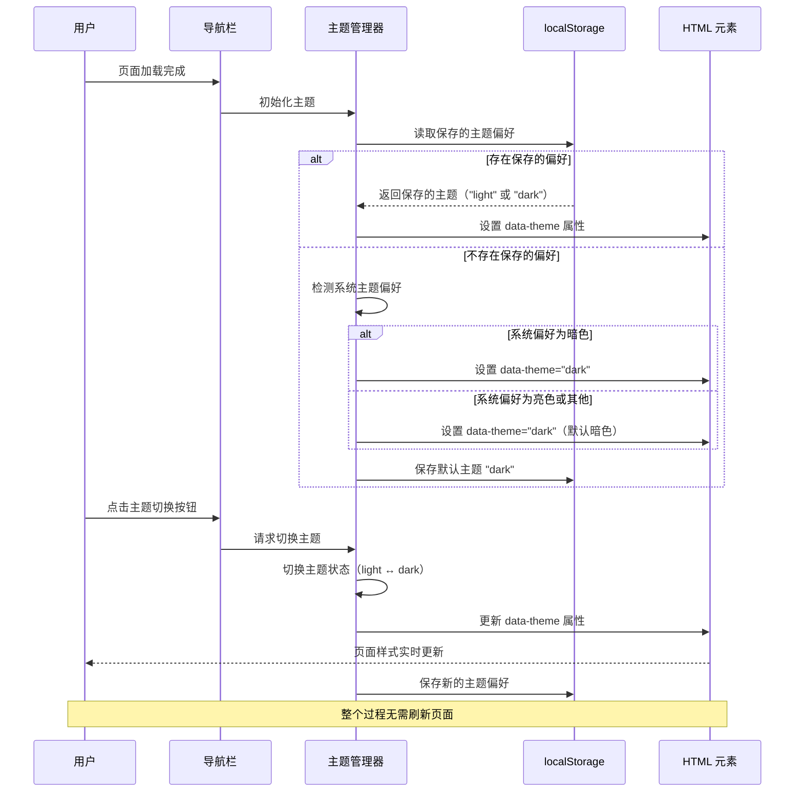
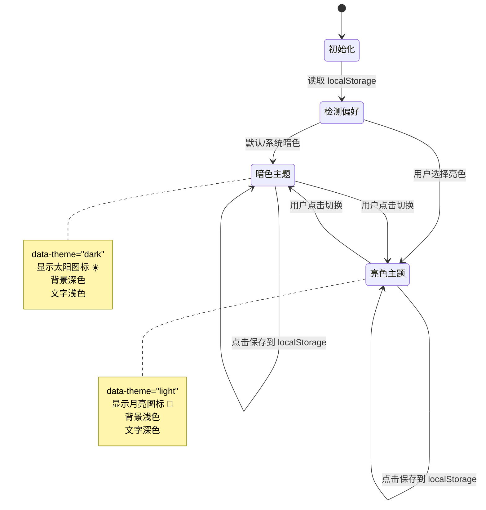
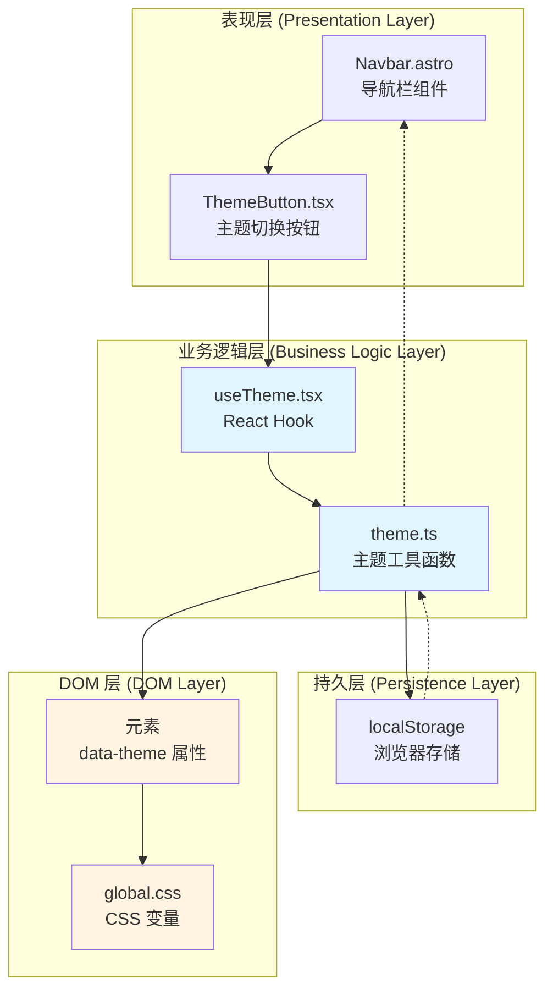
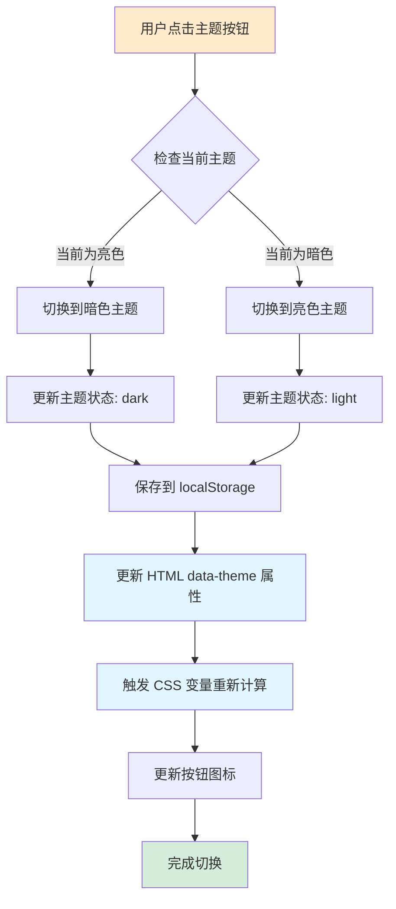
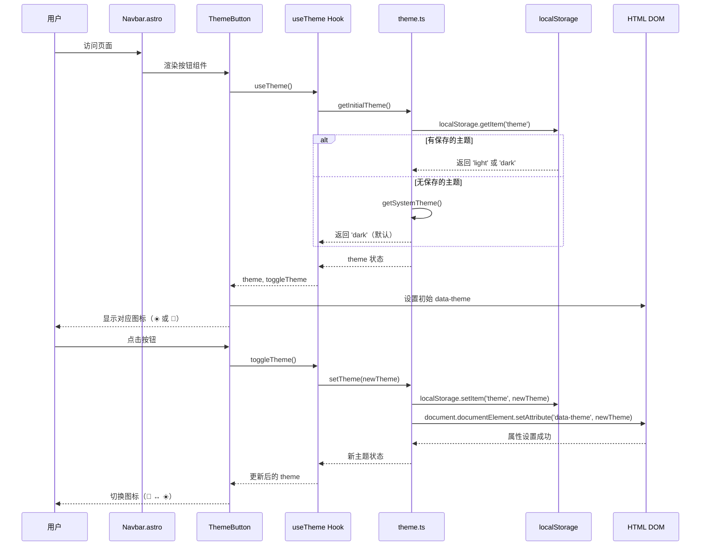

# Change: 为 Hagicode 文档站点添加主题切换功能

## Why

当前 Hagicode 文档站点虽然在 `global.css` 中已定义了暗色主题的 CSS 变量，但缺少主题切换功能，导致：
1. **用户体验受限**：用户无法根据个人偏好或环境光线调整显示模式
2. **现代化标准缺失**：不符合现代 Web 应用的主题切换标准
3. **可访问性不足**：不支持不同光线环境下的阅读需求

## What Changes

### 功能变更
- **新增主题切换机制**：实现亮色/暗色主题之间的动态切换
- **持久化用户偏好**：通过 `localStorage` 保存用户选择的主题
- **系统偏好检测**：优先使用用户选择，其次检测系统主题偏好
- **默认主题设置**：将暗色主题（dark mode）设置为站点默认主题

### UI/UX 变更
- **导航栏集成切换按钮**：在 `Navbar.astro` 组件中添加主题切换按钮
- **图标设计**：使用太阳/月亮图标表示亮色/暗色主题
- **动画效果**：利用 Framer Motion 实现平滑的切换动画
- **响应式布局**：确保在移动端和桌面端均有良好的显示效果

### 技术实现
- **样式系统扩展**：完善 `global.css` 中的亮色和暗色主题 CSS 自定义属性
- **主题控制逻辑**：通过 `<html>` 元素的 `data-theme` 属性控制主题
- **类型安全**：使用 TypeScript 定义主题类型和状态
- **SSR 兼容**：确保在 Astro 的服务端渲染和客户端 hydration 中正确工作
- **性能优化**：仅在需要时加载主题切换脚本，遵循零 JS 默认原则

### 影响范围
- 修改文件：`src/components/Navbar.astro`、`src/styles/global.css`、`src/layouts/Layout.astro`
- 新增文件：主题切换 Hook/工具函数（`src/theme.ts` 或 `src/hooks/useTheme.tsx`）
- 无需新增外部依赖，使用现有的 React 和 Framer Motion
- 与现有的 Astro Content Collections 和 MDX 内容系统完全兼容

## UI 设计变更

### 导航栏主题切换按钮设计

#### 桌面端布局

```
┌──────────────────────────────────────────────────────────────────────┐
│  [☰]  Hagicode Docs    Docs    博客    QQ群    下载    🌙         │
│                                                                        │
│  主题切换按钮位置：在导航栏最右侧                                      │
│  - 默认显示：🌙 月亮图标（当前为亮色主题）                             │
│  - 暗色主题：☀️ 太阳图标（当前为暗色主题）                            │
│  - 悬停效果：图标轻微放大 + 显示 "切换主题" tooltip                    │
│  - 点击效果：直接切换到另一种主题（无下拉菜单）                        │
└──────────────────────────────────────────────────────────────────────┘
```

#### 移动端布局（汉堡菜单展开后）

```
┌─────────────────────────────┐
│  [✕]  Hagicode Docs        │
├─────────────────────────────┤
│  📄 Docs                   │
│  📝 博客                    │
│  👥 QQ群                    │
│  📥 下载安装包              │
│  🐳 Docker Hub             │
│  🔧 Docker Compose 生成器  │
│  ─────────────────────────  │
│  🌙/☀️ 主题切换按钮        │  ← 直接点击切换
└─────────────────────────────┘
```

**交互说明**：
- 移动端也使用相同的按钮，直接点击即可切换主题
- 点击后立即切换并更新图标（🌙 ↔ ☀️）
- 无需展开下拉菜单，交互更简洁

### 主题切换按钮状态设计

#### 正常状态
```
亮色主题时：🌙 (深色图标，白色背景)
暗色主题时：☀️ (浅色图标，透明背景)
```

#### 悬停状态
```
鼠标悬停：图标放大至 1.2 倍 + 显示 "切换主题" tooltip
背景色：rgba(255, 255, 255, 0.1)
```

#### 点击动画
```
1. 当前图标缩小至 0（scale: 0）
2. 新图标从 0 放大至 1（scale: 1）
3. 同时旋转 180 度（rotate: 180deg）
4. 动画时长：300ms（Framer Motion transition）
5. 点击后立即切换主题，无需额外操作
```

### 界面交互流程



### 主题切换状态转换图



## 代码流程变更

### 主题系统架构图



### 主题切换数据流



### 组件交互时序图



### 代码变更清单

| 文件路径 | 变更类型 | 变更原因 | 影响范围 |
|---------|---------|---------|---------|
| `src/layouts/Layout.astro` | 修改 | 在 `<html>` 根元素添加初始主题属性 | 全局主题初始化 |
| `src/components/Navbar.astro` | 修改 | 添加主题切换按钮组件 | 导航栏 UI |
| `src/components/ThemeButton.tsx` | 新增 | 创建 React 主题切换按钮组件 | 交互功能 |
| `src/theme.ts` | 新增 | 实现主题管理工具函数 | 主题核心逻辑 |
| `src/hooks/useTheme.tsx` | 新增 | 提供 React Hook 用于主题状态管理 | React 状态管理 |
| `src/styles/global.css` | 修改 | 完善亮色和暗色主题 CSS 变量 | 全局样式 |

**变更类型说明**：
- **新增**：全新的文件或功能模块
- **修改**：在现有文件中添加或调整功能

### 详细变更

#### 1. `src/layouts/Layout.astro`

| 组件/元素 | 变更前 | 变更后 | 变更原因 |
|----------|-------|-------|---------|
| `<html>` 元素 | `<html lang="zh-CN">` | `<html lang="zh-CN" data-theme="dark">` | 设置默认主题为暗色模式 |
| 初始化脚本 | 无 | 添加内联脚本检测主题偏好 | 防止页面闪烁（FOUC） |

#### 2. `src/components/Navbar.astro`

| 组件/方法 | 变更类型 | 具体变更 | 变更原因 |
|----------|---------|---------|---------|
| 导入语句 | 新增 | `import ThemeButton from './ThemeButton'` | 引入主题切换按钮组件 |
| 导航栏右侧 | 新增 | 在 `<div class="navbar__items">` 中添加 `<ThemeButton />` | 添加主题切换入口 |
| 移动端菜单 | 新增 | 在移动端菜单中添加主题切换选项 | 支持移动端用户切换主题 |

#### 3. `src/components/ThemeButton.tsx`（新文件）

| 组件/属性 | 说明 | 类型 | 默认值 |
|----------|------|------|-------|
| ThemeButton | 主题切换按钮组件 | React.FC | - |
| theme | 当前主题状态 | 'light' \| 'dark' | 'dark' |
| toggleTheme | 切换主题函数 | () => void | - |
| icon | 切换图标 | Motion SVG | - |
| whileHover | 悬停动画 | scale: 1.2 | - |
| whileTap | 点击动画 | scale: 0.9 | - |

#### 4. `src/theme.ts`（新文件）

| 函数/常量 | 说明 | 参数 | 返回值 |
|----------|------|------|-------|
| THEME_KEY | localStorage 键名 | - | 'hagicode-theme' |
| getInitialTheme | 获取初始主题 | - | 'light' \| 'dark' |
| getSystemTheme | 检测系统主题偏好 | - | 'light' \| 'dark' |
| setTheme | 设置主题 | theme: 'light' \| 'dark' | void |
| applyTheme | 应用主题到 DOM | theme: 'light' \| 'dark' | void |

#### 5. `src/hooks/useTheme.tsx`（新文件）

| Hook/属性 | 说明 | 类型 |
|----------|------|------|
| useTheme | 主题管理 Hook | Custom Hook |
| theme | 当前主题状态 | 'light' \| 'dark' |
| toggleTheme | 切换主题函数 | () => void |
| setTheme | 设置主题函数 | (theme: 'light' \| 'dark') => void |

#### 6. `src/styles/global.css`

| CSS 变量/规则 | 变更类型 | 具体变更 | 变更原因 |
|--------------|---------|---------|---------|
| `:root` 亮色主题 | 完善 | 添加缺失的颜色变量 | 确保亮色主题样式完整 |
| `[data-theme='dark']` | 完善 | 添加缺失的颜色变量 | 确保暗色主题样式完整 |
| `--color-background` | 新增 | 背景色变量 | 支持主题切换 |
| `--color-text` | 新增 | 文字颜色变量 | 支持主题切换 |
| `--color-border` | 新增 | 边框颜色变量 | 支持主题切换 |
| 主题过渡动画 | 新增 | `transition: background-color 0.3s, color 0.3s` | 平滑切换效果 |

## 技术实现细节

### 主题初始化逻辑（避免 FOUC）

为防止页面加载时出现闪烁（Flash of Unstyled Content），在 `Layout.astro` 中使用内联脚本：

```typescript
// 在 <head> 中添加
<script is:inline>
  // 优先级：localStorage > 系统偏好 > 默认暗色
  const theme = localStorage.getItem('hagicode-theme') ||
               (window.matchMedia('(prefers-color-scheme: dark)').matches ? 'dark' : 'light');
  document.documentElement.setAttribute('data-theme', theme === 'light' ? 'light' : 'dark');
</script>
```

### TypeScript 类型定义

```typescript
// src/theme.ts
export type Theme = 'light' | 'dark';

export const THEME_KEY = 'hagicode-theme';

export function getInitialTheme(): Theme {
  if (typeof window === 'undefined') return 'dark'; // SSR 默认

  const stored = localStorage.getItem(THEME_KEY);
  if (stored === 'light' || stored === 'dark') return stored;

  return getSystemTheme();
}

export function getSystemTheme(): Theme {
  if (typeof window === 'undefined') return 'dark';
  return window.matchMedia('(prefers-color-scheme: dark)').matches ? 'dark' : 'light';
}

export function setTheme(theme: Theme): void {
  if (typeof window === 'undefined') return;

  localStorage.setItem(THEME_KEY, theme);
  applyTheme(theme);
}

export function applyTheme(theme: Theme): void {
  if (typeof window === 'undefined') return;
  document.documentElement.setAttribute('data-theme', theme);
}
```

### React Hook 实现

```typescript
// src/hooks/useTheme.tsx
import { useState, useEffect } from 'react';
import { getInitialTheme, setTheme, type Theme } from '../theme';

export function useTheme() {
  const [theme, setThemeState] = useState<Theme>(() => getInitialTheme());

  const toggleTheme = () => {
    const newTheme = theme === 'light' ? 'dark' : 'light';
    setThemeState(newTheme);
    setTheme(newTheme);
  };

  useEffect(() => {
    // 监听系统主题变化
    const mediaQuery = window.matchMedia('(prefers-color-scheme: dark)');
    const handleChange = (e: MediaQueryListEvent) => {
      // 仅在用户未手动设置时跟随系统
      if (!localStorage.getItem('hagicode-theme')) {
        setThemeState(e.matches ? 'dark' : 'light');
      }
    };

    mediaQuery.addEventListener('change', handleChange);
    return () => mediaQuery.removeEventListener('change', handleChange);
  }, []);

  return { theme, toggleTheme };
}
```

### Framer Motion 动画配置

```typescript
// 图标切换动画
const iconVariants = {
  light: {
    rotate: 0,
    scale: 1,
    transition: { duration: 0.3, ease: 'easeInOut' }
  },
  dark: {
    rotate: 180,
    scale: 1,
    transition: { duration: 0.3, ease: 'easeInOut' }
  }
};

// 按钮交互动画
const buttonVariants = {
  hover: { scale: 1.1 },
  tap: { scale: 0.95 }
};
```

## 风险与权衡

### 风险评估

| 风险 | 影响 | 缓解措施 |
|------|------|---------|
| FOUC（页面闪烁） | 用户体验差 | 使用内联脚本在 `<head>` 中提前设置主题 |
| localStorage 容量限制 | 低（字符串极小） | 使用简单的键值对，无风险 |
| 浏览器兼容性 | 中等（旧浏览器） | 检测功能支持，提供降级方案 |
| SSR 与客户端 hydration 不一致 | 高 | 在 `Layout.astro` 中正确处理初始化 |
| CSS 变量命名冲突 | 低 | 使用明确的命名前缀（如 `--color-`） |

### 技术权衡

#### 1. 客户端 vs 服务端主题检测
**决策**：优先使用客户端检测 + localStorage 持久化
**原因**：
- 用户偏好是客户端特性
- 避免服务端复杂化
- 支持系统偏好自动切换

**权衡**：首次加载可能有轻微闪烁（已通过内联脚本缓解）

#### 2. React Hook vs 原生 JS 实现
**决策**：使用 React Hook (`useTheme.tsx`)
**原因**：
- 站点已有 React 集成
- 提供更好的类型安全
- 状态管理更清晰

**权衡**：增加少量 JS bundle 大小（可接受）

#### 3. data-theme 属性 vs class 切换
**决策**：使用 `data-theme` 属性
**原因**：
- 语义化更清晰
- 与现有 CSS 代码兼容
- 样式优先级更易控制

**权衡**：无显著差异

#### 4. Framer Motion vs CSS 动画
**决策**：使用 Framer Motion
**原因**：
- 站点已有 Framer Motion 依赖
- 提供更流畅的动画效果
- 声明式 API 更易维护

**权衡**：增加依赖（但已存在）

## 迁移计划

### 实施步骤

1. **准备阶段**
   - 创建 `src/theme.ts` 工具函数文件
   - 创建 `src/hooks/useTheme.tsx` Hook 文件
   - 定义 TypeScript 类型

2. **样式系统**
   - 扩展 `src/styles/global.css` 中的 CSS 变量
   - 添加主题过渡动画
   - 测试两种主题下的样式

3. **组件开发**
   - 创建 `ThemeButton.tsx` 组件
   - 集成到 `Navbar.astro`
   - 实现移动端适配

4. **布局集成**
   - 修改 `Layout.astro` 添加主题初始化脚本
   - 测试 SSR 兼容性
   - 验证无 FOUC

5. **测试验证**
   - 本地开发服务器测试
   - 生产构建验证
   - 类型检查通过
   - 跨浏览器测试

### 回滚策略

如果实施后遇到问题：
1. **快速回滚**：从 `Navbar.astro` 中移除 `ThemeButton` 组件
2. **代码回滚**：删除新增文件，恢复 `Layout.astro` 和 `global.css`
3. **数据清理**：清理 `localStorage` 中的主题数据（可选）

### 测试策略

#### 功能测试
- [ ] 点击主题按钮能正确切换主题
- [ ] 刷新页面后主题选择保持不变
- [ ] 首次访问默认为暗色主题
- [ ] 移动端和桌面端都能正常切换

#### 兼容性测试
- [ ] Chrome/Edge (最新版)
- [ ] Firefox (最新版)
- [ ] Safari (最新版)
- [ ] 移动端浏览器 (iOS Safari, Android Chrome)

#### 性能测试
- [ ] 无页面闪烁（FOUC）
- [ ] 主题切换动画流畅（60fps）
- [ ] 构建产物大小增加 < 5KB

#### 构建验证
- [ ] `npm run typecheck` 无错误
- [ ] `npm run build` 成功
- [ ] `npm run preview` 功能正常

## Impact

### 影响的规格
- **新增规格**：`theme-system` - 主题系统规格

### 影响的代码文件
- `src/layouts/Layout.astro` - 添加主题初始化脚本
- `src/components/Navbar.astro` - 集成主题切换按钮
- `src/styles/global.css` - 完善主题 CSS 变量
- **新增**：`src/components/ThemeButton.tsx` - 主题切换按钮组件
- **新增**：`src/theme.ts` - 主题工具函数
- **新增**：`src/hooks/useTheme.tsx` - 主题管理 Hook

### 用户体验影响
- **正面**：
  - 支持个性化主题选择
  - 提升可访问性（不同光线环境）
  - 符合现代 Web 应用标准

- **风险**：
  - 首次加载可能有轻微闪烁（已缓解）
  - 增加少量 JS bundle 大小（< 5KB）

### 开发流程影响
- 需要在未来的内容创建中考虑两种主题的样式兼容性
- 无需修改现有的 MDX 内容工作流
- 与现有的 OpenSpec 工作流完全兼容

### 后续优化方向（非本次实施）
- [ ] 添加更多主题预设（如高对比度模式）
- [ ] 支持自动切换（跟随系统主题）
- [ ] 添加主题切换快捷键（如 Ctrl/Cmd + Shift + T）
- [ ] 为组件库提供主题切换示例

## 成功标准

### 功能完整性
- ✅ 用户可以通过导航栏按钮切换主题
- ✅ 主题选择在页面刷新后保持不变
- ✅ 首次访问默认为暗色主题
- ✅ 移动端和桌面端均有可用的切换入口

### 技术质量
- ✅ TypeScript 类型检查通过（`npm run typecheck`）
- ✅ 生产构建成功（`npm run build`）
- ✅ 无页面闪烁或样式跳跃
- ✅ 主题切换动画流畅（≥ 60fps）

### 用户体验
- ✅ 主题切换按钮位置直观易找
- ✅ 图标状态清晰（月亮/太阳）
- ✅ 切换动画自然流畅
- ✅ 所有页面内容在两种主题下均可读

### 兼容性
- ✅ 主流桌面浏览器（Chrome, Firefox, Safari, Edge）
- ✅ 移动端浏览器（iOS Safari, Android Chrome）
- ✅ 与现有组件无样式冲突
