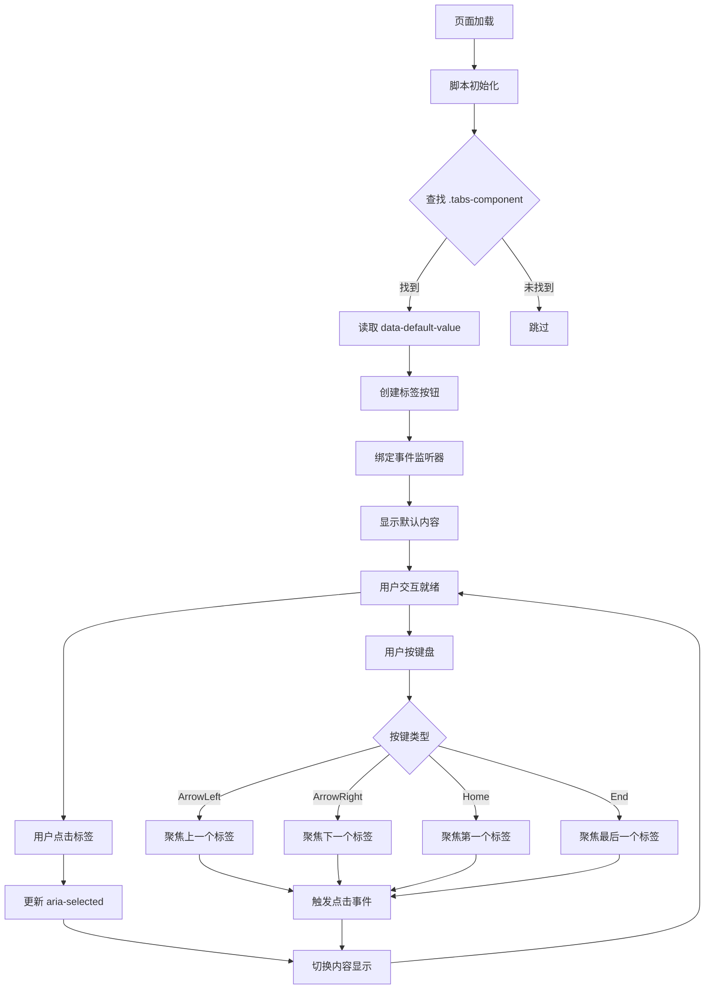
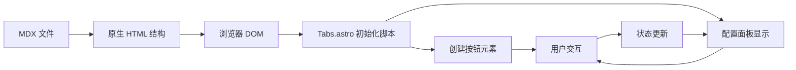
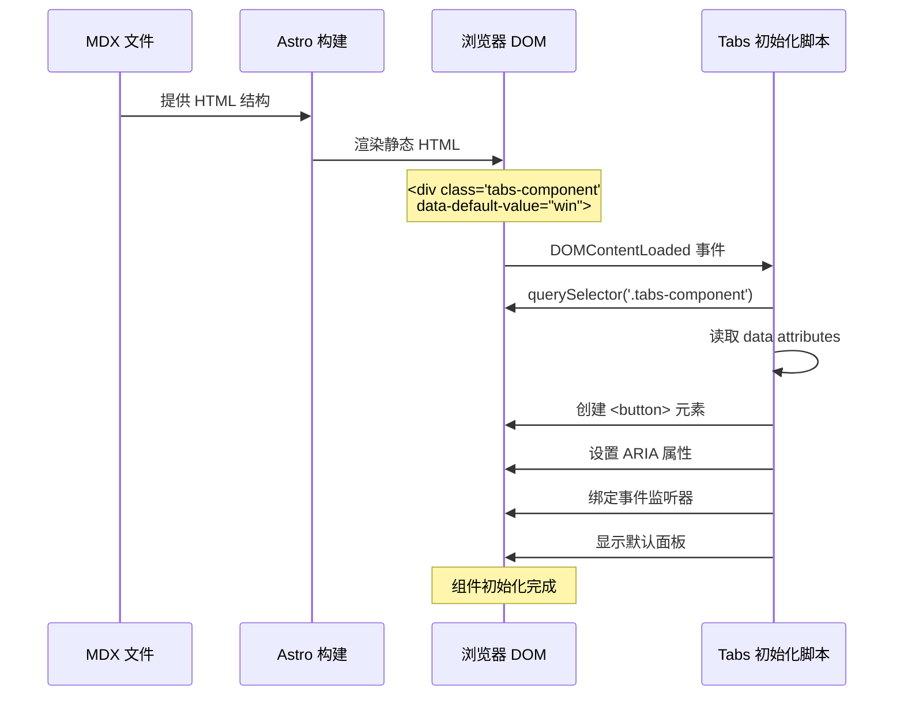

# 修复 Astro 文档 Tabs 组件 - 设计文档

## Context

### 问题背景

文档 `src/content/docs/related-software-installation/openspec/setup-openspec.md` 当前尝试使用 React Tabs 组件（`@/components/Tabs.tsx`），但未正常渲染。

### 关键发现（2026-01-30 更新）

根据 [Astro 官方 MDX 文档](https://docs.astro.build/en/guides/integrations-guide/mdx/#using-components-in-mdx)：

> "After installing the MDX integration, you can **import and use both Astro components and UI framework components** in MDX (`.mdx`) files just as you would use them in any other Astro component.
>
> **Don't forget to include a `client:directive` on your UI framework components, if necessary!**"

**结论**：MDX **完全支持** React 组件，问题出在实现细节，而非技术限制。

### 技术约束

- **框架**: Astro 5.16 + MDX 4.3
- **React 集成**: 已配置 `@astrojs/react`
- **现有资源**:
  - `src/components/Tabs.tsx` - React 实现
  - `src/components/Tabs.astro` - 原生 HTML + JS 实现
- **官方要求**: React 组件在 MDX 中必须添加 `client:` 指令

### 利益相关者

- **文档作者**: 需要简单、可靠的方式在文档中添加跨平台内容
- **最终用户**: 需要清晰的跨平台安装指南，能够轻松切换平台
- **维护者**: 需要可维护、类型安全的解决方案

## Goals / Non-Goals

### Goals

1. **修复渲染问题**: 确保 Tabs 组件在 MDX 文档中正常显示和交互
2. **遵循 Astro 最佳实践**: 使用官方推荐的 React 组件 + `client:` 指令方案
3. **保持用户体验**: 保留现有的键盘导航、无障碍支持和响应式设计
4. **类型安全**: 保持 TypeScript strict 模式通过
5. **快速实施**: 预计 30 分钟 - 1 小时完成（诊断 + 修复）

### Non-Goals

- 不重构 `Tabs.tsx` 组件（仅需验证导出正确）
- 不切换到原生 HTML 方案（仅在 React 方案失败时考虑）
- 不添加新功能（仅修复现有问题）
- 不迁移到 `.astro` 页面（保持 MDX 格式）
- 不使用第三方 UI 库（避免依赖膨胀）

## Decisions

### Decision 1: 优先修复 React 组件集成（推荐）

**选择**: 修复 `Tabs.tsx` 在 MDX 中的集成问题

**原因**:
- **官方支持**: Astro MDX 官方文档明确支持 React 组件
- **符合最佳实践**: 使用 JSX 语法，组件化开发
- **易于维护**: TypeScript 类型安全，IDE 支持
- **文档友好**: 语法简洁，类似标准 React 开发

**技术实现**:

1. **验证组件导出**:
   ```tsx
   // src/components/Tabs.tsx
   export interface TabsProps {
     defaultValue: string;
     children: React.ReactNode;
   }
   export function Tabs({ defaultValue, children }: TabsProps) {
     // ...
   }

   export interface TabItemProps {
     value: string;
     label: string;
     children: React.ReactNode;
   }
   export function TabItem({ value, label, children }: TabItemProps) {
     // ...
   }
   ```

2. **在 MDX 中使用**:
   ```mdx
   ---
   title: 安装 OpenSpec
   ---

   import { Tabs, TabItem } from '@/components/Tabs';

   <Tabs client:load defaultValue="win">
     <TabItem value="win" label="Windows">
       Windows 内容
     </TabItem>
     <TabItem value="mac" data-label="macOS">
       macOS 内容
     </TabItem>
   </Tabs>
   ```

3. **验证步骤**:
   - [ ] 确认 `@astrojs/react` 已在 `astro.config.mjs` 中配置
   - [ ] 检查 `Tabs.tsx` 使用 named export（非 default export）
   - [ ] 在 MDX 中添加 `client:load` 指令
   - [ ] 浏览器控制台检查是否有水合错误
   - [ ] 验证组件交互功能（点击、键盘导航）

**替代方案**: 如果 React 方案无法工作，使用原生 HTML 结构（见 Decision 2）

### Decision 2: 备选方案 - 使用原生 HTML 结构

**选择**: 如果 React 方案失败，使用原生 HTML + `Tabs.astro` 初始化脚本

**原因**:
- **零依赖**: 不依赖 React 水合，100% 可靠
- **已验证**: `Tabs.astro` 中的初始化脚本已完整实现
- **回退方案**: 作为 React 方案的备选

**技术实现**:

```mdx
<div class="tabs-component" data-default-value="win">
  <div>
    <div data-value="win" data-label="Windows"></div>
    <div data-value="mac" data-label="macOS"></div>
    <div data-value="linux" data-label="Linux"></div>
  </div>
  <div>
    <div data-value="win">
      Windows 内容
    </div>
    <div data-value="mac">
      macOS 内容
    </div>
    <div data-value="linux">
      Linux 内容
    </div>
  </div>
</div>
```

**何时使用**:
- React 组件在 MDX 中持续报错
- 组件水合失败无法修复
- 需要零 JavaScript 依赖（静态优先）

## UI/UX Design

### 组件结构

```
┌─────────────────────────────────────────────┐
│ tabs-component                              │
│ ├─ tabs-header (role="tablist")            │
│ │  ├─ tab-button (role="tab")              │ ← Windows
│ │  ├─ tab-button (role="tab")              │ ← macOS
│ │  └─ tab-button (role="tab")              │ ← Linux
│ └─ tabs-content                             │
│    ├─ tab-panel (role="tabpanel")          │ ← Windows 内容
│    ├─ tab-panel (role="tabpanel", hidden)  │ ← macOS 内容
│    └─ tab-panel (role="tabpanel", hidden)  │ ← Linux 内容
└─────────────────────────────────────────────┘
```

### 视觉规范

**标签按钮（未选中）**:
- 背景: `transparent`
- 文字颜色: `var(--color-text)`
- 边框: `border-bottom: 2px solid transparent`
- 内边距: `0.75rem 1.25rem`
- 最小高度: `44px` (触摸友好)

**标签按钮（选中）**:
- 文字颜色: `var(--ifm-color-primary)`
- 边框: `border-bottom-color: var(--ifm-color-primary)`
- 背景: `var(--color-background)`
- ARIA: `aria-selected="true"`

**标签按钮（悬停）**:
- 背景: `var(--color-surface-hover)`
- 文字颜色: `var(--ifm-color-primary)`

**内容面板**:
- 内边距: `1.25rem`
- 动画: `fadeIn 0.2s ease-in-out`
- 暗色模式: 自动适配

### 用户交互流程



### 错误处理

**场景 1: data-default-value 缺失**
- 回退到 `'win'`
- 记录警告到控制台

**场景 2: data-value 与内容不匹配**
- 跳过该标签
- 继续初始化其他标签

**场景 3: JavaScript 加载失败**
- 所有内容可见（fallback 行为）
- 标签按钮不可见（优雅降级）

### 响应式设计

**桌面 (> 768px)**:
- 标签按钮水平排列
- 完整内边距: `0.75rem 1.25rem`
- 最小宽度: `80px`

**移动端 (< 768px)**:
- 标签按钮水平滚动（overflow-x: auto）
- 减少内边距: `0.625rem 1rem`
- 减少字体: `0.875rem`
- 最小宽度: `70px`
- 自定义滚动条样式

**暗色模式**:
- 使用 `[data-theme='dark']` 选择器
- 所有颜色变量自动切换
- 无额外逻辑

## Technical Design

### 数据流



### 组件初始化流程



### 事件处理

```javascript
// 核心事件绑定逻辑
buttons.forEach(btn => {
  // 点击事件
  btn.addEventListener('click', () => {
    setActiveTab(btn.dataset.value);
  });
});

headersContainer.addEventListener('keydown', (e) => {
  switch (e.key) {
    case 'ArrowLeft':
      // 聚焦上一个标签并触发点击
      break;
    case 'ArrowRight':
      // 聚焦下一个标签并触发点击
      break;
    case 'Home':
      // 聚焦第一个标签
      break;
    case 'End':
      // 聚焦最后一个标签
      break;
  }
});
```

### 性能考虑

**构建时**:
- MDX 编译为静态 HTML
- 零 JavaScript 水合开销（除了初始化脚本）

**运行时**:
- 初始化脚本: ~50 行代码
- 内存占用: 每个组件 < 1KB
- 事件监听器: 按需绑定（仅在存在 `.tabs-component` 时）

**优化点**:
- 使用事件委托（keydown 监听在容器上）
- CSS 动画使用 `transform`（GPU 加速）
- 减少动画偏好检测（`prefers-reduced-motion`）

## Risks / Trade-offs

### 风险

| 风险 | 概率 | 影响 | 缓解措施 |
|------|------|------|----------|
| MDX 语法冗长，降低可维护性 | 中 | 低 | 创建代码片段模板；提供使用文档 |
| 作者忘记使用正确的 HTML 结构 | 高 | 中 | 在代码审查中检查；提供 lint 规则 |
| 现有文档使用不同格式 | 低 | 中 | 全局搜索确认；一次性迁移 |
| 移动端滚动条样式不一致 | 低 | 低 | 使用 `-webkit-scrollbar` 自定义样式 |

### 权衡

**简洁性 vs 可靠性**:
- **选择**: 可靠性优先（原生 HTML）
- **原因**: 组件不工作的代价大于语法冗长

**开发体验 vs 用户体验**:
- **选择**: 用户体验优先
- **原因**: 用户无法切换平台是严重问题

**短期修复 vs 长期重构**:
- **选择**: 短期修复（1-2 小时）
- **原因**: 长期方案（转换为 .astro 页面）成本过高，且当前方案已足够

## Migration Plan

### 步骤

**1. 全局搜索受影响的文档** (5 分钟)
```bash
grep -r "import.*Tabs.*from.*@/components" src/content/docs/
```

**2. 备份现有文件** (2 分钟)
```bash
git checkout -b backup-tabs-fix
git commit -am "备份: Tabs 组件修复前的状态"
```

**3. 更新 setup-openspec.md** (20 分钟)
- 移除 `import` 语句
- 将 `<Tabs>` 和 `<TabItem>` 替换为原生 HTML 结构
- 验证 data 属性正确

**4. 测试本地开发** (10 分钟)
```bash
npm run dev
# 访问 http://localhost:4321/site/docs/related-software-installation/openspec/setup-openspec
# 验证: 标签可见、可点击、键盘导航正常
```

**5. 测试构建** (5 分钟)
```bash
npm run build
npm run preview
# 验证: 生产环境构建成功、功能正常
```

**6. 类型检查** (2 分钟)
```bash
npm run typecheck
# 验证: 无 TypeScript 错误
```

**7. 提交变更** (3 分钟)
```bash
git add .
git commit -m "fix: 修复 setup-openspec.md 中的 Tabs 组件渲染"
```

**8. 验证其他文档** (10 分钟)
- 如果搜索发现其他文件使用 Tabs，重复步骤 3-6

### 回滚计划

**如果修复失败**:
```bash
git revert HEAD
# 或者
git reset --hard HEAD~1
```

**如果构建失败**:
- 检查 HTML 结构是否正确
- 确认 data 属性无拼写错误
- 验证所有 `<div>` 标签闭合

**如果功能异常**:
- 使用浏览器开发者工具检查控制台错误
- 验证 `Tabs.astro` 脚本是否加载
- 检查 CSS 样式是否冲突

## Open Questions

1. **是否需要为作者提供 MDX 片段模板？**
   - **建议**: 是，可以创建 `.vscode/snippets/mdx.json` 或在文档中提供代码模板

2. **是否需要添加 ESLint 规则检测 React 组件导入？**
   - **建议**: 否，当前只有少数文档使用 Tabs，手动审查足够

3. **是否需要迁移其他文档中的 Tabs？**
   - **待定**: 需要全局搜索确认（见 Migration Plan 步骤 1）

4. **是否需要在 `Tabs.astro` 中添加错误处理日志？**
   - **建议**: 是，添加开发模式下的 console.warn 帮助调试

5. **data-default-value 是否应该统一为 'win'？**
   - **建议**: 是，除非文档有特殊需求（如 macOS 主导的项目）

---

**文档版本**: 1.0
**最后更新**: 2026-01-30
**状态**: 待审核
