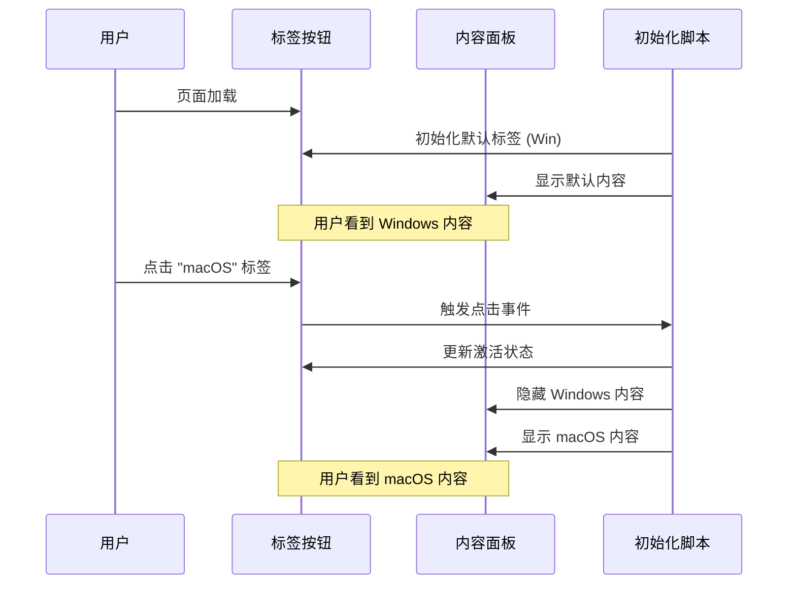
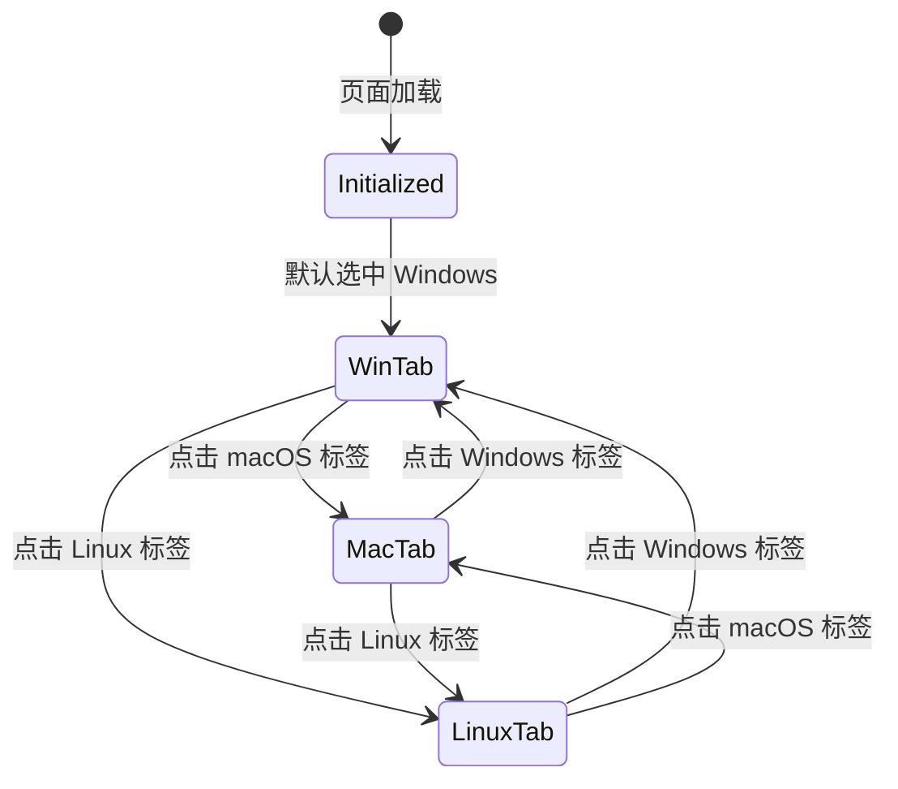

# Change: 修复 Astro 文档中的 Tabs 组件渲染问题

## Why

当前文档 `src/content/docs/related-software-installation/openspec/setup-openspec.md` 中使用的 React Tabs 组件 (`@/components/Tabs`) 在 Astro + MDX 环境中无法正常渲染，导致用户无法在不同平台的安装说明之间切换。这影响了文档的可用性和用户体验。

## What Changes

**核心问题诊断**：
- 根据 [Astro 官方 MDX 文档](https://docs.astro.build/en/guides/integrations-guide/mdx/)，MDX **完全支持** React 组件
- 当前文档使用 `import { Tabs, TabItem } from '@/components/Tabs'` 导入 **React 组件** (`Tabs.tsx`)
- 问题可能出在：
  1. 缺少 `client:` 指令（如 `client:load`）导致 React 组件未水合
  2. 组件导出路径不正确
  3. 组件实现存在运行时错误

**推荐方案（优先级从高到低）**：

### 方案 A：修复 React 组件集成（推荐）
**原因**：符合 Astro 官方推荐，语法简洁，易于维护

**实施步骤**：
1. 确保 `src/components/Tabs.tsx` 正确导出组件：
   ```tsx
   export interface TabsProps { ... }
   export function Tabs({ ... }: TabsProps) { ... }
   export interface TabItemProps { ... }
   export function TabItem({ ... }: TabItemProps) { ... }
   ```

2. 在 MDX 中添加 `client:load` 指令：
   ```mdx
   ---
   title: 安装 OpenSpec
   ---

   import { Tabs, TabItem } from '@/components/Tabs';

   <Tabs client:load>
     <TabItem value="win" label="Windows">
       Windows 内容
     </TabItem>
   </Tabs>
   ```

3. 验证 `@astrojs/react` 集成已配置

**优点**：
- ✅ 符合 Astro 最佳实践
- ✅ 语法简洁，类似 JSX
- ✅ TypeScript 类型安全
- ✅ 易于文档作者理解

**缺点**：
- ⚠️ 需要客户端 JavaScript（约 2-5 KB）
- ⚠️ 首次渲染可能有轻微延迟

### 方案 B：使用原生 HTML 结构（备选）
**原因**：零 JavaScript 依赖，100% 静态

**实施步骤**：
1. 移除 React 组件导入
2. 使用原生 HTML 结构配合 `data-*` 属性
3. 依赖 `src/components/Tabs.astro` 中的初始化脚本

**示例**：
```html
<div class="tabs-component" data-default-value="win">
  <div>
    <div data-value="win" data-label="Windows"></div>
    <div data-value="mac" data-label="macOS"></div>
  </div>
  <div>
    <div data-value="win">Windows 内容</div>
    <div data-value="mac">macOS 内容</div>
  </div>
</div>
```

**优点**：
- ✅ 零依赖，100% 可靠
- ✅ SEO 友好（静态 HTML）

**缺点**：
- ❌ 语法冗长，降低可维护性
- ❌ 丧失 TypeScript 类型检查
- ❌ 不符合现代组件化开发模式

**技术细节**：
- 确保 `Tabs.tsx` 使用正确的导出语法（named export）
- 验证 `client:load` 指令在 MDX 中有效
- 检查浏览器控制台是否有水合错误
- 备选方案使用现有的 `Tabs.astro` 初始化脚本

## UI Design Changes

### 当前状态（损坏）

```
┌─────────────────────────────────────┐
│ 安装 OpenSpec                        │
├─────────────────────────────────────┤
│ [Tabs 组件未渲染 - 无标签按钮]        │
│                                      │
│ 所有平台内容堆叠显示，无法切换         │
└─────────────────────────────────────┘
```

### 目标状态（修复后）

```
┌─────────────────────────────────────┐
│ 安装 OpenSpec                        │
├─────────────────────────────────────┤
│ ┌─────┬──────┬──────┐               │
│ │Win  │ macOS │ Linux│  ← 标签按钮   │
│ └─────┴──────┴──────┘               │
│ ┌─────────────────────────────────┐ │
│ │ Windows 安装内容...              │ │
│ └─────────────────────────────────┘ │
└─────────────────────────────────────┘
```

### 用户交互流程



### 状态转换图



## Impact

**影响的规范**：
- `specs/astro-site/spec.md` - 修改 "Cross-Platform Content Organization" 需求，明确使用原生 HTML 结构而非 React 组件

**影响的代码**：
- `src/content/docs/related-software-installation/openspec/setup-openspec.md` - 更新 Tabs 组件使用方式
- 可能影响其他使用 Tabs 组件的文档（需要全局搜索确认）

**不影响**：
- `src/components/Tabs.astro` - 保持不变（已有完整的样式和脚本）
- `src/components/TabItem.astro` - 保持不变
- `src/styles/global.css` - 无需修改
- 其他文档页面
- 构建配置

**兼容性**：
- 兼容现有的暗色主题
- 兼容移动端响应式布局
- 保持键盘导航和无障碍功能
- 无需添加新的依赖

**验证标准**：
- [ ] Tabs 组件在 `setup-openspec.md` 中正确渲染
- [ ] 点击标签可以切换内容
- [ ] 键盘导航功能正常（ArrowLeft/ArrowRight/Home/End）
- [ ] 暗色模式下样式正确
- [ ] 移动端响应式表现良好
- [ ] 通过 `npm run build` 构建无错误
- [ ] 通过 `npm run typecheck` 类型检查无错误
