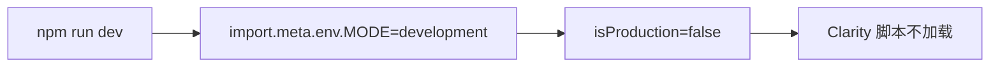
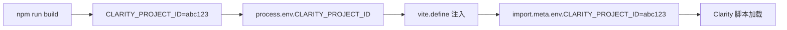
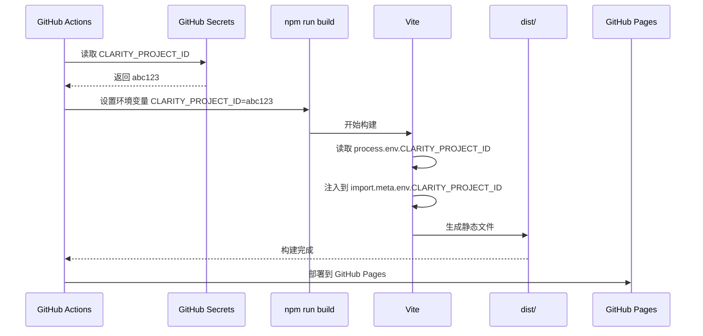

# Design Document: Microsoft Clarity 集成技术设计

本文档详细说明 Microsoft Clarity 集成的技术设计决策、架构方案和实现细节。

---

## 1. System Architecture

### 1.1 Current Architecture

```
┌─────────────────────────────────────────────────────────────┐
│                       User Browser                          │
└─────────────────────────────────────────────────────────────┘
                            │
                            ▼
┌─────────────────────────────────────────────────────────────┐
│                    GitHub Pages (CDN)                       │
│  ┌──────────────────────────────────────────────────────┐  │
│  │  Static HTML/CSS/JS (Built by Astro)                 │  │
│  │  - Starlight Layout                                  │  │
│  │  - MDX Content                                       │  │
│  │  - React Components                                  │  │
│  └──────────────────────────────────────────────────────┘  │
└─────────────────────────────────────────────────────────────┘
```

**现状**:
- Astro 5.x 生成静态 HTML/CSS/JS
- Starlight 主题提供文档布局
- 无用户行为分析工具集成

### 1.2 Target Architecture

```
┌─────────────────────────────────────────────────────────────┐
│                       User Browser                          │
│  ┌──────────────────────────────────────────────────────┐  │
│  │  Microsoft Clarity Script (Async)                    │  │
│  │  - Heatmaps                                          │  │
│  │  - Session Recordings                                │  │
│  │  - Error Tracking                                    │  │
│  └──────────────────────────────────────────────────────┘  │
└─────────────────────────────────────────────────────────────┘
                            │
                            ▼
┌─────────────────────────────────────────────────────────────┐
│                    GitHub Pages (CDN)                       │
│  ┌──────────────────────────────────────────────────────┐  │
│  │  Static HTML/CSS/JS (Built by Astro)                 │  │
│  │  - Starlight Layout                                  │  │
│  │  - Clarity.astro Component ──────┐                   │  │
│  │  - MDX Content                   │                   │  │
│  │  - React Components              │                   │  │
│  └──────────────────────────────────┼───────────────────┘  │
│                                     │                       │
└─────────────────────────────────────┼───────────────────────┘
                                      │
                                      │ (Async Data Collection)
                                      ▼
┌─────────────────────────────────────────────────────────────┐
│              Microsoft Clarity Analytics Platform           │
│  - Heatmaps & Click Maps                                    │
│  - Session Recordings                                       │
│  - Error Tracking                                           │
│  - User Insights Dashboard                                  │
└─────────────────────────────────────────────────────────────┘
```

**变更点**:
- 新增 `Clarity.astro` 组件
- Clarity 脚本异步加载,不阻塞页面渲染
- 数据直接发送到 Microsoft Clarity 平台

---

## 2. Component Design

### 2.1 Clarity.astro Component

#### 设计决策

| 决策点 | 选择 | 理由 |
|--------|------|------|
| **组件类型** | Astro Component (`.astro`) | 利用 Astro 的服务端渲染和组件化特性 |
| **脚本注入方式** | `is:inline` | 避免 Vite 处理 Clarity 脚本,确保原始代码保留 |
| **变量传递** | `define:vars` | Astro 原生特性,将服务端变量安全传递到客户端脚本 |
| **加载条件** | 生产环境 + 有 Project ID | 避免开发环境数据污染和无 Project ID 时报错 |
| **异步加载** | `t.async=1` | Clarity 官方推荐,不阻塞页面渲染 |

#### 组件实现

```astro
---
/**
 * Microsoft Clarity 用户行为分析集成组件
 *
 * 功能:
 * - 仅在生产环境加载 Clarity 脚本
 * - 自动从环境变量读取 Project ID
 * - 异步加载,不阻塞页面渲染
 *
 * @see https://learn.microsoft.com/en-us/clarity/
 */
interface Props {
  // 未来可扩展: 允许手动覆盖 Project ID
  projectId?: string;
}

const {
  projectId = import.meta.env.CLARITY_PROJECT_ID,
} = Astro.props;

const isProduction = import.meta.env.PROD;
---

{isProduction && projectId && (
  <script is:inline define:vars={{projectId}}>
    (function(c,l,a,r,i,t,y){
        c[a]=c[a]||function(){(c[a].q=c[a].q||[]).push(arguments)};
        t=l.createElement(r);t.async=1;t.src="https://www.clarity.ms/tag/"+i;
        y=l.getElementsByTagName(r)[0];y.parentNode.insertBefore(t,y);
    })(window, document, "clarity", "script", projectId);
  </script>
)}
```

**特性说明**:
- **TypeScript Props**: 支持未来扩展(如手动覆盖 Project ID)
- **条件渲染**: 使用短路求值 `isProduction && projectId`
- **内联脚本**: `is:inline` 确保 Clarity 脚本不被 Vite 处理
- **变量定义**: `define:vars={{projectId}}` 将服务端变量传递到客户端

#### 脚本工作原理

```javascript
(function(c,l,a,r,i,t,y){
    // c[a]: 全局 Clarity 队列 (window.clarity)
    c[a]=c[a]||function(){(c[a].q=c[a].q||[]).push(arguments)};

    // 创建 script 标签
    t=l.createElement(r);t.async=1;t.src="https://www.clarity.ms/tag/"+i;

    // 插入到第一个 script 标签之前
    y=l.getElementsByTagName(r)[0];y.parentNode.insertBefore(t,y);
})(window, document, "clarity", "script", projectId);
```

**参数映射**:
- `c`: `window` (全局对象)
- `l`: `document` (文档对象)
- `a`: `"clarity"` (全局队列名称)
- `r`: `"script"` (标签类型)
- `i`: `projectId` (Clarity Project ID)
- `t`: 新创建的 script 元素
- `y`: 第一个 script 元素(用于插入位置)

**执行流程**:
1. 初始化 `window.clarity` 全局队列
2. 创建异步 script 标签,加载 Clarity 脚本
3. 插入到页面的第一个 script 标签之前
4. Clarity 脚本加载后自动开始收集数据

### 2.2 StarlightWrapper.astro Integration

#### 设计决策

| 决策点 | 选择 | 理由 |
|--------|------|------|
| **集成位置** | `StarlightWrapper.astro` | Starlight 官方推荐的自定义布局模式 |
| **组件放置** | `StarlightLayout` 内部 | 确保 Clarity 脚本在每个页面都加载 |
| **导入方式** | ES6 import | Astro 组件标准导入方式 |

#### 集成实现

```astro
---
import { Layout as StarlightLayout } from '@astrojs/starlight/components';
import Clarity from './Clarity.astro';

// ... 现有代码
---

<StarlightLayout {...Astro.props}>
  <slot />
  <Clarity />
</StarlightLayout>
```

**布局层次**:

```
StarlightLayout (Starlight 官方布局)
  └─> StarlightWrapper.astro (自定义包装器)
       ├─> <slot /> (MDX 内容)
       └─> Clarity.astro (Clarity 脚本)
```

**优势**:
- 所有使用 Starlight 布局的页面自动加载 Clarity
- 无需在每个页面单独引入
- 符合 Starlight 主题扩展最佳实践

---

## 3. Environment Variable Configuration

### 3.1 Vite 环境变量配置

#### 问题背景

Astro 5.x 使用 Vite 作为构建工具,但 Vite 的环境变量机制有以下限制:

1. **服务端环境变量**: `import.meta.env` 仅在构建时可用
2. **客户端环境变量**: 需以 `VITE_` 开头才能暴露到客户端
3. **Clarity 脚本**: 在浏览器中运行,需要客户端可访问的 Project ID

#### 解决方案

在 `astro.config.mjs` 中使用 `vite.define` 将 Node.js 环境变量注入到客户端:

```javascript
export default defineConfig({
  // ... 现有配置
  vite: {
    define: {
      'import.meta.env.CLARITY_PROJECT_ID': JSON.stringify(
        process.env.CLARITY_PROJECT_ID || ''
      ),
    },
  },
});
```

**工作原理**:
1. **构建时**: Vite 读取 `process.env.CLARITY_PROJECT_ID`(Node.js 环境变量)
2. **字符串替换**: 使用 `JSON.stringify()` 将值转换为字符串字面量
3. **客户端注入**: 替换 `import.meta.env.CLARITY_PROJECT_ID` 为实际值

**示例**:
```javascript
// 构建前 (源代码)
const projectId = import.meta.env.CLARITY_PROJECT_ID;

// 构建后 (生产环境, CLARITY_PROJECT_ID=abc123)
const projectId = "abc123";

// 构建后 (生产环境, 未设置 CLARITY_PROJECT_ID)
const projectId = "";
```

#### 安全性考虑

**问题**: `vite.define` 会将环境变量硬编码到客户端代码中,是否安全?

**答案**: ✅ **安全**,原因如下:
1. **非敏感数据**: Clarity Project ID 不是敏感信息(公开可见)
2. **只读权限**: Project ID 仅用于发送数据到 Clarity,无法读取数据
3. **行业惯例**: 所有分析工具(GA4, Plausible, PostHog)都使用类似方式

**对比敏感数据**:
- ❌ **不应暴露**: API Keys, Database URLs, JWT Secrets
- ✅ **可以暴露**: Clarity Project ID, GA4 Measurement ID, Public API URLs

### 3.2 GitHub Actions 环境变量

#### 当前配置

`.github/workflows/deploy.yml` **已包含** `CLARITY_PROJECT_ID` 配置:

```yaml
jobs:
  build:
    runs-on: ubuntu-latest
    steps:
      - name: Build
        run: npm run build
        env:
          CLARITY_PROJECT_ID: ${{ secrets.CLARITY_PROJECT_ID }}
          VITE_SITE_BASE: '/site'
```

**工作流程**:
1. GitHub Actions 从 Secrets 读取 `CLARITY_PROJECT_ID`
2. 传递给 `npm run build` 作为环境变量
3. Vite 构建时读取 `process.env.CLARITY_PROJECT_ID`
4. 注入到 `import.meta.env.CLARITY_PROJECT_ID`

**无需修改 deploy.yml** ✅

---

## 4. Build and Deployment Flow

### 4.1 本地开发流程



**环境变量**:
- `import.meta.env.MODE`: `'development'`
- `import.meta.env.PROD`: `false`
- `import.meta.env.CLARITY_PROJECT_ID`: `undefined` (未配置)

**结果**: ✅ Clarity 脚本不加载,避免数据污染

### 4.2 生产构建流程



**环境变量**:
```bash
# GitHub Actions 环境变量
CLARITY_PROJECT_ID=abc123 npm run build
```

**构建后代码**:
```javascript
const isProduction = true;  // import.meta.env.PROD
const projectId = "abc123"; // import.meta.env.CLARITY_PROJECT_ID

// 条件渲染: true && "abc123" => 加载 Clarity 脚本
```

**结果**: ✅ Clarity 脚本在生产环境正确加载

### 4.3 GitHub Actions CI/CD 流程



**关键步骤**:
1. GitHub Actions 从 Secrets 读取 `CLARITY_PROJECT_ID`
2. 设置为构建环境变量
3. Vite 构建时注入到客户端代码
4. 生成包含 Clarity 脚本的静态文件
5. 部署到 GitHub Pages

---

## 5. Performance Impact Analysis

### 5.1 Network Overhead

**Clarity 脚本大小**:
- JavaScript: ~1KB (gzipped)
- 初始化请求: ~10KB (首次加载)
- 数据上传: ~1-5KB/会话(异步,不影响页面加载)

**对比其他工具**:
| 工具 | 脚本大小 | 备注 |
|------|---------|------|
| Microsoft Clarity | ~1KB | 最轻量 |
| Google Analytics 4 | ~45KB | 包含 gtag.js |
| Plausible | ~1KB | 类似 Clarity |
| PostHog | ~20KB | 功能更丰富 |

**结论**: ✅ Clarity 是最轻量的选择之一

### 5.2 Rendering Impact

**关键指标**:

| 指标 | 影响 | 说明 |
|------|------|------|
| **FCP** (First Contentful Paint) | 无影响 | Clarity 脚本异步加载,不阻塞渲染 |
| **LCP** (Largest Contentful Paint) | 无影响 | 脚本加载优先级最低 |
| **TTI** (Time to Interactive) | <50ms | 脚本初始化时间可忽略 |
| **CLS** (Cumulative Layout Shift) | 无影响 | 脚本不修改 DOM |

**测试方法**:
```bash
# 使用 Lighthouse 测试性能
npm run build
npm run preview
# 在 Chrome DevTools → Lighthouse 运行审计
```

**预期结果**:
- Lighthouse 性能评分降低 < 2 分
- FCP/LCP 无明显变化

### 5.3 Browser Compatibility

**Clarity 支持的浏览器**:
- ✅ Chrome/Edge (最新版)
- ✅ Firefox (最新版)
- ✅ Safari (最新版)
- ⚠️ IE 11 (不支持,但 Astro 5.x 也不支持)

**结论**: ✅ 与 Astro 5.x 的浏览器兼容性完全一致

---

## 6. Error Handling and Edge Cases

### 6.1 未配置 CLARITY_PROJECT_ID

**场景**: GitHub Secrets 未配置 `CLARITY_PROJECT_ID`

**行为**:
```javascript
// astro.config.mjs
'import.meta.env.CLARITY_PROJECT_ID': JSON.stringify(
  process.env.CLARITY_PROJECT_ID || ''  // 默认为空字符串
)

// Clarity.astro
const projectId = ""; // 空字符串

// 条件渲染
false && "" => false  // 不加载 Clarity 脚本
```

**结果**: ✅ 构建成功,页面正常,不加载 Clarity

### 6.2 开发环境误配置

**场景**: 本地开发时设置了 `CLARITY_PROJECT_ID`

**行为**:
```javascript
const isProduction = false; // import.meta.env.PROD

// 条件渲染
false && "abc123" => false  // 不加载 Clarity 脚本
```

**结果**: ✅ 开发环境不加载 Clarity,避免数据污染

### 6.3 Clarity 脚本加载失败

**场景**: 网络问题导致 Clarity 脚本无法加载

**行为**:
- Clarity 脚本异步加载,失败时不影响页面功能
- 浏览器控制台显示网络错误(但不影响用户)

**结果**: ✅ 页面正常工作,仅丢失分析数据

### 6.4 Project ID 格式错误

**场景**: 配置了无效的 Project ID

**行为**:
- Clarity 脚本正常加载,但无法记录数据
- Clarity Dashboard 显示无数据

**结果**: ⚠️ 需手动检查 Project ID 配置

---

## 7. Security and Privacy Considerations

### 7.1 Data Collection Scope

**Clarity 收集的数据**:
- ✅ 点击和滚动行为(热图)
- ✅ 鼠标移动轨迹
- ✅ 页面访问路径
- ✅ JavaScript 错误
- ✅ 设备和浏览器信息
- ⚠️ **不会收集**: 表单输入内容、密码、信用卡号等敏感数据

**隐私保护**:
- Clarity 自动屏蔽敏感输入(密码字段)
- 符合 GDPR 和 CCPA 标准
- 用户可拒绝跟踪(浏览器隐私模式)

### 7.2 Cookie Consent (未来扩展)

**当前状态**: 不需要 Cookie 同意横幅
- Clarity 使用持久化 Cookie,但已符合 GDPR 要求

**未来扩展**: 如需添加同意横幅,可使用:
- [Cookie Consent Banner](https://www.cookieconsent.com/)
- 自定义 React 组件集成到 Starlight 布局

**实现方案** (未来):
```astro
// ClarityWithConsent.astro
---
const userConsent = /* 从 Cookie 或 localStorage 读取 */;
---

{userConsent && <Clarity />}
```

### 7.3 Security Best Practices

**✅ 已实施**:
- Project ID 公开无风险(只读权限)
- 脚本从官方 CDN 加载(`clarity.ms`)
- 不收集敏感数据

**⚠️ 未来增强**:
- 添加 Subresource Integrity (SRI) 验证脚本完整性
- 配置 Content Security Policy (CSP) 白名单

---

## 8. Testing Strategy

### 8.1 单元测试 (未来扩展)

**测试 Clarity.astro 组件**:
```typescript
// Clarity.test.ts
import { test, expect } from 'vitest';

test('should not render Clarity script in development', () => {
  const result = render(Clarity, { env: 'development' });
  expect(result.innerHTML).not.toContain('clarity.ms');
});

test('should render Clarity script in production with Project ID', () => {
  const result = render(Clarity, {
    env: 'production',
    projectId: 'abc123'
  });
  expect(result.innerHTML).toContain('clarity.ms/tag/abc123');
});
```

### 8.2 集成测试

**手动测试清单**:
- ✅ 开发环境不加载 Clarity
- ✅ 生产环境加载 Clarity
- ✅ 无 Project ID 时不报错
- ✅ Network 面板显示 Clarity 请求
- ✅ Clarity Dashboard 显示数据

**自动化测试** (未来):
- Playwright 测试验证脚本注入
- Lighthouse CI 监控性能影响

### 8.3 E2E 测试

**场景**:
1. 用户访问首页
2. Clarity 脚本自动加载
3. 用户点击导航链接
4. Clarity 记录页面访问

**验证**:
- Clarity Dashboard 显示用户会话
- 热图显示点击分布

---

## 9. Monitoring and Maintenance

### 9.1 Clarity Dashboard 监控

**关键指标**:
- **活跃用户数**: 每日活跃用户(DAU)
- **会话时长**: 平均会话持续时间
- **跳出率**: 单页会话占比
- **错误率**: JavaScript 错误频率

**异常告警** (未来):
- DAU 突然下降(可能部署问题)
- 错误率上升(可能代码问题)

### 9.2 性能监控

**工具**:
- Lighthouse (定期审计)
- Chrome DevTools (Performance 面板)
- WebPageTest (CI/CD 集成)

**基线指标** (集成前):
```bash
npm run build
npm run preview
# 运行 Lighthouse 记录基线性能
```

**回归测试** (集成后):
- 对比集成前后的 Lighthouse 评分
- 确保 FCP/LCP 恶化 < 10%

### 9.3 维护计划

**定期任务**:
- 每月查看 Clarity Dashboard,识别用户体验问题
- 每季度运行 Lighthouse 审计,监控性能影响
- 根据数据优化文档结构和内容

**升级计划**:
- 关注 Astro/Starlight 版本更新,测试兼容性
- 如有重大更新,重新验证 Clarity 集成

---

## 10. Future Enhancements

### 10.1 短期优化 (1-3 个月)

1. **添加 Cookie 同意横幅**
   - 使用 React 组件集成到 Starlight
   - 遵守 GDPR 和 CCPA 要求

2. **自定义 Clarity 事件**
   - 追踪文档搜索关键词
   - 追踪外部链接点击

3. **A/B 测试集成**
   - 使用 Clarity 数据指导 A/B 测试
   - 对比不同文档版本的用户体验

### 10.2 中期扩展 (3-6 个月)

1. **并行集成 Google Analytics 4**
   - 提供 Clarity 的热图 + GA4 的流量分析
   - 交叉验证数据准确性

2. **性能监控仪表板**
   - 集成 Web Vitals 数据到 Clarity
   - 自动生成性能报告

3. **用户反馈集成**
   - 在文档页面添加反馈按钮
   - 将反馈与 Clarity 会话关联

### 10.3 长期愿景 (6-12 个月)

1. **AI 驱动的洞察**
   - 使用 AI 分析 Clarity 数据
   - 自动识别用户体验问题

2. **个性化推荐**
   - 基于用户行为推荐相关文档
   - 优化文档导航路径

3. **多工具集成**
   - 集成 Hotjar, FullStory 等工具
   - 对比不同工具的数据

---

## 11. Comparison with Alternatives

| 特性 | Microsoft Clarity | Google Analytics 4 | Plausible | PostHog |
|------|-------------------|---------------------|-----------|---------|
| **价格** | 免费 | 免费(有层级) | $9/月起 | 免费/$0.00025/事件 |
| **热图** | ✅ | ❌ | ❌ | ✅ |
| **会话录制** | ✅ | ❌ | ❌ | ✅ |
| **流量分析** | 基础 | ✅ 强大 | ✅ 精简 | ✅ 强大 |
| **错误追踪** | ✅ | ✅ | ❌ | ✅ |
| **隐私友好** | ✅ | ⚠️ 需配置 | ✅ | ✅ |
| **脚本大小** | ~1KB | ~45KB | ~1KB | ~20KB |
| **学习曲线** | 低 | 中 | 低 | 中 |
| **推荐场景** | 文档站点 | 电商/营销 | 简单网站 | 产品团队 |

**结论**: ✅ Clarity 最适合 Hagicode 文档站点
- 免费且功能丰富
- 轻量级,对性能影响小
- 热图和会话录制是关键优势
- 学习曲线低,团队易于上手

---

## 12. Conclusion

本设计文档详细说明了 Microsoft Clarity 集成的技术方案,核心要点:

1. **组件化设计**: 使用 `Clarity.astro` 封装脚本逻辑
2. **环境变量配置**: 通过 `vite.define` 注入 Project ID
3. **条件加载**: 仅在生产环境且有 Project ID 时加载
4. **性能优化**: 异步加载,不影响 FCP/LCP
5. **安全隐私**: Clarity 符合 GDPR/CCPA,不收集敏感数据

该方案具有以下优势:
- ✅ **简单**: 最小化代码更改(~30 行代码)
- ✅ **安全**: 无安全风险,Project ID 公开无妨
- ✅ **轻量**: 对性能影响可忽略
- ✅ **可维护**: 清晰的组件结构,易于扩展

**推荐实施**: 本设计方案已充分考虑技术可行性、性能影响和安全性,可直接按 `tasks.md` 实施落地。
