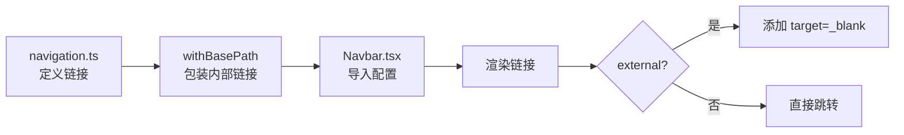

# Design: 统一导航链接配置管理

## 架构设计概述 (Architecture Overview)

本文档记录了统一导航链接配置管理的架构设计决策,包括数据结构设计、模块组织方式和扩展性考虑。

## 设计目标 (Design Goals)

1. **单一数据源**: 确保导航链接在一个地方定义和管理
2. **类型安全**: 利用 TypeScript 类型系统减少运行时错误
3. **可维护性**: 简化链接配置的添加和修改流程
4. **可扩展性**: 为未来的多语言支持和链接分组预留扩展空间
5. **兼容性**: 保持与现有功能的完全兼容,特别是 base path 处理

## 数据结构设计 (Data Structure Design)

### 核心类型定义

```typescript
/**
 * 导航链接接口
 * 定义导航链接的基本结构
 */
export interface NavLink {
  /** 链接显示文本 */
  label: string;

  /** 链接地址 (支持相对路径和绝对 URL) */
  href: string;

  /** 是否为外部链接 (可选) */
  external?: boolean;
}

/**
 * 导航链接配置数组
 * 站点所有导航链接的单一数据源
 */
export const navLinks: NavLink[] = [
  // 链接配置
];
```

### 设计考虑

1. **类型定义位置**: 将 `NavLink` 接口与 `navLinks` 数组放在同一文件中,便于维护和查看
2. **可选字段**: `external` 字段设为可选,因为可以通过 `href` 是否以 `https://` 开头自动判断
3. **路径别名**: 使用 `@/config/navigation` 路径别名导入,保持导入语句简洁

## 模块组织方式 (Module Organization)

### 目录结构

```
src/
├── config/
│   └── navigation.ts           # 统一导航链接配置
├── components/
│   └── home/
│       └── Navbar.tsx          # 首页导航栏组件 (更新为使用配置)
└── utils/
    └── path.ts                 # 路径工具函数 (现有)
```

### 配置文件职责

| 文件 | 职责 | 变更类型 |
|------|------|----------|
| `src/config/navigation.ts` | 定义导航链接数据结构和配置 | **新增** |
| `src/components/home/Navbar.tsx` | 导入并渲染导航链接,处理交互逻辑 | **修改** |
| `src/utils/path.ts` | 提供 `withBasePath` 工具函数 | **不变** |

## 实现细节 (Implementation Details)

### 1. 配置文件实现

```typescript
// src/config/navigation.ts
import { withBasePath } from '@/utils/path';

/**
 * 导航链接接口
 */
export interface NavLink {
  label: string;
  href: string;
  external?: boolean;
}

/**
 * 站点导航链接配置
 * 所有链接在配置时使用相对路径,withBasePath 会在运行时处理 base path
 */
export const navLinks: NavLink[] = [
  {
    label: "安装指南",
    href: withBasePath("/installation/docker-compose"),
  },
  {
    label: "博客",
    href: withBasePath("/blog"),
  },
  {
    label: "文档",
    href: withBasePath("/product-overview"),
  },
  {
    label: "技术支持群 610394020",
    href: "https://qm.qq.com/q/Fwb0o094kw",
    external: true,
  },
  {
    label: "Docker Compose 构建器",
    href: "https://hagicode-org.github.io/docker-compose-builder/",
    external: true,
  },
  {
    label: "GitHub （求 Star ~）",
    href: "https://github.com/HagiCode-org/site",
    external: true,
  },
];
```

**关键设计决策**:
- ✅ 在配置文件中直接使用 `withBasePath` 包装内部链接,确保 base path 处理
- ✅ 外部链接使用完整的 `https://` URL,不使用 `withBasePath`
- ✅ `external` 字段显式标记外部链接,便于组件判断是否添加 `target="_blank"`

### 2. Navbar 组件重构

```typescript
// src/components/home/Navbar.tsx
import { navLinks, NavLink } from '@/config/navigation';
// ... 其他导入

export default function Navbar({ className = "" }: NavbarProps) {
  // 移除硬编码的 navItems 数组
  // 直接使用导入的 navLinks 配置

  return (
    <header>
      {/* ... */}
      <nav className={styles.navDesktop}>
        {navLinks.map((item) => (
          <a
            key={item.href}
            href={item.href}
            className={styles.navLink}
            target={item.external ? "_blank" : undefined}
            rel={item.external ? "noopener noreferrer" : undefined}
          >
            <span className={styles.navLinkText}>{item.label}</span>
            <span className={styles.navLinkIndicator} />
          </a>
        ))}
      </nav>
      {/* ... */}
    </header>
  );
}
```

**关键设计决策**:
- ✅ 使用 `item.external` 字段判断是否为外部链接,替代原有的 `href.startsWith("http")` 检查
- ✅ 保持所有现有的样式和交互逻辑不变
- ✅ 移除 `useMemo` 中的 `navItems` 数组定义(配置现在是静态导入的)

## 与现有系统的集成 (Integration with Existing Systems)

### Base Path 处理机制

现有的 base path 处理机制保持不变:

1. **配置文件**: `src/config/navigation.ts` 在定义链接时调用 `withBasePath()`
2. **运行时**: `withBasePath()` 函数读取 `data-site-base` 属性或环境变量
3. **结果**: 所有内部链接自动包含正确的 base path 前缀



### TypeScript 类型系统

配置文件与项目的 TypeScript 严格模式完全兼容:

- ✅ 接口定义使用 PascalCase 命名 (`NavLink`)
- ✅ 导出的数组明确类型为 `NavLink[]`
- ✅ 路径别名 `@/config/navigation` 在 `tsconfig.json` 中正确配置
- ✅ `npm run typecheck` 通过无错误

## 扩展性设计 (Extensibility Design)

### 未来可能的扩展

#### 1. 多语言支持

如果未来需要支持多语言,可以扩展为:

```typescript
interface NavLink {
  label: string | { zh: string; en: string };
  href: string;
  external?: boolean;
}

function getLabel(label: string | { zh: string; en: string }, locale: string): string {
  return typeof label === 'string' ? label : label[locale];
}
```

#### 2. 链接分组

如果导航链接数量增加,可以添加分组功能:

```typescript
interface NavGroup {
  label: string;
  items: NavLink[];
}

export const navGroups: NavGroup[] = [
  {
    label: "产品",
    items: [/* ... */]
  },
  {
    label: "资源",
    items: [/* ... */]
  }
];
```

#### 3. 基于角色的链接显示

如果需要为不同用户角色显示不同的链接:

```typescript
interface NavLink {
  label: string;
  href: string;
  external?: boolean;
  roles?: string[]; // 新增: 允许访问的角色列表
}
```

## 迁移策略 (Migration Strategy)

### 兼容性保证

1. **功能完全兼容**: 所有现有的导航链接功能保持不变
2. **样式完全兼容**: Navbar 组件的样式和布局不受影响
3. **行为完全兼容**: 外部链接在新标签页打开,内部链接在当前页面跳转

### 回滚计划

如果实施后发现问题,可以通过以下步骤快速回滚:

```bash
# 1. 恢复 Navbar 组件
git checkout -- src/components/home/Navbar.tsx

# 2. 删除配置文件
git clean -f src/config/

# 3. 验证系统恢复
npm run dev
```

## 测试策略 (Testing Strategy)

### 单元测试建议 (未来)

虽然当前实施不需要单元测试,但未来可以考虑添加:

```typescript
import { describe, it, expect } from 'vitest';
import { navLinks } from '@/config/navigation';

describe('Navigation Configuration', () => {
  it('should include all required links', () => {
    const labels = navLinks.map(link => link.label);
    expect(labels).toContain('安装指南');
    expect(labels).toContain('博客');
    // ... 其他链接
  });

  it('should mark external links correctly', () => {
    const externalLinks = navLinks.filter(link => link.external);
    externalLinks.forEach(link => {
      expect(link.href).toMatch(/^https:\/\//);
    });
  });
});
```

### 手动测试清单

- [ ] 首页导航栏显示正常,样式无变化
- [ ] 点击"安装指南"链接,跳转到正确的页面
- [ ] 点击"博客"链接,跳转到 `/blog/`
- [ ] 点击"文档"链接,跳转到 `/product-overview/`
- [ ] 点击"技术支持群"链接,在新标签页打开 QQ 群链接
- [ ] 点击"Docker Compose 构建器"链接,在新标签页打开外部网站
- [ ] 点击"GitHub"链接,在新标签页打开 GitHub 仓库
- [ ] 在子路径部署模式 (`VITE_SITE_BASE=/site`) 下,所有内部链接正确包含 `/site` 前缀
- [ ] 移动端菜单显示正常,所有链接功能正常

## 性能考虑 (Performance Considerations)

### 构建时性能

- ✅ 配置文件在构建时静态导入,无运行时性能损耗
- ✅ TypeScript 编译时类型检查,无运行时开销
- ✅ 与现有的 Astro 构建流程完全兼容

### 运行时性能

- ✅ `navLinks` 配置在模块加载时初始化,无重复计算
- ✅ `withBasePath()` 函数在模块初始化时调用一次,结果缓存
- ✅ Navbar 组件的渲染性能与修改前相同

## 安全性考虑 (Security Considerations)

### 外部链接安全

- ✅ 所有外部链接添加 `rel="noopener noreferrer"` 防止 `window.opener` 访问
- ✅ `target="_blank"` 确保外部链接在新标签页打开

### XSS 防护

- ✅ 链接文本通过 React 的默认 XSS 防护机制处理
- ✅ 配置文件不包含用户输入,无注入风险

## 决策记录 (Decision Log)

| 决策点 | 选择 | 理由 |
|--------|------|------|
| 配置文件位置 | `src/config/navigation.ts` | 符合项目约定,与现有配置文件组织方式一致 |
| 类型命名 | `NavLink` (PascalCase) | 遵循 TypeScript 类型命名约定 |
| 导入路径 | `@/config/navigation` | 使用路径别名,保持导入语句简洁 |
| Base path 处理 | 配置文件中调用 `withBasePath()` | 确保所有组件使用配置时无需额外处理 |
| External 字段 | 可选 | 可通过 URL 自动判断,但显式标记更清晰 |
| 配置文件格式 | TypeScript (而非 JSON) | 利用 TypeScript 类型系统,提供更好的开发体验 |

## 参考资源 (References)

- Astro 文档: https://docs.astro.build/en/guides/configuration-reference/
- TypeScript 手册: https://www.typescriptlang.org/docs/handbook/declaration-files/do-s-and-don-ts.html
- React 组件最佳实践: https://react.dev/learn/understanding-your-ui-as-a-tree
- 项目路径别名配置: `tsconfig.json`
- 现有路径工具函数: `src/utils/path.ts`
