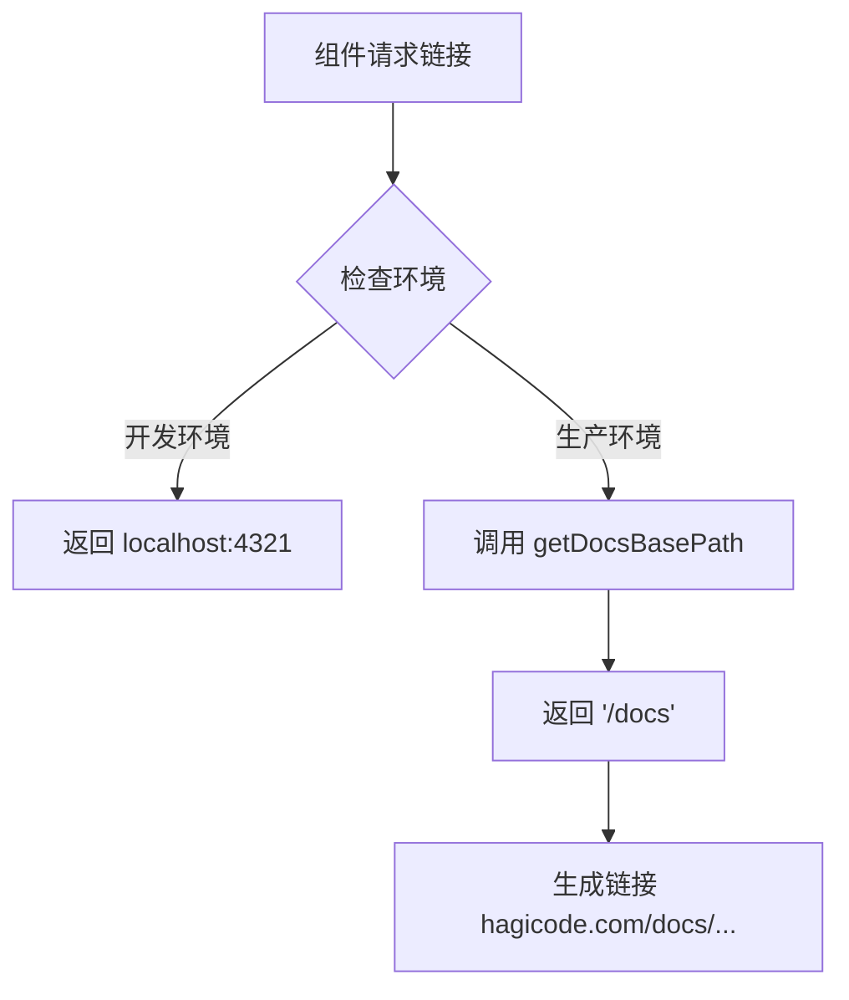
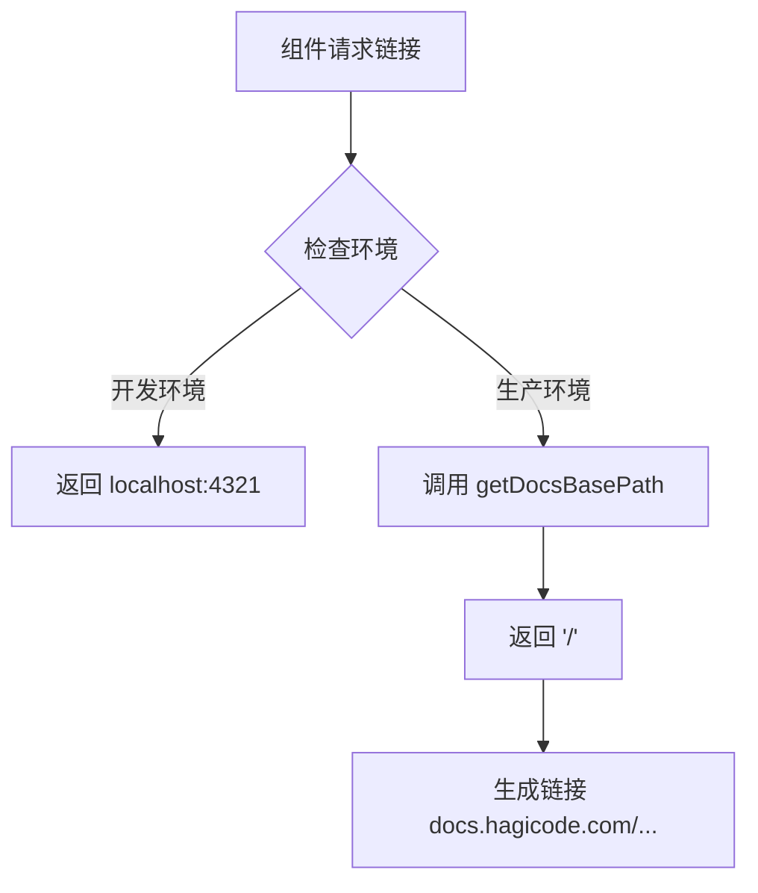

# Change: 修复公共链接中错误的 Docs 基础路径

## Status

**ExecutionCompleted**

所有任务已实施完成：
- 修改了 `getDocsBasePath()` 函数，现在返回 `/`
- 更新了所有 `SITE_LINKS` 生产环境链接到 `https://docs.hagicode.com/...`
- 修复了 `scripts/custom-404.js` 中的硬编码路径
- 构建验证通过，sitemap 和生成的链接都使用正确的 URL 格式
- Azure Static Web Apps 配置已检查，无需额外配置

---

## Why

当前共享链接库 `@shared/links` 中的生产环境链接配置与实际部署架构不匹配。文档站点现已独立部署在 `docs.hagicode.com`，使用根路径 `/`，但 `getDocsBasePath()` 函数仍在生产环境返回 `/docs`，导致公共链接生成错误的 URL 结构。

## What Changes

- **BREAKING**: 修改 `packages/shared/src/links.ts` 中 `getDocsBasePath()` 函数，生产环境返回 `/` 而非 `/docs`
- **BREAKING**: 更新 `SITE_LINKS` 中所有文档相关链接的生产环境 URL，从 `https://hagicode.com/docs/...` 改为 `https://docs.hagicode.com/...`
- **BREAKING**: 移除链接中的中间路径段 `/docs/`，使用直接的路径结构
- 验证所有使用共享链接的组件（导航、面包屑等）正确使用新的路径结构

## 代码流程变更

### 链接生成流程变更

#### 变更前的链接生成流程

#### 变更后的链接生成流程

### 代码变更清单

| 文件路径 | 变更类型 | 变更原因 | 影响范围 |
|---------|---------|---------|---------|
| `packages/shared/src/links.ts` | 修改 | 更新 `getDocsBasePath()` 返回值，生产环境从 `/docs` 改为 `/` | 所有使用该函数的组件 |
| `packages/shared/src/links.ts` | 修改 | 更新 `SITE_LINKS.docs.prod` 从 `https://hagicode.com/docs/` 改为 `https://docs.hagicode.com/` | 文档站点基础链接 |
| `packages/shared/src/links.ts` | 修改 | 更新 `SITE_LINKS.blog.prod` 从 `https://hagicode.com/docs/blog/` 改为 `https://docs.hagicode.com/blog/` | 博客链接 |
| `packages/shared/src/links.ts` | 修改 | 更新 `SITE_LINKS.productOverview.prod` 从 `https://hagicode.com/docs/product-overview/` 改为 `https://docs.hagicode.com/product-overview/` | 产品概述链接 |
| `packages/shared/src/links.ts` | 修改 | 更新 `SITE_LINKS.dockerCompose.prod` 从 `https://hagicode.com/docs/installation/docker-compose/` 改为 `https://docs.hagicode.com/installation/docker-compose/` | 安装指南链接 |
| `packages/shared/src/links.ts` | 修改 | 更新 `SITE_LINKS.rss.prod` 从 `https://hagicode.com/docs/blog/rss.xml` 改为 `https://docs.hagicode.com/blog/rss.xml` | RSS 订阅链接 |

### 详细变更 - packages/shared/src/links.ts

| 函数/属性 | 变更前 | 变更后 | 变更原因 |
|----------|-------|-------|---------|
| `getDocsBasePath()` 生产环境返回值 | `'/docs'` | `'/'` | 文档站点独立部署在 docs.hagicode.com，使用根路径 |
| `SITE_LINKS.docs.prod` | `'https://hagicode.com/docs/'` | `'https://docs.hagicode.com/'` | 匹配实际部署的独立域名 |
| `SITE_LINKS.blog.prod` | `'https://hagicode.com/docs/blog/'` | `'https://docs.hagicode.com/blog/'` | 移除中间路径段 /docs |
| `SITE_LINKS.productOverview.prod` | `'https://hagicode.com/docs/product-overview/'` | `'https://docs.hagicode.com/product-overview/'` | 移除中间路径段 /docs |
| `SITE_LINKS.dockerCompose.prod` | `'https://hagicode.com/docs/installation/docker-compose/'` | `'https://docs.hagicode.com/installation/docker-compose/'` | 移除中间路径段 /docs |
| `SITE_LINKS.rss.prod` | `'https://hagicode.com/docs/blog/rss.xml'` | `'https://docs.hagicode.com/blog/rss.xml'` | 移除中间路径段 /docs |

## Impact

### 影响的规范

- `openspec/specs/astro-site/spec.md` - 修改基础路径配置相关需求

### 影响的代码

- `packages/shared/src/links.ts` - 共享链接管理库
- `apps/docs/src/config/navigation.ts` - 导航配置（使用共享链接）
- `apps/website/src/config/navigation.ts` - 营销站点导航配置（使用共享链接）
- 所有使用 `@shared/links` 的组件

### 向后兼容性

**破坏性变更**：此更改会破坏现有链接结构。
- 生产环境的所有文档链接将从 `https://hagicode.com/docs/...` 变为 `https://docs.hagicode.com/...`
- 需要配置重定向规则处理旧的 `/docs/` 链接
- 外部引用的链接需要更新

### 部署注意事项

- Azure Static Web Apps 路由配置需要验证
- 可能需要配置重定向规则处理旧链接
- SEO 影响：需要更新站点地图和 canonical URL
