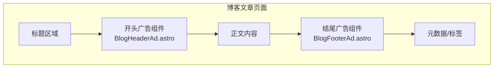

# Change: 博客文章添加 GLM 广告推广区域

## Why

当前博客文章缺少广告推广区域，无法在博客内容中展示 GLM（智谱 AI）相关的推广信息。博客作为高流量入口，是推广 API Token 购买链接的理想位置。通过在每篇博客文章的开头和结尾添加广告区域，可以提高 GLM 服务的曝光率和转化率。

## What Changes

- 在每篇博客文章的**开头**（标题之后、正文之前）添加广告区域
- 在每篇博客文章的**结尾**（正文之后）添加广告区域
- 创建 **两个独立的广告组件**，分别处理开头和结尾区域：
  - `BlogHeaderAd.astro` - 开头广告组件：简洁的 GLM 推广卡片
  - `BlogFooterAd.astro` - 结尾广告组件：扩展的链接列表区域
- 将 GLM 推广链接抽取为可复用的常量配置，存放于 `packages/shared/src/links.ts`
- 广告内容与现有 Docker Compose 安装指南中的 GLM 推广信息保持一致
- 支持通过博客文章 frontmatter 的 `hideAd` 属性控制广告显示（默认显示）

## UI Design Changes

### 广告区域布局

```
┌─────────────────────────────────────────────────────┐
│ 博客标题                                             │
│ 发布日期 | 作者                                       │
├─────────────────────────────────────────────────────┤
│ ┌─────────────────────────────────────────────────┐ │
│ │ 🚀 速来拼好模，智谱 GLM Coding 超值订阅          │ │
│ │                                                 │ │
│ │ Claude Code、Cline 等 20+ 大编程工具无缝支持    │ │
│ │ "码力"全开，越拼越爽！立即开拼，享限时惊喜价！    │ │
│ │                                                 │ │
│ │ [立即开拼 →]  (链接: bigmodel.cn/glm-coding)    │ │
│ └─────────────────────────────────────────────────┘ │
├─────────────────────────────────────────────────────┤
│ 博客正文内容...                                       │
│ ...                                                 │
├─────────────────────────────────────────────────────┤
│ ┌─────────────────────────────────────────────────┐ │
│ │ 🔗 相关链接                                       │ │
│ │                                                 │ │
│ │ • 智谱 GLM Coding: 20+ 大编程工具无缝支持        │ │
│ │   [立即开拼 →]                                  │ │
│ │                                                 │ │
│ │ • Docker Compose 部署: 一键部署 Hagicode         │ │
│ │   [查看部署指南 →]                               │ │
│ └─────────────────────────────────────────────────┘ │
└─────────────────────────────────────────────────────┘
```

### 组件位置示意



## Impact

| 方面 | 影响 |
|------|------|
| **用户体验** | 博客文章增加推广信息展示，可能影响阅读体验（可通过 frontmatter 关闭） |
| **代码结构** | 新增 `BlogHeaderAd.astro` 和 `BlogFooterAd.astro` 两个组件，修改博客布局 |
| **共享模块** | 扩展 `packages/shared/src/links.ts` 添加 GLM 推广链接配置 |
| **维护性** | GLM 推广信息集中管理，便于更新链接和文案 |
| **构建** | 无影响，纯静态 Astro 组件 |
| **SEO** | 外部链接使用 `rel="noopener noreferrer"` 确保安全性 |

### Affected Code

- `apps/docs/src/components/BlogHeaderAd.astro` (新增) - 开头广告组件
- `apps/docs/src/components/BlogFooterAd.astro` (新增) - 结尾广告组件
- `apps/docs/src/components/StarlightWrapper.astro` (可能需要修改)
- `packages/shared/src/links.ts` (扩展)
- 博客文章模板/布局

### Affected Specs

- `specs/blog/spec.md` (新增 capability)
