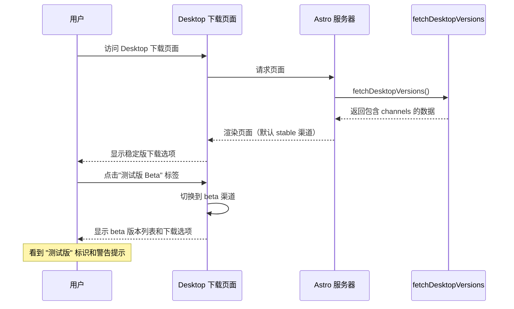

# 支持 Desktop 多渠道版本管理

## 概述

为 Hagicode Desktop 下载页面添加多渠道版本管理支持，允许用户选择获取稳定版（stable）或测试版（beta）。

## 背景

### 当前状态

Hagicode Desktop 的版本数据来源于 `desktop.dl.hagicode.com/index.json`，原有数据格式仅包含 `updatedAt` 和 `versions` 数组：

```json
{
  "updatedAt": 1234567890,
  "versions": [...]
}
```

### 新的数据结构

官方已更新数据格式，新增了 `channels` 字段以支持多渠道版本管理：

```json
{
  "updatedAt": "时间戳",
  "versions": [...],
  "channels": {
    "stable": {
      "latest": "v0.1.10",
      "versions": ["v0.1.9", "v0.1.8", ...]
    },
    "beta": {
      "latest": "v0.1.11-beta.1",
      "versions": ["v0.1.11-beta.1"]
    }
  }
}
```

### 项目架构

当前项目使用**构建时固定版本**的架构：

- `apps/docs` 和 `apps/website` 两个站点共享 Desktop 相关的类型定义和工具函数
- 类型定义在各自站点的 `src/types/desktop.ts`
- 工具函数在各自站点的 `src/utils/desktop.ts`
- 两个站点均有安装按钮组件
- Desktop 下载页面展示版本和下载选项

## 问题

当前代码无法正确处理新增的 `channels` 字段，存在以下问题：

1. **类型定义过时**：`DesktopIndexResponse` 接口缺少 `channels` 字段定义
2. **版本获取逻辑不完整**：现有代码仅从 `versions` 数组获取最新版本，无法区分 stable 和 beta 渠道
3. **UI 组件不支持渠道切换**：
   - 安装按钮未显示渠道信息
   - Desktop 下载页面未提供渠道选择功能
4. **数据转换不兼容**：`fetchDesktopVersions` 函数返回的数据结构与新格式不匹配

## 为什么需要此变更

1. **用户体验提升**：
   - 用户可以选择获取稳定版或测试版本
   - 更清晰的版本分类和标识
   - 更准确的"最新版本"展示

2. **技术债务减少**：
   - 类型定义与实际数据结构保持同步
   - 代码更容易维护和扩展
   - 为未来可能添加的更多渠道（如 dev、canary）做好准备

## 变更内容

### 1. 更新类型定义

在两个站点的类型定义文件中添加渠道相关类型：

```typescript
/**
 * 渠道信息
 */
export interface ChannelInfo {
  /** 该渠道最新版本号 */
  latest: string;
  /** 该渠道包含的版本号列表 */
  versions: string[];
}

/**
 * index.json 响应结构（更新后）
 */
export interface DesktopIndexResponse {
  /** Unix 时间戳 */
  updatedAt: number;
  /** 版本列表（完整历史） */
  versions: DesktopVersion[];
  /** 渠道信息 */
  channels: {
    /** 稳定版渠道 */
    stable: ChannelInfo;
    /** 测试版渠道 */
    beta: ChannelInfo;
  };
}
```

### 2. 更新工具函数

添加渠道相关的工具函数：

- `getChannelLatestVersion(channel: 'stable' | 'beta'): Promise<DesktopVersion>`
- `getAllChannelVersions(channel: 'stable' | 'beta'): Promise<DesktopVersion[]>`
- 更新 `fetchDesktopVersions` 函数以返回包含 `channels` 的完整数据结构
- 保留向后兼容性，确保现有调用不受影响

### 3. 更新 InstallButton 组件

修改两个站点的安装按钮组件：

- 添加 `channel` 属性（默认 `'stable'`）
- 根据 channel 属性获取对应渠道的最新版本
- 显示当前选择的渠道标识（beta 版本添加 "测试版" 标签）

### 4. 更新 Desktop 下载页面

在 `apps/website/src/pages/desktop/index.astro` 中：

- 添加渠道切换选项卡（stable / beta）
- 根据选择的渠道显示对应的版本列表
- 为 beta 版本添加视觉标识
- 更新版本监控脚本以支持新格式

## UI 设计变更

### Desktop 下载页面 - 渠道选择器

```
┌────────────────────────────────────────────────────────────────┐
│ Hagicode Desktop - 下载                                        │
├────────────────────────────────────────────────────────────────┤
│                                                                │
│  ┌──────────────┐  ┌──────────────┐                           │
│  │ 稳定版       │  │ 测试版 Beta  │                           │
│  └──────────────┘  └──────────────┘                           │
│                                                                │
│  最新版本: v0.1.10  [当前选择]                                 │
│                                                                │
│  ┌──────────────────────────────────────────────────────┐    │
│  │  [Windows] [macOS] [Linux]                            │    │
│  │                                                        │    │
│  │  立即安装                          [选择其他版本 ▼]    │    │
│  └──────────────────────────────────────────────────────┘    │
│                                                                │
│  版本历史:                                                     │
│  ┌──────────────────────────────────────────────────────┐    │
│  │ v0.1.10 [最新版本] [稳定版]                           │    │
│  │ v0.1.9  [稳定版]                                      │    │
│  │ v0.1.8  [稳定版]                                      │    │
│  └──────────────────────────────────────────────────────┘    │
└────────────────────────────────────────────────────────────────┘
```

### 切换到测试版后的界面

```
┌────────────────────────────────────────────────────────────────┐
│ Hagicode Desktop - 下载                                        │
├────────────────────────────────────────────────────────────────┤
│                                                                │
│  ┌──────────────┐  ┌──────────────┐                           │
│  │ 稳定版       │  │ 测试版 Beta  │  [当前选择]               │
│  └──────────────┘  └──────────────┘                           │
│                                                                │
│  最新版本: v0.1.11-beta.1  [测试版]                            │
│                                                                │
│  ⚠️ 这是一个测试版本，可能存在不稳定问题                         │
│                                                                │
│  ┌──────────────────────────────────────────────────────┐    │
│  │  [Windows] [macOS] [Linux]                            │    │
│  │                                                        │    │
│  │  立即安装              [测试版]  [选择其他版本 ▼]      │    │
│  └──────────────────────────────────────────────────────┘    │
│                                                                │
│  版本历史:                                                     │
│  ┌──────────────────────────────────────────────────────┐    │
│  │ v0.1.11-beta.1 [最新版本] [测试版]                    │    │
│  │ v0.1.10-beta.2  [测试版]                              │    │
│  │ v0.1.10-beta.1  [测试版]                              │    │
│  └──────────────────────────────────────────────────────┘    │
└────────────────────────────────────────────────────────────────┘
```

### 用户交互流程



## 数据流变更

### 版本获取流程

```mermaid
flowchart TD
    A[fetchDesktopVersions] --> B{本地文件存在?}
    B -->|是| C[读取 /version-index.json]
    B -->|否| D[请求在线 API]

    C --> E[验证 channels 字段]
    D --> E

    E --> F{channels 存在?}
    F -->|是| G[使用新格式数据]
    F -->|否| H[使用旧格式兼容]

    G --> I[返回完整数据]
    H --> I

    I --> J[组件使用数据]
    J --> K{使用哪种方式?}
    K -->|默认| L[从 versions[0] 获取]
    K -->|新函数| M[从 channels.stable.latest 获取]
    K -->|新函数| N[从 channels.beta.latest 获取]
```

## 影响范围

### 受影响的文件

**apps/docs 站点：**
- `apps/docs/src/types/desktop.ts` - 添加渠道相关类型定义
- `apps/docs/src/utils/desktop.ts` - 添加渠道相关工具函数
- `apps/docs/src/components/InstallButton.tsx` - 添加渠道属性支持

**apps/website 站点：**
- `apps/website/src/types/desktop.ts` - 添加渠道相关类型定义
- `apps/website/src/utils/desktop.ts` - 添加渠道相关工具函数
- `apps/website/src/components/home/InstallButton.tsx` - 添加渠道属性支持
- `apps/website/src/pages/desktop/index.astro` - 添加渠道切换 UI

**脚本：**
- `scripts/version-monitor.js` - 更新版本监控逻辑以支持 channels

### 向后兼容性

1. **类型兼容**：新类型定义完全兼容旧数据格式
2. **函数兼容**：现有函数调用无需修改，继续使用默认行为
3. **UI 兼容**：默认显示稳定版，不影响现有用户体验

### 数据验证

为确保新数据格式正确，需要验证：

1. `channels` 字段是否存在
2. `channels.stable` 和 `channels.beta` 结构是否正确
3. `latest` 版本号是否在 `versions` 数组中存在
4. 对应的 `DesktopVersion` 对象是否在 `versions` 数组中存在

## 风险评估

| 风险 | 影响 | 缓解措施 |
|------|------|---------|
| 新数据格式未上线 | 类型定义与实际数据不匹配 | 添加运行时验证和降级处理 |
| 渠道数据不完整 | 部分版本无法正确显示 | 回退到使用完整 versions 数组 |
| 用户混淆渠道概念 | 用户体验下降 | 添加清晰的说明和视觉区分 |
| Beta 版本稳定性问题 | 用户安装后遇到问题 | 添加明确的测试版警告提示 |

## 成功标准

1. ✅ 类型定义正确包含 `channels` 字段
2. ✅ 工具函数支持按渠道获取版本
3. ✅ InstallButton 组件支持渠道属性
4. ✅ Desktop 下载页面可以切换渠道
5. ✅ Beta 版本有清晰的视觉标识和警告
6. ✅ 向后兼容旧数据格式
7. ✅ 所有组件在旧数据格式下正常工作
8. ✅ 本地构建和测试通过

## 后续优化

1. **更多渠道支持**：为将来可能添加的 dev、canary 等渠道预留扩展空间
2. **用户偏好记忆**：使用 localStorage 记住用户选择的渠道
3. **自动切换建议**：根据用户行为推荐合适的渠道
4. **版本过滤优化**：在版本历史中提供更精细的过滤选项

## 相关资源

- 官方版本数据源: `https://desktop.dl.hagicode.com/index.json`
- Desktop 页面: `apps/website/src/pages/desktop/index.astro`
- InstallButton 组件:
  - `apps/docs/src/components/InstallButton.tsx`
  - `apps/website/src/components/home/InstallButton.tsx`
- 版本数据工具:
  - `apps/docs/src/utils/desktop.ts`
  - `apps/website/src/utils/desktop.ts`
- 版本监控脚本: `scripts/version-monitor.js`
- 类型定义:
  - `apps/docs/src/types/desktop.ts`
  - `apps/website/src/types/desktop.ts`
