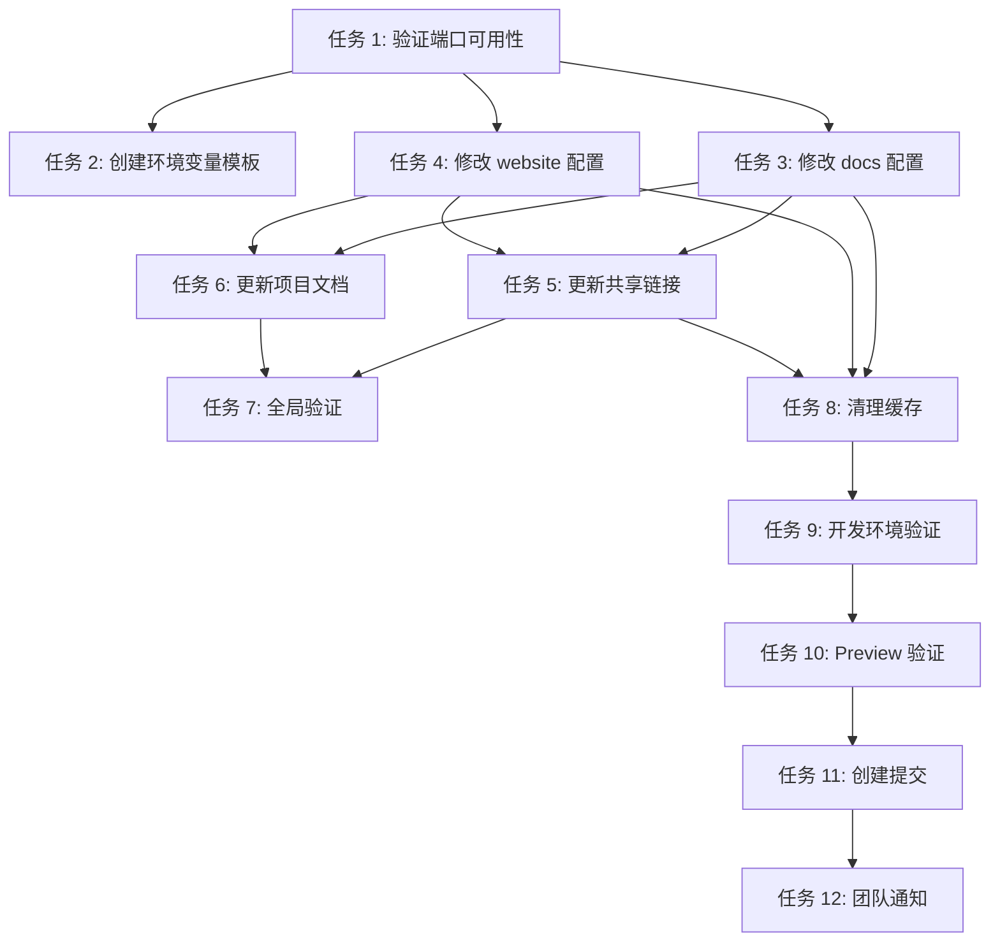

# 实施任务清单

本文件定义了实施"调整开发服务器端口配置"提案的详细任务清单。

**提案版本：** 1.1
**最后更新：** 2025-02-15

---

## 任务 1：验证端口可用性

**优先级：** P0 - 阻塞性任务
**预计时间：** < 1 分钟
**依赖：** 无

**描述：**
在开始修改配置之前，验证目标端口 31264 和 31265 当前未被其他服务占用。

**执行步骤：**

1. 检查端口占用情况
   ```bash
   lsof -i :31264 || echo "Port 31264 is available"
   lsof -i :31265 || echo "Port 31265 is available"
   ```

2. 如果端口被占用，记录占用进程并与团队确认是否需要选择其他端口号

**成功标准：**
- 两个目标端口均未被占用，或已确认可以使用

**回滚计划：**
不适用（验证阶段）

---

## 任务 2：创建环境变量配置模板

**优先级：** P0 - 核心任务
**预计时间：** 2-3 分钟
**依赖：** 任务 1

**描述：**
创建环境变量配置模板文件，定义端口配置规范。

**执行步骤：**

1. 创建 `.env.example` 文件（项目根目录）：
   ```bash
   # 开发服务器端口配置
   PORT_DOCS=31265
   PORT_WEBSITE=31264
   ```

2. 创建 `.env.local.example` 文件，说明本地覆盖配置：
   ```bash
   # 本地开发环境端口配置（可选）
   # 取消注释并修改端口号以覆盖默认值
   # PORT_DOCS=31265
   # PORT_WEBSITE=31264
   ```

3. 更新 `.gitignore` 确保 `.env.local` 不被提交（如果尚未存在）

**文件变更：**
- `.env.example`（新建）
- `.env.local.example`（新建）

**成功标准：**
- 模板文件创建完成
- 环境变量命名规范统一（`PORT_DOCS`, `PORT_WEBSITE`）
- 提供清晰的注释说明

---

## 任务 3：修改 docs 应用端口配置

**优先级：** P0 - 核心任务
**预计时间：** < 1 分钟
**依赖：** 任务 1

**描述：**
修改 `apps/docs/package.json` 中的开发脚本，支持环境变量配置端口。

**执行步骤：**

1. 编辑 `apps/docs/package.json`
2. 修改 `dev` 脚本，使用环境变量并设置默认值：
   ```json
   "dev": "astro dev --port ${PORT_DOCS:-31265}"
   ```
3. 修改 `preview` 脚本：
   ```json
   "preview": "astro preview --port ${PORT_DOCS:-31265}"
   ```

**文件变更：**
- `apps/docs/package.json`

**成功标准：**
- `dev` 和 `preview` 脚本支持 `PORT_DOCS` 环境变量
- 默认值设置为 31265
- 文件语法有效

**验证命令：**
```bash
# 测试默认端口
cd apps/docs && npm run dev &
curl http://localhost:31265/

# 测试环境变量覆盖
PORT_DOCS=4000 npm run dev &
curl http://localhost:4000/
```

---

## 任务 4：修改 website 应用端口配置

**优先级：** P0 - 核心任务
**预计时间：** < 1 分钟
**依赖：** 任务 1

**描述：**
修改 `apps/website/package.json` 中的开发脚本，支持环境变量配置端口。

**执行步骤：**

1. 编辑 `apps/website/package.json`
2. 修改 `dev` 脚本，使用环境变量并设置默认值：
   ```json
   "dev": "astro dev --port ${PORT_WEBSITE:-31264}"
   ```
3. 修改 `preview` 脚本：
   ```json
   "preview": "astro preview --port ${PORT_WEBSITE:-31264}"
   ```

**文件变更：**
- `apps/website/package.json`

**成功标准：**
- `dev` 和 `preview` 脚本支持 `PORT_WEBSITE` 环境变量
- 默认值设置为 31264
- 文件语法有效

**验证命令：**
```bash
# 测试默认端口
cd apps/website && npm run dev &
curl http://localhost:31264/

# 测试环境变量覆盖
PORT_WEBSITE=4001 npm run dev &
curl http://localhost:4001/
```

---

## 任务 5：更新共享链接配置

**优先级：** P0 - 核心任务
**预计时间：** 2-3 分钟
**依赖：** 任务 3, 任务 4

**描述：**
更新 `packages/shared/src/links.ts` 中所有硬编码的本地开发端口为新的默认值，并添加环境变量说明注释。

**执行步骤：**

1. 编辑 `packages/shared/src/links.ts`
2. 执行以下替换：
   - 所有 `localhost:4321` → `localhost:31265`
   - 所有 `localhost:4322` → `localhost:31264`

3. 在文件顶部添加说明注释：
   ```typescript
   /**
    * 开发环境链接配置
    *
    * 端口可通过环境变量配置：
    * - PORT_DOCS: 文档站点端口（默认 31265）
    * - PORT_WEBSITE: 营销站点端口（默认 31264）
    *
    * 如需自定义端口，请在 .env.local 中设置对应的环境变量
    */
   ```

4. 需要更新的链接属性：
   ```typescript
   SITE_LINKS.docs.dev           // 4321 → 31265
   SITE_LINKS.website.dev        // 4322 → 31264
   SITE_LINKS.blog.dev           // 4321 → 31265
   SITE_LINKS.productOverview.dev // 4321 → 31265
   SITE_LINKS.desktop.dev        // 4322 → 31264
   SITE_LINKS.dockerCompose.dev  // 4321 → 31265
   SITE_LINKS.container.dev      // 4322 → 31264
   SITE_LINKS.rss.dev            // 4321 → 31265
   ```

**文件变更：**
- `packages/shared/src/links.ts`

**成功标准：**
- 所有 `dev` 属性中的端口号已更新为新的默认值
- 无遗留的旧端口号（4321, 4322）
- 添加了环境变量配置说明注释
- TypeScript 类型检查通过

**验证命令：**
```bash
# 检查是否还有旧端口残留
grep -r "4321\|4322" packages/shared/src/links.ts || echo "No old ports found"
```

---

## 任务 6：更新项目文档

**优先级：** P1 - 重要任务
**预计时间：** 2-3 分钟
**依赖：** 任务 2, 任务 3

**描述：**
更新 `openspec/project.md` 中的开发说明，反映新的端口配置和环境变量支持。

**执行步骤：**

1. 编辑 `openspec/project.md`
2. 查找包含端口说明的部分（约第 337-341 行）
3. 更新注释，添加环境变量说明：
   ```markdown
   # 开发服务器 - 启动两个站点
   npm run dev                # Start both docs (port 31265) and website (port 31264)

   # 使用自定义端口
   PORT_DOCS=4000 PORT_WEBSITE=4001 npm run dev

   # 单独启动各站点
   npm run dev:docs           # Start docs site only (localhost:31265/)
   npm run dev:website        # Start website only (localhost:31264/)

   # 环境变量配置（可选）
   # PORT_DOCS=31265          # 文档站点端口
   # PORT_WEBSITE=31264       # 营销站点端口
   ```

4. 添加环境变量配置章节，说明如何使用 `.env.local` 文件

**文件变更：**
- `openspec/project.md`

**成功标准：**
- 文档中的端口号与实际配置一致
- 包含环境变量使用说明
- 格式和语法保持一致

---

## 任务 7：全局验证端口引用

**优先级：** P1 - 重要任务
**预计时间：** 1-2 分钟
**依赖：** 任务 3, 任务 4, 任务 5

**描述：**
在整个项目中搜索，确保没有遗漏的旧端口引用。

**执行步骤：**

1. 在项目根目录执行全局搜索：
   ```bash
   grep -r "4321" --exclude-dir=node_modules --exclude-dir=.git --exclude-dir=dist --exclude=*.lock .
   grep -r "4322" --exclude-dir=node_modules --exclude-dir=.git --exclude-dir=dist --exclude=*.lock .
   ```

2. 检查搜索结果，确认：
   - 所有应用代码中的引用已更新
   - 任何遗漏的引用需要手动修复
   - 文档中的引用已更新

**成功标准：**
- 搜索结果显示无遗漏的端口引用（除了本变更文件本身）
- 或所有发现的引用都已确认为不需要修改

---

## 任务 8：构建缓存清理

**优先级：** P1 - 重要任务
**预计时间：** 1 分钟
**依赖：** 任务 3, 任务 4, 任务 5

**描述：**
清理构建产物和缓存，确保新配置生效。

**执行步骤：**

1. 清理所有应用的构建产物：
   ```bash
   npm run clean
   ```

2. 如果存在，清理 Astro 缓存：
   ```bash
   rm -rf apps/docs/.astro
   rm -rf apps/website/.astro
   rm -rf node_modules/.cache
   ```

**成功标准：**
- 所有构建目录已清空
- 无缓存残留

---

## 任务 9：开发环境验证

**优先级：** P0 - 核心任务
**预计时间：** 5-7 分钟
**依赖：** 任务 3, 任务 4, 任务 5, 任务 8

**描述：**
启动开发服务器并验证所有功能正常工作，包括默认端口和环境变量覆盖。

**执行步骤：**

1. 启动完整开发环境（使用默认端口）：
   ```bash
   npm run dev
   ```

2. 验证两个服务都正常启动：
   - 访问 http://localhost:31265/ （docs）
   - 访问 http://localhost:31264/ （website）

3. 测试跨站点链接：
   - 从 website 导航到 docs
   - 从 docs 导航回 website
   - 测试所有主要导航链接

4. 验证环境变量覆盖功能：
   ```bash
   # 停止当前服务
   # 使用自定义端口启动
   PORT_DOCS=4000 PORT_WEBSITE=4001 npm run dev
   ```
   - 访问 http://localhost:4000/ （docs）
   - 访问 http://localhost:4001/ （website）

5. 验证开发工具（如果有）：
   - 检查浏览器控制台无错误
   - 验证热重载功能正常

**成功标准：**
- 默认端口配置下两个开发服务器成功启动
- 环境变量覆盖功能正常工作
- 无端口冲突错误
- 所有链接正常工作
- 控制台无错误信息

---

## 任务 10：Preview 模式验证

**优先级：** P1 - 重要任务
**预计时间：** 3-4 分钟
**依赖：** 任务 9

**描述：**
构建并验证 preview 模式下的端口配置，包括环境变量支持。

**执行步骤：**

1. 构建所有应用：
   ```bash
   npm run build
   ```

2. 启动 preview 服务器（使用默认端口）：
   ```bash
   npm run preview
   ```

3. 验证 preview 端口：
   ```bash
   curl http://localhost:31265/
   curl http://localhost:31264/
   ```

4. 测试 preview 模式的环境变量覆盖：
   ```bash
   PORT_DOCS=5000 PORT_WEBSITE=5001 npm run preview
   curl http://localhost:5000/
   curl http://localhost:5001/
   ```

**成功标准：**
- 构建成功无错误
- Preview 服务器在正确端口启动
- Preview 站点可正常访问
- 环境变量覆盖功能在 preview 模式下正常工作

---

## 任务 11：创建提交

**优先级：** P2 - 收尾任务
**预计时间：** 1 分钟
**依赖：** 任务 9, 任务 10

**描述：**
提交所有变更到版本控制系统。

**执行步骤：**

1. 检查变更文件：
   ```bash
   git status
   ```

2. 暂存相关文件：
   ```bash
   git add apps/docs/package.json
   git add apps/website/package.json
   git add packages/shared/src/links.ts
   git add openspec/project.md
   git add .env.example
   git add .env.local.example
   ```

3. 创建提交：
   ```bash
   git commit -m "feat: reconfigure dev server ports with environment variable support

   - Add PORT_DOCS and PORT_WEBSITE environment variables
   - Set default ports: docs=31265, website=31264
   - Update all local development links to new default ports
   - Add .env.example and .env.local.example templates
   - Update project documentation with environment variable usage

   This change provides configurable port management while maintaining
   sensible defaults to avoid port conflicts."
   ```

**成功标准：**
- Git 提交成功创建
- 提交信息清晰描述变更内容
- 包含所有相关文件

---

## 任务 12：团队通知（可选）

**优先级：** P2 - 收尾任务
**预计时间：** 5 分钟
**依赖：** 任务 11

**描述：**
通知团队成员关于端口配置的变更和环境变量支持。

**执行步骤：**

1. 准备变更说明，包含：
   - 新默认端口配置信息（docs: 31265, website: 31264）
   - 环境变量使用方法（`PORT_DOCS`, `PORT_WEBSITE`）
   - `.env.local` 配置示例
   - 可能影响的操作（书签、调试配置等）
   - 如遇到端口冲突如何自定义端口

2. 通过团队沟通渠道发送通知

**成功标准：**
- 团队成员已了解变更内容
- 提供了清晰的迁移说明
- 环境变量使用说明易于理解

---

## 执行顺序总结



## 并行执行机会

以下任务可以并行执行：
- **任务 3** 和 **任务 4**（docs 和 website 配置修改）
- **任务 5** 可以与 **任务 6** 并行执行（链接配置和文档更新）

## 快速执行清单

如需快速完成此变更，可按以下顺序执行：

```bash
# 1. 验证端口
lsof -i :31264 -i :31265

# 2. 创建环境变量模板
cat > .env.example << 'EOF'
# 开发服务器端口配置
PORT_DOCS=31265
PORT_WEBSITE=31264
EOF

# 3. 执行配置修改（手动编辑文件）
# - apps/docs/package.json (添加环境变量支持)
# - apps/website/package.json (添加环境变量支持)
# - packages/shared/src/links.ts (更新端口默认值)
# - openspec/project.md (更新文档)

# 4. 验证无遗漏
grep -r "4321\|4322" --exclude-dir=node_modules --exclude-dir=.git --exclude-dir=dist --exclude=*.lock .

# 5. 清理并验证
npm run clean
npm run dev

# 6. 测试环境变量覆盖
PORT_DOCS=4000 PORT_WEBSITE=4001 npm run dev

# 7. 测试完成后创建提交
git add apps/docs/package.json apps/website/package.json packages/shared/src/links.ts openspec/project.md .env.example
git commit -m "feat: reconfigure dev server ports with environment variable support"
```

## 总预计时间

**串行执行：** 约 20-25 分钟
**并行执行（优化）：** 约 15-20 分钟

## 版本历史

| 日期 | 变更 |
|------|------|
| 2025-02-15 | 初始版本 |
| 2025-02-15 | 添加环境变量支持，调整任务顺序和内容 |
