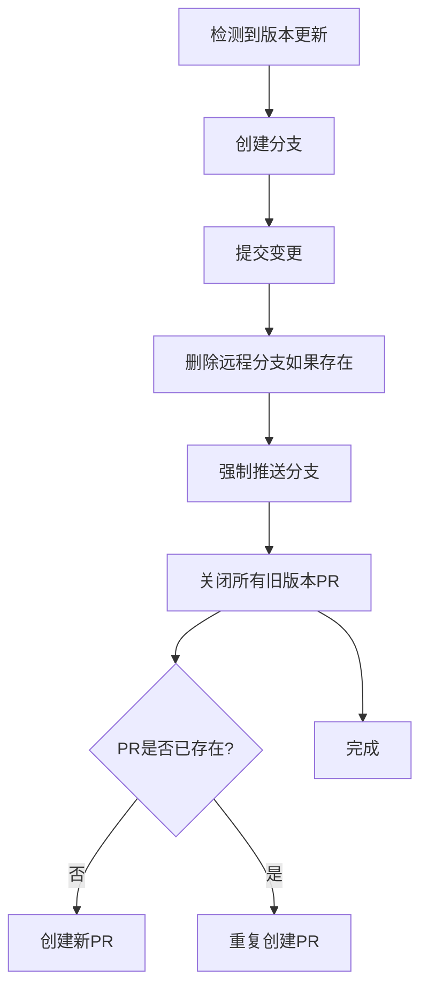
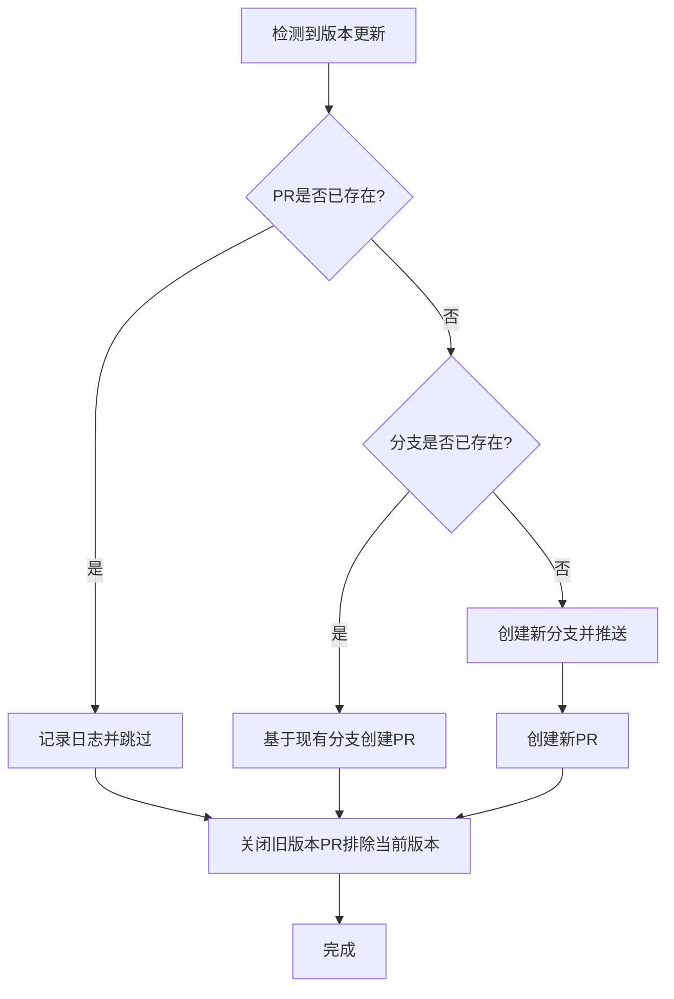
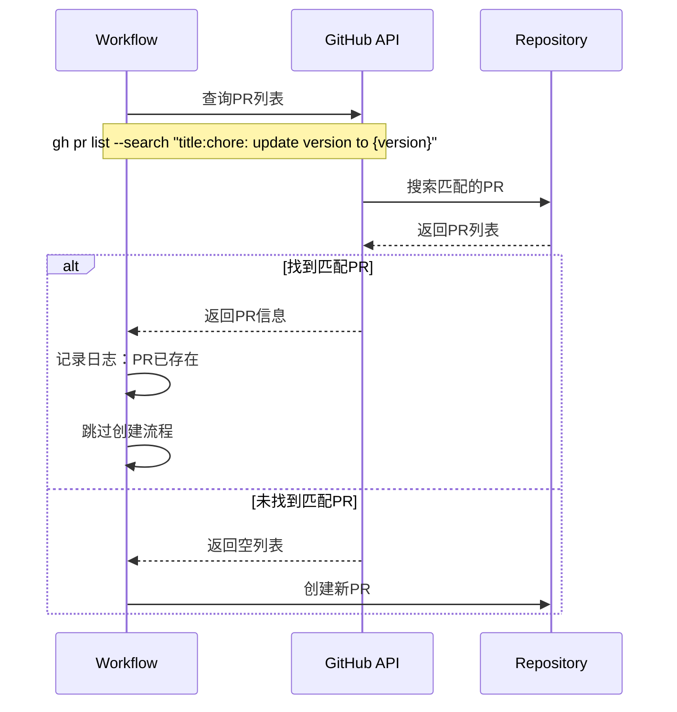

# Change: 优化版本监控工作流避免重复PR

## Why

当前版本监控工作流在检测到版本更新时会创建 Pull Request，但由于缺少重复检查机制，当同一版本的 PR 被手动关闭或分支被删除后，工作流会重复创建相同的 PR。这导致：

1. PR 列表中存在大量重复的版本更新请求
2. 浪费 GitHub Actions 资源和执行时间
3. 不必要的分支强制推送和删除操作
4. 可能关闭正在审查中的 PR

## What Changes

- **添加 PR 存在性检查**：在创建新 PR 前，使用 GitHub CLI 查询是否已存在目标版本的 PR
- **优化分支管理**：在创建分支前检查远程是否已存在同名分支
- **智能更新策略**：
  - 如果 PR 已存在，跳过创建并记录日志
  - 如果分支存在但 PR 不存在，基于现有分支创建 PR
  - 如果两者都不存在，才创建新的分支和 PR
- **改进关闭旧 PR 逻辑**：排除与当前版本相同的 PR，避免关闭目标 PR

## Code Flow Changes

### 当前流程

### 优化后流程

### PR 检查逻辑

## Impact

- **影响的 specs**: 无（这是工具性改进，不影响外部行为规范）
- **影响的代码**:
  - `.github/workflows/version-monitor.yml` - 添加 PR 检查步骤
- **用户体验改进**:
  - 减少 GitHub Actions 任务执行时间
  - 保持 PR 列表整洁
  - 避免重复通知

## Success Criteria

1. ✅ 当检测到新版本时，如果 PR 已存在则不创建新的 PR
2. ✅ 当 PR 被手动关闭后再次运行，不会重新创建相同 PR（如果版本未变）
3. ✅ 当真正有新版本时，仍能正常创建新的 PR
4. ✅ 旧版本 PR 正确关闭，不影响当前版本 PR
5. ✅ 工作流日志清晰记录 PR 检查结果
