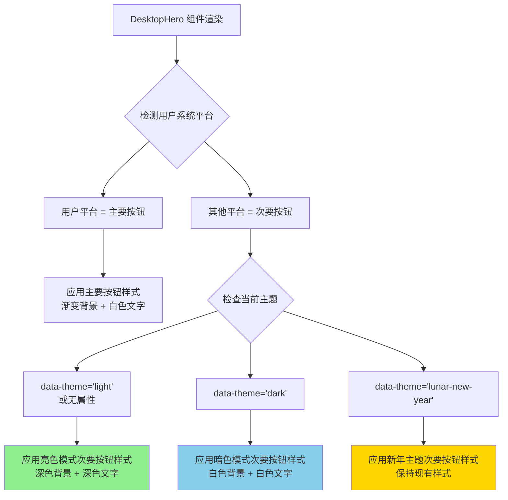

# Change: 修复 Desktop Hero 次要按钮亮色模式对比度

## Why

Desktop Hero 组件 (`apps/website/src/components/desktop/DesktopHero.tsx`) 的次要下载按钮（非用户系统平台）在亮色模式下存在严重的可访问性问题。当前实现使用白色半透明背景 (`rgba(255, 255, 255, 0.12)`) 配合白色边框和白色文字，导致在白色页面背景下文字几乎不可见，对比度极低。这违反了 WCAG AA 级对比度标准（≥ 4.5:1），影响用户识别其他平台下载选项，降低了用户体验和产品可访问性。

## What Changes

- 修改 `DesktopHero.module.css` 中次要按钮的亮色模式样式
- 添加亮色模式专用的次要按钮样式规则，使用深色背景和文字
- 同步修改次要按钮的下拉切换按钮样式
- 确保修改不影响暗色模式和农历新年主题的现有样式
- 使用 CSS 变量（如 `var(--color-text)`）以增强主题一致性
- 保持主要按钮（用户检测到的平台）的现有样式不变

## UI Design Changes

### 当前状态 - 亮色模式下的次要按钮问题

```
┌─────────────────────────────────────────────────────────────────┐
│  Hagicode Desktop                                                │
│  本地化的 AI 代码助手，保护隐私，提升效率                          │
│                                                                  │
│  ┌──────────────────┐  ┌──────────────────┐  ┌──────────────────┐│
│  │  [推荐] Windows  │  │    macOS        │  │    Linux        ││
│  │  [渐变蓝-青-绿]  │  │  ⚠️ 问题区域     │  │  ⚠️ 问题区域     ││
│  │                  │  │                  │  │                  ││
│  │  背景: 蓝青绿渐变 │  │  背景: 12%白色   │  │  背景: 12%白色   ││
│  │  文字: 白色 ✓    │  │  文字: 白色 ✗    │  │  文字: 白色 ✗    ││
│  │  对比度: 优秀    │  │  对比度: < 2:1   │  │  对比度: < 2:1   ││
│  └──────────────────┘  └──────────────────┘  └──────────────────┘│
│                                                                  │
│  白色页面背景下，次要按钮的白色文字几乎完全不可读                 │
└─────────────────────────────────────────────────────────────────┘
```

### 目标状态 - 修复后的次要按钮

```
┌─────────────────────────────────────────────────────────────────┐
│  Hagicode Desktop                                                │
│  本地化的 AI 代码助手，保护隐私，提升效率                          │
│                                                                  │
│  ┌──────────────────┐  ┌──────────────────┐  ┌──────────────────┐│
│  │  [推荐] Windows  │  │    macOS        │  │    Linux        ││
│  │  [渐变蓝-青-绿]  │  │  ✓ 修复后        │  │  ✓ 修复后        ││
│  │                  │  │                  │  │                  ││
│  │  背景: 蓝青绿渐变 │  │  背景: 8%深色    │  │  背景: 8%深色    ││
│  │  文字: 白色 ✓    │  │  文字: 深色 ✓    │  │  文字: 深色 ✓    ││
│  │  边框: 无        │  │  边框: 深色      │  │  边框: 深色      ││
│  └──────────────────┘  └──────────────────┘  └──────────────────┘│
│                                                                  │
│  亮色模式下，次要按钮使用深色文字在浅色背景上，对比度符合 WCAG AA  │
└─────────────────────────────────────────────────────────────────┘
```

### 次要按钮亮色模式样式详情

**正常状态**：
```
┌──────────────────┐
│    macOS         │  ← 深色文字 (#0F172A)
│                  │
│ 背景: rgba(15, 23, 42, 0.08) - 8% 深色半透明
│ 边框: 1px rgba(0, 0, 0, 0.15) - 深色边框
│ 对比度: ~12:1 (WCAG AAA)
└──────────────────┘
```

**悬停状态**：
```
┌──────────────────┐
│    macOS         │  ← 深色文字 (#0060CC)
│                  │
│ 背景: rgba(0, 128, 255, 0.1) - 10% 品牌色半透明
│ 边框: 1px rgba(0, 128, 255, 0.3) - 品牌色边框高亮
│ 对比度: ~8:1 (WCAG AA)
└──────────────────┘
```

### 下拉切换按钮同步修复

**正常状态**：
```
┌──────────┐
│    ▼     │  ← 深色箭头图标 (#0F172A)
│          │
│ 背景: rgba(15, 23, 42, 0.06) - 6% 深色半透明
│ 边框: 左侧深色分割线
└──────────┘
```

## 代码流程变更

### 样式应用流程



### CSS 选择器优先级

```mermaid
graph TD
    A[.platformButtonSecondary .btnDownloadMain] --> B[基础样式<br/>白色半透明背景]
    C[:root .platformButtonSecondary .btnDownloadMain] --> D[亮色模式覆盖<br/>深色背景和文字]
    E[[data-theme='dark'] .platformButtonSecondary .btnDownloadMain] --> F[暗色模式覆盖<br/>保持白色样式]
    G[[data-theme='lunar-new-year'] .platformButtonSecondary .btnDownloadMain] --> H[新年主题覆盖<br/>保持现有样式]

    D --> I[最终: 深色样式]
    F --> J[最终: 白色样式]
    H --> K[最终: 新年样式]
    B -->|被覆盖| D
    B -->|被覆盖| F
    B -->|被覆盖| H

    style D fill:#90EE90
    style F fill:#87CEEB
    style H fill:#FFD700
```

### 主题系统集成

```mermaid
graph LR
    A[DesktopHero.module.css] -->|定义| B[次要按钮样式]
    B --> C[亮色模式样式<br/>:root 选择器]
    B --> D[暗色模式样式<br/>[data-theme='dark']]
    B --> E[新年主题样式<br/>[data-theme='lunar-new-year']]

    C -->|使用变量| F[var(--color-text)<br/>var(--color-border)]
    D -->|使用变量| G[var(--color-text)<br/>var(--color-border)]
    E -->|使用变量| H[新年主题特定颜色]

    F --> I[主题系统<br/>theme-system spec]
    G --> I
    H --> I

    style I fill:#FFD700
```

## 代码变更清单

| 文件路径 | 变更类型 | 变更原因 | 影响范围 |
|---------|---------|---------|---------|
| `apps/website/src/components/desktop/DesktopHero.module.css` | 修改 | 添加亮色模式次要按钮样式 | 次要按钮亮色模式显示 |

### 详细变更 - DesktopHero.module.css

| 样式类 | 变更类型 | 具体变更 | 变更原因 |
|--------|---------|---------|---------|
| `:root .platformButtonSecondary .btnDownloadMain` | 新增 | 添加亮色模式基础样式（深色背景、深色文字、深色边框） | 修复亮色模式对比度问题 |
| `:root .platformButtonSecondary .btnDownloadMain:hover` | 新增 | 添加亮色模式悬停样式（品牌色背景、品牌色边框） | 提供交互反馈 |
| `:root .platformButtonSecondary .btnDropdownToggle` | 新增 | 添加亮色模式下拉按钮样式（深色背景、深色边框） | 同步修复下拉按钮 |
| `:root .platformButtonSecondary .btnDropdownToggle:hover` | 新增 | 添加亮色模式下拉按钮悬停样式 | 提供交互反馈 |

### CSS 变量使用

为确保主题一致性，新增样式将使用以下 CSS 变量：

| 变量名 | 亮色模式值 | 用途 |
|--------|-----------|------|
| `--color-text` | `#0F172A` | 主要文字颜色 |
| `--color-border` | `rgba(0, 0, 0, 0.15)` | 边框颜色 |
| `--color-primary` | `#0080FF` | 品牌主色 |

## Impact

- **影响规范**: `theme-system` - 修改亮色主题下次要按钮的样式规范
- **影响代码**:
  - `apps/website/src/components/desktop/DesktopHero.module.css` - 添加亮色模式次要按钮样式
- **用户体验**: 亮色模式下次要按钮文字清晰可读，符合 WCAG AA 对比度标准
- **可访问性**: 满足 WCAG 2.1 AA 级对比度要求（≥ 4.5:1），目标达到 AAA 级（≥ 7:1）
- **兼容性**:
  - 不影响暗色模式次要按钮的现有样式
  - 不影响农历新年主题次要按钮的现有样式
  - 不影响主要按钮的渐变背景样式
  - 与现有的主题切换系统完全兼容
- **国际化**: 无文字内容变更，不影响国际化
- **性能**: 纯 CSS 修改，无性能影响
