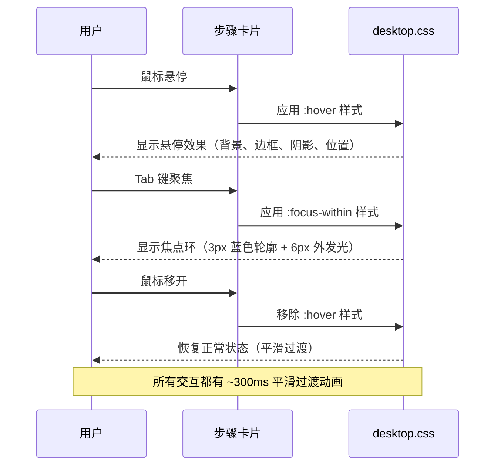
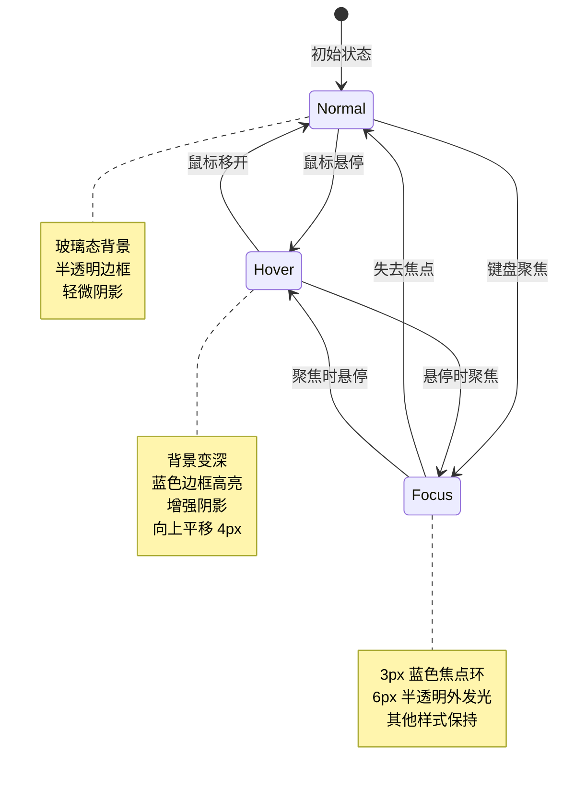
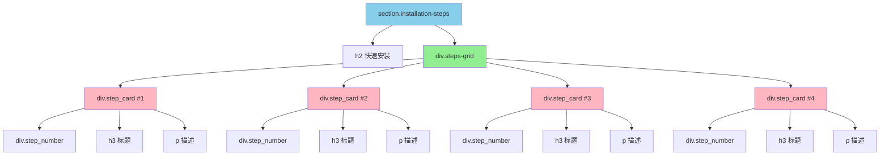

# Design: Desktop 页面快速安装区域样式修复

## Context

Desktop 页面的快速安装区域（位于 FAQ 上方，使用静态 HTML 结构）当前存在样式问题，导致该区域看起来像纯文本显示，与其他组件的视觉风格差异明显。该页面采用 HUD/Sci-Fi FUI + Glassmorphism 设计系统，支持多主题（light/dark/lunar-new-year）切换。

**问题背景**：
- 快速安装区域（`section.installation-steps`）缺少清晰的视觉层次，步骤卡片看起来像纯文本
- 可能存在样式定义缺失或样式类未正确应用
- 与页面的 Hero 内容、功能特性卡片、FAQ 等组件风格不一致
- 影响用户对安装步骤的识别和理解

**设计约束**：
- 必须与现有设计系统（HUD/Sci-Fi FUI + Glassmorphism）保持一致
- 支持三种主题：light、dark、lunar-new-year
- 需要响应式设计，支持移动端、平板端、桌面端
- 必须满足可访问性要求（对比度、焦点样式、键盘导航）

## Goals / Non-Goals

**Goals**:
- 修复快速安装区域的样式，使其具有清晰的视觉层次
- 确保步骤卡片具有明显的玻璃态效果和交互状态（hover、focus）
- 统一页面风格，提升品牌形象和用户体验
- 保持与设计系统完全对齐，便于未来主题扩展
- 使用全局样式（desktop.css）管理快速安装区域样式

**Non-Goals**:
- 不改变 HTML 结构（静态 HTML 已存在且符合语义化标准）
- 不改变安装步骤的内容
- 不影响其他页面组件的样式

## Decisions

### 1. 样式架构决策

**Decision**: 使用全局样式（desktop.css）管理快速安装区域样式

**Reasoning**:
- 快速安装区域使用静态 HTML 结构，不需要 CSS Modules
- 全局样式便于维护和主题适配
- 与现有 desktop.css 架构保持一致

**Alternatives considered**:
- **CSS Modules**: 需要重构为 React 组件，增加复杂度
- **内联样式**: 难以维护，不支持主题切换
- **Tailwind CSS**: 需要大规模重构，不符合现有技术栈

### 2. 卡片视觉层次决策

**Decision**: 使用玻璃态效果 + 渐变编号创建视觉层次

**Reasoning**:
- 玻璃态效果（glassmorphism）符合设计系统风格
- 渐变编号提供强烈的视觉吸引力，符合 Sci-Fi FUI 风格
- 阴影和边框创建深度感，增强交互反馈
- 步骤编号的视觉突出帮助用户快速识别安装流程

**Alternatives considered**:
- **纯色背景**: 视觉吸引力不足，不符合设计系统
- **边框高亮**: 对比度不足，在暗色背景下不明显
- **仅使用颜色区分**: 缺乏深度感和交互反馈

### 3. 交互状态决策

**Decision**: 使用平滑过渡动画 + 多层次反馈

**Reasoning**:
- 平滑过渡动画提供流畅的用户体验
- 多层次反馈（背景、边框、阴影、位置）增强交互感知
- 符合现代 UI/UX 最佳实践

**Alternatives considered**:
- **无动画**: 用户体验较差，缺乏交互反馈
- **复杂动画**: 可能影响性能，不符合"快速安装"的简洁定位

## UI/UX Design

### 界面设计

#### 快速安装区域布局（桌面端）

```
┌─────────────────────────────────────────────────────────────────┐
│  快速安装                                                        │
│  ┌─────────────┐  ┌─────────────┐  ┌─────────────┐          │
│  │     ①       │  │     ②       │  │     ③       │          │
│  │ 下载安装包   │  │ 运行安装程序  │  │  启动应用    │          │
│  │ 根据你的操作 │  │ 双击下载的   │  │ 首次启动时会 │          │
│  │ 系统选择对应 │  │ 安装包按照   │  │ 引导你完成   │          │
│  │ 的安装包     │  │ 提示完成安装 │  │ 初始配置     │          │
│  │             │  │             │  │             │          │
│  │ [玻璃态卡片]  │  │ [玻璃态卡片]  │  │ [玻璃态卡片]  │          │
│  └─────────────┘  └─────────────┘  └─────────────┘          │
│                                                                  │
│  ┌─────────────┐                                               │
│  │     ④       │                                               │
│  │  开始使用    │                                               │
│  │ 配置完成后即 │                                               │
│  │ 可开始使用   │                                               │
│  │ Hagicode    │                                               │
│  │ Desktop     │                                               │
│  │             │                                               │
│  │ [玻璃态卡片]  │                                               │
│  └─────────────┘                                               │
└─────────────────────────────────────────────────────────────────┘
```

#### 步骤卡片详细设计

**正常状态**：
```
┌─────────────────────┐
│       ①             │  ← 圆形徽章，渐变背景（蓝→青→绿）
│    下载安装包         │  ← 标题，加粗
│  根据你的操作系统     │  ← 描述文字
│  选择对应的安装包     │
│                      │
│ 背景: rgba(255,255,255,0.08)  (glassmorphism)
│ 边框: 1px solid rgba(255,255,255,0.15)
│ 阴影: 0 2px 8px rgba(0,0,0,0.1)
│ 圆角: 0.75rem
│ 内边距: 1.5rem
└─────────────────────┘
```

**悬停状态**：
```
┌─────────────────────┐
│       ①             │  ← 圆形徽章，轻微发光
│    下载安装包         │
│  根据你的操作系统     │
│  选择对应的安装包     │
│                      │
│ 背景: rgba(255,255,255,0.12)
│ 边框: 1px solid rgba(0,128,255,0.4)
│ 阴影: 0 4px 16px rgba(0,128,255,0.15)
│ 变换: translateY(-4px)
│ 过渡: all 0.3s cubic-bezier(0.4, 0, 0.2, 1)
└─────────────────────┘
```

**焦点状态（键盘导航）**：
```
┌─────────────────────┐
│  ═════════════════  │  ← 焦点环: 3px 蓝色轮廓
│  ║     ①           ║  ← 焦点环: 6px 半透明外发光
│  ║  下载安装包       ║
│  ║根据你的操作系统   ║
│  ║选择对应的安装包   ║
│  ║                  ║
│  ═════════════════  │
│  其他样式保持不变
└─────────────────────┘
```

### 交互流程



### 状态转换图



### 移动端/响应式设计

**移动端（≤480px）布局**：

```
┌─────────────────────────┐
│  快速安装                │
│                         │
│  ┌───────────────────┐  │
│  │       ①          │  │  ← 单列垂直堆叠
│  │   下载安装包       │  │
│  │  根据你的操作系统  │  │
│  │  选择对应的安装包  │  │
│  └───────────────────┘  │
│                         │
│  ┌───────────────────┐  │
│  │       ②          │  │
│  │  运行安装程序      │  │
│  └───────────────────┘  │
│                         │
│  ┌───────────────────┐  │
│  │       ③          │  │
│  │   启动应用        │  │
│  └───────────────────┘  │
│                         │
│  ┌───────────────────┐  │
│  │       ④          │  │
│  │   开始使用        │  │
│  └───────────────────┘  │
└─────────────────────────┘
```

**响应式断点**：
- 移动端: ≤480px - 单列布局，卡片间距 0.875rem
- 平板端: 481px-768px - 两列布局，卡片间距 1rem
- 桌面端: >768px - 四列布局，卡片间距 1.5rem

### 主题适配

**Light 主题**：
- 卡片背景: rgba(255, 255, 255, 0.08) + backdrop-filter
- 卡片边框: rgba(255, 255, 255, 0.15)
- 步骤编号: 蓝→青→绿 渐变
- 标题颜色: #ffffff
- 描述颜色: rgba(255, 255, 255, 0.7)

**Dark 主题**：
- 卡片背景: rgba(255, 255, 255, 0.05) + backdrop-filter
- 卡片边框: rgba(255, 255, 255, 0.1)
- 步骤编号: 蓝→青→绿 渐变（增强发光）
- 标题颜色: #ffffff
- 描述颜色: rgba(255, 255, 255, 0.6)

**Lunar New Year 主题**：
- 卡片背景: rgba(255, 193, 7, 0.05) + backdrop-filter
- 卡片边框: rgba(255, 193, 7, 0.2)
- 步骤编号: 红→橙→金 渐变
- 标题颜色: #ffffff
- 描述颜色: rgba(255, 255, 255, 0.7)

## Technical Design

### 架构图

```mermaid
graph TB
    subgraph "Desktop 页面"
        A[index.astro] --> B[快速安装区域<br/>section.installation-steps]
    end

    subgraph "样式系统"
        C[desktop.css]
        D[homepage.css]
        E[themes.css]
        F[variables.css]
    end

    B -->|全局样式| C
    C -->|@import| D
    D -->|@import| E
    D -->|@import| F

    G[设计系统变量] --> E
    G --> F

    style B fill:#87CEEB
    style C fill:#90EE90
    style D fill:#FFD700
    style E fill:#FFB6C1
    style F fill:#FFB6C1
```

### HTML 结构图



## 实现细节

### 关键样式定义

**区域容器样式**：
```css
/* 快速安装区域容器 */
.installation-steps {
  padding: 4rem 1.5rem;
  max-width: 1200px;
  margin: 0 auto;
}

.installation-steps h2 {
  font-size: 2rem;
  font-weight: 700;
  text-align: center;
  margin-bottom: 3rem;
  color: var(--color-text, #ffffff);
}
```

**步骤网格布局**：
```css
/* 步骤网格 */
.steps-grid {
  display: grid;
  grid-template-columns: repeat(4, 1fr);
  gap: 1.5rem;
  width: 100%;
}

/* 移动端响应式 */
@media (max-width: 768px) {
  .steps-grid {
    grid-template-columns: repeat(2, 1fr);
    gap: 1rem;
  }
}

@media (max-width: 480px) {
  .steps-grid {
    grid-template-columns: 1fr;
    gap: 0.875rem;
  }
}
```

**步骤卡片样式**：
```css
/* 步骤卡片 */
.step-card {
  background: rgba(255, 255, 255, 0.08);
  backdrop-filter: blur(16px);
  -webkit-backdrop-filter: blur(16px);
  border: 1px solid rgba(255, 255, 255, 0.15);
  border-radius: 0.75rem;
  padding: 1.5rem;
  box-shadow: 0 2px 8px rgba(0, 0, 0, 0.1);
  transition: all 0.3s cubic-bezier(0.4, 0, 0.2, 1);
  min-height: 200px;
  display: flex;
  flex-direction: column;
  align-items: center;
  text-align: center;
}

/* 悬停状态 */
.step-card:hover {
  background: rgba(255, 255, 255, 0.12);
  border-color: rgba(0, 128, 255, 0.4);
  box-shadow: 0 4px 16px rgba(0, 128, 255, 0.15);
  transform: translateY(-4px);
}

/* 焦点状态 */
.step-card:focus-within {
  outline: none;
  box-shadow: 0 0 0 3px var(--color-primary, #0080FF),
              0 0 0 6px rgba(0, 128, 255, 0.2);
}
```

**步骤编号样式**：
```css
/* 步骤编号 */
.step-number {
  width: 48px;
  height: 48px;
  display: flex;
  align-items: center;
  justify-content: center;
  background: linear-gradient(135deg, #0080FF 0%, #00CCCC 50%, #22C55E 100%);
  color: #ffffff;
  font-size: 1.5rem;
  font-weight: 700;
  border-radius: 50%;
  margin-bottom: 1rem;
  box-shadow: 0 4px 12px rgba(0, 128, 255, 0.3);
}

/* 农历新年主题 */
[data-theme='lunar-new-year'] .step-number {
  background: linear-gradient(135deg, #FF1744 0%, #FF9100 50%, #FFD600 100%);
  box-shadow: 0 4px 12px rgba(255, 23, 68, 0.3);
}
```

**卡片内容样式**：
```css
/* 步骤标题 */
.step-card h3 {
  font-size: 1.125rem;
  font-weight: 600;
  color: var(--color-text, #ffffff);
  margin: 0 0 0.75rem 0;
}

/* 步骤描述 */
.step-card p {
  font-size: 0.9375rem;
  color: var(--color-text-secondary, rgba(255, 255, 255, 0.7));
  line-height: 1.5;
  margin: 0;
}
```

### 配置变更

无配置文件变更，仅修改 desktop.css 样式文件。

## 测试策略

### 视觉回归测试

1. **截图对比测试**
   - 对比修复前后的页面截图
   - 验证所有主题下的视觉效果
   - 检查响应式断点的布局变化

2. **交互状态测试**
   - 测试所有卡片的 hover、focus 状态
   - 验证过渡动画的流畅性
   - 检查键盘导航的焦点样式

### 跨浏览器测试

- Chrome/Edge (最新版)
- Firefox (最新版)
- Safari (最新版，特别测试 backdrop-filter 支持)
- 移动浏览器 (iOS Safari, Chrome Mobile)

### 可访问性测试

- 对比度检查（WCAG AA 标准）
- 键盘导航测试（Tab 键、方向键）
- 屏幕阅读器测试（NVDA、VoiceOver）
- 触摸目标尺寸测试（移动端最小 44x44px）

### 性能测试

- 测量样式加载和渲染时间
- 检查动画帧率（目标 60fps）
- 验证 CSS 文件大小（避免过度增长）

## Risks / Trade-offs

### 风险

1. **样式冲突风险**
   - **风险**: 全局样式可能与现有样式冲突
   - **缓解**: 使用明确的类名，避免 !important，测试所有主题

2. **浏览器兼容性风险**
   - **风险**: backdrop-filter 在旧版浏览器中不支持
   - **缓解**: 提供 -webkit- 前缀，设置降级样式（纯色背景）

3. **性能风险**
   - **风险**: backdrop-filter 和动画可能影响性能
   - **缓解**: 使用 transform 和 opacity 进行动画，避免重排

### 权衡

1. **视觉效果 vs 性能**
   - **决策**: 保留玻璃态效果和动画，使用硬件加速优化
   - **权衡**: 牺牲少量性能以获得更好的用户体验

2. **代码复杂度 vs 可维护性**
   - **决策**: 使用全局样式而非重构为 React 组件
   - **权衡**: 保持现有架构，但需要更仔细的样式管理

## Migration Plan

**步骤**：
1. 备份当前 desktop.css 文件
2. 在 desktop.css 中添加快速安装区域样式
3. 本地测试所有功能和视觉效果
4. 提交代码审查
5. 合并后部署到测试环境
6. 执行视觉回归测试和跨浏览器测试
7. 部署到生产环境

**回滚计划**：
- 如果发现严重问题，立即回滚到原始 desktop.css
- 保留备份文件以便快速恢复
- 记录所有更改以便后续重新应用

## Open Questions

1. **样式优先级问题**: desktop.css 中是否存在与其他样式冲突的规则？
   - **行动**: 在实施阶段检查并解决

2. **backdrop-filter 兼容性**: 是否需要为不支持 backdrop-filter 的浏览器提供降级方案？
   - **决策**: 提供降级样式（纯色背景），确保基本功能可用

3. **动画性能**: 过渡动画在低端设备上可能导致性能问题
   - **决策**: 添加 `@media (prefers-reduced-motion: reduce)` 支持
