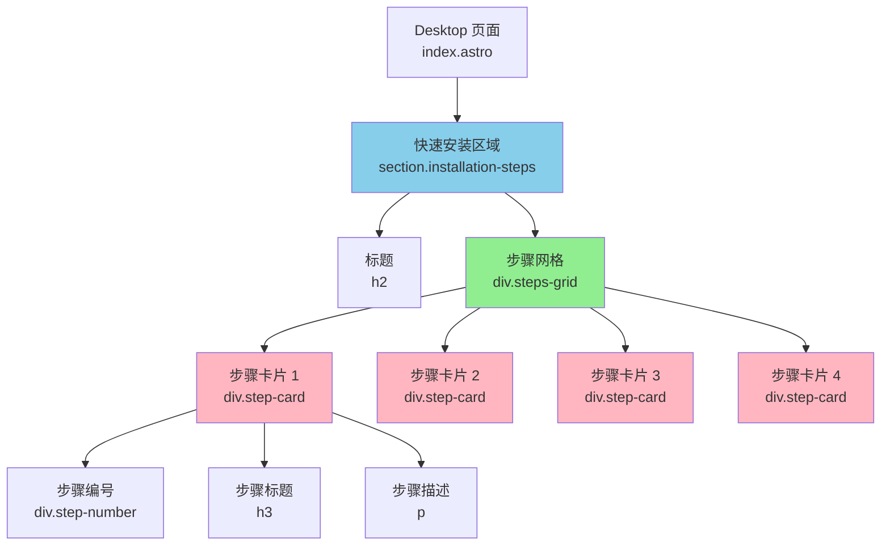
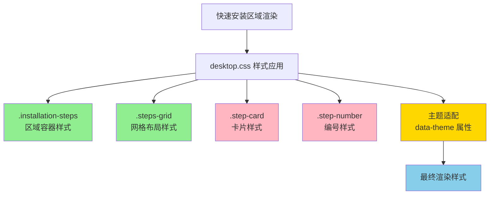

# Change: 修复 Desktop 页面快速安装区域样式问题

## Why

Desktop 页面 (`apps/website/src/pages/desktop/index.astro`) 的"快速安装"区域（位于 FAQ 上方，第 218-243 行）存在样式问题，导致该区域看起来像纯文本显示，与其他组件的视觉风格不一致。该区域使用静态 HTML 结构（非 React 组件），由 `desktop.css` 提供样式支持。这影响了页面的整体视觉一致性和用户体验，使得安装步骤不够突出，降低了用户的安装意愿。

## What Changes

- 修复"快速安装"区域的 HTML 结构和样式类绑定，确保所有样式正确应用
- 增强 `desktop.css` 中快速安装区域的样式定义（`.installation-steps`、`.steps-grid`、`.step-card`）
- 补充缺失的视觉层次和交互状态（hover、focus、active）
- 调整全局样式优先级，确保快速安装区域与设计系统一致
- 验证主题适配（light/dark/lunar-new-year），确保所有主题下样式正确
- 优化响应式设计，确保移动端体验一致

## UI Design Changes

### 当前状态 - 快速安装区域样式问题

```
┌─────────────────────────────────────────────────────────────────┐
│  快速安装                                                        │
│                                                                  │
│  1   下载安装包         2   运行安装程序                          │
│  根据你的操作系统       双击下载的安装包                         │
│  选择对应的安装包       按照提示完成安装                         │
│  ← 看起来像纯文本，无明显卡片样式和视觉层次                      │
│                                                                  │
│  3   启动应用           4   开始使用                              │
│  首次启动时会引导       配置完成后即可                           │
│  你完成初始配置         开始使用 Hagicode Desktop                │
└─────────────────────────────────────────────────────────────────┘
```

### 目标状态 - 修复后的快速安装区域

```
┌─────────────────────────────────────────────────────────────────┐
│  快速安装                                                        │
│                                                                  │
│  ┌─────────────┐  ┌─────────────┐  ┌─────────────┐          │
│  │     ①       │  │     ②       │  │     ③       │          │
│  │ 下载安装包   │  │ 运行安装程序  │  │  启动应用    │          │
│  │ 根据你的操作 │  │ 双击下载的   │  │ 首次启动时会 │          │
│  │ 系统选择对应 │  │ 安装包按照   │  │ 引导你完成   │          │
│  │ 的安装包     │  │ 提示完成安装 │  │ 初始配置     │          │
│  │             │  │             │  │             │          │
│  │  [玻璃态卡片] │  │  [玻璃态卡片] │  │  [玻璃态卡片] │          │
│  └─────────────┘  └─────────────┘  └─────────────┘          │
│                                                                  │
│  ┌─────────────┐                                               │
│  │     ④       │                                               │
│  │  开始使用    │                                               │
│  │ 配置完成后即 │                                               │
│  │ 可开始使用   │                                               │
│  │ Hagicode    │                                               │
│  │ Desktop     │                                               │
│  │             │                                               │
│  │  [玻璃态卡片] │                                               │
│  └─────────────┘                                               │
└─────────────────────────────────────────────────────────────────┘
```

### 步骤卡片交互状态

**正常状态**：
```
┌─────────────┐
│     ①       │  ← 圆形徽章，渐变背景
│ 下载安装包   │  ← 标题，加粗
│ 根据你的操作 │  ← 描述文字
│ 系统选择对应 │
│ 的安装包     │
│             │
│ 背景: 半透明白色 (glassmorphism)
│ 边框: 1px 半透明白色边框
│ 阴影: 轻微阴影效果
└─────────────┘
```

**悬停状态**：
```
┌─────────────┐
│     ①       │  ← 圆形徽章，轻微发光
│ 下载安装包   │  ← 标题
│ 根据你的操作 │  ← 描述文字
│ 系统选择对应 │
│ 的安装包     │
│             │
│ 背景: 半透明白色 (增加透明度)
│ 边框: 蓝色高亮边框
│ 阴影: 增强阴影效果
│ 变换: 向上平移 4px
└─────────────┘
```

**焦点状态（键盘导航）**：
```
┌─────────────┐
│     ①       │  ← 焦点环: 3px 蓝色轮廓
│ 下载安装包   │  ← 焦点环: 6px 半透明外发光
│ 根据你的操作 │
│ 系统选择对应 │
│ 的安装包     │
│             │
│ 其他样式保持不变
└─────────────┘
```

## 代码流程变更

### 快速安装区域结构



### 样式应用流程



### 样式系统集成

```mermaid
graph LR
    A[desktop.css] -->|定义| B[快速安装区域样式]
    A -->|@import| C[homepage.css]
    C -->|变量| D[themes.css]
    C -->|变量| E[variables.css]
    D -->|主题变量| F["data-theme 属性"]
    F --> G["light-dark-lunar-new-year"]

    style B fill:#90EE90
    style C fill:#FFD700
    style D fill:#FFB6C1
    style E fill:#FFB6C1
    style F fill:#FFA500
    style G fill:#FF69B4
```

## 代码变更清单

| 文件路径 | 变更类型 | 变更原因 | 影响范围 |
|---------|---------|---------|---------|
| `apps/website/src/pages/desktop/index.astro` | 验证 | 确认快速安装区域的 HTML 结构和类名 | 静态 HTML 结构 |
| `apps/website/src/styles/desktop.css` | 修改 | 补充和优化快速安装区域的样式定义 | 快速安装区域样式 |

### 详细变更 - desktop.css

| 样式类 | 变更类型 | 具体变更 | 变更原因 |
|--------|---------|---------|---------|
| `.installation-steps` | 补充 | 添加明确的区域容器样式（间距、对齐、最大宽度） | 确保容器正确显示 |
| `.installation-steps h2` | 补充 | 添加标题样式（字体大小、粗细、对齐） | 标题视觉效果 |
| `.steps-grid` | 优化 | 确保 grid 布局正确（列数、间距） | 步骤卡片网格布局 |
| `.step-card` | 补充 | 添加完整的卡片样式（背景、边框、阴影、间距） | 卡片视觉效果 |
| `.step-card:hover` | 补充 | 添加悬停状态样式（背景变化、边框高亮、阴影增强） | 交互反馈 |
| `.step-card:focus-within` | 补充 | 添加焦点状态样式（焦点环） | 键盘导航支持 |
| `.step-number` | 优化 | 增强编号样式（渐变背景、圆形、阴影） | 编号视觉突出 |
| `.step-card h3` | 补充 | 添加标题样式（字体大小、粗细、颜色） | 标题层次 |
| `.step-card p` | 补充 | 添加描述文字样式（颜色、行高、间距） | 描述可读性 |

## Impact

- **影响规范**: `astro-site` - 修改 Desktop 页面的快速安装区域样式
- **影响代码**:
  - `apps/website/src/pages/desktop/index.astro` - HTML 结构验证（静态，无需修改）
  - `apps/website/src/styles/desktop.css` - 快速安装区域样式补充和优化
- **用户体验**: 快速安装区域将具有清晰的视觉层次，用户能够立即识别安装步骤，提升安装意愿
- **兼容性**: 现有功能（安装步骤内容）完全保留，不影响其他页面组件的样式
