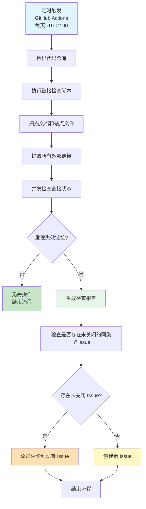
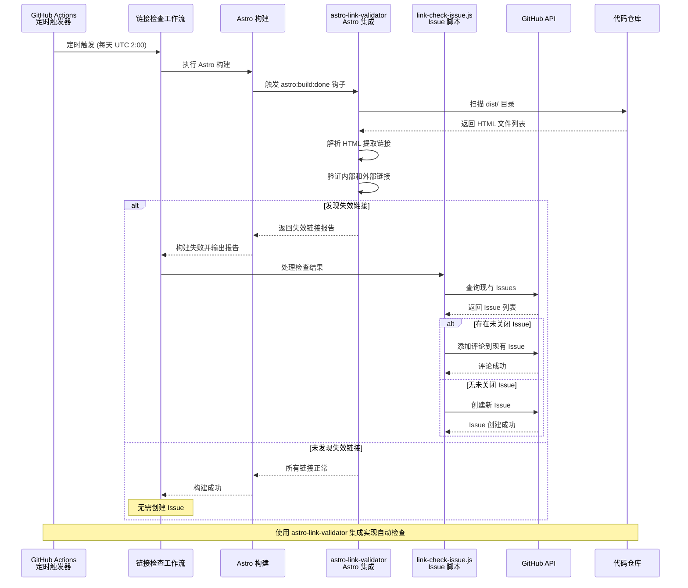
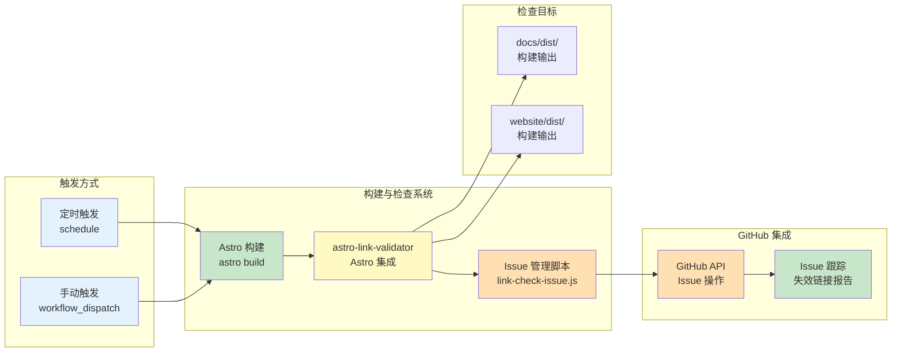

# Change: 添加外部链接自动检查工作流

## Why

当前项目缺少自动化的外部链接检查机制，存在以下问题：

1. **链接失效难以及时发现**：站点中的外部链接可能已失效（返回 404 状态码），但无法及时发现
2. **手动检查效率低下**：手动检查所有链接效率低下且容易遗漏
3. **用户体验和 SEO 受损**：链接失效会降低用户体验和 SEO 表现
4. **构建配置要求**：Astro 配置中使用 `onBrokenLinks: 'throw'`，要求确保所有链接有效

### 现有解决方案调研

经调研发现以下现有解决方案：

1. **astro-link-validator** ([GitHub](https://github.com/rodgtr1/astro-link-validator)) - Astro 集成
   - 在构建时验证所有链接（内部和外部）
   - 支持 HTML 解析，检查 `href`、`src`、`srcset` 属性
   - 可配置外部链接检查（默认禁用以提升构建速度）
   - 尚未发布到 npm，需从 GitHub 安装

2. **lychee** ([GitHub](https://github.com/lycheeverse/lychee)) - Rust 链接检查器
   - 快速、异步、基于流的链接检查器
   - 支持 Markdown、HTML、reStructuredText 和网站
   - 高性能，适合大量链接检查

3. **markdown-link-check** ([npm](https://www.npmjs.com/package/markdown-link-check)) - Markdown 专用
   - 专门检查 Markdown 文件中的链接
   - 支持配置文件和排除规则

4. **linkinator** ([GitHub](https://github.com/JustinBeckwith/linkinator)) - 网站爬取
   - 爬取网站并验证链接
   - 适合检查已构建的站点

### 选择方案

本提案采用 **混合方案**：
- 使用 **astro-link-validator** 作为基础集成（利用其构建时钩子）
- 创建自定义 **GitHub Actions 工作流** 实现定时检查和 Issue 管理
- 理由：astro-link-validator 与 Astro 深度集成，可检查构建后的 HTML，更适合本项目的需求

## What Changes

### 实施方案：基于 astro-link-validator 的集成方案

采用 **astro-link-validator** Astro 集成作为核心，配合 GitHub Actions 工作流实现自动化检查：

### 新增组件

1. **Astro 集成** - `astro-link-validator`
   - 安装方式：`npm install github:rodgtr1/astro-link-validator`
   - 配置到 `astro.config.mjs` 中
   - 利用 `astro:build:done` 钩子在构建后自动检查
   - 支持检查构建后的 HTML 文件（覆盖 Markdown 和 Astro 组件生成的链接）

2. **GitHub Actions 工作流** (`.github/workflows/link-check.yml`)
   - 定时执行：每天 UTC 2:00
   - 手动触发支持（workflow_dispatch）
   - 构建站点并触发链接检查
   - 解析检查结果并创建/更新 Issue

3. **Issue 管理脚本** (`scripts/link-check-issue.js`)
   - 解析 astro-link-validator 的输出
   - 检查是否存在未关闭的同类型 Issue
   - 创建或更新 Issue
   - 格式化失效链接列表

4. **配置文件**
   - Astro 配置中的 `linkValidator()` 选项
   - GitHub Actions 工作流环境变量

### 技术优势

| 特性 | 自定义脚本方案 | astro-link-validator 方案 |
|-----|--------------|-------------------------|
| 集成复杂度 | 需要自行实现所有功能 | 开箱即用，利用 Astro 钩子 |
| 检查范围 | 仅扫描源文件 | 检查构建后的 HTML（更全面） |
| 维护成本 | 高（需维护自定义代码） | 低（依赖社区维护的集成） |
| 性能优化 | 需手动实现并发控制 | 内置并发和性能优化 |
| 内部链接检查 | 需要额外实现 | 内置支持 |
| 外部链接检查 | 需要自行实现 HTTP 请求 | 内置支持（可配置） |

## Code Flow Changes

### 链接检查与 Issue 提交流程



### 组件交互时序图



### 系统架构图



### astro-link-validator 配置

#### 文档站点配置 (`apps/docs/astro.config.mjs`)

```javascript
import { defineConfig } from 'astro/config';
import linkValidator from 'astro-link-validator';

export default defineConfig({
  integrations: [
    linkValidator({
      // 启用外部链接检查（在 CI 环境中）
      checkExternal: process.env.CI === 'true',
      // 外部链接超时时间（毫秒）
      externalTimeout: 10000,
      // 遇到失效链接时构建失败
      failOnBrokenLinks: true,
      // 详细输出（用于调试）
      verbose: process.env.CI === 'true',
      // 排除某些路径
      exclude: ['/api/*', '/admin/*'],
      // 如果有重定向文件
      redirectsFile: '_redirects',
    })
  ],
});
```

#### 营销站点配置 (`apps/website/astro.config.mjs`)

类似配置，根据营销站点的具体需求调整。

### Issue 内容格式

**标题**：`[链接检查] 发现失效外部链接 - YYYY-MM-DD`

**正文**：
```markdown
## 检查日期
2026-02-16

## 检查结果
发现 5 个失效的外部链接：

| 文件路径 | 行号 | 链接 | 状态码 |
|---------|------|------|--------|
| docs/quick-start/installation.md | 42 | https://example.com/broken | 404 |
| ...

## 建议操作
- 修复失效链接
- 或将其添加到排除列表（如 .github/link-check-config.json）

---
此 Issue 由链接检查工作流自动创建
```

## Impact

### 预期收益

1. **提升链接质量**：自动发现失效链接，提升用户体验
2. **改善 SEO 表现**：减少 404 链接，改善搜索引擎评价
3. **降低维护成本**：自动化检查替代手动检查
4. **及早发现问题**：定期检查确保外部链接始终有效

### 技术考量

1. **性能影响**：
   - astro-link-validator 内置并发检查，可配置并发数量
   - 外部链接检查会显著增加构建时间（可能从秒级增加到分钟级）
   - 建议：仅在 CI 环境中启用外部链接检查，本地开发禁用
   - GitHub Actions 免费额度内运行（每天一次约 5-15 分钟）

2. **误报处理**：
   - 通过 `exclude` 选项排除特定路径
   - 支持 `redirectsFile` 配置处理重定向
   - 可配置超时时间避免误判

3. **Issue 管理**：
   - 去重机制避免重复创建
   - 添加评论到现有 Issue 而非新建
   - 搜索最近 7 天内的同类 Issue

4. **构建集成**：
   - 利用 Astro 的 `astro:build:done` 钩子
   - 构建失败时触发 Issue 创建
   - 构建成功时不创建 Issue

### 兼容性

- 与现有 GitHub Actions 工作流完全兼容
- 不影响现有 CI/CD 流程
- 可独立启用/禁用链接检查功能
- 支持 Node.js >= 18.0 环境

### 风险与缓解

| 风险 | 缓解措施 |
|-----|---------|
| 构建时间增加 | 仅在 CI 环境启用外部链接检查，本地开发禁用 |
| HTTP 请求超时 | 配置合理的 `externalTimeout`（默认 10 秒） |
| 误报（临时性失效） | 配置 `exclude` 选项排除不稳定路径 |
| Issue 泛滥 | 去重机制：检查最近 7 天内的未关闭 Issue |
| 第三方依赖风险 | astro-link-validator 未发布到 npm，需从 GitHub 安装；考虑备用方案（lychee） |
| 重定向链接误报 | 配置 `redirectsFile` 支持重定向规则 |

### 替代方案

如果 astro-link-validator 不可用或不满足需求，可考虑以下替代方案：

1. **lychee** - 高性能 Rust 链接检查器
   - 优点：快速、成熟、支持多种文件格式
   - 缺点：需要额外安装 Rust 二进制文件或使用 Docker

2. **markdown-link-check** - Markdown 专用检查器
   - 优点：轻量级、专注于 Markdown
   - 缺点：仅支持 Markdown，不检查构建后的 HTML

3. **自建脚本** - 完全自定义实现
   - 优点：完全控制
   - 缺点：维护成本高，需要处理各种边界情况

### 受影响的规范

- `github-integration` - 扩展 GitHub Actions 工作流规范，添加链接检查功能
