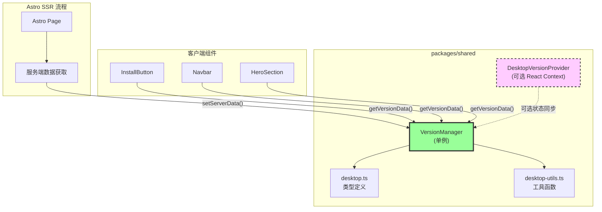
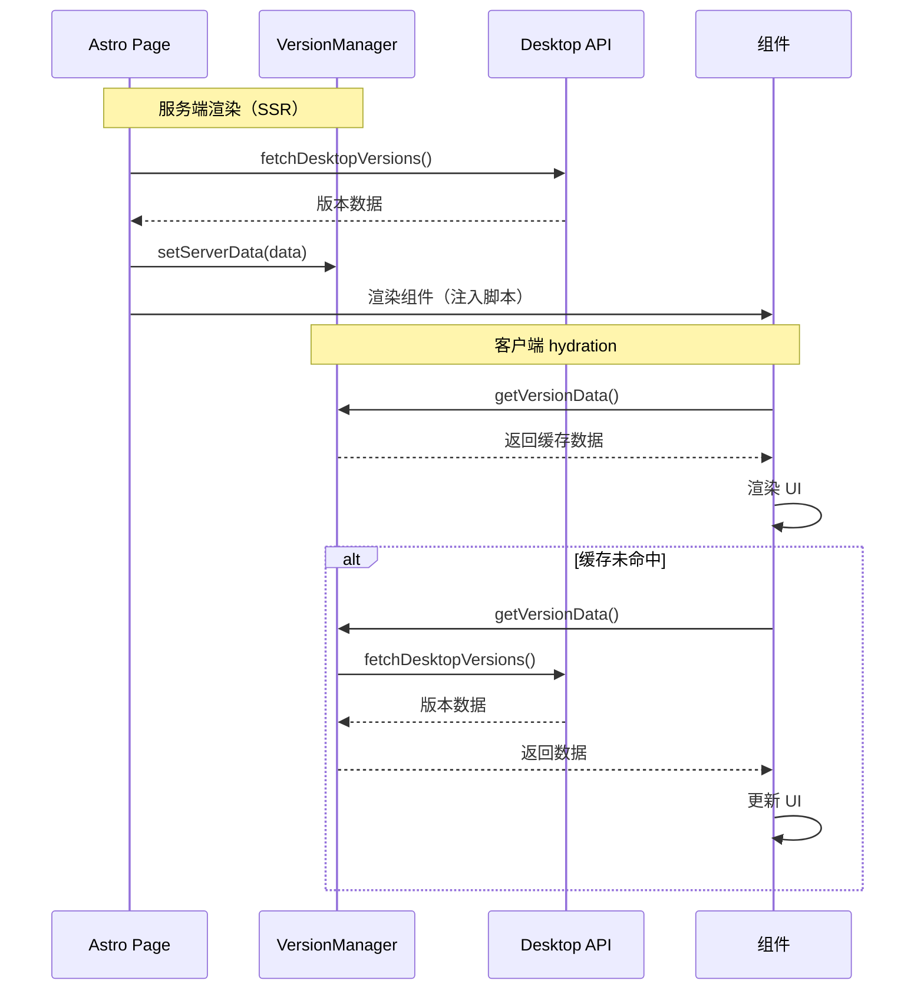

# Design: 统一 Desktop 版本信息管理

## Overview

本设计文档描述如何将分散在 `apps/docs` 和 `apps/website` 中的 Desktop 版本管理逻辑统一到 `packages/shared`，通过引入版本数据管理器简化组件使用并消除代码重复。

## Context

**当前问题**：
- 两个应用中存在相同的 `desktop.ts` 类型定义和 `desktop-utils.ts` 工具函数
- 每个使用安装按钮的页面都需要手动获取并传递版本信息作为 props
- 版本数据的获取和状态管理分散在多个组件中
- 缺乏统一的缓存机制，可能导致重复请求

**目标**：
- 将类型定义和工具函数统一到 `packages/shared`
- 创建版本数据管理器，提供统一的数据访问接口
- 简化组件接口，无需手动传递版本信息
- 支持服务端渲染（SSR）和客户端状态管理

**约束**：
- 必须保持向后兼容，允许逐步迁移
- 不能破坏现有的构建流程
- 需要支持 Astro 的 SSR 场景

## Goals / Non-Goals

**Goals**:
- 消除代码重复，统一类型和工具函数
- 简化组件使用，无需传递版本信息 props
- 提供统一的版本数据缓存和状态管理
- 支持 Astro SSR 和 React 客户端状态
- 保持向后兼容

**Non-Goals**:
- 不修改版本数据源（`desktop.dl.hagicode.com/index.json`）
- 不改变版本数据的显示逻辑和 UI
- 不影响现有的 Docker 版本相关功能
- 不修改 `packages/shared` 中其他模块

## Decisions

### 决策 1：使用单例模式实现版本管理器

**选择**：创建 `VersionManager` 单例类

**原因**：
- 确保整个应用只有一个版本数据实例
- 避免重复的网络请求
- 简化组件间的数据共享

**替代方案**：
- 使用全局变量：不够优雅，难以管理状态
- 使用 React Context：仅在 React 组件中有效，无法支持 Astro SSR

**实现**：
```typescript
// packages/shared/src/version-manager.ts
class VersionManager {
  private static instance: VersionManager;
  private data: DesktopVersionData | null = null;
  private error: string | null = null;

  static getInstance(): VersionManager {
    if (!VersionManager.instance) {
      VersionManager.instance = new VersionManager();
    }
    return VersionManager.instance;
  }

  setServerData(data: DesktopVersionData): void { /* ... */ }
  async getVersionData(): Promise<DesktopVersionData> { /* ... */ }
}
```

### 决策 2：保持组件 props 向后兼容

**选择**：组件支持两种使用方式
- 新方式：不传递 props，组件内部调用 VersionManager
- 旧方式：传递 props，组件优先使用传入数据

**原因**：
- 允许逐步迁移，降低风险
- 支持特殊场景下的自定义数据源

**实现**：
```typescript
interface InstallButtonProps {
  // 新方式：不需要这些 props
  // 旧方式：可选传递
  initialVersion?: DesktopVersion | null;
  initialPlatforms?: PlatformGroup[];
  versionError?: string | null;
  channel?: 'stable' | 'beta';
}

function InstallButton({ initialVersion, ...props }: InstallButtonProps) {
  const [version, setVersion] = useState(initialVersion);

  useEffect(() => {
    if (initialVersion) return; // 使用传入的数据
    // 否则从 VersionManager 获取
  }, [initialVersion]);
}
```

### 决策 3：可选的 React Context Provider

**选择**：提供可选的 `DesktopVersionProvider` 和 `useDesktopVersion` Hook

**原因**：
- 支持更复杂的客户端状态管理场景
- 允许组件树中多个组件共享版本状态
- 保持核心功能不依赖 React（支持纯 Astro 场景）

**使用场景**：
- 需要在多个组件间同步版本状态
- 需要在版本更新时重新渲染组件树

## Technical Design

### 架构图



### 数据流图



### 模块接口设计

#### VersionManager 接口

```typescript
interface DesktopVersionData {
  latest: DesktopVersion | null;
  platforms: PlatformGroup[];
  error: string | null;
  channels: {
    stable: { latest: DesktopVersion | null; all: DesktopVersion[] };
    beta: { latest: DesktopVersion | null; all: DesktopVersion[] };
  };
}

class VersionManager {
  // 服务端注入数据（SSR）
  setServerData(data: DesktopVersionData): void;

  // 获取版本数据（客户端）
  getVersionData(): Promise<DesktopVersionData>;

  // 获取指定渠道数据
  getChannelVersionData(channel: 'stable' | 'beta'): DesktopVersionData;

  // 检查是否已初始化
  isInitialized(): boolean;

  // 清除缓存（用于测试或手动刷新）
  clearCache(): void;
}
```

#### 组件使用方式

```typescript
// 新方式（推荐）
<InstallButton />
<InstallButton channel="stable" />

// 旧方式（向后兼容）
<InstallButton
  initialVersion={version}
  initialPlatforms={platforms}
  versionError={error}
/>

// 使用 Context Provider（可选）
<DesktopVersionProvider channel="stable">
  <InstallButton />
  <OtherComponent />
</DesktopVersionProvider>
```

### 详细代码变更

#### packages/shared/src/version-manager.ts

| 方法/属性 | 类型 | 说明 |
|----------|------|------|
| `getInstance()` | `static () => VersionManager` | 获取单例实例 |
| `setServerData()` | `(data: DesktopVersionData) => void` | 服务端注入数据 |
| `getVersionData()` | `() => Promise<DesktopVersionData>` | 获取版本数据 |
| `getChannelVersionData()` | `(channel) => DesktopVersionData` | 获取渠道数据 |
| `isInitialized()` | `() => boolean` | 检查是否已初始化 |
| `clearCache()` | `() => void` | 清除缓存 |
| `data` | `private DesktopVersionData \| null` | 缓存的数据 |
| `error` | `private string \| null` | 错误信息 |

#### packages/shared/src/desktop-context.tsx

| 导出 | 类型 | 说明 |
|------|------|------|
| `DesktopVersionContext` | `React.Context` | 版本数据 Context |
| `DesktopVersionProvider` | `React.Component` | Context Provider 组件 |
| `useDesktopVersion` | `Hook` | 访问版本数据的 Hook |

### 组件接口变更

#### InstallButton 组件

| 变更项 | 变更前 | 变更后 |
|--------|--------|--------|
| **必需 props** | 无 | 无 |
| **可选 props** | `initialVersion`, `initialPlatforms`, `versionError`, `channel` | 同左（保持兼容） |
| **内部状态** | 使用传入的 props | 优先使用 props，否则调用 VersionManager |
| **数据获取** | 父组件获取并传递 | 内部通过 VersionManager 获取 |
| **示例** | `<InstallButton initialVersion={v} />` | `<InstallButton />` 或 `<InstallButton channel="stable" />` |

#### Navbar 组件

| 变更项 | 变更前 | 变更后 |
|--------|--------|--------|
| **必需 props** | 无 | 无 |
| **可选 props** | `desktopVersion`, `desktopPlatforms`, `desktopVersionError`, `desktopChannels` | 同左（保持兼容） |
| **示例** | `<Navbar desktopVersion={v} desktopPlatforms={p} />` | `<Navbar />` |

## Risks / Trade-offs

### 风险 1：破坏性变更

**描述**：组件接口变更可能导致现有页面出错

**缓解措施**：
- 保持 props 向后兼容
- 优先使用传入的 props
- 提供渐进式迁移路径
- 充分测试所有使用场景

### 风险 2：性能影响

**描述**：版本管理器引入可能影响性能

**缓解措施**：
- 实现高效缓存机制
- 避免重复的网络请求
- 使用单例模式减少实例创建
- 提供缓存失效和刷新机制

### 风险 3：TypeScript 类型错误

**描述**：合并类型定义可能导致类型不兼容

**缓解措施**：
- 保持类型定义的向后兼容
- 使用类型断言处理边缘情况
- 充分运行 TypeScript 类型检查
- 在两个应用中分别测试

## Migration Plan

### 阶段 1：准备和开发（1-2 天）

1. 创建 `packages/shared/src/version-manager.ts`
2. 创建 `packages/shared/src/desktop-context.tsx`（可选）
3. 更新 `packages/shared/src/types/desktop.ts`
4. 更新 `packages/shared/src/utils/desktop.ts`
5. 更新 `packages/shared/src/index.ts` 导出

### 阶段 2：apps/docs 迁移（1 天）

1. 更新组件导入路径
2. 修改 InstallButton 组件
3. 更新页面组件
4. 删除本地类型和工具文件
5. 测试构建和功能

### 阶段 3：apps/website 迁移（1 天）

1. 更新组件导入路径
2. 修改 Navbar 和 HeroSection 组件
3. 更新页面组件
4. 删除本地类型和工具文件
5. 测试构建和功能

### 阶段 4：集成测试和验证（0.5 天）

1. 本地开发服务器测试
2. 安装按钮功能测试
3. 渠道切换测试
4. 生产构建测试

### 阶段 5：清理和文档（0.5 天）

1. 更新组件使用文档
2. 清理未使用的代码
3. 添加代码注释
4. 验证 OpenSpec 提案

**总时间估算**：3-4 天

**回滚计划**：
- 保留 Git 历史记录
- 如遇重大问题，可快速回滚到之前版本
- 逐步迁移确保每个阶段都是可回滚的

## Open Questions

1. **是否需要支持 TTL 缓存失效机制？**
   - 当前设计使用永久缓存，手动刷新
   - 可选：添加 5-10 分钟的 TTL 机制

2. **是否需要支持多实例 VersionManager？**
   - 当前设计使用单例模式
   - 可选：支持按渠道创建独立实例

3. **是否需要在服务端渲染时也支持渠道切换？**
   - 当前设计默认使用 stable 渠道
   - 可选：根据 URL 参数或 Cookie 选择渠道
