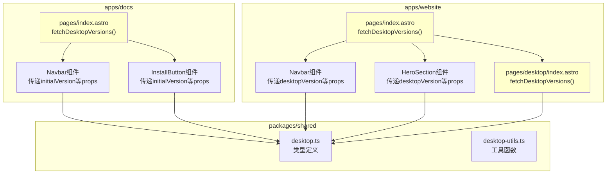
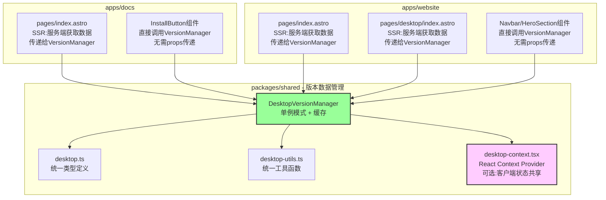

# Change: 统一Desktop版本信息管理

## Why

当前 monorepo 架构下，两个应用（`apps/docs` 和 `apps/website`）中存在重复的 Desktop 版本管理逻辑，导致以下问题：

1. **代码重复**：`desktop.ts` 工具函数和类型定义在两个应用中分别维护，缺乏一致性保证
2. **维护负担**：版本信息更新时需要同步修改多个文件
3. **可扩展性差**：新增安装按钮位置时需要重复实现版本获取逻辑
4. **缺乏统一状态管理**：版本数据在多个组件间手动传递，容易出错

通过将版本信息管理集中化到 `packages/shared`，可以：
- 消除代码重复，确保类型和逻辑一致性
- 简化组件使用，无需手动传递版本信息
- 提供统一的缓存和数据获取策略
- 降低维护成本，减少 bug 引入风险

## What Changes

### 架构变更
- **增强 `packages/shared`**：将 Desktop 类型定义和工具函数统一管理
- **创建版本数据管理器**：实现单例模式确保版本数据只获取一次
- **重构组件接口**：组件内部自行获取版本信息，无需外部传递

### 代码结构变更
- 将 `apps/*/src/types/desktop.ts` 合并到 `packages/shared/src/types/desktop.ts`
- 将 `apps/*/src/utils/desktop.ts` 合并到 `packages/shared/src/utils/desktop.ts`
- 在 `packages/shared` 中创建版本数据缓存和状态管理机制
- 更新 `packages/shared/src/index.ts` 导出新的共享模块

### 组件使用简化
- `InstallButton` 组件无需接收 `initialVersion`、`initialPlatforms` 等 props
- 组件内部通过共享模块获取版本数据
- 支持 Astro SSR 场景下的服务端数据传递

### 数据流优化
- Astro 页面在构建时获取版本数据
- 通过全局状态或 Context Provider 在客户端共享
- 实现懒加载和缓存机制

**兼容性**：
- 现有的 props 接口保持向后兼容
- 逐步迁移现有组件到新的共享实现

## Code Flow Changes

### 当前数据流（Before）

### 目标数据流（After）

### 组件接口变更对比

| 组件 | 变更前（Current） | 变更后（Target） |
|------|-------------------|------------------|
| **InstallButton** | `<InstallButton initialVersion={v} initialPlatforms={p} versionError={e} />` | `<InstallButton />` 或 `<InstallButton channel="stable" />` |
| **Navbar** | `<Navbar desktopVersion={v} desktopPlatforms={p} desktopVersionError={e} />` | `<Navbar />` |
| **HeroSection** | `<HeroSection desktopVersion={v} desktopPlatforms={p} />` | `<HeroSection />` |

### 代码变更清单

#### packages/shared/ 增强

| 文件路径 | 变更类型 | 变更原因 | 影响范围 |
|---------|---------|---------|---------|
| `packages/shared/src/types/desktop.ts` | 修改 | 合并两个应用的类型定义，确保一致性 | 所有使用 Desktop 类型的代码 |
| `packages/shared/src/utils/desktop.ts` | 修改 | 合并两个应用的工具函数，添加版本比较逻辑 | 所有 Desktop 工具函数调用 |
| `packages/shared/src/version-manager.ts` | 新增 | 创建版本数据管理器，实现单例和缓存 | 提供统一的版本数据访问接口 |
| `packages/shared/src/index.ts` | 修改 | 导出新的版本管理器和类型 | 应用导入路径 |
| `packages/shared/src/desktop-context.tsx` | 新增（可选） | React Context Provider 用于客户端状态共享 | 需要 React 状态管理的场景 |

#### apps/docs/ 变更

| 文件路径 | 变更类型 | 变更原因 | 影响范围 |
|---------|---------|---------|---------|
| `apps/docs/src/types/desktop.ts` | 删除 | 类型定义已迁移到 packages/shared | 删除文件 |
| `apps/docs/src/utils/desktop.ts` | 删除 | 工具函数已迁移到 packages/shared | 删除文件 |
| `apps/docs/src/components/InstallButton.tsx` | 修改 | 组件内部调用 VersionManager，移除 props 依赖 | 组件接口简化 |
| `apps/docs/src/pages/*.astro` | 修改 | 移除版本数据获取逻辑，使用共享管理器 | 页面简化 |

#### apps/website/ 变更

| 文件路径 | 变更类型 | 变更原因 | 影响范围 |
|---------|---------|---------|---------|
| `apps/website/src/types/desktop.ts` | 删除 | 类型定义已迁移到 packages/shared | 删除文件 |
| `apps/website/src/utils/desktop.ts` | 删除 | 工具函数已迁移到 packages/shared | 删除文件 |
| `apps/website/src/components/home/Navbar.tsx` | 修改 | 组件内部调用 VersionManager，移除 props 依赖 | 组件接口简化 |
| `apps/website/src/components/home/HeroSection.tsx` | 修改 | 组件内部调用 VersionManager，移除 props 依赖 | 组件接口简化 |
| `apps/website/src/pages/index.astro` | 修改 | 移除版本数据获取和传递逻辑 | 页面简化 |
| `apps/website/src/pages/desktop/index.astro` | 修改 | 移除版本数据获取和传递逻辑 | 页面简化 |

## Impact

### Affected specs
- `monorepo-architecture`: 更新共享包管理规范
- 新增 `desktop-version-management`: Desktop 版本管理规范

### Affected code
- `packages/shared/*`: 新增版本管理器和 Context
- `apps/docs/src/components/InstallButton.tsx`: 简化组件接口
- `apps/website/src/components/home/*`: 简化组件接口
- `apps/docs/src/pages/*.astro`: 移除版本数据传递
- `apps/website/src/pages/*.astro`: 移除版本数据传递

### Benefits
- **减少代码重复**：消除 ~300 行重复代码
- **简化使用**：组件无需手动传递版本信息
- **类型安全**：统一的类型定义确保一致性
- **性能优化**：统一的缓存策略减少重复请求
- **维护性提升**：版本信息更新只需修改共享包

### Migration
- **向后兼容**：现有组件接口保持兼容，支持逐步迁移
- **测试验证**：确保所有页面的安装按钮正常工作
- **文档更新**：更新组件使用文档

### Risks
- **破坏性变更**：如果组件接口变化不当，可能导致现有页面出错
  - **缓解措施**：保持 props 向后兼容，优先使用内部状态管理
- **构建失败**：共享包变更可能导致类型检查失败
  - **缓解措施**：充分测试两个应用的构建流程
- **性能回归**：版本管理器引入可能影响性能
  - **缓解措施**：实现高效缓存机制，避免重复请求

### Non-Goals
- 不修改版本数据源（`desktop.dl.hagicode.com/index.json`）
- 不改变版本数据的显示逻辑
- 不影响现有的 Docker 版本相关功能
- 不修改 `packages/shared` 中其他模块（如 links、version）
