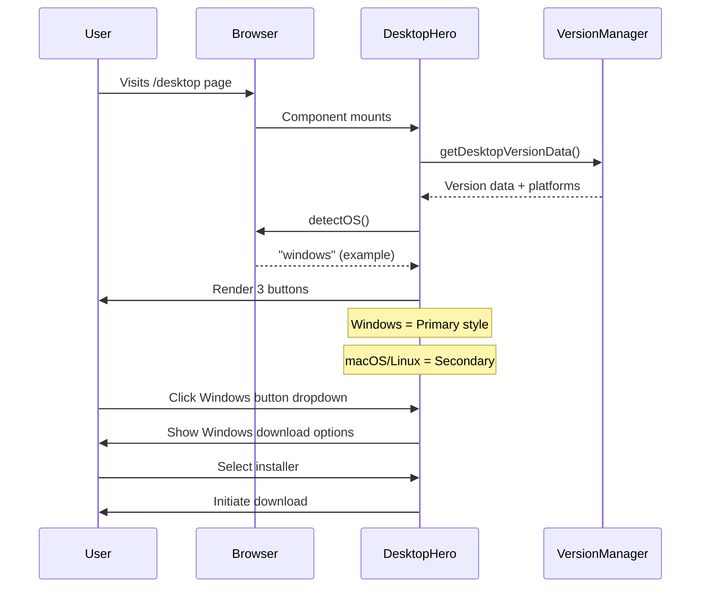

# Change: Unify Desktop Download Button UI

## Why

The desktop download experience has inconsistent UI/UX across the website:

1. **Style inconsistency**: `DesktopHero` component uses custom card-based layout with CSS Modules, while `InstallButton` component (used in homepage and docs) uses a unified button design with dropdown menus
2. **Platform presentation**: `DesktopHero` shows only the detected OS as primary with other platforms as secondary cards, while `InstallButton` provides a comprehensive dropdown with all platforms
3. **CSS implementation divergence**: Both components use CSS Modules, but other components in the project (Navbar, HeroSection) use Tailwind CSS, creating maintenance overhead

This fragmentation creates a disjointed user experience and increases maintenance costs.

## What Changes

### 1. Unified Download Button Component Design
- Replace the card-based layout in `DesktopHero` with a button group layout
- Display all three platforms (Windows, macOS, Linux) simultaneously with proper visual hierarchy
- Apply consistent styling matching `InstallButton` component

### 2. Dynamic Platform Highlighting
- Use `detectOS()` from `@shared/desktop-utils` to identify user's operating system
- Apply primary button style (gradient background, prominent) to detected OS
- Use secondary style (gray, lower contrast) for other platforms
- Each platform button supports dropdown menu showing all download options

### 3. Enhanced Dropdown Functionality
- Reuse `InstallButton`'s dropdown menu implementation
- Show platform-specific download options (installers, portable versions, etc.)
- Include version selection and container deployment links

### 4. Style System Unification (Optional Follow-up)
- **Phase 1**: Implement UI changes using existing CSS Modules approach
- **Phase 2** (separate proposal): Evaluate migration to Tailwind CSS for consistency with other components

## UI Design Changes

### Current DesktopHero Layout

```
+--------------------------------------------------+
|  [Windows Icon]  Windows        [推荐] Badge    |
|  推荐用于此设备                                  |
|                                                  |
|  [下载] 立即下载                                  |
|        安装程序 (.exe)                           |
|                                                  |
|  --- 或选择其他版本 ---                          |
|  [便携版 (.zip)]                    [下载图标]  |
|  [Microsoft Store]                  [下载图标]  |
|  [查看历史版本]                    [历史图标]  |
+--------------------------------------------------+

+-------------------+  +-------------------+
| [macOS Icon] macOS |  | [Linux Icon] Linux |
|                   |  |                   |
| [Apple Silicon]   |  | [AppImage]        |
| [Intel 版]        |  | [Debian 包]       |
| [更多版本]        |  | [更多版本]        |
+-------------------+  +-------------------+
```

### Proposed Unified Button Group Layout

```
+--------------------------------------------------+
|  Download Hagicode Desktop                       |
+--------------------------------------------------+
|                                                  |
|  +------------+  +----------+  +----------+      |
|  | [Windows]  |  | [macOS]  |  | [Linux]  |      |
|  | 立即下载 ▼ |  | 立即下载▼ |  | 立即下载▼ |      |
|  +------------+  +----------+  +----------+      |
|     Primary      Secondary    Secondary          |
|                                                  |
+--------------------------------------------------+
```

### Primary vs Secondary Button Styles

**Primary (Detected OS):**
- Background: `linear-gradient(135deg, #0080FF 0%, #00CCCC 50%, #22C55E 100%)`
- Full opacity, prominent shadow
- Animated gradient (3s wave effect)

**Secondary (Other Platforms):**
- Background: Gray/muted colors
- Lower opacity, reduced shadow
- Same dropdown functionality

### User Interaction Flow



## Impact

### Affected Specs
- `desktop-download-ui` - New capability spec for unified desktop download interface

### Affected Code
- `apps/website/src/components/desktop/DesktopHero.tsx` - Major refactoring of download UI
- `apps/website/src/components/desktop/DesktopHero.module.css` - Style updates to match InstallButton
- `apps/website/src/components/home/InstallButton.tsx` - Reference for styling patterns (no changes)
- `packages/shared/src/desktop-utils.ts` - Existing `detectOS()` function will be used
- `packages/shared/src/version-manager.ts` - Existing version data management (no changes)

### Benefits
- **Improved UX**: Users see all platform options at once with clear visual hierarchy
- **Consistent branding**: Unified button design across entire website
- **Reduced maintenance**: Reuse existing `InstallButton` patterns and shared utilities
- **Better accessibility**: Clear platform detection reduces download errors

### Risks
- **Breaking change**: Current card-based UI will be completely replaced
- **User familiarity**: Existing users accustomed to current layout may need adjustment
- **Mobile responsiveness**: Button group layout requires careful mobile design

## Open Questions

1. **Mobile layout**: Should the button group stack vertically or use a horizontal scroll on mobile?
2. **Dropdown behavior**: Should clicking the secondary buttons directly download the recommended version, or always show dropdown first?
3. **Version history**: Should the "View Version History" feature remain in the new design?
