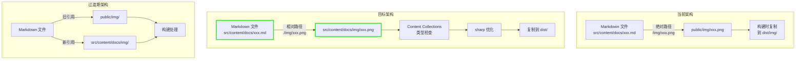
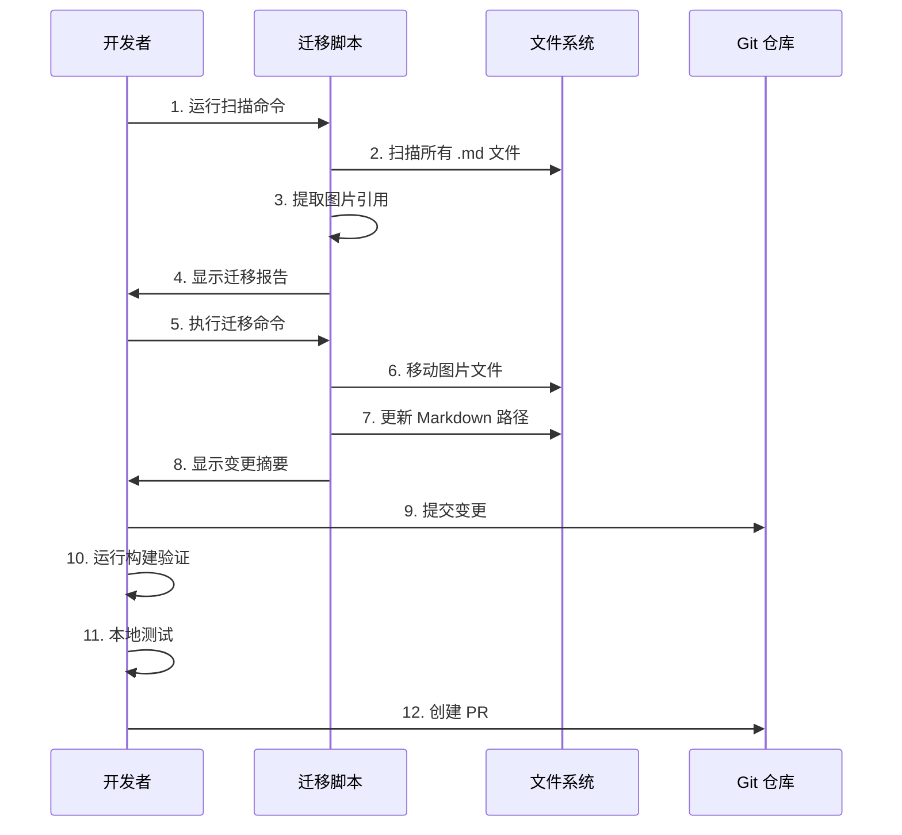
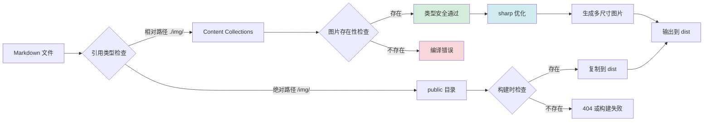

# Design: Astro Content Collections 图片引用方式迁移

## Context

### 背景
文档站点当前使用 `public/` 目录存储图片资源，通过绝对路径 `/img/` 引用。这种方式是传统静态网站的标准做法，但在 Astro 的 Content Collections 架构下存在局限性。

### 约束条件
- 必须保持向后兼容，不能一次性破坏现有内容
- 需要支持渐进式迁移，允许新旧方式共存
- 迁移过程不能影响 CI/CD 部署流程
- 必须确保所有现有图片链接在迁移后继续有效

### 利益相关者
- 内容维护者：需要更简单的图片管理方式
- 开发者：需要类型安全和 IDE 支持
- 用户：需要更快的图片加载体验
- CI/CD 系统：需要稳定的构建流程

## Goals / Non-Goals

### Goals
- 实现图片路径的类型安全检查
- 利用 Astro 的图片优化功能（sharp 集成）
- 使图片资源与内容文件关联更紧密
- 提供清晰的图片引用规范
- 创建可复用的迁移脚本

### Non-Goals
- 强制一次性迁移所有内容（渐进式迁移）
- 修改图片格式或进行大量图片优化
- 更改 Starlight 或 Astro 的核心配置
- 创建新的图片处理管道

## Decisions

### 决策 1：使用相对路径而非 Astro Image 组件

**选择**：使用 Markdown 标准的图片引用语法 ``，而非在 MDX 中导入和渲染 `<Image />` 组件。

**理由**：
1. **兼容性更好**：标准 Markdown 语法在所有编辑器中都能正确渲染
2. **迁移成本更低**：只需修改路径，不需要改写 MDX 语法
3. **学习成本更低**：内容创作者无需学习新的组件语法
4. **工具链支持**：大多数 Markdown 工具和预览插件都支持这种语法

**替代方案考虑**：
- 使用 `<Image />` 组件需要将所有 `.md` 文件改为 `.mdx`
- 需要在每个文件顶部添加 import 语句
- 增加了内容文件的复杂度和维护成本

### 决策 2：图片存放在 src/content/docs/img/ 而非 src/assets/

**选择**：将图片存放在 `src/content/docs/img/` 目录下，与内容文件保持关联。

**理由**：
1. **内容关联性**：图片与内容文件在同一目录树下，便于管理
2. **相对路径简洁**：引用路径更短，如 `./img/xxx.png`
3. **业务逻辑清晰**：图片按功能模块组织，与内容结构一致
4. **符合 Astro 最佳实践**：Content Collections 推荐将相关资源放在内容目录内

**替代方案考虑**：
- `src/assets/` 是通用资源目录，更适合全局共享的组件和样式
- `src/content/docs/img/` 更专注于文档内容相关的图片资源

### 决策 3：渐进式迁移策略

**选择**：允许新旧方式共存，优先迁移高频访问页面。

**理由**：
1. **降低风险**：避免一次性大量变更导致的不可预测问题
2. **灵活安排**：可以根据优先级和资源情况安排迁移顺序
3. **持续可用**：迁移过程中站点始终保持可用状态
4. **便于验证**：分批次迁移便于发现问题并及时调整

**迁移优先级**：
1. 高优先级：快速开始、安装指南（新用户主要访问）
2. 中优先级：相关软件安装、博客文章
3. 低优先级：存档内容、低访问页面

## Technical Design

### 架构变更



### 目录结构设计

```
apps/docs/
├── public/
│   ├── favicon.ico              # 站点图标（保留）
│   ├── robots.txt               # 爬虫规则（保留）
│   └── img/                     # 逐步淘汰，仅保留非内容图片
│       └── legacy/              # 迁移后的旧图片备份
└── src/
    └── content/
        └── docs/
            ├── img/             # 新的图片目录
            │   ├── quick-start/ # 按功能模块组织
            │   │   ├── create-normal-session/
            │   │   │   └── 01-create-normal-session.png
            │   │   └── create-project/
            │   ├── installation/
            │   ├── product-overview/ # 已实现的示例
            │   │   ├── value-proposition-proposal-driven/
            │   │   │   ├── illustration.png
            │   │   │   └── prompt.json
            │   │   └── ...
            │   └── shared/      # 多文档共享的图片
            ├── quick-start/
            │   ├── conversation-session.md
            │   └── ...
            └── installation/
                └── ...
```

### 迁移流程设计



### 迁移脚本设计

**脚本功能**：

1. **扫描脚本** (`scripts/image-migration/scan.mjs`)
   - 扫描所有 Markdown 文件
   - 提取图片引用路径
   - 分类：已迁移、待迁移、无需迁移
   - 生成迁移优先级报告

2. **迁移脚本** (`scripts/image-migration/migrate.mjs`)
   - 移动图片文件到新位置
   - 更新 Markdown 中的路径引用
   - 保留原始文件备份
   - 生成迁移日志

3. **验证脚本** (`scripts/image-migration/validate.mjs`)
   - 检查所有图片链接的有效性
   - 验证构建无错误
   - 生成验证报告

### 数据流设计



## Risks / Trade-offs

### 风险 1：图片链接失效

**描述**：迁移过程中可能出现路径更新不完整，导致 404 错误。

**缓解措施**：
- 创建自动化验证脚本，在每次迁移后检查所有链接
- 保留 `public/img/` 原文件作为备份
- 创建重定向规则处理旧路径（如需要）
- 分小批次迁移，每批验证后再继续

### 风险 2：构建配置变更导致构建失败

**描述**：新的路径方式可能需要调整 Astro 配置，不当的调整可能导致构建失败。

**缓解措施**：
- 先在 feature 分支进行充分测试
- 参考 product-overview.md 的成功实现
- 逐步调整配置，每次调整后验证构建
- 在 PR 中包含详细的构建测试结果

### 风险 3：迁移脚本错误导致文件丢失

**描述**：自动化脚本可能在移动文件时出错，导致内容丢失。

**缓解措施**：
- 脚本使用复制而非移动操作，保留原文件
- 添加详细的日志记录每个操作
- 在执行前显示预览，需要用户确认
- 提供回滚机制

### Trade-off 1：新旧方式共存的复杂度

**描述**：允许新旧方式共存会增加维护复杂度。

**权衡理由**：
- 降低迁移风险，避免一次性大变更
- 允许内容维护者根据时间安排迁移
- 为验证新方式的有效性留出时间
- 长期来看，复杂度是暂时的

### Trade-off 2：相对路径的长度

**描述**：深层目录的文件可能需要较长的相对路径（如 `../../../img/xxx.png`）。

**权衡理由**：
- 相对路径的清晰度优势大于长度劣势
- 现代 IDE 和编辑器对路径长度不敏感
- 可以通过目录结构优化减少嵌套深度

## Migration Plan

### 阶段 1：准备阶段（1-2 天）

1. 创建迁移脚本框架
2. 扫描并分析当前图片引用情况
3. 确定迁移优先级
4. 在 feature 分支测试产品概述页面的实现

### 阶段 2：核心内容迁移（3-5 天）

1. 迁移快速开始文档（最高优先级）
2. 迁移安装指南文档
3. 每批迁移后运行完整验证
4. 修复发现的问题

### 阶段 3：扩展内容迁移（5-7 天）

1. 迁移相关软件安装文档
2. 迁移博客文章图片（如有）
3. 清理 `public/img/` 中的已迁移图片

### 阶段 4：文档和规范更新（1-2 天）

1. 更新贡献指南
2. 创建图片引用最佳实践文档
3. 更新模板文件
4. 归档变更提案

### 回滚计划

如果迁移过程中出现严重问题：
1. 恢复 `public/img/` 目录的备份
2. 回滚 Markdown 文件的路径修改
3. 验证构建成功
4. 分析失败原因，调整迁移策略

## Open Questions

1. **是否需要为 `public/img/` 创建自动重定向？**
   - 建议：先不创建，通过迁移完整性确保无死链
   - 如果验证发现有遗漏，再考虑添加重定向

2. **是否需要自动压缩和优化现有图片？**
   - 建议：本次迁移不包含图片优化，专注于路径变更
   - 图片优化可以作为独立的后续项目

3. **如何处理博客文章中的图片引用？**
   - 建议：博客图片存放在 `src/content/docs/blog/img/`
   - 保持与内容文件的一致性

## 成功标准

1. **功能完整性**：所有页面图片正常显示，无 404 错误
2. **构建成功**：`npm run build` 无错误完成
3. **类型安全**：不存在的图片路径在编译时被检测
4. **文档完整**：贡献指南包含图片引用规范
5. **自动化程度**：迁移脚本可复用于未来类似任务
