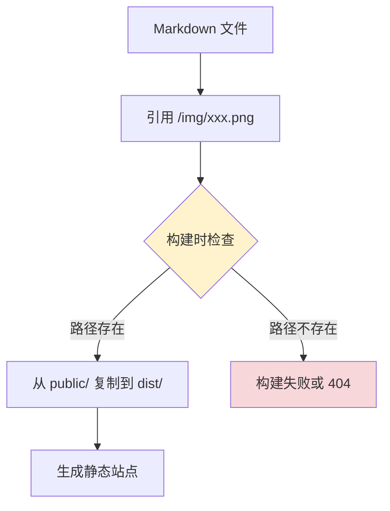
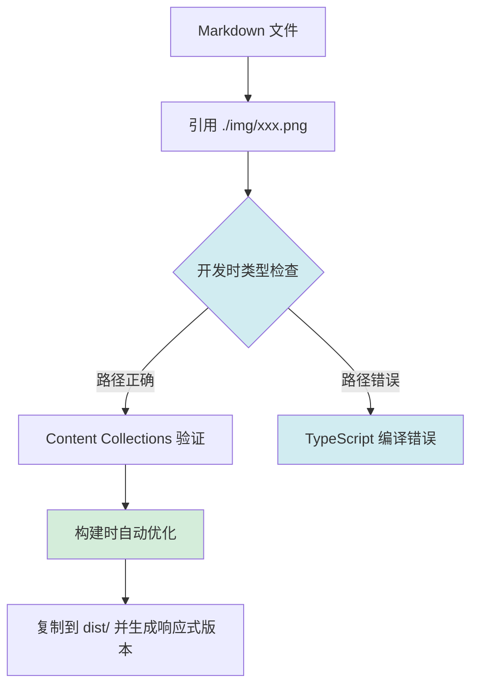
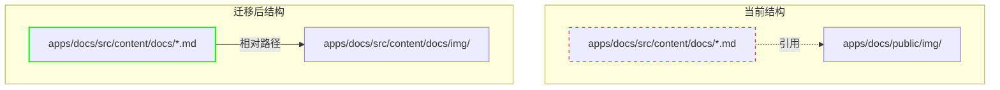

# Change: 迁移到 Astro Content Collections 图片引用方式

## Why

当前文档站点使用 `public/` 目录作为静态图片资源存储，通过绝对路径 `/img/` 引用图片。这种方式存在以下问题：

1. **路径错误风险**：硬编码的绝对路径在图片移动或重命名时容易产生 404 错误
2. **缺乏类型检查**：图片路径错误只能在构建时发现，开发阶段无法提前检测
3. **资源管理分散**：图片资源与内容文件分离，增加维护难度
4. **无法利用优化**：无法使用 Astro 的图片优化功能（sharp 集成的自动压缩和格式转换）
5. **与内容集合不一致**：Astro Content Collections 提供类型安全，但当前图片引用方式未利用此优势

产品概述页面已成功采用相对路径方式（`./img/...`），证明了这种方式的可行性，需要将此模式推广到全站。

## What Changes

- **迁移图片存储位置**：将 `public/img/` 下的图片迁移到 `src/content/docs/img/` 目录
- **更新引用方式**：将绝对路径引用 `/img/path/to/image.png` 改为相对路径引用 `./img/path/to/image.png`
- **保持向后兼容**：支持新旧方式共存，确保平滑过渡
- **更新构建配置**：确保新路径正确打包到构建输出
- **更新文档规范**：在贡献指南中说明新的图片引用规范
- **创建迁移脚本**：自动化迁移过程，减少手动操作错误

## Code Flow Changes

### 当前图片引用流程

### 迁移后图片引用流程

### 目录结构变更对比

## Impact

- **Affected specs**: docs-site
- **Affected code**:
  - `apps/docs/src/content/docs/**/*.md` - 所有包含图片引用的 Markdown 文件
  - `apps/docs/public/img/` - 现有图片目录（迁移后可保留用于非内容图片）
  - `apps/docs/src/content/docs/img/` - 新的图片存储位置
  - `apps/docs/astro.config.mjs` - 可能需要调整构建配置
  - `CONTRIBUTING.md` - 更新图片引用规范文档

- **Benefits**:
  - 类型安全：图片路径在开发阶段即可验证
  - 性能优化：可利用 sharp 进行图片压缩和格式转换
  - 更好的维护性：图片与内容文件关联更紧密
  - 响应式支持：自动生成多种尺寸和格式

- **Migration Strategy**:
  - 渐进式迁移，无需一次性完成
  - 支持新旧方式共存期
  - 创建自动化迁移脚本
  - 优先迁移高频访问页面

## 风险与缓解措施

| 风险 | 影响 | 缓解措施 |
|------|------|----------|
| 图片链接失效 | 用户看到 404 错误 | 创建验证脚本检查所有链接，保持旧路径重定向 |
| 构建配置变更导致构建失败 | CI/CD 部署中断 | 在 feature 分支充分测试，验证构建通过后合并 |
| 大量文件手动迁移耗时 | 迁移周期长 | 创建自动化脚本处理路径替换和文件移动 |
| 历史提交中的图片链接失效 | 旧版本文档链接 404 | 在 public/ 目录保留重定向页面或保留原文件 |

## 成功标准

1. 所有现有图片引用在新路径下正常工作
2. `npm run build` 构建成功，无图片相关错误
3. `openspec validate --strict` 验证通过
4. 至少完成 50% 内容页面的图片迁移
5. 更新贡献指南，新的图片引用规范已文档化
6. 创建自动化迁移脚本并验证其有效性
