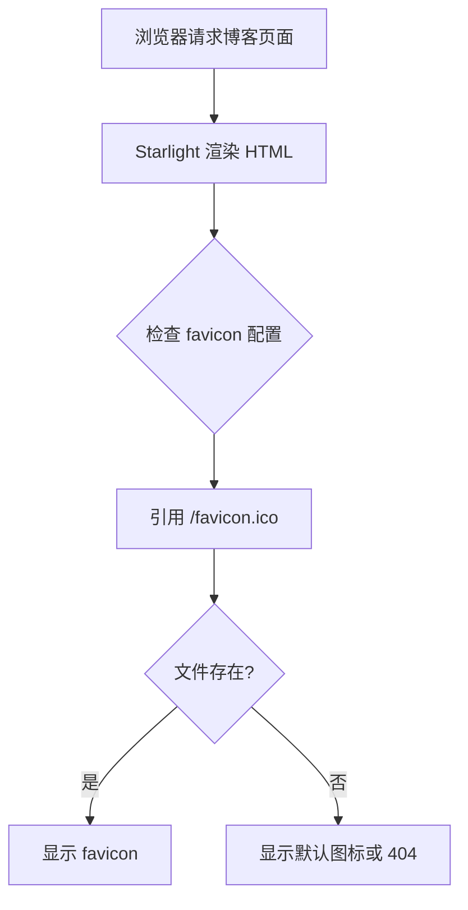

# 博客 Favicon 配置修复

## Why

当前博客页面的 favicon 配置存在以下问题:
- Starlight 默认引用 `/favicon.svg`,但该文件在 `public/` 目录中不存在
- 只有 `favicon.ico` 和 `logo.svg` 文件存在
- 导致浏览器标签页无法显示正确的 favicon 图标
- 影响品牌识别度和用户体验

## What Changes

- **配置 Starlight favicon**: 在 `astro.config.mjs` 中显式配置 favicon 为现有的 `/favicon.ico`
- **验证 favicon.ico 正常工作**: 确保现有的 favicon.ico 文件可以被正确引用和显示

## UI Design Changes

无 UI 变化 - 这是一个后台配置修复,不影响可见界面。

## Code Flow Changes

## Impact

- Affected specs: `seo-config`
- Affected code:
  - `apps/docs/astro.config.mjs` (配置 favicon 路径)

## 验证标准

1. **配置正确**: `astro.config.mjs` 中配置了 favicon 路径
2. **HTML 正确引用**: 构建后的 HTML 包含正确的 favicon 链接
3. **浏览器显示**: 访问博客页面时,浏览器标签页显示正确的 favicon
4. **构建成功**: `npm run build` 无错误
