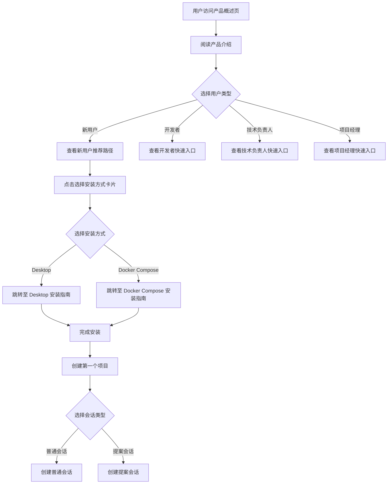

# Change: 产品介绍页补充 Desktop 版本并使用 Card 组件优化链接展示

## Why

当前产品概述页面 (`product-overview.md`) 仅提及 Docker Compose 安装方式，缺少 Desktop 版本的介绍内容。同时，页面底部的相关链接使用普通文本链接，视觉层级不明显，未利用 Starlight 主题的 Card 组件优势来展示多个资源链接。

用户无法通过当前文档全面了解 Desktop 和 Docker Compose 两种部署方式的差异和选择建议，降低了文档的完整性和可读性。

## What Changes

- 在产品概述页面的"从这里开始"部分新增 Desktop 版本介绍
- 完善 Desktop 和 Docker Compose 两种安装方式的对比说明
- 使用 Starlight Card 和 CardGrid 组件重构"从这里开始"部分的链接展示
- 将底部相关链接改为使用 Card 组件展示，每个 Card 包含标题、描述、跳转链接

## UI Design Changes

### 现有链接展示方式（变更前）

当前"从这里开始"部分使用普通文本链接：

```markdown
## 从这里开始

### 新用户推荐路径

如果您是第一次接触 Hagicode,建议按以下顺序阅读:

1. **[本文档](/product-overview)** - 建立对产品的整体认知(您在这里)
2. **[安装指南](/installation/docker-compose/)** - 安装并运行 Hagicode
3. **[创建第一个项目](/quick-start/create-first-project)** - 初始化您的项目
4. **[创建普通会话](/quick-start/conversation-session)** - 开始与 AI 交互
5. **[创建提案会话](/quick-start/proposal-session)** - 了解提案工作流

### 不同角色的快速入口

- **开发者**: 从 [创建普通会话](/quick-start/conversation-session) 开始,体验只读和编辑模式
- **技术负责人**: 从 [创建提案会话](/quick-start/proposal-session) 开始,了解规范驱动开发
- **项目经理**: 从 [项目管理](/projects/) 开始,学习如何管理项目和团队知识
```

### 新的链接展示方式（变更后）

使用 Starlight Card 组件重构：

```markdown
## 从这里开始

根据您的角色和需求,选择最适合的阅读路径。

### 新用户推荐路径

import { Card, CardGrid } from '@astrojs/starlight/components';

<CardGrid>

<Card title="产品概述" icon="book">
    建立对 Hagicode 的整体认知,了解产品定位、核心特性和适用场景。
    **您当前在这里**
</Card>

<Card title="选择安装方式" icon="download">
    根据您的需求选择最合适的安装方式：
    - **Desktop 版本**：一键安装，图形化界面，适合个人开发者
    - **Docker Compose**：容器化部署，环境隔离，适合开发和测试环境
</Card>

<Card title="创建第一个项目" icon="rocket" href="/quick-start/create-first-project">
    初始化您的 Hagicode 项目，配置基本设置，开始您的 AI 辅助开发之旅。
</Card>

<Card title="创建普通会话" icon="chat" href="/quick-start/conversation-session">
    开始与 AI 交互，体验只读和编辑双模式，让 AI 成为您得力的编程搭档。
</Card>

<Card title="创建提案会话" icon="lightbulb" href="/quick-start/proposal-session">
    了解提案驱动开发工作流，将抽象想法转化为结构化的实施计划。
</Card>

</CardGrid>

### 不同角色的快速入口

<CardGrid>

<Card title="开发者" icon="code" href="/quick-start/conversation-session">
    从创建普通会话开始，体验只读和编辑模式，快速上手 AI 辅助开发。
</Card>

<Card title="技术负责人" icon="users" href="/quick-start/proposal-session">
    从创建提案会话开始，了解规范驱动开发，管理复杂变更和团队知识。
</Card>

<Card title="项目经理" icon="folder" href="/projects/">
    学习如何管理项目和团队知识，沉淀设计决策，追踪项目进度。
</Card>

</CardGrid>
```

### 安装方式对比界面

在"选择安装方式"卡片中，添加安装方式对比说明：

```
┌─────────────────────────────────────────────────────────────────────────────┐
│  选择安装方式                                                                │
├─────────────────────────────────────────────────────────────────────────────┤
│                                                                               │
│  ┌─────────────────────────┐     ┌──────────────────────────────────────┐  │
│  │  Desktop 版本           │     │  Docker Compose                       │  │
│  │  💻 一键安装             │     │  🐳 容器化部署                        │  │
│  ├─────────────────────────┤     ├──────────────────────────────────────┤  │
│  │ ✓ 图形化界面            │     │ ✓ 环境隔离，避免依赖冲突              │  │
│  │ ✓ 自动依赖管理          │     │ ✓ 一键启动所有服务                    │  │
│  │ ✓ 内置版本管理          │     │ ✓ 易于管理和维护                      │  │
│  │ ✓ 本地运行，数据安全    │     │ ✓ 适合快速体验和测试                  │  │
│  │ ✓ 离线可用              │     │ ✓ 支持生产环境部署                    │  │
│  ├─────────────────────────┤     ├──────────────────────────────────────┤  │
│  │ 适合个人开发者、非技术   │     │ 适合开发团队、测试环境和生产部署      │  │
│  │ 用户、需要离线使用的场景 │     │                                      │  │
│  └─────────────────────────┘     └──────────────────────────────────────┘  │
│                                                                               │
│                          [Desktop 安装]    [Docker Compose 安装]            │
└─────────────────────────────────────────────────────────────────────────────┘
```

### 用户交互流程



## Impact

### 影响的规格
- `docs-site` - 文档站点内容结构

### 影响的代码
- `apps/docs/src/content/docs/product-overview.md` - 主要修改文件
- 可能需要更新导航配置（如果添加新的安装指南索引页）

### 用户体验改进
- 用户可全面了解 Desktop 和 Docker Compose 两种安装方式，做出更适合的选择
- 链接展示更直观，降低导航难度
- 视觉层级更清晰，提升文档可读性

### 技术债务减少
- 统一使用 Starlight 主题组件，符合项目架构规范
- 为后续类似页面提供可复用的展示模式

### 文档完整性
- 补齐 Desktop 版本文档缺失，覆盖所有安装方式
- 提升产品介绍的完整性和专业性
