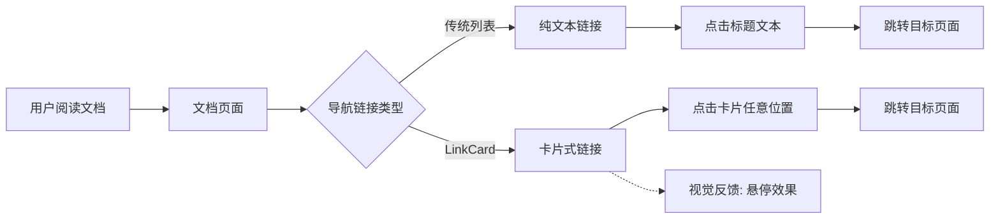

# Change: 文档站点 LinkCard 组件统一优化

## Why

当前文档站点中仅有 `product-overview.mdx` 使用了 Starlight 官方的 LinkCard 组件来展示导航链接，而其他多个文档仍使用传统的列表链接格式。这种不一致的导航体验降低了文档的专业度和可维护性。

## What Changes

- 将 4 个目标文档中的传统列表链接统一替换为 LinkCard 组件
- 确保所有导航入口具有一致的视觉体验和交互模式
- 优化文档内容的可读性和专业度

## UI Design Changes

### 变更前后对比

**变更前 - 传统列表链接**（以 installation/desktop.mdx 为例）```
## 后续步骤

完成安装后，您可以：

- [创建第一个项目](/quick-start/create-first-project) - 初始化您的 Hagicode 项目
- [创建普通会话](/quick-start/conversation-session) - 开始与 AI 交互
- [创建提案会话](/quick-start/proposal-session) - 了解提案驱动开发
```

**变更后 - LinkCard 组件**
```
import { LinkCard, CardGrid } from '@astrojs/starlight/components';

## 后续步骤

完成安装后，您可以继续以下步骤：

<CardGrid>

<LinkCard title="创建第一个项目" href="/quick-start/create-first-project"
    description="初始化您的 Hagicode 项目，配置基本设置，开始您的 AI 辅助开发之旅。"
/>

<LinkCard title="创建普通会话" href="/quick-start/conversation-session"
    description="开始与 AI 交互，体验只读和编辑双模式，让 AI 成为您得力的编程搭档。"
/>

<LinkCard title="创建提案会话" href="/quick-start/proposal-session"
    description="了解提案驱动开发工作流，将抽象想法转化为结构化的实施计划。"
/>

</CardGrid>
```

### 用户交互流程



### 设计优势

1. **视觉一致性** - 所有导航入口使用相同的卡片样式
2. **可点击区域** - 卡片整个区域都可点击，提升交互体验
3. **信息层次** - 标题和描述分层展示，更易阅读
4. **悬停反馈** - Starlight 内置的悬停效果提供清晰的交互反馈

## Code Flow Changes

### 文档变更清单

| 文件路径 | 变更类型 | 变更原因 | 影响范围 |
|---------|---------|---------|---------|
| `apps/docs/src/content/docs/installation/desktop.mdx` | 添加 LinkCard | 将"后续步骤"部分从列表链接改为 LinkCard 格式 | 安装指南用户体验 |
| `apps/docs/src/content/docs/setup-openspec.mdx` | 添加 LinkCard | 将"下一步"部分从列表链接改为 LinkCard 格式 | OpenSpec 设置指南 |
| `apps/docs/src/content/docs/conversation-session.md` | 添加 LinkCard | 将"后续步骤"部分从列表链接改为 LinkCard 格式 | 会话管理文档 |
| `apps/docs/src/content/docs/related-software-installation/nodejs/installation.md` | 添加 LinkCard | 将"下一步"部分从列表链接改为 LinkCard 格式 | Node.js 安装指南 |

### 组件导入变更

每个受影响的文档需要在文件顶部添加组件导入：

```typescript
import { LinkCard, CardGrid } from '@astrojs/starlight/components';
```

## Impact

### 受影响的规范
- `content-documentation` - 文档内容展示规范

### 受影响的代码
- `apps/docs/src/content/docs/installation/desktop.mdx` - Desktop 安装指南
- `apps/docs/src/content/docs/setup-openspec.mdx` - OpenSpec 设置指南
- `apps/docs/src/content/docs/conversation-session.md` - 普通会话文档
- `apps/docs/src/content/docs/related-software-installation/nodejs/installation.md` - Node.js 安装指南

### 预期收益
1. **用户体验改进** - 统一的导航体验，更清晰的信息层次
2. **文档质量提升** - 专业度和可维护性的提高
3. **技术实施无风险** - 使用 Starlight 官方组件，兼容性良好

### 验证标准
- [ ] 所有 4 个目标文档成功使用 LinkCard 组件
- [ ] 本地构建成功（`npm run build:docs`）
- [ ] 链接卡片样式与 product-overview.mdx 保持一致
- [ ] 所有链接可正常跳转
- [ ] 悬停效果正常工作
