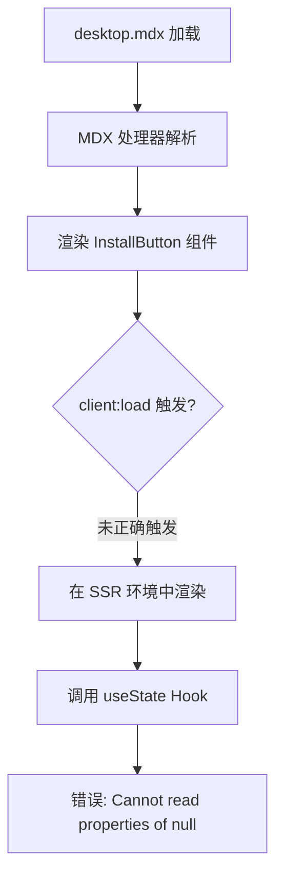
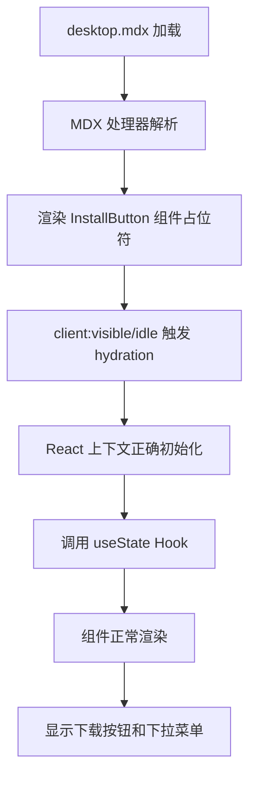

# Change: 修复 InstallButton React Hook 错误

## Why

InstallButton 组件在 Desktop 安装文档页面中报错：`Cannot read properties of null (reading 'useState')`。这是由于 React Hooks 在非 React 环境中被调用导致的。错误发生在 `apps/docs/src/components/InstallButton.tsx:95`，具体是 `useState` Hook 调用处。

根本原因分析：
1. **React 上下文未正确初始化**：组件在服务端渲染(SSR)阶段被渲染，但 React Hooks 只能在客户端组件中使用
2. **@astrojs/react 集成配置问题**：可能存在 React 集成配置不正确或 `client:load` 指令未正确触发 React hydration
3. **组件在 MDX 中的使用方式**：当前使用 `<InstallButton variant="full" client:load />`，但可能需要调整客户端指令策略

该错误导致：
- Desktop 安装文档页面中的下载按钮无法正常渲染
- 用户无法通过文档页面直接下载 Desktop 应用程序
- 降级链接可以显示，但丢失了平台检测和版本选择功能

## What Changes

- 修改 `apps/docs/src/content/docs/installation/desktop.mdx` 中的 InstallButton 组件调用方式
- 评估并可能调整 `client:load` 指令为 `client:visible` 或 `client:idle`
- 验证 `apps/docs/astro.config.mjs` 中的 React 集成配置
- 在 InstallButton 组件中添加服务端兼容性检查（如果需要）
- 更新相关的文档和注释

## UI Design Changes

不涉及 UI 设计变更。修复后的 InstallButton 组件应与预期设计完全一致，提供：
- 主下载按钮（立即安装）
- 下拉切换按钮（选择其他版本）
- 平台分组显示（Windows、macOS、Linux）
- Docker 版本选项链接
- 版本标签显示
- 推荐版本标记

## Code Flow Changes

### 当前代码流程（有问题）

### 修复后的代码流程（预期）

### 代码变更清单

| 文件路径 | 变更类型 | 变更原因 | 影响范围 |
|---------|---------|---------|---------|
| `apps/docs/src/content/docs/installation/desktop.mdx` | 修改客户端指令 | 将 `client:load` 改为 `client:visible` 或 `client:idle`，确保 React hydration 在正确的时机执行 | InstallButton 组件加载时机 |
| `apps/docs/src/components/InstallButton.tsx` | 添加环境检查（可选） | 添加 `typeof window` 检查，确保 Hooks 只在客户端环境中调用 | 组件初始化逻辑 |
| `apps/docs/astro.config.mjs` | 验证配置 | 确认 React 集成配置正确，`@astrojs/react` 版本兼容 | React 组件水合策略 |

## Impact

### 受影响的规范
- `astro-site` - React 组件集成和客户端水合相关需求

### 受影响的代码
- `apps/docs/src/content/docs/installation/desktop.mdx` - Desktop 安装文档页面
- `apps/docs/src/components/InstallButton.tsx` - 下载按钮组件
- `apps/docs/astro.config.mjs` - Astro 配置（验证，可能不需要修改）

### 预期效果
- InstallButton 组件在 Desktop 安装文档页面中正常渲染
- 用户可以通过文档页面直接下载 Desktop 应用程序
- 平台检测和版本选择功能正常工作
- 无控制台错误
