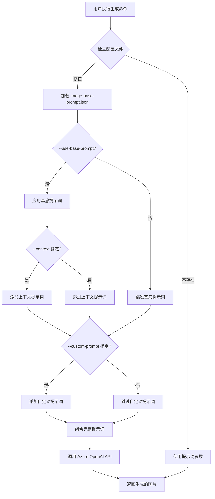
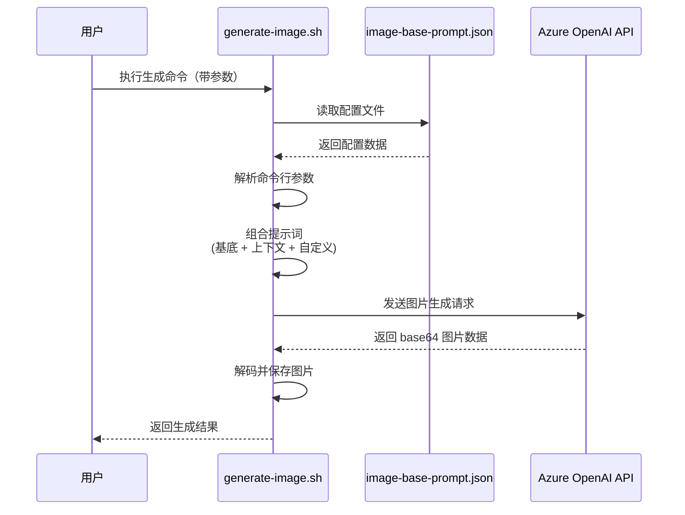

# Change: 图片生成基底提示词系统

## Why

当前图片生成脚本 (`scripts/generate-image.sh`) 缺少统一的视觉基础，每次生成图片时需要手动输入完整的提示词，导致：
- 生成的图片风格不一致，视觉连贯性差
- 用户操作效率低下，需要重复输入相同的基础提示词
- 缺少结合 Hagicode 产品特性的定制化视觉元素
- 品牌识别度弱，无法建立统一的视觉语言体系

## What Changes

### 新增功能

1. **创建基底提示词配置文件** (`scripts/image-base-prompt.json`)
   - 定义统一的视觉风格和品牌调性
   - 支持上下文特定的提示词增强
   - 可配置的启用/禁用开关

2. **增强图片生成脚本** (`scripts/generate-image.sh`)
   - 新增 `--use-base-prompt` / `--no-base-prompt` 参数控制基底提示词使用（默认启用）
   - 新增 `--context <type>` 参数选择特定上下文的提示词增强
   - 新增 `--custom-prompt <text>` 参数允许添加自定义提示词
   - 实现提示词组合逻辑：基底提示词 + 上下文提示词 + 用户提示词

3. **更新 npm 脚本** (`package.json`)
   - 添加便捷的图片生成脚本命令

### 技术细节

- **配置文件格式**: JSON
- **脚本语言**: Bash（保持与现有 `generate-image.sh` 一致）
- **提示词组合顺序**:
  1. 基底提示词（默认启用）
  2. 上下文特定提示词（可选）
  3. 用户自定义提示词（可选）

## UI Design Changes

不涉及用户界面更改，这是纯脚本层面的功能增强。

## Code Flow Changes

## Impact

### 受影响的规格
- `specs/build-scripts/spec.md` - 新增基底提示词系统需求

### 受影响的代码
- **修改**: `scripts/generate-image.sh` - 添加新参数和提示词组合逻辑
- **新增**: `scripts/image-base-prompt.json` - 基底提示词配置文件
- **修改**: `package.json` - 添加便捷脚本命令

### 用户体验改进
- **视觉一致性**: 所有生成的图片保持统一的专业风格和品牌调性
- **操作便捷性**: 用户无需每次输入完整提示词，一键调用即可
- **灵活性**: 支持禁用基底提示词或添加自定义内容
- **上下文适配**: 针对不同功能模块提供专门的视觉增强

### 品牌价值
- 强化 Hagicode 作为专业 AI 编程工具的品牌形象
- 提升文档和营销材料的视觉质量
- 建立可识别的视觉语言体系

## 风险与缓解措施

| 风险 | 影响 | 缓解措施 |
|------|------|----------|
| 提示词组合逻辑错误导致生成结果不符合预期 | 高 | 编写单元测试验证组合逻辑，提供详细的使用示例 |
| 配置文件缺失导致脚本失败 | 中 | 提供默认配置，配置文件缺失时优雅降级 |
| 与现有参数冲突 | 低 | 使用新的参数名称，保持向后兼容 |

## 迁移计划

1. **阶段 1**: 创建配置文件和脚本修改
2. **阶段 2**: 测试验证（本地测试 + CI/CD 验证）
3. **阶段 3**: 文档更新（使用说明和示例）

**回滚计划**: 保留原脚本功能，新参数为可选，不影响现有使用方式。
